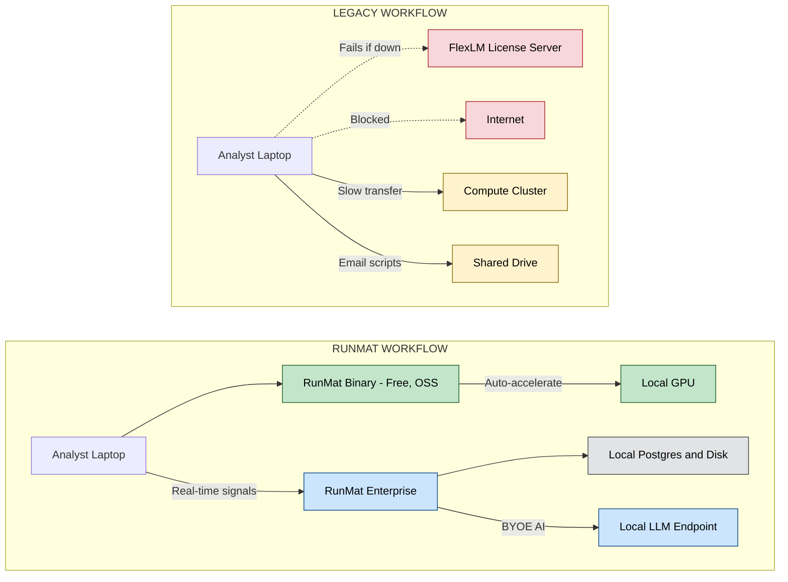

The airgap is a security requirement, not a reason to freeze your toolchain. RunMat is built to run entirely offline, with GPU acceleration, collaboration, AI, and audit trails all shipping in a single binary.

National security relies on that isolation; isolating critical systems from the public internet is a necessary defense. But for engineers working inside secure facilities, the airgap has come with a heavy tax: their tools stopped evolving. While the rest of the software world moved to the cloud (real-time collaboration, AI assistance, instant updates), scientific computing in the secure zone fell behind. License servers, complex dependency trees, and manual updates have made modern workflows nearly impossible to implement offline.

## TL;DR

- **RunMat** (open-source runtime) is a single static binary that runs MATLAB-compatible code entirely offline. Free to download and use; it has zero external dependencies and does not contact a license server or the internet.
- **RunMat Enterprise** (self-hosted) deploys as one server binary with local Postgres; licensing uses offline signed payloads. [Contact Sales](mailto:team@runmat.com) for access.
- GPU acceleration works via native APIs (Metal, Vulkan, DX12) with no CUDA toolkit required.
- Built-in structured logging, audit trails, SSO/SCIM, and RBAC align with ITAR and NIST compliance frameworks.
- Real-time collaboration, AI-assisted analysis (via local LLM endpoints), and automatic versioning all work fully offline.

## The license server problem

RunMat has zero licensing infrastructure. Copy the binary onto an approved drive, carry it in, and run your code.

If you've administered a scientific computing environment inside a secure facility, you know the FlexLM ritual. You need a dedicated machine to host the license daemon. You generate a host ID, request a license file from the vendor -- from a different network -- and carry it across the gap on approved media. You configure the daemon, test it, and pray it stays up.

If the license server goes down during a test campaign, your analysts can't work. If the license expires, you're repeating the whole process. If the hardware changes, you're starting from scratch. The license server is a single point of failure in an environment where failure is not an option.

For teams that need the full platform — collaboration, versioning, AI integration — **RunMat Enterprise** is the self-hosted product designed for exactly this environment. Licensing uses **offline signed payloads** -- a small file you carry in on the same media as the binary. The server verifies the signature locally and applies the policy. Renewal means replacing one file, with no network calls and no phone-home requirement.

And if you build RunMat from source, telemetry is off by default. There is nothing to disable, nothing to firewall. The binary makes zero network requests unless you explicitly configure it to.

## Two binaries, full platform

The entire platform fits on two binaries. Copy them onto approved media and you have everything you need.

Getting software into an airgapped facility means walking it in, and complex installations make that painful.

Try setting up a Python scientific computing environment offline. You need NumPy, SciPy, matplotlib, and their transitive dependencies -- dozens of packages, each with version constraints that interact in non-obvious ways. You download them on an internet-connected machine, scan them, carry them across the gap, and hope `pip install --no-index` works. When it doesn't (and it often doesn't), you debug a dependency graph in an environment where you can't Google the error message.

MATLAB is simpler to install but comes with its own weight: a multi-gigabyte installer, a license server to configure, and toolbox add-ons that each require their own licenses.

RunMat takes a different approach. The open-source runtime contains the full execution engine, the standard library, the LSP language server, and the Jupyter kernel in a single static binary with zero external dependencies. Copy it to a machine and it runs; startup takes 5 milliseconds. This is the engine for individual analysis and scripting. Download it from [GitHub](https://github.com/runmat-org/runmat), carry it in, and go.

RunMat Enterprise adds the team layer: pair the server binary with a Postgres instance and local disk for blob storage and you get multi-user real-time updates, a filesystem with automatic versioning and snapshots, LLM integration, SSO with your on-prem identity provider, role-based access control, and a real-time signal bus. All of it runs entirely offline. RunMat Enterprise is available through direct engagement, [contact sales](mailto:team@runmat.com) to discuss deployment for your facility.

Configuration for both is a local TOML file or environment variables. There is no cloud config service to reach. You can provision a hundred machines with standard configuration management tools and never worry about network connectivity.

Upgrades are the same process: carry in two new binaries and a license payload, replace the old ones, and you are done.

```mermaid
flowchart TD
    subgraph LEGACY[LEGACY WORKFLOW]
        L1[Analyst Laptop]
        L2[FlexLM License Server]
        L5[Internet]
        L3[Compute Cluster]
        L4[Shared Drive]
        L1 -. "Fails if down" .-> L2
        L1 -. "Blocked" .-> L5
        L1 -- "Slow transfer" --> L3
        L1 -- "Email scripts" --> L4
    end
    LEGACY ~~~ RUNMAT
    subgraph RUNMAT[RUNMAT WORKFLOW]
        R1[Analyst Laptop]
        R2[RunMat Binary - Free, OSS]
        R3[Local GPU]
        R4[RunMat Enterprise]
        R5[Local Postgres and Disk]
        R6[Local LLM Endpoint]
        R1 --> R2
        R2 -- "Auto-accelerate" --> R3
        R1 -- "Real-time signals" --> R4
        R4 --> R5
        R4 -- "BYOE AI" --> R6
    end
    style L2 fill:#f8d7da,stroke:#a71d2a,color:#000000
    style L5 fill:#f8d7da,stroke:#a71d2a,color:#000000
    style L3 fill:#fff3cd,stroke:#856404,color:#000000
    style L4 fill:#fff3cd,stroke:#856404,color:#000000
    style R2 fill:#c3e6cb,stroke:#155724,color:#000000
    style R3 fill:#c3e6cb,stroke:#155724,color:#000000
    style R4 fill:#cce5ff,stroke:#004085,color:#000000
    style R5 fill:#e2e3e5,stroke:#383d41,color:#000000
    style R6 fill:#cce5ff,stroke:#004085,color:#000000
```

## Performance comes to the data

In most organizations, heavy compute means sending data to a cloud cluster. In a secure environment, that data cannot leave the building.

RunMat brings the performance to the data. [RunMat Accelerate](/blog/runmat-accelerate-fastest-runtime-for-your-math) automatically detects the GPU hardware on the local machine -- whether it's an Apple Silicon laptop, a workstation with a discrete NVIDIA card, or a rack-mounted server -- and compiles your math into optimized fused kernels on the fly. It works through native graphics APIs (Metal, Vulkan, DirectX 12) via wgpu, so there is no CUDA toolkit to install and no vendor lock-in.

During a thermal vacuum campaign, the analyst running a 10,000-point FFT on attitude control telemetry needs to visualize the frequency response and get it to the ops team in the next room. With legacy tools: wait for MATLAB to boot, fight a license checkout, email a PNG. With RunMat the runtime starts in 5 milliseconds, the FFT runs on the local GPU, the results appear in an interactive plot, and she shares through the collaboration layer so her colleague sees it in real time. The entire workflow happens in seconds. No data leaves the secure network; no license server is consulted.

## Compliance-ready by design

RunMat was designed to satisfy security reviewers, auditors, and compliance frameworks, not just to work offline. Deploying in a defense or intelligence environment demands both.

Every filesystem write and membership change emits a structured audit record with actor identity, action, resource identifier, and timestamp, routable to an immutable audit sink with chain-of-custody controls. On the logging side, the server emits structured JSON with a centralized redaction engine; credentials, file contents, API keys, prompts, and tokens are never logged. Redaction rules live in one place for compliance review, and the logging profile follows ITAR and NIST conventions: every mutating operation records the actor, target resource, operation type, and outcome. For identity, RunMat Enterprise supports SSO with on-premises providers via SAML or OIDC (Keycloak, ADFS, or whatever your facility runs). SCIM handles user lifecycle and group-to-role mapping. RBAC enforces permissions at org, project, and file level; API keys for headless and CI are scoped, revocable, and rotation-friendly. Source builds of the open-source runtime have telemetry off by default, and `RUNMAT_TELEMETRY_SHOW=1` prints every payload to stderr before transmission. Inside an airgap, nothing is transmitted because there is nowhere for it to go.

## What this unlocks

Engineers inside secure facilities often rely on older toolchains. The real opportunity is giving them capabilities they have rarely had access to, even compared to teams on the open internet.

File changes and project events stream to teammates via Server-Sent Events — when an analyst saves a script, her teammate sees the update immediately, and shared drives and email attachments and "which version is current?" drop out of the workflow. RunMat Enterprise's LLM integration takes that further: point it at a local model server (Ollama, vLLM, or a facility-approved endpoint) and engineers get AI-assisted code completion and analysis without any data leaving the building. The feedback loop that used to mean sending code to a separate team and waiting days for review can happen inside the editor. Few legacy scientific computing tools offer that in a disconnected environment.

On the versioning side, every file write creates a version record and snapshots capture full project state at a point in time. Snapshots export as a git fast-import stream for external review. When someone asks "which version of this script was running during the anomaly investigation last Tuesday?" you have a definitive answer. Compute stays local too: RunMat Accelerate works with whatever GPU is already in the machine, so performance that used to require a dedicated cluster or an IT ticket is now available at the analyst's desk. Upgrades follow the same single path as the initial install: carry in two binaries and a license payload on approved media, replace the old files, and the runtime, server, collaboration layer, and AI integration all update together.

## The gap doesn't have to exist

The airgap is a security requirement; it is not supposed to be a time machine. RunMat is proof that a modern scientific computing platform can run entirely offline from a single binary. If you're building in aerospace or defense, the next step is to stop fighting your tools and run your math.

---

*The open-source RunMat runtime is available on [GitHub](https://github.com/runmat-org/runmat). Interested in deploying RunMat Enterprise in your secure environment? [Contact sales](mailto:team@runmat.com).*

*RunMat is not affiliated with MathWorks, Inc. "MATLAB" is a registered trademark of MathWorks, Inc. We reference it nominatively to describe the language whose grammar and semantics our independent runtime accepts.*
