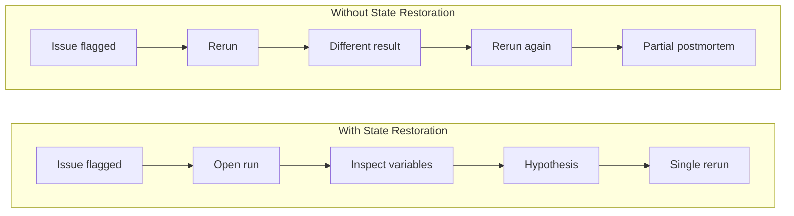
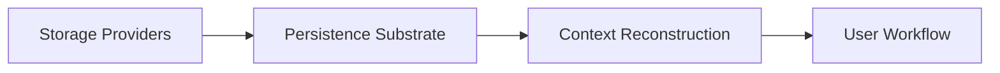

## TL;DR

- Re-execution answers "what happens now." Historical state restoration answers "what happened then." Treating them as interchangeable wastes compute and delays root-cause analysis.
- Teams without state restoration typically cycle through 3-4 speculative reruns per incident, burning hours of compute that direct inspection would eliminate.
- The practical flow: inspect the historical run first, form a hypothesis from actual variables and figures, then rerun once to validate the fix.
- The pain compounds with run cost and team size. Simulation groups, quant desks, and applied R&D teams feel this most acutely, where a single rerun can cost hours of wall-clock time and hundreds of dollars in cloud compute.
- Persistence stores artifacts durably; state restoration rebuilds context from them. Both are necessary, and they are [separate layers](/blog/ad-hoc-checkpoints-to-large-data-persistence). For how the persistence layer works under the hood, see [Large Dataset Persistence](/docs/large-dataset-persistence).

Scientific and numerical teams lose more time to speculative reruns than to the bugs themselves. When something goes wrong in a past run, the default move is to re-execute, but re-execution only tells you what happens under current conditions. The question that actually needs answering, what did the system produce at that specific point in time, requires inspecting historical state directly.

Something looked wrong yesterday. A plot showed unexpected asymmetry in zone 3. A tensor had NaN entries past row 8,000. A metric spiked 3x above its normal range.

Today someone says, "Can you rerun it?"

You rerun it. The output looks different. Did the original issue resolve itself? Did input data change overnight? Are you even comparing equivalent state? Without a way to inspect the original run directly, every answer is a guess.

Most teams have the infrastructure to re-execute a run. Far fewer can pull up the exact workspace state from two days ago, with its variables, figures, and outputs, and inspect it directly. That gap is what historical state restoration closes.

## When a result looks off, the real need is historical state

In day-to-day work, the question is rarely academic. It is usually very direct:

- "What value did `R` have in that run?"
- "Which figure state did we actually see?"
- "Can we compare yesterday's run with today's?"

Those are historical questions. You do not answer them by rerunning and hoping conditions line up. You answer them by restoring prior run context and inspecting it directly.

## Re-execution is useful, but it answers a different question

Rerun is still essential, but it belongs in the validation phase, after a team already has a hypothesis. Re-execution tells you what happens under current conditions. Historical state restoration tells you what the system actually produced at a specific point in time. Using rerun as the first investigative move means comparing two runs that may not share the same inputs, dependencies, or environment state.

| | Re-execution | Historical State Restoration |
|---|---|---|
| Answers | What happens now? | What happened then? |
| Cost per investigation | Full compute cost, often repeated 3-4x | Near-zero: reads from persisted state |
| Confidence | Depends on matching original conditions | Exact match to the original run |
| Collaboration | "Run it again and tell me what you get" | "Open run X and look at the output" |
| Typical time | Hours for expensive simulations | Minutes |

## What teams do without historical state restoration

People fill the gap however they can: screenshots of plots, copied terminal logs, ad-hoc checkpoint files written to shared drives, and reruns on a colleague's machine. Each of these helps in the moment. None of them compose into a reliable team process when runs cost hours of compute and collaboration happens asynchronously across time zones.

The symptoms follow a pattern teams recognize immediately: repeated reruns just to regain context, long "is this the same issue?" threads that span days, and postmortems built on partial evidence because nobody can reproduce the exact state that triggered the investigation.

## What this looks like in practice

A 6-hour thermal simulation runs overnight. Next morning, a reviewer notices the heat distribution in zone 3 is 15% above the expected range at timestep 12,000. The team reruns the full simulation. Six more hours. The second run looks clean.

A third rerun is launched with verbose logging. Two days and 18 hours of compute later, someone checks the upstream mesh repository and discovers that a coordinate transform was updated between the original run and the first rerun. The anomaly was real, the fix happened accidentally, and the team spent two days confirming something that inspecting the original run's intermediate tensors would have surfaced in 20 minutes.

The pattern shows up consistently when three conditions are present: runs are expensive, inputs can change between executions, and the person investigating is often not the person who ran the original job.

## What historical state restoration actually restores

Historical-state tooling restores enough context to make debugging concrete rather than speculative:

- run and session identity (which execution, on which machine, at what time),
- figure state (the exact plots and visualizations produced),
- workspace-backed variables (every matrix, tensor, and scalar in the session),
- output context tied to that specific run.

Once that state is recoverable, team conversations shift from "Can you run it again and tell me what you get?" to "Open run 1847 and look at the R matrix in the workspace."

## A practical investigation flow that works

An effective investigation puts the rerun last, after the hypothesis:

1. Select the historical run.
2. Inspect figures and variables in that run's workspace.
3. Compare against a nearby run (the one before the anomaly, or the one after a fix).
4. Form a hypothesis from the actual data.
5. Rerun once to validate the fix.

Same rigor as a rerun-first approach, but with one targeted rerun instead of three or four speculative ones.

## How RunMat approaches this

RunMat persists run context automatically. Workspace variables, figure state, and session identity are stored with each run under a [content-addressed artifact model](/docs/large-dataset-persistence). Historical runs are browsable and inspectable without re-execution. Because chunks are deduplicated by content hash, storing a week of daily runs where 90% of the data is unchanged costs roughly 10% more storage than a single run [snapshot](/docs/versioning#snapshots).

State restoration depends on having a reliable persistence substrate underneath. The [persistence layer](/docs/large-dataset-persistence) stores artifacts durably through chunked, content-addressed objects with [versioned manifests](/docs/versioning). The state restoration layer reads those artifacts and reconstructs the workspace, figures, and session context of a historical run into something a team can browse and compare.

We wrote separately about the persistence design in [From Ad-Hoc Checkpoints to Reliable Large Data Persistence](/blog/ad-hoc-checkpoints-to-large-data-persistence).

## Why teams feel this hardest in scientific and numerical work

The payoff is strongest where runs are expensive and handoffs are common: simulation groups running multi-hour CFD or FEA jobs, quant desks where a single risk model run can take 90 minutes on a 64-core machine, large preprocessing pipelines that chain data ingestion through numerical analysis, and platform teams supporting dozens of analysts who each need to review someone else's output.

Solo developers running 30-second scripts rarely feel this pain. The cost concentrates in teams where runs take hours, results need peer review, and the person investigating is often not the person who originally ran the job.

## Compliance and safety angle

In regulated or safety-adjacent domains, historical-state restoration produces better evidence for audits and incident reviews. Instead of reconstructing what probably happened from logs and memory, teams can point to restored historical state tied to a specific run ID, with exact variable values and figure outputs.

This does not replace governance processes, but it strengthens the technical foundation those processes depend on. An auditor asking "what did the model produce on March 3rd?" gets a concrete answer backed by restored workspace state tied to a specific [run version](/docs/versioning), rather than a reconstruction from scattered artifacts.

## How to adopt this without a big program

Start with one recurring incident type where reruns are noisy or expensive. Use historical-state inspection as the first investigative step for a few weeks.

Track two numbers: reruns per incident, and time-to-root-cause. If both move in the right direction after a month, expand to additional incident types. The teams that adopt this incrementally tend to sustain it; the ones that try to roll it out organization-wide on day one tend to stall on process buy-in before the tooling proves its value.

As run histories accumulate, the same infrastructure that supports manual investigation opens the door to automated regression detection: flagging when a run's outputs deviate from a known-good baseline without a human needing to notice first.

## FAQ

**How is this different from saving checkpoint files?**  
Checkpoints persist raw data to disk. State restoration reconstructs the full context of a historical run, including variables, figures, and session identity, from those persisted artifacts. A checkpoint gives you bytes on disk; state restoration gives you a browsable workspace from Tuesday's run. See [What historical state restoration actually restores](#what-historical-state-restoration-actually-restores) and the [Large Dataset Persistence](/docs/large-dataset-persistence) docs for how the underlying storage works.

**Does this work if my runs are non-deterministic?**  
Yes. State restoration shows what actually happened in a specific run, not what you expect a rerun to reproduce. Non-determinism is exactly why rerunning is unreliable for investigation: if the same code can produce different outputs, comparing a rerun to the original tells you nothing unless you can also see the original. See [Re-execution is useful, but it answers a different question](#re-execution-is-useful-but-it-answers-a-different-question).

**What if upstream data changed between runs?**  
That is the scenario where state restoration matters most. With historical state, you compare the exact tensors from yesterday's run against today's, side by side. The data change becomes visible in minutes rather than triggering a chain of speculative reruns to isolate the variable. See [What this looks like in practice](#what-this-looks-like-in-practice) for a concrete example of this scenario.

**How much storage overhead does keeping historical state add?**  
Content-addressed chunk storage deduplicates identical data across runs. If 90% of your arrays are unchanged between runs, that 90% is stored once. The incremental cost per run is primarily small metadata manifests, typically a few kilobytes per array. See [How RunMat approaches this](#how-runmat-approaches-this) and the [Large Dataset Persistence](/docs/large-dataset-persistence) docs for details on chunked storage and deduplication.

**Can I restore state from a run someone else did?**  
Yes. Run identity is project-scoped, not machine-scoped. Any team member with project access can inspect any historical run, including its workspace variables, figures, and outputs. See [Collaboration & Teams](/docs/collaboration) for how project access and sharing work.

**Does this replace version control for data?**  
They are complementary. [Manifest versioning](/docs/versioning) within RunMat provides reproducibility for run artifacts. It does not replace git for source code or tools like DVC for cross-system data lineage tracking. RunMat can [export snapshots to git](/docs/versioning#git-export) when you need a git-compatible audit trail.
