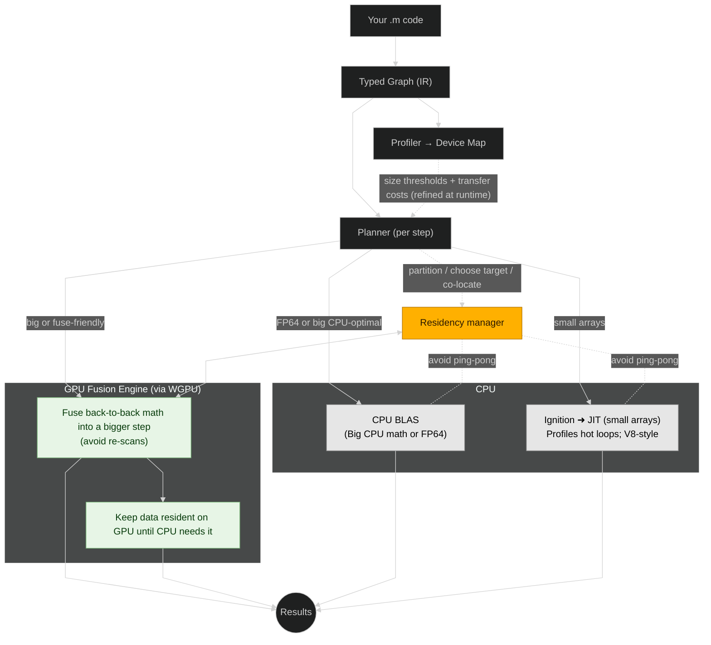

## TL;DR

- **RunMat Accelerate** automatically fuses MATLAB-style array math into optimized CPU and GPU kernels — no CUDA, no device flags, no code changes.
- On a 4K image pipeline benchmark (Apple M2 Max), RunMat is up to 10× faster than NumPy and up to 3.8× faster than PyTorch.
- Works on any GPU — NVIDIA, AMD, Apple Silicon, Intel — via native APIs (Metal, DirectX 12, Vulkan).
- One code path: write math, the runtime decides what runs where.

## Why a faster way to do math

Your mathematical code is elegant. It's also 50x slower than it should be. You know GPUs could fix this, but the path there is absurd: rewrite everything in CUDA, manage device memory explicitly, accept vendor lock-in, or pay thousands per seat for accelerators that still require code changes. The gap between "math as we think it" and "math as GPUs want it" has become so normalized that we've forgotten to question why  (A \- mean(A)) / std(A) should require anything more than writing exactly that. 

RunMat eliminates this gap entirely. You write your math in clean, readable MATLAB-style syntax. RunMat automatically fuses your operations into optimized kernels and runs them on the best place — CPU or GPU. On GPU, it can often match or beat hand-tuned CUDA pipelines on many math-heavy workloads.

It runs on whatever GPU you have — NVIDIA, AMD, Apple Silicon, Intel — through native APIs (Metal / DirectX 12 / Vulkan). No device flags. No vendor lock-in. No rewrites.

## The performance tradeoff (until now)

Running math fast on a machine means setting up the machine to run a sequence of mathematical operations.

You have two choices today:

**Option 1:** Learn CUDA and write GPU kernels. Master how to parallelize workgroups in GPU cores. For those willing to do this work, you can sometimes eke out marginal performance gains by writing GPU kernels yourself.

**Option 2:** Write `y = sin(x)` and leave it at that. This is what RunMat is designed for.

RunMat detects operations that can run well on GPUs, and keeps smaller or awkward workloads on its CPU JIT and BLAS paths. You write one script; it decides what runs where.


If you want to write CUDA/GPU code yourself, you might write a marginally faster GPU pipeline. [Note: this mainly applies to specialized pre-written PyTorch pipelines, particularly around ML tasks]

If you want to focus on the math, our promise is: you write math, and we make it fly.

### What the best path looks like

Let's see RunMat in action with a common problem: processing high-resolution images in batches. Whether you're analyzing satellite imagery, medical scans, or camera sensor data, the pipeline is always the same—normalize the data, apply corrections, and enhance the signal. The math is straightforward. 

This pipeline mirrors common image preprocessing (remote sensing, medical, photography): per-image z-score normalization, radiometric gain/bias correction, gamma correction, and a simple quality check using MSE. We use 16 single-precision 4K tiles to avoid I/O effects and to stress the pattern GPUs handle well: long elementwise chains with light reductions. In RunMat, the MATLAB-style code remains as written, while Accelerate fuses elementwise steps and eliminates unnecessary memory transfers between operations, reducing kernel launches and transfers. 


``` Matlab
rng(0); 
B = 16; H = 2160; W = 3840;   % Batch of 16 4K images
gain = single(1.0123); bias = single(-0.02);   
gamma = single(1.8); eps0 = single(1e-6);   

% Generate random test images (16 × 2160 × 3840 = 133M elements)
imgs = rand(B, H, W, 'single');   % RunMat generates directly on GPU when possible

% Compute per-image statistics for normalization
mu = mean(imgs, [2 3]);           % Mean across height/width dims (stays on GPU)
sigma = sqrt(mean((imgs - mu).^2, [2 3]) + eps0);  % Std deviation (fused on GPU)

% Apply normalization with gain and bias
out = ((imgs - mu) ./ sigma) * gain + bias;  % Entire chain fused into single GPU kernel

% Apply gamma correction  
out = out .^ gamma;               % Fused with previous operations when possible

% Compute error metric
mse = mean((out - imgs).^2, 'all');  % Reduction stays on GPU until...
fprintf('Done. MSE=%.6e\n', mse);    % Only here does data return to CPU for printing
```

## 4K image pipeline: real benchmark numbers


We ran this exact pipeline on an **Apple M2 Max** using the Metal backend, averaged over **3 runs** per point. Each batch size `B` is `B × 2160 × 3840` single-precision pixels.

### 4K image pipeline perf sweep (B = batch size)
| B | RunMat (ms) | PyTorch (ms) | NumPy (ms) | NumPy ÷ RunMat | PyTorch ÷ RunMat |
|---|---:|---:|---:|---:|---:|
| 4  | 142.97 | 801.29 | 500.34 | 3.50× | 5.60× |
| 8  | 212.77 | 808.92 | 939.27 | 4.41× | 3.80× |
| 16 | 241.56 | 907.73 | 1783.47 | 7.38× | 3.76× |
| 32 | 389.25 | 1141.92 | 3605.95 | 9.26× | 2.93× |
| 64 | 683.54 | 1203.20 | 6958.28 | 10.18× | 1.76× |


At the high end (**B = 64**, 64 4K images ≈ 133M pixels):

- RunMat: **0.68 s**  
- NumPy: **about 7.0 s** → **(≈10× slower)**  
- PyTorch: **about 1.2 s** → **(≈1.8× slower)**


This is the same MATLAB-style code you saw above. RunMat’s fusion engine turns that code into a small number of GPU kernels, keeps tensors resident on the device, and only brings data back to CPU when you actually need it (for example, when printing the final MSE).

On smaller batches, RunMat keeps more of this work on the CPU JIT and BLAS paths so you still get low overhead and fast startup.

Run this benchmark yourself: [4K image pipeline script](https://github.com/runmat-org/runmat/blob/main/benchmarks/4k-image-processing/runmat.m)

See your workload accelerated: [Getting Started guide](/docs/getting-started)

### What RunMat does automatically

1. Detects a GPU and selects the backend automatically (Metal / DirectX 12 / Vulkan). Falls back to CPU when none is available.  
2. Plans each operation to the best engine (CPU JIT, BLAS, or GPU) based on array sizes and op type.  
3. Fuses compatible steps and intelligently manages data placement between CPU and GPU memory.  
4. One code path: no device flags, no vendor branches, no separate builds.



## The complexity you're avoiding

To understand what RunMat eliminates from your workflow, let's look at what GPU acceleration currently requires. PyTorch is the de facto standard for GPU computing in machine learning and scientific computing—it's mature, well-optimized, and widely used. If you want GPU acceleration today, PyTorch is often your best option. 

Here's our image preprocessing pipeline implemented in both RunMat and PyTorch. Notice what's required beyond the mathematical operations themselves:

```Matlab

% 16×4K tiles: normalize → calibrate → gamma → MSE
rng(0); B=16; H=2160; W=3840;
gain=single(1.0123); bias=single(-0.02); gamma=single(1.8); eps0=single(1e-6);

imgs  = rand(B,H,W,'single');                      % [B,H,W]
mu    = mean(imgs,[2 3]);                          % per-image mean
sigma = sqrt(mean((imgs - mu).^2,[2 3]) + eps0);   % per-image std

out = ((imgs - mu) ./ sigma) * gain + bias;        % normalize + calibrate
out = out .^ gamma;                                % gamma correction
mse = mean((out - imgs).^2,'all');


```


Vs 

```Python

# 16×4K tiles: normalize → calibrate → gamma → MSE
import torch
B, H, W = 16, 2160, 3840

# [device/setup]
device = "cuda" if torch.cuda.is_available() else "cpu"
dtype = torch.float32
torch.manual_seed(0)

# [allocations on selected device]
imgs  = torch.rand((B, H, W), dtype=dtype, device=device)
gain  = torch.tensor(1.0123, dtype=dtype, device=device)
bias  = torch.tensor(-0.02,  dtype=dtype, device=device)
gamma = torch.tensor(1.8,    dtype=dtype, device=device)
eps0  = 1e-6

# [math]
mu    = imgs.mean(dim=(1, 2), keepdim=True)
sigma = ((imgs - mu)**2).mean(dim=(1, 2), keepdim=True).add(eps0).sqrt()
out   = ((imgs - mu) / sigma) * gain + bias
out   = out.pow(gamma)
mse   = (out - imgs).pow(2).mean()


```

The PyTorch version requires 24 lines to RunMat's 11, but line count isn't the real story. 

Look at what those extra lines are doing: 


* **Explicit device management:** PyTorch requires you to check for CUDA availability, explicitly move tensors to GPU. Every tensor operation must consider where the data lives. RunMat handles this automatically—if a GPU is available and it will be faster to use for your given task, it uses it. If not, it runs on CPU. Your code doesn't change.   
* **Framework-specific types:** PyTorch separates NumPy arrays and `torch.Tensor`, and you must track each tensor’s device. RunMat exposes one MATLAB-style array backed by a common `Tensor` abstraction (CPU or `GpuTensor`) with the same interface.  
* **Conditional execution paths:** PyTorch requires provider-specific branches (CUDA/ROCm/MPS) and device-aware tensor placement. RunMat has no provider branches: one script, with the runtime choosing Metal/DX12/Vulkan and keeping semantics consistent.

This isn't a criticism of PyTorch—it's an excellent framework that makes GPU programming accessible to millions of developers. But it still requires you to think about hardware details when you want to think about mathematics. RunMat removes that cognitive overhead entirely.

### Cross-ecosystem comparison at a glance

A side-by-side of RunMat versus MATLAB+PCT, PyTorch, and Julia+CUDA.jl on six dimensions that matter for numerical computing: code surface, placement (CPU/GPU), fusion, residency, transfers, and learning curve. Scope: dense arrays and scripting—not full ML training stacks. For a guide to MATLAB's gpuArray and how RunMat fits in, see [How to Use GPUs in MATLAB](/blog/how-to-use-gpu-in-matlab).

| Dimension                                                | RunMat Accelerate                                              | MATLAB \+ Parallel Computing Toolbox (gpuArray) | PyTorch (GPU)                                                | Julia \+ CUDA.jl                                                  |
|----------------------------------------------------------|----------------------------------------------------------------|-------------------------------------------------|--------------------------------------------------------------|-------------------------------------------------------------------|
| **How you write code**                                   | Plain MATLAB-syntax (no gpuArray)                              | MATLAB with `gpuArray`, `gather`, device types  | Python tensors on `cuda`                                     | Julia `CuArray` types                                             |
| **CPU/GPU selection**                                    | **Automatic per-op** (live thresholds; fallback to CPU)        | Manual (you choose gpuArray)                    | Manual (you choose the device)                               | Manual (you choose the device)                                    |
| **Epilogue fusion** (e.g., matmul → divide → max → norm) | **Yes, cross-statement** (fused kernels)                       | No (separate kernels)                           | Limited by default; custom fusion via `torch.compile`/Triton | Broadcast fusion helps elementwise; GEMM epilogues often separate |
| **Data residency**                                       | **Automatic** (keeps tensors on device; gather only if needed) | Manual (you manage `gpuArray`/`gather`)         | Manual/partial (framework helps, but you manage boundaries)  | Manual/partial                                                    |
| **Host↔Device transfers**                                | **Minimized automatically**; device map amortizes copies       | Developer decides when to copy                  | Developer decides; easy to accidentally sync                 | Developer decides                                                 |
| **Learning curve**                                       | **Low** (keep existing scripts)                                | Medium (GPU types, residency patterns)          | Medium (tensor/device/dtype discipline; optional Triton)     | Medium (GPU array ecosystem)                                      |

### What you can run today with RunMat

RunMat covers the core numerical stack so you can keep MATLAB-style code and use the GPU when it helps. Elementwise chains, reductions, filters, and matmul epilogues are fused on GPU; large linear-algebra ops call optimized BLAS/LAPACK on CPU. 

Full list and examples live in the [`benchmarks/`](https://github.com/runmat-org/runmat/tree/main/benchmarks) library.

### Why MATLAB syntax, not a new language

MATLAB is commonly taught in engineering programs, so many engineers already think in MATLAB-style array math. Keeping that surface lowers switching cost and preserves existing work.

* **Reuse existing code.** Teams can run current `.m` files with minimal edits rather than translating them into a new syntax.

* **Correct semantics for arrays.** MATLAB’s rules (column-major arrays, 1-based indexing, implicit expansion/broadcast) match how people write numerical work. We keep those semantics while changing the runtime.

* **Lower cognitive load.** Users focus on equations and shapes, not on learning new keywords or control structures.

* **Training and documentation.** Thousands of textbooks, lab notes, and snippets use MATLAB notation; keeping it preserves that knowledge base.

* **Separation of concerns.** The language stays stable; performance comes from the runtime (JIT, Accelerate, Fusion, WGPU). No API churn for users.

### Try for yourself

***Download RunMat:** [Download](/download)

* **See benchmarks and examples:** [Benchmarks](/benchmarks)

## FAQ

**What is RunMat?**  
An open-source MATLAB-compatible runtime focused on fast, portable numerical computing. It keeps MATLAB-style syntax and accelerates code on GPU when available.

**Which operating systems and GPUs are supported?**  
macOS (Apple Silicon and supported AMD/NVIDIA cards), Windows, and Linux via the native GPU APIs above. If no compatible GPU is present, RunMat runs on CPU.

**Do I need MATLAB installed or a MATLAB license?**  
No. RunMat is a standalone runtime. It adheres to MATLAB core language grammar and semantics. It is not associated or affiliated with MathWorks MATLAB in any way, shape or form. [Learn more in the grammar/semantics doc.](/docs/language-coverage)

**How compatible is it with MATLAB?**  
Core array operations, elementwise math, reductions, common linear-algebra, FFT/signal/image, and statistics functions are covered. Check the function index for exact status. 

**How do I run my existing `.m` files?**  
Install RunMat and run your script with the CLI or the Jupyter kernel.
**Can I mix CPU and GPU in one script?**  
Yes. The planner chooses CPU JIT/BLAS or GPU per step. Fusion keeps GPU regions device-resident when beneficial.

**Does it work offline? Any telemetry?**  
 It runs locally and does not require internet access for execution. See the repository for any optional diagnostics and how to disable them. [Privacy/Telemetry](/docs/telemetry)

**How do I report an issue or contribute?**  
 Open an issue or PR in the repository. Include OS, GPU/CPU info, a minimal script, and steps to reproduce. [GitHub](https://github.com/runmat-org/runmat)


