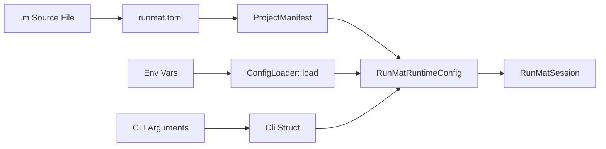

# Configuration Reference

<details>
<summary>Relevant source files</summary>

- [crates/runmat-cli/src/app/bootstrap.rs](https://github.com/runmat-org/runmat/blob/82685330/crates/runmat-cli/src/app/bootstrap.rs)
- [crates/runmat-cli/src/app/dispatch.rs](https://github.com/runmat-org/runmat/blob/82685330/crates/runmat-cli/src/app/dispatch.rs)
- [crates/runmat-cli/src/cli/root.rs](https://github.com/runmat-org/runmat/blob/82685330/crates/runmat-cli/src/cli/root.rs)
- [crates/runmat-cli/src/commands/benchmark.rs](https://github.com/runmat-org/runmat/blob/82685330/crates/runmat-cli/src/commands/benchmark.rs)
- [crates/runmat-cli/src/commands/bytecode.rs](https://github.com/runmat-org/runmat/blob/82685330/crates/runmat-cli/src/commands/bytecode.rs)
- [crates/runmat-cli/src/commands/config.rs](https://github.com/runmat-org/runmat/blob/82685330/crates/runmat-cli/src/commands/config.rs)
- [crates/runmat-cli/src/commands/repl.rs](https://github.com/runmat-org/runmat/blob/82685330/crates/runmat-cli/src/commands/repl.rs)
- [crates/runmat-cli/src/commands/script.rs](https://github.com/runmat-org/runmat/blob/82685330/crates/runmat-cli/src/commands/script.rs)
- [crates/runmat-cli/src/commands/version.rs](https://github.com/runmat-org/runmat/blob/82685330/crates/runmat-cli/src/commands/version.rs)
- [crates/runmat-cli/src/remote/fs.rs](https://github.com/runmat-org/runmat/blob/82685330/crates/runmat-cli/src/remote/fs.rs)
- [crates/runmat-cli/src/remote/mod.rs](https://github.com/runmat-org/runmat/blob/82685330/crates/runmat-cli/src/remote/mod.rs)
- [crates/runmat-cli/src/telemetry/client.rs](https://github.com/runmat-org/runmat/blob/82685330/crates/runmat-cli/src/telemetry/client.rs)
- [crates/runmat-cli/src/telemetry/mod.rs](https://github.com/runmat-org/runmat/blob/82685330/crates/runmat-cli/src/telemetry/mod.rs)
- [crates/runmat-cli/tests/environment.rs](https://github.com/runmat-org/runmat/blob/82685330/crates/runmat-cli/tests/environment.rs)
- [crates/runmat-config/src/lib.rs](https://github.com/runmat-org/runmat/blob/82685330/crates/runmat-config/src/lib.rs)
- [crates/runmat-config/src/project/mod.rs](https://github.com/runmat-org/runmat/blob/82685330/crates/runmat-config/src/project/mod.rs)
- [crates/runmat-config/tests/accelerate_bridge.rs](https://github.com/runmat-org/runmat/blob/82685330/crates/runmat-config/tests/accelerate_bridge.rs)
- [crates/runmat-config/tests/defaults.rs](https://github.com/runmat-org/runmat/blob/82685330/crates/runmat-config/tests/defaults.rs)
- [crates/runmat-config/tests/env_overrides.rs](https://github.com/runmat-org/runmat/blob/82685330/crates/runmat-config/tests/env_overrides.rs)
- [crates/runmat-config/tests/loading.rs](https://github.com/runmat-org/runmat/blob/82685330/crates/runmat-config/tests/loading.rs)
- [crates/runmat-config/tests/project_manifest.rs](https://github.com/runmat-org/runmat/blob/82685330/crates/runmat-config/tests/project_manifest.rs)
- [crates/runmat-config/tests/serialization.rs](https://github.com/runmat-org/runmat/blob/82685330/crates/runmat-config/tests/serialization.rs)
- [crates/runmat-core/src/abi.rs](https://github.com/runmat-org/runmat/blob/82685330/crates/runmat-core/src/abi.rs)

</details>

RunMat utilizes a hierarchical configuration system that manages project-level metadata, source organization, and runtime execution parameters. The configuration is primarily driven by a manifest file (`runmat.toml` or `runmat.json`) and can be overridden by environment variables and CLI arguments.

## Configuration Resolution Order

RunMat resolves configuration settings using a specific precedence. Lower-numbered levels are overridden by higher-numbered levels:

1. Built-in Defaults: Hardcoded values within the `runmat-config` crate [crates/runmat-config/tests/defaults.rs #1-10](https://github.com/runmat-org/runmat/blob/82685330/crates/runmat-config/tests/defaults.rs#L1-L10)
2. Project Manifest: Settings found in `runmat.toml` or `runmat.json`. The system automatically discovers this file by walking up the directory tree from the source file being executed [crates/runmat-config/tests/project_manifest.rs #243-261](https://github.com/runmat-org/runmat/blob/82685330/crates/runmat-config/tests/project_manifest.rs#L243-L261)
3. Environment Variables: Variables such as `RUNMAT_CONFIG` or `RUNMAT_JIT_THRESHOLD` [crates/runmat-cli/src/cli/root.rs #49-55](https://github.com/runmat-org/runmat/blob/82685330/crates/runmat-cli/src/cli/root.rs#L49-L55)
4. CLI Arguments: Explicit flags passed to the `runmat` binary (e.g., `--no-jit` or `--gc-preset`) [crates/runmat-cli/src/app/bootstrap.rs #126-205](https://github.com/runmat-org/runmat/blob/82685330/crates/runmat-cli/src/app/bootstrap.rs#L126-L205)

### Configuration Discovery and Loading

The `ConfigLoader` in `runmat-config` handles the deserialization and validation of runtime settings [crates/runmat-config/src/runtime/mod.rs #1-10](https://github.com/runmat-org/runmat/blob/82685330/crates/runmat-config/src/runtime/mod.rs#L1-L10)

Config Resolution Data Flow Title: Configuration Loading Pipeline



<details>
<summary>Rendered SVG</summary>

```svg
<svg id="mermaid-55ipx49phb" xmlns="http://www.w3.org/2000/svg" xmlns:xlink="http://www.w3.org/1999/xlink" class="flowchart" style="max-width: 100%; touch-action: none; user-select: none; cursor: grab; min-height: fit-content; max-height: 100%;" viewBox="-0.008167613636373972 0 744.7272727272727 633" role="graphics-document document" aria-roledescription="flowchart-v2" preserveAspectRatio="xMidYMid meet"><style>#mermaid-55ipx49phb{font-family:ui-sans-serif,-apple-system,system-ui,Segoe UI,Helvetica;font-size:16px;fill:#ccc;}@keyframes edge-animation-frame{from{stroke-dashoffset:0;}}@keyframes dash{to{stroke-dashoffset:0;}}#mermaid-55ipx49phb .edge-animation-slow{stroke-dasharray:9,5!important;stroke-dashoffset:900;animation:dash 50s linear infinite;stroke-linecap:round;}#mermaid-55ipx49phb .edge-animation-fast{stroke-dasharray:9,5!important;stroke-dashoffset:900;animation:dash 20s linear infinite;stroke-linecap:round;}#mermaid-55ipx49phb .error-icon{fill:#333;}#mermaid-55ipx49phb .error-text{fill:#cccccc;stroke:#cccccc;}#mermaid-55ipx49phb .edge-thickness-normal{stroke-width:1px;}#mermaid-55ipx49phb .edge-thickness-thick{stroke-width:3.5px;}#mermaid-55ipx49phb .edge-pattern-solid{stroke-dasharray:0;}#mermaid-55ipx49phb .edge-thickness-invisible{stroke-width:0;fill:none;}#mermaid-55ipx49phb .edge-pattern-dashed{stroke-dasharray:3;}#mermaid-55ipx49phb .edge-pattern-dotted{stroke-dasharray:2;}#mermaid-55ipx49phb .marker{fill:#666;stroke:#666;}#mermaid-55ipx49phb .marker.cross{stroke:#666;}#mermaid-55ipx49phb svg{font-family:ui-sans-serif,-apple-system,system-ui,Segoe UI,Helvetica;font-size:16px;}#mermaid-55ipx49phb p{margin:0;}#mermaid-55ipx49phb .label{font-family:ui-sans-serif,-apple-system,system-ui,Segoe UI,Helvetica;color:#fff;}#mermaid-55ipx49phb .cluster-label text{fill:#fff;}#mermaid-55ipx49phb .cluster-label span{color:#fff;}#mermaid-55ipx49phb .cluster-label span p{background-color:transparent;}#mermaid-55ipx49phb .label text,#mermaid-55ipx49phb span{fill:#fff;color:#fff;}#mermaid-55ipx49phb .node rect,#mermaid-55ipx49phb .node circle,#mermaid-55ipx49phb .node ellipse,#mermaid-55ipx49phb .node polygon,#mermaid-55ipx49phb .node path{fill:#111;stroke:#222;stroke-width:1px;}#mermaid-55ipx49phb .rough-node .label text,#mermaid-55ipx49phb .node .label text,#mermaid-55ipx49phb .image-shape .label,#mermaid-55ipx49phb .icon-shape .label{text-anchor:middle;}#mermaid-55ipx49phb .node .katex path{fill:#000;stroke:#000;stroke-width:1px;}#mermaid-55ipx49phb .rough-node .label,#mermaid-55ipx49phb .node .label,#mermaid-55ipx49phb .image-shape .label,#mermaid-55ipx49phb .icon-shape .label{text-align:center;}#mermaid-55ipx49phb .node.clickable{cursor:pointer;}#mermaid-55ipx49phb .root .anchor path{fill:#666!important;stroke-width:0;stroke:#666;}#mermaid-55ipx49phb .arrowheadPath{fill:#0b0b0b;}#mermaid-55ipx49phb .edgePath .path{stroke:#666;stroke-width:1px;}#mermaid-55ipx49phb .flowchart-link{stroke:#666;fill:none;}#mermaid-55ipx49phb .edgeLabel{background-color:#161616;text-align:center;}#mermaid-55ipx49phb .edgeLabel p{background-color:#161616;}#mermaid-55ipx49phb .edgeLabel rect{opacity:0.5;background-color:#161616;fill:#161616;}#mermaid-55ipx49phb .labelBkg{background-color:rgba(22, 22, 22, 0.5);}#mermaid-55ipx49phb .cluster rect{fill:#161616;stroke:#222;stroke-width:1px;}#mermaid-55ipx49phb .cluster text{fill:#fff;}#mermaid-55ipx49phb .cluster span{color:#fff;}#mermaid-55ipx49phb div.mermaidTooltip{position:absolute;text-align:center;max-width:200px;padding:2px;font-family:ui-sans-serif,-apple-system,system-ui,Segoe UI,Helvetica;font-size:12px;background:#333;border:1px solid hsl(0, 0%, 10%);border-radius:2px;pointer-events:none;z-index:100;}#mermaid-55ipx49phb .flowchartTitleText{text-anchor:middle;font-size:18px;fill:#ccc;}#mermaid-55ipx49phb rect.text{fill:none;stroke-width:0;}#mermaid-55ipx49phb .icon-shape,#mermaid-55ipx49phb .image-shape{background-color:#161616;text-align:center;}#mermaid-55ipx49phb .icon-shape p,#mermaid-55ipx49phb .image-shape p{background-color:#161616;padding:2px;}#mermaid-55ipx49phb .icon-shape .label rect,#mermaid-55ipx49phb .image-shape .label rect{opacity:0.5;background-color:#161616;fill:#161616;}#mermaid-55ipx49phb .label-icon{display:inline-block;height:1em;overflow:visible;vertical-align:-0.125em;}#mermaid-55ipx49phb .node .label-icon path{fill:currentColor;stroke:revert;stroke-width:revert;}#mermaid-55ipx49phb .node .neo-node{stroke:#222;}#mermaid-55ipx49phb [data-look="neo"].node rect,#mermaid-55ipx49phb [data-look="neo"].cluster rect,#mermaid-55ipx49phb [data-look="neo"].node polygon{stroke:url(#mermaid-55ipx49phb-gradient);filter:drop-shadow( 1px 2px 2px rgba(185,185,185,1));}#mermaid-55ipx49phb [data-look="neo"].node path{stroke:url(#mermaid-55ipx49phb-gradient);stroke-width:1px;}#mermaid-55ipx49phb [data-look="neo"].node .outer-path{filter:drop-shadow( 1px 2px 2px rgba(185,185,185,1));}#mermaid-55ipx49phb [data-look="neo"].node .neo-line path{stroke:#222;filter:none;}#mermaid-55ipx49phb [data-look="neo"].node circle{stroke:url(#mermaid-55ipx49phb-gradient);filter:drop-shadow( 1px 2px 2px rgba(185,185,185,1));}#mermaid-55ipx49phb [data-look="neo"].node circle .state-start{fill:#000000;}#mermaid-55ipx49phb [data-look="neo"].icon-shape .icon{fill:url(#mermaid-55ipx49phb-gradient);filter:drop-shadow( 1px 2px 2px rgba(185,185,185,1));}#mermaid-55ipx49phb [data-look="neo"].icon-shape .icon-neo path{stroke:url(#mermaid-55ipx49phb-gradient);filter:drop-shadow( 1px 2px 2px rgba(185,185,185,1));}#mermaid-55ipx49phb :root{--mermaid-font-family:"trebuchet ms",verdana,arial,sans-serif;}</style><g><marker id="mermaid-55ipx49phb_flowchart-v2-pointEnd" class="marker flowchart-v2" viewBox="0 0 10 10" refX="5" refY="5" markerUnits="userSpaceOnUse" markerWidth="8" markerHeight="8" orient="auto"><path d="M 0 0 L 10 5 L 0 10 z" class="arrowMarkerPath" style="stroke-width: 1; stroke-dasharray: 1, 0;"></path></marker><marker id="mermaid-55ipx49phb_flowchart-v2-pointStart" class="marker flowchart-v2" viewBox="0 0 10 10" refX="4.5" refY="5" markerUnits="userSpaceOnUse" markerWidth="8" markerHeight="8" orient="auto"><path d="M 0 5 L 10 10 L 10 0 z" class="arrowMarkerPath" style="stroke-width: 1; stroke-dasharray: 1, 0;"></path></marker><marker id="mermaid-55ipx49phb_flowchart-v2-pointEnd-margin" class="marker flowchart-v2" viewBox="0 0 11.5 14" refX="11.5" refY="7" markerUnits="userSpaceOnUse" markerWidth="10.5" markerHeight="14" orient="auto"><path d="M 0 0 L 11.5 7 L 0 14 z" class="arrowMarkerPath" style="stroke-width: 0; stroke-dasharray: 1, 0;"></path></marker><marker id="mermaid-55ipx49phb_flowchart-v2-pointStart-margin" class="marker flowchart-v2" viewBox="0 0 11.5 14" refX="1" refY="7" markerUnits="userSpaceOnUse" markerWidth="11.5" markerHeight="14" orient="auto"><polygon points="0,7 11.5,14 11.5,0" class="arrowMarkerPath" style="stroke-width: 0; stroke-dasharray: 1, 0;"></polygon></marker><marker id="mermaid-55ipx49phb_flowchart-v2-circleEnd" class="marker flowchart-v2" viewBox="0 0 10 10" refX="11" refY="5" markerUnits="userSpaceOnUse" markerWidth="11" markerHeight="11" orient="auto"><circle cx="5" cy="5" r="5" class="arrowMarkerPath" style="stroke-width: 1; stroke-dasharray: 1, 0;"></circle></marker><marker id="mermaid-55ipx49phb_flowchart-v2-circleStart" class="marker flowchart-v2" viewBox="0 0 10 10" refX="-1" refY="5" markerUnits="userSpaceOnUse" markerWidth="11" markerHeight="11" orient="auto"><circle cx="5" cy="5" r="5" class="arrowMarkerPath" style="stroke-width: 1; stroke-dasharray: 1, 0;"></circle></marker><marker id="mermaid-55ipx49phb_flowchart-v2-circleEnd-margin" class="marker flowchart-v2" viewBox="0 0 10 10" refY="5" refX="12.25" markerUnits="userSpaceOnUse" markerWidth="14" markerHeight="14" orient="auto"><circle cx="5" cy="5" r="5" class="arrowMarkerPath" style="stroke-width: 0; stroke-dasharray: 1, 0;"></circle></marker><marker id="mermaid-55ipx49phb_flowchart-v2-circleStart-margin" class="marker flowchart-v2" viewBox="0 0 10 10" refX="-2" refY="5" markerUnits="userSpaceOnUse" markerWidth="14" markerHeight="14" orient="auto"><circle cx="5" cy="5" r="5" class="arrowMarkerPath" style="stroke-width: 0; stroke-dasharray: 1, 0;"></circle></marker><marker id="mermaid-55ipx49phb_flowchart-v2-crossEnd" class="marker cross flowchart-v2" viewBox="0 0 11 11" refX="12" refY="5.2" markerUnits="userSpaceOnUse" markerWidth="11" markerHeight="11" orient="auto"><path d="M 1,1 l 9,9 M 10,1 l -9,9" class="arrowMarkerPath" style="stroke-width: 2; stroke-dasharray: 1, 0;"></path></marker><marker id="mermaid-55ipx49phb_flowchart-v2-crossStart" class="marker cross flowchart-v2" viewBox="0 0 11 11" refX="-1" refY="5.2" markerUnits="userSpaceOnUse" markerWidth="11" markerHeight="11" orient="auto"><path d="M 1,1 l 9,9 M 10,1 l -9,9" class="arrowMarkerPath" style="stroke-width: 2; stroke-dasharray: 1, 0;"></path></marker><marker id="mermaid-55ipx49phb_flowchart-v2-crossEnd-margin" class="marker cross flowchart-v2" viewBox="0 0 15 15" refX="17.7" refY="7.5" markerUnits="userSpaceOnUse" markerWidth="12" markerHeight="12" orient="auto"><path d="M 1,1 L 14,14 M 1,14 L 14,1" class="arrowMarkerPath" style="stroke-width: 2.5;"></path></marker><marker id="mermaid-55ipx49phb_flowchart-v2-crossStart-margin" class="marker cross flowchart-v2" viewBox="0 0 15 15" refX="-3.5" refY="7.5" markerUnits="userSpaceOnUse" markerWidth="12" markerHeight="12" orient="auto"><path d="M 1,1 L 14,14 M 1,14 L 14,1" class="arrowMarkerPath" style="stroke-width: 2.5; stroke-dasharray: 1, 0;"></path></marker><g class="root"><g class="clusters"><g class="cluster" id="mermaid-55ipx49phb-subGraph1" data-look="classic"><rect style="" x="271.59375" y="161" width="465.1171875" height="232"></rect><g class="cluster-label" transform="translate(450.41015625, 161)"><foreignObject width="107.484375" height="24"><div style="display: table-cell; white-space: nowrap; line-height: 1.5;" xmlns="http://www.w3.org/1999/xhtml"><span class="nodeLabel"><p>Process Space</p></span></div></foreignObject></g></g><g class="cluster" id="mermaid-55ipx49phb-subGraph0" data-look="classic"><rect style="" x="8" y="8" width="243.59375" height="385"></rect><g class="cluster-label" transform="translate(66.6328125, 8)"><foreignObject width="126.328125" height="24"><div style="display: table-cell; white-space: nowrap; line-height: 1.5;" xmlns="http://www.w3.org/1999/xhtml"><span class="nodeLabel"><p>Filesystem Space</p></span></div></foreignObject></g></g></g><g class="edgePaths"><path d="M129.797,87L129.797,93.167C129.797,99.333,129.797,111.667,129.797,124C129.797,136.333,129.797,148.667,129.797,158.333C129.797,168,129.797,175,129.797,178.5L129.797,182" id="mermaid-55ipx49phb-L_A_B_0" class="edge-thickness-normal edge-pattern-solid edge-thickness-normal edge-pattern-solid flowchart-link" style=";" data-edge="true" data-et="edge" data-id="L_A_B_0" data-points="W3sieCI6MTI5Ljc5Njg3NSwieSI6ODd9LHsieCI6MTI5Ljc5Njg3NSwieSI6MTI0fSx7IngiOjEyOS43OTY4NzUsInkiOjE2MX0seyJ4IjoxMjkuNzk2ODc1LCJ5IjoxODZ9XQ==" data-look="classic" marker-end="url(#mermaid-55ipx49phb_flowchart-v2-pointEnd)"></path><path d="M129.797,240L129.797,246.167C129.797,252.333,129.797,264.667,129.797,276.333C129.797,288,129.797,299,129.797,304.5L129.797,310" id="mermaid-55ipx49phb-L_B_C_0" class="edge-thickness-normal edge-pattern-solid edge-thickness-normal edge-pattern-solid flowchart-link" style=";" data-edge="true" data-et="edge" data-id="L_B_C_0" data-points="W3sieCI6MTI5Ljc5Njg3NSwieSI6MjQwfSx7IngiOjEyOS43OTY4NzUsInkiOjI3N30seyJ4IjoxMjkuNzk2ODc1LCJ5IjozMTR9XQ==" data-look="classic" marker-end="url(#mermaid-55ipx49phb_flowchart-v2-pointEnd)"></path><path d="M405.5,240L405.5,246.167C405.5,252.333,405.5,264.667,405.5,276.333C405.5,288,405.5,299,405.5,304.5L405.5,310" id="mermaid-55ipx49phb-L_D_E_0" class="edge-thickness-normal edge-pattern-solid edge-thickness-normal edge-pattern-solid flowchart-link" style=";" data-edge="true" data-et="edge" data-id="L_D_E_0" data-points="W3sieCI6NDA1LjUsInkiOjI0MH0seyJ4Ijo0MDUuNSwieSI6Mjc3fSx7IngiOjQwNS41LCJ5IjozMTR9XQ==" data-look="classic" marker-end="url(#mermaid-55ipx49phb_flowchart-v2-pointEnd)"></path><path d="M618,240L618,246.167C618,252.333,618,264.667,618,276.333C618,288,618,299,618,304.5L618,310" id="mermaid-55ipx49phb-L_F_G_0" class="edge-thickness-normal edge-pattern-solid edge-thickness-normal edge-pattern-solid flowchart-link" style=";" data-edge="true" data-et="edge" data-id="L_F_G_0" data-points="W3sieCI6NjE4LCJ5IjoyNDB9LHsieCI6NjE4LCJ5IjoyNzd9LHsieCI6NjE4LCJ5IjozMTR9XQ==" data-look="classic" marker-end="url(#mermaid-55ipx49phb_flowchart-v2-pointEnd)"></path><path d="M129.797,368L129.797,372.167C129.797,376.333,129.797,384.667,129.797,395C129.797,405.333,129.797,417.667,156.473,430.026C183.149,442.385,236.501,454.77,263.177,460.962L289.854,467.155" id="mermaid-55ipx49phb-L_C_H_0" class="edge-thickness-normal edge-pattern-solid edge-thickness-normal edge-pattern-solid flowchart-link" style=";" data-edge="true" data-et="edge" data-id="L_C_H_0" data-points="W3sieCI6MTI5Ljc5Njg3NSwieSI6MzY4fSx7IngiOjEyOS43OTY4NzUsInkiOjM5M30seyJ4IjoxMjkuNzk2ODc1LCJ5Ijo0MzB9LHsieCI6MjkzLjc1LCJ5Ijo0NjguMDU5MDUzNTU2MjQ4Mn1d" data-look="classic" marker-end="url(#mermaid-55ipx49phb_flowchart-v2-pointEnd)"></path><path d="M405.5,368L405.5,372.167C405.5,376.333,405.5,384.667,405.5,395C405.5,405.333,405.5,417.667,405.5,429.333C405.5,441,405.5,452,405.5,457.5L405.5,463" id="mermaid-55ipx49phb-L_E_H_0" class="edge-thickness-normal edge-pattern-solid edge-thickness-normal edge-pattern-solid flowchart-link" style=";" data-edge="true" data-et="edge" data-id="L_E_H_0" data-points="W3sieCI6NDA1LjUsInkiOjM2OH0seyJ4Ijo0MDUuNSwieSI6MzkzfSx7IngiOjQwNS41LCJ5Ijo0MzB9LHsieCI6NDA1LjUsInkiOjQ2N31d" data-look="classic" marker-end="url(#mermaid-55ipx49phb_flowchart-v2-pointEnd)"></path><path d="M618,368L618,372.167C618,376.333,618,384.667,618,395C618,405.333,618,417.667,598.163,429.808C578.326,441.949,538.652,453.898,518.815,459.872L498.979,465.846" id="mermaid-55ipx49phb-L_G_H_0" class="edge-thickness-normal edge-pattern-solid edge-thickness-normal edge-pattern-solid flowchart-link" style=";" data-edge="true" data-et="edge" data-id="L_G_H_0" data-points="W3sieCI6NjE4LCJ5IjozNjh9LHsieCI6NjE4LCJ5IjozOTN9LHsieCI6NjE4LCJ5Ijo0MzB9LHsieCI6NDk1LjE0ODQzNzUsInkiOjQ2N31d" data-look="classic" marker-end="url(#mermaid-55ipx49phb_flowchart-v2-pointEnd)"></path><path d="M405.5,521L405.5,525.167C405.5,529.333,405.5,537.667,405.5,545.333C405.5,553,405.5,560,405.5,563.5L405.5,567" id="mermaid-55ipx49phb-L_H_I_0" class="edge-thickness-normal edge-pattern-solid edge-thickness-normal edge-pattern-solid flowchart-link" style=";" data-edge="true" data-et="edge" data-id="L_H_I_0" data-points="W3sieCI6NDA1LjUsInkiOjUyMX0seyJ4Ijo0MDUuNSwieSI6NTQ2fSx7IngiOjQwNS41LCJ5Ijo1NzF9XQ==" data-look="classic" marker-end="url(#mermaid-55ipx49phb_flowchart-v2-pointEnd)"></path></g><g class="edgeLabels"><g class="edgeLabel" transform="translate(129.796875, 124)"><g class="label" data-id="L_A_B_0" transform="translate(-55.375, -12)"><foreignObject width="110.75" height="24"><div style="display: table-cell; white-space: nowrap; line-height: 1.5; max-width: 200px; text-align: center;" xmlns="http://www.w3.org/1999/xhtml" class="labelBkg"><span class="edgeLabel"><p>Search Upward</p></span></div></foreignObject></g></g><g class="edgeLabel" transform="translate(129.796875, 277)"><g class="label" data-id="L_B_C_0" transform="translate(-20.2890625, -12)"><foreignObject width="40.578125" height="24"><div style="display: table-cell; white-space: nowrap; line-height: 1.5; max-width: 200px; text-align: center;" xmlns="http://www.w3.org/1999/xhtml" class="labelBkg"><span class="edgeLabel"><p>Parse</p></span></div></foreignObject></g></g><g class="edgeLabel" transform="translate(405.5, 277)"><g class="label" data-id="L_D_E_0" transform="translate(-66.1953125, -12)"><foreignObject width="132.390625" height="24"><div style="display: table-cell; white-space: nowrap; line-height: 1.5; max-width: 200px; text-align: center;" xmlns="http://www.w3.org/1999/xhtml" class="labelBkg"><span class="edgeLabel"><p>RUNMAT_CONFIG</p></span></div></foreignObject></g></g><g class="edgeLabel" transform="translate(618, 277)"><g class="label" data-id="L_F_G_0" transform="translate(-42.7890625, -12)"><foreignObject width="85.578125" height="24"><div style="display: table-cell; white-space: nowrap; line-height: 1.5; max-width: 200px; text-align: center;" xmlns="http://www.w3.org/1999/xhtml" class="labelBkg"><span class="edgeLabel"><p>clap::Parser</p></span></div></foreignObject></g></g><g class="edgeLabel"><g class="label" data-id="L_C_H_0" transform="translate(0, 0)"><foreignObject width="0" height="0"><div style="display: table-cell; white-space: nowrap; line-height: 1.5; max-width: 200px; text-align: center;" xmlns="http://www.w3.org/1999/xhtml" class="labelBkg"><span class="edgeLabel"></span></div></foreignObject></g></g><g class="edgeLabel"><g class="label" data-id="L_E_H_0" transform="translate(0, 0)"><foreignObject width="0" height="0"><div style="display: table-cell; white-space: nowrap; line-height: 1.5; max-width: 200px; text-align: center;" xmlns="http://www.w3.org/1999/xhtml" class="labelBkg"><span class="edgeLabel"></span></div></foreignObject></g></g><g class="edgeLabel" transform="translate(618, 430)"><g class="label" data-id="L_G_H_0" transform="translate(-69.4375, -12)"><foreignObject width="138.875" height="24"><div style="display: table-cell; white-space: nowrap; line-height: 1.5; max-width: 200px; text-align: center;" xmlns="http://www.w3.org/1999/xhtml" class="labelBkg"><span class="edgeLabel"><p>apply_cli_overrides</p></span></div></foreignObject></g></g><g class="edgeLabel"><g class="label" data-id="L_H_I_0" transform="translate(0, 0)"><foreignObject width="0" height="0"><div style="display: table-cell; white-space: nowrap; line-height: 1.5; max-width: 200px; text-align: center;" xmlns="http://www.w3.org/1999/xhtml" class="labelBkg"><span class="edgeLabel"></span></div></foreignObject></g></g></g><g class="nodes"><g class="node default" id="mermaid-55ipx49phb-flowchart-A-0" data-look="classic" transform="translate(129.796875, 60)"><rect class="basic label-container" style="" x="-81.265625" y="-27" width="162.53125" height="54"></rect><g class="label" style="" transform="translate(-51.265625, -12)"><rect></rect><foreignObject width="102.53125" height="24"><div style="display: table-cell; white-space: nowrap; line-height: 1.5; max-width: 200px; text-align: center;" xmlns="http://www.w3.org/1999/xhtml"><span class="nodeLabel"><p>.m Source File</p></span></div></foreignObject></g></g><g class="node default" id="mermaid-55ipx49phb-flowchart-B-1" data-look="classic" transform="translate(129.796875, 213)"><rect class="basic label-container" style="" x="-73.7265625" y="-27" width="147.453125" height="54"></rect><g class="label" style="" transform="translate(-43.7265625, -12)"><rect></rect><foreignObject width="87.453125" height="24"><div style="display: table-cell; white-space: nowrap; line-height: 1.5; max-width: 200px; text-align: center;" xmlns="http://www.w3.org/1999/xhtml"><span class="nodeLabel"><p>runmat.toml</p></span></div></foreignObject></g></g><g class="node default" id="mermaid-55ipx49phb-flowchart-C-3" data-look="classic" transform="translate(129.796875, 341)"><rect class="basic label-container" style="" x="-86.796875" y="-27" width="173.59375" height="54"></rect><g class="label" style="" transform="translate(-56.796875, -12)"><rect></rect><foreignObject width="113.59375" height="24"><div style="display: table-cell; white-space: nowrap; line-height: 1.5; max-width: 200px; text-align: center;" xmlns="http://www.w3.org/1999/xhtml"><span class="nodeLabel"><p>ProjectManifest</p></span></div></foreignObject></g></g><g class="node default" id="mermaid-55ipx49phb-flowchart-D-4" data-look="classic" transform="translate(405.5, 213)"><rect class="basic label-container" style="" x="-61.1875" y="-27" width="122.375" height="54"></rect><g class="label" style="" transform="translate(-31.1875, -12)"><rect></rect><foreignObject width="62.375" height="24"><div style="display: table-cell; white-space: nowrap; line-height: 1.5; max-width: 200px; text-align: center;" xmlns="http://www.w3.org/1999/xhtml"><span class="nodeLabel"><p>Env Vars</p></span></div></foreignObject></g></g><g class="node default" id="mermaid-55ipx49phb-flowchart-E-5" data-look="classic" transform="translate(405.5, 341)"><rect class="basic label-container" style="" x="-98.90625" y="-27" width="197.8125" height="54"></rect><g class="label" style="" transform="translate(-68.90625, -12)"><rect></rect><foreignObject width="137.8125" height="24"><div style="display: table-cell; white-space: nowrap; line-height: 1.5; max-width: 200px; text-align: center;" xmlns="http://www.w3.org/1999/xhtml"><span class="nodeLabel"><p>ConfigLoader::load</p></span></div></foreignObject></g></g><g class="node default" id="mermaid-55ipx49phb-flowchart-F-6" data-look="classic" transform="translate(618, 213)"><rect class="basic label-container" style="" x="-83.7109375" y="-27" width="167.421875" height="54"></rect><g class="label" style="" transform="translate(-53.7109375, -12)"><rect></rect><foreignObject width="107.421875" height="24"><div style="display: table-cell; white-space: nowrap; line-height: 1.5; max-width: 200px; text-align: center;" xmlns="http://www.w3.org/1999/xhtml"><span class="nodeLabel"><p>CLI Arguments</p></span></div></foreignObject></g></g><g class="node default" id="mermaid-55ipx49phb-flowchart-G-7" data-look="classic" transform="translate(618, 341)"><rect class="basic label-container" style="" x="-63.59375" y="-27" width="127.1875" height="54"></rect><g class="label" style="" transform="translate(-33.59375, -12)"><rect></rect><foreignObject width="67.1875" height="24"><div style="display: table-cell; white-space: nowrap; line-height: 1.5; max-width: 200px; text-align: center;" xmlns="http://www.w3.org/1999/xhtml"><span class="nodeLabel"><p>Cli Struct</p></span></div></foreignObject></g></g><g class="node default" id="mermaid-55ipx49phb-flowchart-H-9" data-look="classic" transform="translate(405.5, 494)"><rect class="basic label-container" style="" x="-111.75" y="-27" width="223.5" height="54"></rect><g class="label" style="" transform="translate(-81.75, -12)"><rect></rect><foreignObject width="163.5" height="24"><div style="display: table-cell; white-space: nowrap; line-height: 1.5; max-width: 200px; text-align: center;" xmlns="http://www.w3.org/1999/xhtml"><span class="nodeLabel"><p>RunMatRuntimeConfig</p></span></div></foreignObject></g></g><g class="node default" id="mermaid-55ipx49phb-flowchart-I-15" data-look="classic" transform="translate(405.5, 598)"><rect class="basic label-container" style="" x="-86.1796875" y="-27" width="172.359375" height="54"></rect><g class="label" style="" transform="translate(-56.1796875, -12)"><rect></rect><foreignObject width="112.359375" height="24"><div style="display: table-cell; white-space: nowrap; line-height: 1.5; max-width: 200px; text-align: center;" xmlns="http://www.w3.org/1999/xhtml"><span class="nodeLabel"><p>RunMatSession</p></span></div></foreignObject></g></g></g></g></g><defs><filter id="mermaid-55ipx49phb-drop-shadow" height="130%" width="130%"><feDropShadow dx="4" dy="4" stdDeviation="0" flood-opacity="0.06" flood-color="#000000"></feDropShadow></filter></defs><defs><filter id="mermaid-55ipx49phb-drop-shadow-small" height="150%" width="150%"><feDropShadow dx="2" dy="2" stdDeviation="0" flood-opacity="0.06" flood-color="#000000"></feDropShadow></filter></defs><linearGradient id="mermaid-55ipx49phb-gradient" gradientUnits="objectBoundingBox" x1="0%" y1="0%" x2="100%" y2="0%"><stop offset="0%" stop-color="#333" stop-opacity="1"></stop><stop offset="100%" stop-color="hsl(-120, 0%, 3.3333333333%)" stop-opacity="1"></stop></linearGradient></svg>
```

</details>

Sources: [crates/runmat-config/tests/project_manifest.rs #243-261](https://github.com/runmat-org/runmat/blob/82685330/crates/runmat-config/tests/project_manifest.rs#L243-L261) [crates/runmat-cli/src/app/bootstrap.rs #19-23](https://github.com/runmat-org/runmat/blob/82685330/crates/runmat-cli/src/app/bootstrap.rs#L19-L23) [crates/runmat-cli/src/app/bootstrap.rs #102-123](https://github.com/runmat-org/runmat/blob/82685330/crates/runmat-cli/src/app/bootstrap.rs#L102-L123)

---

## Project Manifest (`runmat.toml`)

The project manifest defines the identity, structure, and dependencies of a RunMat project. It is divided into several core sections.

### `[package]`

Defines basic metadata and version requirements.

- `name`: (Required) The unique identifier for the project [crates/runmat-config/tests/project_manifest.rs #133-137](https://github.com/runmat-org/runmat/blob/82685330/crates/runmat-config/tests/project_manifest.rs#L133-L137)
- `version`: Semantic version of the project.
- `runmat-version`: A semver requirement string (e.g., `">=0.1.0"`) that the runtime must satisfy [crates/runmat-config/tests/project_manifest.rs #93-115](https://github.com/runmat-org/runmat/blob/82685330/crates/runmat-config/tests/project_manifest.rs#L93-L115)

### `[sources]`

Configures how the compiler finds MATLAB source files.

- `roots`: (Required) A list of directories containing `.m` files. These are added to the search path [crates/runmat-config/tests/project_manifest.rs #138-141](https://github.com/runmat-org/runmat/blob/82685330/crates/runmat-config/tests/project_manifest.rs#L138-L141)

### `[dependencies]`

Lists external RunMat projects required by this project.

- Supports local path dependencies: `dep_a = { path = "libs/dep_a" }` [crates/runmat-config/tests/project_manifest.rs #35-36](https://github.com/runmat-org/runmat/blob/82685330/crates/runmat-config/tests/project_manifest.rs#L35-L36)

### `[entrypoints]`

Defines named targets for execution.

- Path-based: Points to a specific script file [crates/runmat-config/tests/project_manifest.rs #38-40](https://github.com/runmat-org/runmat/blob/82685330/crates/runmat-config/tests/project_manifest.rs#L38-L40)
- Module-based: Points to a specific function within a package [crates/runmat-config/tests/project_manifest.rs #221-240](https://github.com/runmat-org/runmat/blob/82685330/crates/runmat-config/tests/project_manifest.rs#L221-L240)

---

## Runtime Settings

The `[runtime]` section (or the `RunMatRuntimeConfig` struct in code) controls the behavior of the VM, JIT, and Garbage Collector.

### Runtime Core

| Field | Type | Description |
| --- | --- | --- |
| verbose | bool | Enables detailed execution logging crates/runmat-cli/src/commands/repl.rs#21-23 |
| callstack_limit | usize | Maximum recursion depth (Default: 200) crates/runmat-cli/src/cli/root.rs#70-71 |
| snapshot_path | PathBuf | Path to a pre-compiled standard library snapshot crates/runmat-cli/src/app/bootstrap.rs#151-153 |

### JIT Compilation (`[runtime.jit]`)

RunMat uses a tiered model where hot functions are promoted to JIT.

- `enabled`: Toggle the Cranelift JIT compiler [crates/runmat-cli/src/commands/script.rs #116-118](https://github.com/runmat-org/runmat/blob/82685330/crates/runmat-cli/src/commands/script.rs#L116-L118)
- `threshold`: Number of interpreter executions before a function is JIT-compiled [crates/runmat-cli/src/cli/root.rs #89-91](https://github.com/runmat-org/runmat/blob/82685330/crates/runmat-cli/src/cli/root.rs#L89-L91)
- `optimization_level`: One of `none`, `size`, `speed`, or `aggressive` [crates/runmat-cli/src/cli/root.rs #93-95](https://github.com/runmat-org/runmat/blob/82685330/crates/runmat-cli/src/cli/root.rs#L93-L95)

### GPU Acceleration (`[runtime.accelerate]`)

Controls the `runmat-accelerate` provider and fusion engine.

- `enabled`: Toggle GPU offloading via `wgpu` [crates/runmat-cli/src/commands/repl.rs #163-168](https://github.com/runmat-org/runmat/blob/82685330/crates/runmat-cli/src/commands/repl.rs#L163-L168)
- `auto_offload.enabled`: Heuristic-based automatic migration of workloads to GPU [crates/runmat-cli/src/commands/repl.rs #172-176](https://github.com/runmat-org/runmat/blob/82685330/crates/runmat-cli/src/commands/repl.rs#L172-L176)

### Garbage Collection (`[runtime.gc]`)

- `preset`: One of `low-latency`, `high-throughput`, `low-memory`, or `debug` [crates/runmat-cli/src/app/bootstrap.rs #159-166](https://github.com/runmat-org/runmat/blob/82685330/crates/runmat-cli/src/app/bootstrap.rs#L159-L166)
- `young_size_mb`: Explicitly set the size of the nursery generation [crates/runmat-cli/src/cli/root.rs #101-103](https://github.com/runmat-org/runmat/blob/82685330/crates/runmat-cli/src/cli/root.rs#L101-L103)
- `collect_stats`: Enable telemetry for GC cycles [crates/runmat-cli/src/cli/root.rs #109-111](https://github.com/runmat-org/runmat/blob/82685330/crates/runmat-cli/src/cli/root.rs#L109-L111)

---

## Language Compatibility Modes

RunMat supports different levels of MATLAB/Octave compatibility via the `[language]` section.

| Mode | Semantic Enforcement | Use Case |
| --- | --- | --- |
| runmat | Modern semantics, strict shadowing rules. | New projects optimized for RunMat performance. |
| matlab | Standard MATLAB behavior, inclusive of legacy indexing. | General compatibility for existing codebases. |
| strict | Rejects non-standard extensions or ambiguous syntax. | Ensuring code runs identically across different engines. |

The compatibility mode affects the `ParserOptions` used during the frontend phase [crates/runmat-cli/src/commands/bytecode.rs #19-21](https://github.com/runmat-org/runmat/blob/82685330/crates/runmat-cli/src/commands/bytecode.rs#L19-L21) and determines the default `error_namespace` used for diagnostics [crates/runmat-cli/src/app/bootstrap.rs #154-157](https://github.com/runmat-org/runmat/blob/82685330/crates/runmat-cli/src/app/bootstrap.rs#L154-L157)

---

## Technical Implementation

The configuration is managed by the `runmat-config` crate. The following diagram illustrates the relationship between the configuration entities and the execution pipeline.

Entity Association Map Title: Configuration Entity Mapping

"provides overrides""produces""populates""configures"Cli+Option<PathBuf> config+bool no_jit+apply_cli_overrides()ConfigLoader+load() : RunMatRuntimeConfig+load_from_file(path)RunMatRuntimeConfig+RuntimeSettings runtime+JitConfig jit+GcConfig gcProjectManifest+PackageSection package+SourceSection sources+EntrypointSection entrypointsRunMatSession+WorkspaceHandle workspace+execute_request(ExecutionRequest)

Sources: [crates/runmat-cli/src/app/bootstrap.rs #19-23](https://github.com/runmat-org/runmat/blob/82685330/crates/runmat-cli/src/app/bootstrap.rs#L19-L23) [crates/runmat-config/src/lib.rs #1-2](https://github.com/runmat-org/runmat/blob/82685330/crates/runmat-config/src/lib.rs#L1-L2) [crates/runmat-core/src/abi.rs #32-38](https://github.com/runmat-org/runmat/blob/82685330/crates/runmat-core/src/abi.rs#L32-L38) [crates/runmat-cli/src/commands/repl.rs #19-38](https://github.com/runmat-org/runmat/blob/82685330/crates/runmat-cli/src/commands/repl.rs#L19-L38)

### Implementation Details

- Resolution Logic: `apply_cli_overrides` iterates through CLI matches and replaces values in the `RunMatRuntimeConfig` struct only if the user explicitly provided them on the command line [crates/runmat-cli/src/app/bootstrap.rs #126-205](https://github.com/runmat-org/runmat/blob/82685330/crates/runmat-cli/src/app/bootstrap.rs#L126-L205)
- Validation: The `ProjectManifest::validate` method ensures that required fields like `[package].name` and `[sources].roots` are present and non-empty before execution begins [crates/runmat-config/tests/project_manifest.rs #130-141](https://github.com/runmat-org/runmat/blob/82685330/crates/runmat-config/tests/project_manifest.rs#L130-L141)
- Symbol Discovery: The `discover_known_project_symbols_from_source_name` function uses the `[sources]` configuration to index the project, allowing the HIR lowering stage to resolve function calls to local files [crates/runmat-cli/src/commands/bytecode.rs #32-39](https://github.com/runmat-org/runmat/blob/82685330/crates/runmat-cli/src/commands/bytecode.rs#L32-L39)

Sources: [crates/runmat-config/tests/project_manifest.rs](https://github.com/runmat-org/runmat/blob/82685330/crates/runmat-config/tests/project_manifest.rs) [crates/runmat-cli/src/app/bootstrap.rs](https://github.com/runmat-org/runmat/blob/82685330/crates/runmat-cli/src/app/bootstrap.rs) [crates/runmat-config/src/runtime/mod.rs](https://github.com/runmat-org/runmat/blob/82685330/crates/runmat-config/src/runtime/mod.rs) [crates/runmat-cli/src/commands/bytecode.rs](https://github.com/runmat-org/runmat/blob/82685330/crates/runmat-cli/src/commands/bytecode.rs)
