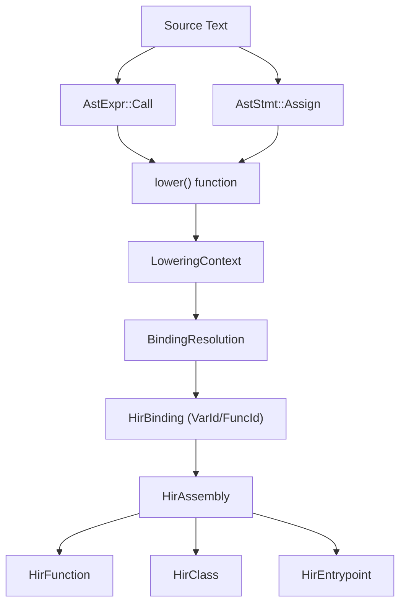
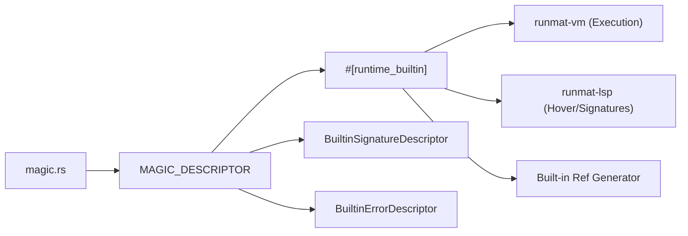

# MATLAB Language Compatibility

<details>
<summary>Relevant source files</summary>

- [crates/runmat-hir/src/lib.rs](https://github.com/runmat-org/runmat/blob/82685330/crates/runmat-hir/src/lib.rs)
- [crates/runmat-hir/tests/attributes.rs](https://github.com/runmat-org/runmat/blob/82685330/crates/runmat-hir/tests/attributes.rs)
- [crates/runmat-hir/tests/binder_disambiguation.rs](https://github.com/runmat-org/runmat/blob/82685330/crates/runmat-hir/tests/binder_disambiguation.rs)
- [crates/runmat-hir/tests/coverage.rs](https://github.com/runmat-org/runmat/blob/82685330/crates/runmat-hir/tests/coverage.rs)
- [crates/runmat-hir/tests/fuzz_lowering.rs](https://github.com/runmat-org/runmat/blob/82685330/crates/runmat-hir/tests/fuzz_lowering.rs)
- [crates/runmat-hir/tests/hir.rs](https://github.com/runmat-org/runmat/blob/82685330/crates/runmat-hir/tests/hir.rs)
- [crates/runmat-hir/tests/lowering_extras.rs](https://github.com/runmat-org/runmat/blob/82685330/crates/runmat-hir/tests/lowering_extras.rs)
- [crates/runmat-runtime/src/builtins/array/creation/empty.rs](https://github.com/runmat-org/runmat/blob/82685330/crates/runmat-runtime/src/builtins/array/creation/empty.rs)
- [crates/runmat-runtime/src/builtins/array/creation/magic.rs](https://github.com/runmat-org/runmat/blob/82685330/crates/runmat-runtime/src/builtins/array/creation/magic.rs)
- [crates/runmat-runtime/src/builtins/builtins-json/isgpuarray.json](https://github.com/runmat-org/runmat/blob/82685330/crates/runmat-runtime/src/builtins/builtins-json/isgpuarray.json)
- [crates/runmat-runtime/src/builtins/logical/tests/isgpuarray.rs](https://github.com/runmat-org/runmat/blob/82685330/crates/runmat-runtime/src/builtins/logical/tests/isgpuarray.rs)
- [crates/runmat-runtime/src/builtins/logical/tests/mod.rs](https://github.com/runmat-org/runmat/blob/82685330/crates/runmat-runtime/src/builtins/logical/tests/mod.rs)
- [docs/ARCHITECTURE.md](https://github.com/runmat-org/runmat/blob/82685330/docs/ARCHITECTURE.md?plain=1)
- [docs/CHANGELOG.md](https://github.com/runmat-org/runmat/blob/82685330/docs/CHANGELOG.md?plain=1)
- [docs/COMPATIBILITY.md](https://github.com/runmat-org/runmat/blob/82685330/docs/COMPATIBILITY.md?plain=1)
- [docs/LANGUAGE_COVERAGE.md](https://github.com/runmat-org/runmat/blob/82685330/docs/LANGUAGE_COVERAGE.md?plain=1)
- [docs/ROADMAP.md](https://github.com/runmat-org/runmat/blob/82685330/docs/ROADMAP.md?plain=1)

</details>

RunMat is a high-performance runtime designed for MATLAB-syntax code. It targets the core language grammar and semantics, enabling engineers to execute `.m` scripts, functions, and complex object-oriented systems without a license. Compatibility focuses on the core language (variables, operators, control flow, N-D indexing, and `classdef` OOP) and a standard library of 400+ built-in functions [docs/COMPATIBILITY.md #3-7](https://github.com/runmat-org/runmat/blob/82685330/docs/COMPATIBILITY.md?plain=1#L3-L7)

## Compatibility Modes

RunMat provides three distinct compatibility modes to balance parity with MATLAB's legacy behaviors and modern execution strictness. These are configured via the `compat` key in the project configuration [docs/COMPATIBILITY.md #69-74](https://github.com/runmat-org/runmat/blob/82685330/docs/COMPATIBILITY.md?plain=1#L69-L74)

| Mode | Behavior |
| --- | --- |
| runmat | Default. Accepts MATLAB command syntax (e.g., hold on) but uses RunMat-specific error namespaces docs/COMPATIBILITY.md#71 |
| matlab | Same as runmat, but overrides error identifiers to use the MATLAB: prefix for exact parity in try/catch blocks docs/COMPATIBILITY.md#72 |
| strict | Disables command-style implicit calls. All function calls must use explicit parenthesized syntax f(x) docs/COMPATIBILITY.md#73 |

## Language Feature Coverage

RunMat implements the core grammar of the MATLAB language, moving from raw source to a High-Level IR (HIR) that preserves MATLAB's unique scoping and resolution rules [docs/ARCHITECTURE.md #65-69](https://github.com/runmat-org/runmat/blob/82685330/docs/ARCHITECTURE.md?plain=1#L65-L69)

### Core Syntax & Semantics

- Variables & Data Types: Supports `double`, `single`, `char` arrays, and native `StringArray` objects with MATLAB-parity indexing [docs/LANGUAGE_COVERAGE.md #11-13](https://github.com/runmat-org/runmat/blob/82685330/docs/LANGUAGE_COVERAGE.md?plain=1#L11-L13) It supports `global` and `persistent` variables with write-through and per-function lifetime semantics [docs/LANGUAGE_COVERAGE.md #15-16](https://github.com/runmat-org/runmat/blob/82685330/docs/LANGUAGE_COVERAGE.md?plain=1#L15-L16)
- Operators: Full support for arithmetic (`+`, `-`, `*`, `/`, `\`, `^`), element-wise broadcasting (`.*`, `./`, `.\`, `.^`), and relational operators [docs/LANGUAGE_COVERAGE.md #25-27](https://github.com/runmat-org/runmat/blob/82685330/docs/LANGUAGE_COVERAGE.md?plain=1#L25-L27)
- Control Flow: Standard `if/elseif/else`, `for`, `while`, `switch/case`, and `try/catch` blocks [docs/LANGUAGE_COVERAGE.md #32-37](https://github.com/runmat-org/runmat/blob/82685330/docs/LANGUAGE_COVERAGE.md?plain=1#L32-L37)
- Functions: Supports named functions, anonymous functions with closure capture, and variable arity via `varargin`/`varargout` [docs/LANGUAGE_COVERAGE.md #38-42](https://github.com/runmat-org/runmat/blob/82685330/docs/LANGUAGE_COVERAGE.md?plain=1#L38-L42)

### Advanced Indexing

RunMat implements a robust indexing subsystem that handles N-D numeric and logical indexing, linear indexing, and `end` arithmetic [docs/LANGUAGE_COVERAGE.md #43-46](https://github.com/runmat-org/runmat/blob/82685330/docs/LANGUAGE_COVERAGE.md?plain=1#L43-L46)

- Expansion: Supports function and cell expansion into slice targets with dynamic packing [docs/LANGUAGE_COVERAGE.md #49](https://github.com/runmat-org/runmat/blob/82685330/docs/LANGUAGE_COVERAGE.md?plain=1#L49-L49)
- L-Value Handling: The HIR lowering stage distinguishes between standard assignments, indexed assignments (`A(1)=2`), and cell assignments (`C{1}=3`) [crates/runmat-hir/tests/lowering_extras.rs #44-64](https://github.com/runmat-org/runmat/blob/82685330/crates/runmat-hir/tests/lowering_extras.rs#L44-L64)

### Object-Oriented Programming (classdef)

Unlike many alternative runtimes, RunMat provides full `classdef` support [docs/LANGUAGE_COVERAGE.md #50](https://github.com/runmat-org/runmat/blob/82685330/docs/LANGUAGE_COVERAGE.md?plain=1#L50-L50)

- Properties & Methods: Supports attributes such as `Constant`, `Dependent`, `Static`, and access levels (`Private`, `Public`) [crates/runmat-hir/tests/attributes.rs #5-23](https://github.com/runmat-org/runmat/blob/82685330/crates/runmat-hir/tests/attributes.rs#L5-L23)
- Handle Classes: Implements identity semantics, `isvalid`, and `delete` lifecycle management [docs/LANGUAGE_COVERAGE.md #54](https://github.com/runmat-org/runmat/blob/82685330/docs/LANGUAGE_COVERAGE.md?plain=1#L54-L54)
- Events: Full `addlistener` and `notify` support integrated with the runtime event registry [docs/LANGUAGE_COVERAGE.md #53](https://github.com/runmat-org/runmat/blob/82685330/docs/LANGUAGE_COVERAGE.md?plain=1#L53-L53)

## Implementation: From Syntax to Semantic HIR

The compatibility layer is primarily enforced during the "Lowering" phase, where the `runmat-parser` AST is converted into `runmat-hir`. This stage resolves identifiers based on MATLAB's complex precedence rules.

### Name Resolution Precedence

The `runmat-hir` crate manages the resolution order: Locals > User Functions > Specific Imports > Wildcard Imports > Class Statics [docs/LANGUAGE_COVERAGE.md #59](https://github.com/runmat-org/runmat/blob/82685330/docs/LANGUAGE_COVERAGE.md?plain=1#L59-L59)

### Diagram: Lowering and Binding Resolution

This diagram illustrates how the `LoweringContext` and `HirAssembly` structures map MATLAB syntax entities to unique internal IDs.



<details>
<summary>Rendered SVG</summary>

```svg
<svg id="mermaid-eing6k6007b" xmlns="http://www.w3.org/2000/svg" xmlns:xlink="http://www.w3.org/1999/xlink" class="flowchart" style="max-width: 100%; touch-action: none; user-select: none; cursor: grab; min-height: fit-content; max-height: 100%;" viewBox="-25.625270732862532 5.684341886080802e-14 657.2974164657251 947.9999999999999" role="graphics-document document" aria-roledescription="flowchart-v2" preserveAspectRatio="xMidYMid meet"><style>#mermaid-eing6k6007b{font-family:ui-sans-serif,-apple-system,system-ui,Segoe UI,Helvetica;font-size:16px;fill:#ccc;}@keyframes edge-animation-frame{from{stroke-dashoffset:0;}}@keyframes dash{to{stroke-dashoffset:0;}}#mermaid-eing6k6007b .edge-animation-slow{stroke-dasharray:9,5!important;stroke-dashoffset:900;animation:dash 50s linear infinite;stroke-linecap:round;}#mermaid-eing6k6007b .edge-animation-fast{stroke-dasharray:9,5!important;stroke-dashoffset:900;animation:dash 20s linear infinite;stroke-linecap:round;}#mermaid-eing6k6007b .error-icon{fill:#333;}#mermaid-eing6k6007b .error-text{fill:#cccccc;stroke:#cccccc;}#mermaid-eing6k6007b .edge-thickness-normal{stroke-width:1px;}#mermaid-eing6k6007b .edge-thickness-thick{stroke-width:3.5px;}#mermaid-eing6k6007b .edge-pattern-solid{stroke-dasharray:0;}#mermaid-eing6k6007b .edge-thickness-invisible{stroke-width:0;fill:none;}#mermaid-eing6k6007b .edge-pattern-dashed{stroke-dasharray:3;}#mermaid-eing6k6007b .edge-pattern-dotted{stroke-dasharray:2;}#mermaid-eing6k6007b .marker{fill:#666;stroke:#666;}#mermaid-eing6k6007b .marker.cross{stroke:#666;}#mermaid-eing6k6007b svg{font-family:ui-sans-serif,-apple-system,system-ui,Segoe UI,Helvetica;font-size:16px;}#mermaid-eing6k6007b p{margin:0;}#mermaid-eing6k6007b .label{font-family:ui-sans-serif,-apple-system,system-ui,Segoe UI,Helvetica;color:#fff;}#mermaid-eing6k6007b .cluster-label text{fill:#fff;}#mermaid-eing6k6007b .cluster-label span{color:#fff;}#mermaid-eing6k6007b .cluster-label span p{background-color:transparent;}#mermaid-eing6k6007b .label text,#mermaid-eing6k6007b span{fill:#fff;color:#fff;}#mermaid-eing6k6007b .node rect,#mermaid-eing6k6007b .node circle,#mermaid-eing6k6007b .node ellipse,#mermaid-eing6k6007b .node polygon,#mermaid-eing6k6007b .node path{fill:#111;stroke:#222;stroke-width:1px;}#mermaid-eing6k6007b .rough-node .label text,#mermaid-eing6k6007b .node .label text,#mermaid-eing6k6007b .image-shape .label,#mermaid-eing6k6007b .icon-shape .label{text-anchor:middle;}#mermaid-eing6k6007b .node .katex path{fill:#000;stroke:#000;stroke-width:1px;}#mermaid-eing6k6007b .rough-node .label,#mermaid-eing6k6007b .node .label,#mermaid-eing6k6007b .image-shape .label,#mermaid-eing6k6007b .icon-shape .label{text-align:center;}#mermaid-eing6k6007b .node.clickable{cursor:pointer;}#mermaid-eing6k6007b .root .anchor path{fill:#666!important;stroke-width:0;stroke:#666;}#mermaid-eing6k6007b .arrowheadPath{fill:#0b0b0b;}#mermaid-eing6k6007b .edgePath .path{stroke:#666;stroke-width:1px;}#mermaid-eing6k6007b .flowchart-link{stroke:#666;fill:none;}#mermaid-eing6k6007b .edgeLabel{background-color:#161616;text-align:center;}#mermaid-eing6k6007b .edgeLabel p{background-color:#161616;}#mermaid-eing6k6007b .edgeLabel rect{opacity:0.5;background-color:#161616;fill:#161616;}#mermaid-eing6k6007b .labelBkg{background-color:rgba(22, 22, 22, 0.5);}#mermaid-eing6k6007b .cluster rect{fill:#161616;stroke:#222;stroke-width:1px;}#mermaid-eing6k6007b .cluster text{fill:#fff;}#mermaid-eing6k6007b .cluster span{color:#fff;}#mermaid-eing6k6007b div.mermaidTooltip{position:absolute;text-align:center;max-width:200px;padding:2px;font-family:ui-sans-serif,-apple-system,system-ui,Segoe UI,Helvetica;font-size:12px;background:#333;border:1px solid hsl(0, 0%, 10%);border-radius:2px;pointer-events:none;z-index:100;}#mermaid-eing6k6007b .flowchartTitleText{text-anchor:middle;font-size:18px;fill:#ccc;}#mermaid-eing6k6007b rect.text{fill:none;stroke-width:0;}#mermaid-eing6k6007b .icon-shape,#mermaid-eing6k6007b .image-shape{background-color:#161616;text-align:center;}#mermaid-eing6k6007b .icon-shape p,#mermaid-eing6k6007b .image-shape p{background-color:#161616;padding:2px;}#mermaid-eing6k6007b .icon-shape .label rect,#mermaid-eing6k6007b .image-shape .label rect{opacity:0.5;background-color:#161616;fill:#161616;}#mermaid-eing6k6007b .label-icon{display:inline-block;height:1em;overflow:visible;vertical-align:-0.125em;}#mermaid-eing6k6007b .node .label-icon path{fill:currentColor;stroke:revert;stroke-width:revert;}#mermaid-eing6k6007b .node .neo-node{stroke:#222;}#mermaid-eing6k6007b [data-look="neo"].node rect,#mermaid-eing6k6007b [data-look="neo"].cluster rect,#mermaid-eing6k6007b [data-look="neo"].node polygon{stroke:url(#mermaid-eing6k6007b-gradient);filter:drop-shadow( 1px 2px 2px rgba(185,185,185,1));}#mermaid-eing6k6007b [data-look="neo"].node path{stroke:url(#mermaid-eing6k6007b-gradient);stroke-width:1px;}#mermaid-eing6k6007b [data-look="neo"].node .outer-path{filter:drop-shadow( 1px 2px 2px rgba(185,185,185,1));}#mermaid-eing6k6007b [data-look="neo"].node .neo-line path{stroke:#222;filter:none;}#mermaid-eing6k6007b [data-look="neo"].node circle{stroke:url(#mermaid-eing6k6007b-gradient);filter:drop-shadow( 1px 2px 2px rgba(185,185,185,1));}#mermaid-eing6k6007b [data-look="neo"].node circle .state-start{fill:#000000;}#mermaid-eing6k6007b [data-look="neo"].icon-shape .icon{fill:url(#mermaid-eing6k6007b-gradient);filter:drop-shadow( 1px 2px 2px rgba(185,185,185,1));}#mermaid-eing6k6007b [data-look="neo"].icon-shape .icon-neo path{stroke:url(#mermaid-eing6k6007b-gradient);filter:drop-shadow( 1px 2px 2px rgba(185,185,185,1));}#mermaid-eing6k6007b :root{--mermaid-font-family:"trebuchet ms",verdana,arial,sans-serif;}</style><g><marker id="mermaid-eing6k6007b_flowchart-v2-pointEnd" class="marker flowchart-v2" viewBox="0 0 10 10" refX="5" refY="5" markerUnits="userSpaceOnUse" markerWidth="8" markerHeight="8" orient="auto"><path d="M 0 0 L 10 5 L 0 10 z" class="arrowMarkerPath" style="stroke-width: 1; stroke-dasharray: 1, 0;"></path></marker><marker id="mermaid-eing6k6007b_flowchart-v2-pointStart" class="marker flowchart-v2" viewBox="0 0 10 10" refX="4.5" refY="5" markerUnits="userSpaceOnUse" markerWidth="8" markerHeight="8" orient="auto"><path d="M 0 5 L 10 10 L 10 0 z" class="arrowMarkerPath" style="stroke-width: 1; stroke-dasharray: 1, 0;"></path></marker><marker id="mermaid-eing6k6007b_flowchart-v2-pointEnd-margin" class="marker flowchart-v2" viewBox="0 0 11.5 14" refX="11.5" refY="7" markerUnits="userSpaceOnUse" markerWidth="10.5" markerHeight="14" orient="auto"><path d="M 0 0 L 11.5 7 L 0 14 z" class="arrowMarkerPath" style="stroke-width: 0; stroke-dasharray: 1, 0;"></path></marker><marker id="mermaid-eing6k6007b_flowchart-v2-pointStart-margin" class="marker flowchart-v2" viewBox="0 0 11.5 14" refX="1" refY="7" markerUnits="userSpaceOnUse" markerWidth="11.5" markerHeight="14" orient="auto"><polygon points="0,7 11.5,14 11.5,0" class="arrowMarkerPath" style="stroke-width: 0; stroke-dasharray: 1, 0;"></polygon></marker><marker id="mermaid-eing6k6007b_flowchart-v2-circleEnd" class="marker flowchart-v2" viewBox="0 0 10 10" refX="11" refY="5" markerUnits="userSpaceOnUse" markerWidth="11" markerHeight="11" orient="auto"><circle cx="5" cy="5" r="5" class="arrowMarkerPath" style="stroke-width: 1; stroke-dasharray: 1, 0;"></circle></marker><marker id="mermaid-eing6k6007b_flowchart-v2-circleStart" class="marker flowchart-v2" viewBox="0 0 10 10" refX="-1" refY="5" markerUnits="userSpaceOnUse" markerWidth="11" markerHeight="11" orient="auto"><circle cx="5" cy="5" r="5" class="arrowMarkerPath" style="stroke-width: 1; stroke-dasharray: 1, 0;"></circle></marker><marker id="mermaid-eing6k6007b_flowchart-v2-circleEnd-margin" class="marker flowchart-v2" viewBox="0 0 10 10" refY="5" refX="12.25" markerUnits="userSpaceOnUse" markerWidth="14" markerHeight="14" orient="auto"><circle cx="5" cy="5" r="5" class="arrowMarkerPath" style="stroke-width: 0; stroke-dasharray: 1, 0;"></circle></marker><marker id="mermaid-eing6k6007b_flowchart-v2-circleStart-margin" class="marker flowchart-v2" viewBox="0 0 10 10" refX="-2" refY="5" markerUnits="userSpaceOnUse" markerWidth="14" markerHeight="14" orient="auto"><circle cx="5" cy="5" r="5" class="arrowMarkerPath" style="stroke-width: 0; stroke-dasharray: 1, 0;"></circle></marker><marker id="mermaid-eing6k6007b_flowchart-v2-crossEnd" class="marker cross flowchart-v2" viewBox="0 0 11 11" refX="12" refY="5.2" markerUnits="userSpaceOnUse" markerWidth="11" markerHeight="11" orient="auto"><path d="M 1,1 l 9,9 M 10,1 l -9,9" class="arrowMarkerPath" style="stroke-width: 2; stroke-dasharray: 1, 0;"></path></marker><marker id="mermaid-eing6k6007b_flowchart-v2-crossStart" class="marker cross flowchart-v2" viewBox="0 0 11 11" refX="-1" refY="5.2" markerUnits="userSpaceOnUse" markerWidth="11" markerHeight="11" orient="auto"><path d="M 1,1 l 9,9 M 10,1 l -9,9" class="arrowMarkerPath" style="stroke-width: 2; stroke-dasharray: 1, 0;"></path></marker><marker id="mermaid-eing6k6007b_flowchart-v2-crossEnd-margin" class="marker cross flowchart-v2" viewBox="0 0 15 15" refX="17.7" refY="7.5" markerUnits="userSpaceOnUse" markerWidth="12" markerHeight="12" orient="auto"><path d="M 1,1 L 14,14 M 1,14 L 14,1" class="arrowMarkerPath" style="stroke-width: 2.5;"></path></marker><marker id="mermaid-eing6k6007b_flowchart-v2-crossStart-margin" class="marker cross flowchart-v2" viewBox="0 0 15 15" refX="-3.5" refY="7.5" markerUnits="userSpaceOnUse" markerWidth="12" markerHeight="12" orient="auto"><path d="M 1,1 L 14,14 M 1,14 L 14,1" class="arrowMarkerPath" style="stroke-width: 2.5; stroke-dasharray: 1, 0;"></path></marker><g class="root"><g class="clusters"><g class="cluster" id="mermaid-eing6k6007b-subGraph2" data-look="classic"><rect style="" x="8" y="732" width="590.046875" height="208"></rect><g class="cluster-label" transform="translate(231.4140625, 732)"><foreignObject width="143.21875" height="24"><div style="display: table-cell; white-space: nowrap; line-height: 1.5;" xmlns="http://www.w3.org/1999/xhtml"><span class="nodeLabel"><p>runmat-hir (Output)</p></span></div></foreignObject></g></g><g class="cluster" id="mermaid-eing6k6007b-subGraph1" data-look="classic"><rect style="" x="92.11328125" y="266" width="400.0859375" height="416"></rect><g class="cluster-label" transform="translate(212.96875, 266)"><foreignObject width="158.375" height="24"><div style="display: table-cell; white-space: nowrap; line-height: 1.5;" xmlns="http://www.w3.org/1999/xhtml"><span class="nodeLabel"><p>runmat-hir (Lowering)</p></span></div></foreignObject></g></g><g class="cluster" id="mermaid-eing6k6007b-subGraph0" data-look="classic"><rect style="" x="94.890625" y="8" width="447.875" height="208"></rect><g class="cluster-label" transform="translate(243.5234375, 8)"><foreignObject width="150.609375" height="24"><div style="display: table-cell; white-space: nowrap; line-height: 1.5;" xmlns="http://www.w3.org/1999/xhtml"><span class="nodeLabel"><p>runmat-parser (AST)</p></span></div></foreignObject></g></g></g><g class="edgePaths"><path d="M249.854,87L242.554,91.167C235.254,95.333,220.654,103.667,213.354,111.333C206.055,119,206.055,126,206.055,129.5L206.055,133" id="mermaid-eing6k6007b-L_A_B_0" class="edge-thickness-normal edge-pattern-solid edge-thickness-normal edge-pattern-solid flowchart-link" style=";" data-edge="true" data-et="edge" data-id="L_A_B_0" data-points="W3sieCI6MjQ5Ljg1MzUxNTYyNSwieSI6ODd9LHsieCI6MjA2LjA1NDY4NzUsInkiOjExMn0seyJ4IjoyMDYuMDU0Njg3NSwieSI6MTM3fV0=" data-look="classic" marker-end="url(#mermaid-eing6k6007b_flowchart-v2-pointEnd)"></path><path d="M360.936,87L370.779,91.167C380.622,95.333,400.307,103.667,410.15,111.333C419.992,119,419.992,126,419.992,129.5L419.992,133" id="mermaid-eing6k6007b-L_A_C_0" class="edge-thickness-normal edge-pattern-solid edge-thickness-normal edge-pattern-solid flowchart-link" style=";" data-edge="true" data-et="edge" data-id="L_A_C_0" data-points="W3sieCI6MzYwLjkzNjQ0ODMxNzMwNzcsInkiOjg3fSx7IngiOjQxOS45OTIxODc1LCJ5IjoxMTJ9LHsieCI6NDE5Ljk5MjE4NzUsInkiOjEzN31d" data-look="classic" marker-end="url(#mermaid-eing6k6007b_flowchart-v2-pointEnd)"></path><path d="M206.055,191L206.055,195.167C206.055,199.333,206.055,207.667,206.055,216C206.055,224.333,206.055,232.667,206.055,241C206.055,249.333,206.055,257.667,212.776,265.67C219.496,273.672,232.938,281.345,239.659,285.181L246.38,289.017" id="mermaid-eing6k6007b-L_B_D_0" class="edge-thickness-normal edge-pattern-solid edge-thickness-normal edge-pattern-solid flowchart-link" style=";" data-edge="true" data-et="edge" data-id="L_B_D_0" data-points="W3sieCI6MjA2LjA1NDY4NzUsInkiOjE5MX0seyJ4IjoyMDYuMDU0Njg3NSwieSI6MjE2fSx7IngiOjIwNi4wNTQ2ODc1LCJ5IjoyNDF9LHsieCI6MjA2LjA1NDY4NzUsInkiOjI2Nn0seyJ4IjoyNDkuODUzNTE1NjI1LCJ5IjoyOTF9XQ==" data-look="classic" marker-end="url(#mermaid-eing6k6007b_flowchart-v2-pointEnd)"></path><path d="M419.992,191L419.992,195.167C419.992,199.333,419.992,207.667,419.992,216C419.992,224.333,419.992,232.667,419.992,241C419.992,249.333,419.992,257.667,410.763,265.74C401.535,273.814,383.077,281.627,373.849,285.534L364.62,289.441" id="mermaid-eing6k6007b-L_C_D_0" class="edge-thickness-normal edge-pattern-solid edge-thickness-normal edge-pattern-solid flowchart-link" style=";" data-edge="true" data-et="edge" data-id="L_C_D_0" data-points="W3sieCI6NDE5Ljk5MjE4NzUsInkiOjE5MX0seyJ4Ijo0MTkuOTkyMTg3NSwieSI6MjE2fSx7IngiOjQxOS45OTIxODc1LCJ5IjoyNDF9LHsieCI6NDE5Ljk5MjE4NzUsInkiOjI2Nn0seyJ4IjozNjAuOTM2NDQ4MzE3MzA3NywieSI6MjkxfV0=" data-look="classic" marker-end="url(#mermaid-eing6k6007b_flowchart-v2-pointEnd)"></path><path d="M297.156,345L297.156,349.167C297.156,353.333,297.156,361.667,297.156,369.333C297.156,377,297.156,384,297.156,387.5L297.156,391" id="mermaid-eing6k6007b-L_D_E_0" class="edge-thickness-normal edge-pattern-solid edge-thickness-normal edge-pattern-solid flowchart-link" style=";" data-edge="true" data-et="edge" data-id="L_D_E_0" data-points="W3sieCI6Mjk3LjE1NjI1LCJ5IjozNDV9LHsieCI6Mjk3LjE1NjI1LCJ5IjozNzB9LHsieCI6Mjk3LjE1NjI1LCJ5IjozOTV9XQ==" data-look="classic" marker-end="url(#mermaid-eing6k6007b_flowchart-v2-pointEnd)"></path><path d="M297.156,449L297.156,453.167C297.156,457.333,297.156,465.667,297.156,473.333C297.156,481,297.156,488,297.156,491.5L297.156,495" id="mermaid-eing6k6007b-L_E_F_0" class="edge-thickness-normal edge-pattern-solid edge-thickness-normal edge-pattern-solid flowchart-link" style=";" data-edge="true" data-et="edge" data-id="L_E_F_0" data-points="W3sieCI6Mjk3LjE1NjI1LCJ5Ijo0NDl9LHsieCI6Mjk3LjE1NjI1LCJ5Ijo0NzR9LHsieCI6Mjk3LjE1NjI1LCJ5Ijo0OTl9XQ==" data-look="classic" marker-end="url(#mermaid-eing6k6007b_flowchart-v2-pointEnd)"></path><path d="M297.156,553L297.156,557.167C297.156,561.333,297.156,569.667,297.156,577.333C297.156,585,297.156,592,297.156,595.5L297.156,599" id="mermaid-eing6k6007b-L_F_G_0" class="edge-thickness-normal edge-pattern-solid edge-thickness-normal edge-pattern-solid flowchart-link" style=";" data-edge="true" data-et="edge" data-id="L_F_G_0" data-points="W3sieCI6Mjk3LjE1NjI1LCJ5Ijo1NTN9LHsieCI6Mjk3LjE1NjI1LCJ5Ijo1Nzh9LHsieCI6Mjk3LjE1NjI1LCJ5Ijo2MDN9XQ==" data-look="classic" marker-end="url(#mermaid-eing6k6007b_flowchart-v2-pointEnd)"></path><path d="M297.156,657L297.156,661.167C297.156,665.333,297.156,673.667,297.156,682C297.156,690.333,297.156,698.667,297.156,707C297.156,715.333,297.156,723.667,297.156,731.333C297.156,739,297.156,746,297.156,749.5L297.156,753" id="mermaid-eing6k6007b-L_G_H_0" class="edge-thickness-normal edge-pattern-solid edge-thickness-normal edge-pattern-solid flowchart-link" style=";" data-edge="true" data-et="edge" data-id="L_G_H_0" data-points="W3sieCI6Mjk3LjE1NjI1LCJ5Ijo2NTd9LHsieCI6Mjk3LjE1NjI1LCJ5Ijo2ODJ9LHsieCI6Mjk3LjE1NjI1LCJ5Ijo3MDd9LHsieCI6Mjk3LjE1NjI1LCJ5Ijo3MzJ9LHsieCI6Mjk3LjE1NjI1LCJ5Ijo3NTd9XQ==" data-look="classic" marker-end="url(#mermaid-eing6k6007b_flowchart-v2-pointEnd)"></path><path d="M221.805,805.51L204.003,810.591C186.201,815.673,150.596,825.837,132.794,834.418C114.992,843,114.992,850,114.992,853.5L114.992,857" id="mermaid-eing6k6007b-L_H_I_0" class="edge-thickness-normal edge-pattern-solid edge-thickness-normal edge-pattern-solid flowchart-link" style=";" data-edge="true" data-et="edge" data-id="L_H_I_0" data-points="W3sieCI6MjIxLjgwNDY4NzUsInkiOjgwNS41MDk2MjgxNjgyODkzfSx7IngiOjExNC45OTIxODc1LCJ5Ijo4MzZ9LHsieCI6MTE0Ljk5MjE4NzUsInkiOjg2MX1d" data-look="classic" marker-end="url(#mermaid-eing6k6007b_flowchart-v2-pointEnd)"></path><path d="M297.156,811L297.156,815.167C297.156,819.333,297.156,827.667,297.156,835.333C297.156,843,297.156,850,297.156,853.5L297.156,857" id="mermaid-eing6k6007b-L_H_J_0" class="edge-thickness-normal edge-pattern-solid edge-thickness-normal edge-pattern-solid flowchart-link" style=";" data-edge="true" data-et="edge" data-id="L_H_J_0" data-points="W3sieCI6Mjk3LjE1NjI1LCJ5Ijo4MTF9LHsieCI6Mjk3LjE1NjI1LCJ5Ijo4MzZ9LHsieCI6Mjk3LjE1NjI1LCJ5Ijo4NjF9XQ==" data-look="classic" marker-end="url(#mermaid-eing6k6007b_flowchart-v2-pointEnd)"></path><path d="M372.508,804.838L391.288,810.032C410.068,815.226,447.628,825.613,466.408,834.306C485.188,843,485.188,850,485.188,853.5L485.188,857" id="mermaid-eing6k6007b-L_H_K_0" class="edge-thickness-normal edge-pattern-solid edge-thickness-normal edge-pattern-solid flowchart-link" style=";" data-edge="true" data-et="edge" data-id="L_H_K_0" data-points="W3sieCI6MzcyLjUwNzgxMjUsInkiOjgwNC44Mzg0NTc3MDMxNzQzfSx7IngiOjQ4NS4xODc1LCJ5Ijo4MzZ9LHsieCI6NDg1LjE4NzUsInkiOjg2MX1d" data-look="classic" marker-end="url(#mermaid-eing6k6007b_flowchart-v2-pointEnd)"></path></g><g class="edgeLabels"><g class="edgeLabel"><g class="label" data-id="L_A_B_0" transform="translate(0, 0)"><foreignObject width="0" height="0"><div style="display: table-cell; white-space: nowrap; line-height: 1.5; max-width: 200px; text-align: center;" xmlns="http://www.w3.org/1999/xhtml" class="labelBkg"><span class="edgeLabel"></span></div></foreignObject></g></g><g class="edgeLabel"><g class="label" data-id="L_A_C_0" transform="translate(0, 0)"><foreignObject width="0" height="0"><div style="display: table-cell; white-space: nowrap; line-height: 1.5; max-width: 200px; text-align: center;" xmlns="http://www.w3.org/1999/xhtml" class="labelBkg"><span class="edgeLabel"></span></div></foreignObject></g></g><g class="edgeLabel"><g class="label" data-id="L_B_D_0" transform="translate(0, 0)"><foreignObject width="0" height="0"><div style="display: table-cell; white-space: nowrap; line-height: 1.5; max-width: 200px; text-align: center;" xmlns="http://www.w3.org/1999/xhtml" class="labelBkg"><span class="edgeLabel"></span></div></foreignObject></g></g><g class="edgeLabel"><g class="label" data-id="L_C_D_0" transform="translate(0, 0)"><foreignObject width="0" height="0"><div style="display: table-cell; white-space: nowrap; line-height: 1.5; max-width: 200px; text-align: center;" xmlns="http://www.w3.org/1999/xhtml" class="labelBkg"><span class="edgeLabel"></span></div></foreignObject></g></g><g class="edgeLabel"><g class="label" data-id="L_D_E_0" transform="translate(0, 0)"><foreignObject width="0" height="0"><div style="display: table-cell; white-space: nowrap; line-height: 1.5; max-width: 200px; text-align: center;" xmlns="http://www.w3.org/1999/xhtml" class="labelBkg"><span class="edgeLabel"></span></div></foreignObject></g></g><g class="edgeLabel"><g class="label" data-id="L_E_F_0" transform="translate(0, 0)"><foreignObject width="0" height="0"><div style="display: table-cell; white-space: nowrap; line-height: 1.5; max-width: 200px; text-align: center;" xmlns="http://www.w3.org/1999/xhtml" class="labelBkg"><span class="edgeLabel"></span></div></foreignObject></g></g><g class="edgeLabel"><g class="label" data-id="L_F_G_0" transform="translate(0, 0)"><foreignObject width="0" height="0"><div style="display: table-cell; white-space: nowrap; line-height: 1.5; max-width: 200px; text-align: center;" xmlns="http://www.w3.org/1999/xhtml" class="labelBkg"><span class="edgeLabel"></span></div></foreignObject></g></g><g class="edgeLabel"><g class="label" data-id="L_G_H_0" transform="translate(0, 0)"><foreignObject width="0" height="0"><div style="display: table-cell; white-space: nowrap; line-height: 1.5; max-width: 200px; text-align: center;" xmlns="http://www.w3.org/1999/xhtml" class="labelBkg"><span class="edgeLabel"></span></div></foreignObject></g></g><g class="edgeLabel"><g class="label" data-id="L_H_I_0" transform="translate(0, 0)"><foreignObject width="0" height="0"><div style="display: table-cell; white-space: nowrap; line-height: 1.5; max-width: 200px; text-align: center;" xmlns="http://www.w3.org/1999/xhtml" class="labelBkg"><span class="edgeLabel"></span></div></foreignObject></g></g><g class="edgeLabel"><g class="label" data-id="L_H_J_0" transform="translate(0, 0)"><foreignObject width="0" height="0"><div style="display: table-cell; white-space: nowrap; line-height: 1.5; max-width: 200px; text-align: center;" xmlns="http://www.w3.org/1999/xhtml" class="labelBkg"><span class="edgeLabel"></span></div></foreignObject></g></g><g class="edgeLabel"><g class="label" data-id="L_H_K_0" transform="translate(0, 0)"><foreignObject width="0" height="0"><div style="display: table-cell; white-space: nowrap; line-height: 1.5; max-width: 200px; text-align: center;" xmlns="http://www.w3.org/1999/xhtml" class="labelBkg"><span class="edgeLabel"></span></div></foreignObject></g></g></g><g class="nodes"><g class="node default" id="mermaid-eing6k6007b-flowchart-A-0" data-look="classic" transform="translate(297.15625, 60)"><rect class="basic label-container" style="" x="-72.8046875" y="-27" width="145.609375" height="54"></rect><g class="label" style="" transform="translate(-42.8046875, -12)"><rect></rect><foreignObject width="85.609375" height="24"><div style="display: table-cell; white-space: nowrap; line-height: 1.5; max-width: 200px; text-align: center;" xmlns="http://www.w3.org/1999/xhtml"><span class="nodeLabel"><p>Source Text</p></span></div></foreignObject></g></g><g class="node default" id="mermaid-eing6k6007b-flowchart-B-1" data-look="classic" transform="translate(206.0546875, 164)"><rect class="basic label-container" style="" x="-76.1640625" y="-27" width="152.328125" height="54"></rect><g class="label" style="" transform="translate(-46.1640625, -12)"><rect></rect><foreignObject width="92.328125" height="24"><div style="display: table-cell; white-space: nowrap; line-height: 1.5; max-width: 200px; text-align: center;" xmlns="http://www.w3.org/1999/xhtml"><span class="nodeLabel"><p>AstExpr::Call</p></span></div></foreignObject></g></g><g class="node default" id="mermaid-eing6k6007b-flowchart-C-3" data-look="classic" transform="translate(419.9921875, 164)"><rect class="basic label-container" style="" x="-87.7734375" y="-27" width="175.546875" height="54"></rect><g class="label" style="" transform="translate(-57.7734375, -12)"><rect></rect><foreignObject width="115.546875" height="24"><div style="display: table-cell; white-space: nowrap; line-height: 1.5; max-width: 200px; text-align: center;" xmlns="http://www.w3.org/1999/xhtml"><span class="nodeLabel"><p>AstStmt::Assign</p></span></div></foreignObject></g></g><g class="node default" id="mermaid-eing6k6007b-flowchart-D-5" data-look="classic" transform="translate(297.15625, 318)"><rect class="basic label-container" style="" x="-87.171875" y="-27" width="174.34375" height="54"></rect><g class="label" style="" transform="translate(-57.171875, -12)"><rect></rect><foreignObject width="114.34375" height="24"><div style="display: table-cell; white-space: nowrap; line-height: 1.5; max-width: 200px; text-align: center;" xmlns="http://www.w3.org/1999/xhtml"><span class="nodeLabel"><p>lower() function</p></span></div></foreignObject></g></g><g class="node default" id="mermaid-eing6k6007b-flowchart-E-9" data-look="classic" transform="translate(297.15625, 422)"><rect class="basic label-container" style="" x="-91.234375" y="-27" width="182.46875" height="54"></rect><g class="label" style="" transform="translate(-61.234375, -12)"><rect></rect><foreignObject width="122.46875" height="24"><div style="display: table-cell; white-space: nowrap; line-height: 1.5; max-width: 200px; text-align: center;" xmlns="http://www.w3.org/1999/xhtml"><span class="nodeLabel"><p>LoweringContext</p></span></div></foreignObject></g></g><g class="node default" id="mermaid-eing6k6007b-flowchart-F-11" data-look="classic" transform="translate(297.15625, 526)"><rect class="basic label-container" style="" x="-95.2421875" y="-27" width="190.484375" height="54"></rect><g class="label" style="" transform="translate(-65.2421875, -12)"><rect></rect><foreignObject width="130.484375" height="24"><div style="display: table-cell; white-space: nowrap; line-height: 1.5; max-width: 200px; text-align: center;" xmlns="http://www.w3.org/1999/xhtml"><span class="nodeLabel"><p>BindingResolution</p></span></div></foreignObject></g></g><g class="node default" id="mermaid-eing6k6007b-flowchart-G-13" data-look="classic" transform="translate(297.15625, 630)"><rect class="basic label-container" style="" x="-121.1484375" y="-27" width="242.296875" height="54"></rect><g class="label" style="" transform="translate(-91.1484375, -12)"><rect></rect><foreignObject width="182.296875" height="24"><div style="display: table-cell; white-space: nowrap; line-height: 1.5; max-width: 200px; text-align: center;" xmlns="http://www.w3.org/1999/xhtml"><span class="nodeLabel"><p>HirBinding (VarId/FuncId)</p></span></div></foreignObject></g></g><g class="node default" id="mermaid-eing6k6007b-flowchart-H-15" data-look="classic" transform="translate(297.15625, 784)"><rect class="basic label-container" style="" x="-75.3515625" y="-27" width="150.703125" height="54"></rect><g class="label" style="" transform="translate(-45.3515625, -12)"><rect></rect><foreignObject width="90.703125" height="24"><div style="display: table-cell; white-space: nowrap; line-height: 1.5; max-width: 200px; text-align: center;" xmlns="http://www.w3.org/1999/xhtml"><span class="nodeLabel"><p>HirAssembly</p></span></div></foreignObject></g></g><g class="node default" id="mermaid-eing6k6007b-flowchart-I-17" data-look="classic" transform="translate(114.9921875, 888)"><rect class="basic label-container" style="" x="-71.9921875" y="-27" width="143.984375" height="54"></rect><g class="label" style="" transform="translate(-41.9921875, -12)"><rect></rect><foreignObject width="83.984375" height="24"><div style="display: table-cell; white-space: nowrap; line-height: 1.5; max-width: 200px; text-align: center;" xmlns="http://www.w3.org/1999/xhtml"><span class="nodeLabel"><p>HirFunction</p></span></div></foreignObject></g></g><g class="node default" id="mermaid-eing6k6007b-flowchart-J-19" data-look="classic" transform="translate(297.15625, 888)"><rect class="basic label-container" style="" x="-60.171875" y="-27" width="120.34375" height="54"></rect><g class="label" style="" transform="translate(-30.171875, -12)"><rect></rect><foreignObject width="60.34375" height="24"><div style="display: table-cell; white-space: nowrap; line-height: 1.5; max-width: 200px; text-align: center;" xmlns="http://www.w3.org/1999/xhtml"><span class="nodeLabel"><p>HirClass</p></span></div></foreignObject></g></g><g class="node default" id="mermaid-eing6k6007b-flowchart-K-21" data-look="classic" transform="translate(485.1875, 888)"><rect class="basic label-container" style="" x="-77.859375" y="-27" width="155.71875" height="54"></rect><g class="label" style="" transform="translate(-47.859375, -12)"><rect></rect><foreignObject width="95.71875" height="24"><div style="display: table-cell; white-space: nowrap; line-height: 1.5; max-width: 200px; text-align: center;" xmlns="http://www.w3.org/1999/xhtml"><span class="nodeLabel"><p>HirEntrypoint</p></span></div></foreignObject></g></g></g></g></g><defs><filter id="mermaid-eing6k6007b-drop-shadow" height="130%" width="130%"><feDropShadow dx="4" dy="4" stdDeviation="0" flood-opacity="0.06" flood-color="#000000"></feDropShadow></filter></defs><defs><filter id="mermaid-eing6k6007b-drop-shadow-small" height="150%" width="150%"><feDropShadow dx="2" dy="2" stdDeviation="0" flood-opacity="0.06" flood-color="#000000"></feDropShadow></filter></defs><linearGradient id="mermaid-eing6k6007b-gradient" gradientUnits="objectBoundingBox" x1="0%" y1="0%" x2="100%" y2="0%"><stop offset="0%" stop-color="#333" stop-opacity="1"></stop><stop offset="100%" stop-color="hsl(-120, 0%, 3.3333333333%)" stop-opacity="1"></stop></linearGradient></svg>
```

</details>

Sources: [crates/runmat-hir/src/lib.rs #15-40](https://github.com/runmat-org/runmat/blob/82685330/crates/runmat-hir/src/lib.rs#L15-L40) [crates/runmat-hir/tests/coverage.rs #148-172](https://github.com/runmat-org/runmat/blob/82685330/crates/runmat-hir/tests/coverage.rs#L148-L172)

## Built-in Function Coverage

RunMat ships with over 400 built-in functions defined in `runmat-runtime`. These functions use the `#[runtime_builtin]` macro to provide metadata (signatures, error codes, and documentation) used by both the VM and the LSP [crates/runmat-runtime/src/builtins/array/creation/magic.rs #95-104](https://github.com/runmat-org/runmat/blob/82685330/crates/runmat-runtime/src/builtins/array/creation/magic.rs#L95-L104)

### Coverage Table (By Category)

| Category | Status | Examples |
| --- | --- | --- |
| Array Creation | ✅ | zeros, ones, rand, eye, magic, empty |
| Linear Algebra | ✅ | mtimes, mldivide (), inv, eig, svd, qr |
| Signal Processing | ⚠️ | fft, ifft, conv, sinc, sawtooth |
| Plotting | ✅ | plot, scatter, surf, imagesc, heatmap, patch |
| I/O & Filesystem | ✅ | fopen, fread, imread, writematrix, jsonencode |
| Optimization | ⚠️ | fzero, fsolve, fminbnd, integral |

Sources: [docs/COMPATIBILITY.md #27-50](https://github.com/runmat-org/runmat/blob/82685330/docs/COMPATIBILITY.md?plain=1#L27-L50) [docs/CHANGELOG.md #13-18](https://github.com/runmat-org/runmat/blob/82685330/docs/CHANGELOG.md?plain=1#L13-L18) [crates/runmat-runtime/src/builtins/array/creation/empty.rs #206-212](https://github.com/runmat-org/runmat/blob/82685330/crates/runmat-runtime/src/builtins/array/creation/empty.rs#L206-L212)

## Known Gaps and Divergences

While RunMat targets high fidelity, certain areas are explicitly out of scope or currently unimplemented:

1. Toolboxes: Specialized toolboxes (Simulink, Symbolic Math, Parallel Computing Toolbox) are not supported. RunMat provides its own automatic GPU acceleration instead of `gpuArray` [docs/COMPATIBILITY.md #55-65](https://github.com/runmat-org/runmat/blob/82685330/docs/COMPATIBILITY.md?plain=1#L55-L65)
2. GUI Frameworks: Legacy `GUIDE` and modern `App Designer` (.mlapp) are not supported [docs/COMPATIBILITY.md #99](https://github.com/runmat-org/runmat/blob/82685330/docs/COMPATIBILITY.md?plain=1#L99-L99)
3. Interoperability: MEX (C++), Java, and Python interop are currently outside the scope of the core runtime [docs/COMPATIBILITY.md #5](https://github.com/runmat-org/runmat/blob/82685330/docs/COMPATIBILITY.md?plain=1#L5-L5)
4. JIT Coverage: The Turbine JIT currently optimizes numeric fast-paths; complex OOP or dynamic structure modifications may fall back to the VM interpreter [docs/ROADMAP.md #20](https://github.com/runmat-org/runmat/blob/82685330/docs/ROADMAP.md?plain=1#L20-L20)

### Diagram: Builtin Metadata Flow

How a builtin like `magic` is defined and exposed to the system.



<details>
<summary>Rendered SVG</summary>

```svg
<svg id="mermaid-x3y51pjd6n" xmlns="http://www.w3.org/2000/svg" xmlns:xlink="http://www.w3.org/1999/xlink" class="flowchart" style="max-width: 100%; touch-action: none; user-select: none; cursor: grab; min-height: fit-content; max-height: 100%;" viewBox="-0.014679450295261631 0 1138.8887339005905 598" role="graphics-document document" aria-roledescription="flowchart-v2" preserveAspectRatio="xMidYMid meet"><style>#mermaid-x3y51pjd6n{font-family:ui-sans-serif,-apple-system,system-ui,Segoe UI,Helvetica;font-size:16px;fill:#ccc;}@keyframes edge-animation-frame{from{stroke-dashoffset:0;}}@keyframes dash{to{stroke-dashoffset:0;}}#mermaid-x3y51pjd6n .edge-animation-slow{stroke-dasharray:9,5!important;stroke-dashoffset:900;animation:dash 50s linear infinite;stroke-linecap:round;}#mermaid-x3y51pjd6n .edge-animation-fast{stroke-dasharray:9,5!important;stroke-dashoffset:900;animation:dash 20s linear infinite;stroke-linecap:round;}#mermaid-x3y51pjd6n .error-icon{fill:#333;}#mermaid-x3y51pjd6n .error-text{fill:#cccccc;stroke:#cccccc;}#mermaid-x3y51pjd6n .edge-thickness-normal{stroke-width:1px;}#mermaid-x3y51pjd6n .edge-thickness-thick{stroke-width:3.5px;}#mermaid-x3y51pjd6n .edge-pattern-solid{stroke-dasharray:0;}#mermaid-x3y51pjd6n .edge-thickness-invisible{stroke-width:0;fill:none;}#mermaid-x3y51pjd6n .edge-pattern-dashed{stroke-dasharray:3;}#mermaid-x3y51pjd6n .edge-pattern-dotted{stroke-dasharray:2;}#mermaid-x3y51pjd6n .marker{fill:#666;stroke:#666;}#mermaid-x3y51pjd6n .marker.cross{stroke:#666;}#mermaid-x3y51pjd6n svg{font-family:ui-sans-serif,-apple-system,system-ui,Segoe UI,Helvetica;font-size:16px;}#mermaid-x3y51pjd6n p{margin:0;}#mermaid-x3y51pjd6n .label{font-family:ui-sans-serif,-apple-system,system-ui,Segoe UI,Helvetica;color:#fff;}#mermaid-x3y51pjd6n .cluster-label text{fill:#fff;}#mermaid-x3y51pjd6n .cluster-label span{color:#fff;}#mermaid-x3y51pjd6n .cluster-label span p{background-color:transparent;}#mermaid-x3y51pjd6n .label text,#mermaid-x3y51pjd6n span{fill:#fff;color:#fff;}#mermaid-x3y51pjd6n .node rect,#mermaid-x3y51pjd6n .node circle,#mermaid-x3y51pjd6n .node ellipse,#mermaid-x3y51pjd6n .node polygon,#mermaid-x3y51pjd6n .node path{fill:#111;stroke:#222;stroke-width:1px;}#mermaid-x3y51pjd6n .rough-node .label text,#mermaid-x3y51pjd6n .node .label text,#mermaid-x3y51pjd6n .image-shape .label,#mermaid-x3y51pjd6n .icon-shape .label{text-anchor:middle;}#mermaid-x3y51pjd6n .node .katex path{fill:#000;stroke:#000;stroke-width:1px;}#mermaid-x3y51pjd6n .rough-node .label,#mermaid-x3y51pjd6n .node .label,#mermaid-x3y51pjd6n .image-shape .label,#mermaid-x3y51pjd6n .icon-shape .label{text-align:center;}#mermaid-x3y51pjd6n .node.clickable{cursor:pointer;}#mermaid-x3y51pjd6n .root .anchor path{fill:#666!important;stroke-width:0;stroke:#666;}#mermaid-x3y51pjd6n .arrowheadPath{fill:#0b0b0b;}#mermaid-x3y51pjd6n .edgePath .path{stroke:#666;stroke-width:1px;}#mermaid-x3y51pjd6n .flowchart-link{stroke:#666;fill:none;}#mermaid-x3y51pjd6n .edgeLabel{background-color:#161616;text-align:center;}#mermaid-x3y51pjd6n .edgeLabel p{background-color:#161616;}#mermaid-x3y51pjd6n .edgeLabel rect{opacity:0.5;background-color:#161616;fill:#161616;}#mermaid-x3y51pjd6n .labelBkg{background-color:rgba(22, 22, 22, 0.5);}#mermaid-x3y51pjd6n .cluster rect{fill:#161616;stroke:#222;stroke-width:1px;}#mermaid-x3y51pjd6n .cluster text{fill:#fff;}#mermaid-x3y51pjd6n .cluster span{color:#fff;}#mermaid-x3y51pjd6n div.mermaidTooltip{position:absolute;text-align:center;max-width:200px;padding:2px;font-family:ui-sans-serif,-apple-system,system-ui,Segoe UI,Helvetica;font-size:12px;background:#333;border:1px solid hsl(0, 0%, 10%);border-radius:2px;pointer-events:none;z-index:100;}#mermaid-x3y51pjd6n .flowchartTitleText{text-anchor:middle;font-size:18px;fill:#ccc;}#mermaid-x3y51pjd6n rect.text{fill:none;stroke-width:0;}#mermaid-x3y51pjd6n .icon-shape,#mermaid-x3y51pjd6n .image-shape{background-color:#161616;text-align:center;}#mermaid-x3y51pjd6n .icon-shape p,#mermaid-x3y51pjd6n .image-shape p{background-color:#161616;padding:2px;}#mermaid-x3y51pjd6n .icon-shape .label rect,#mermaid-x3y51pjd6n .image-shape .label rect{opacity:0.5;background-color:#161616;fill:#161616;}#mermaid-x3y51pjd6n .label-icon{display:inline-block;height:1em;overflow:visible;vertical-align:-0.125em;}#mermaid-x3y51pjd6n .node .label-icon path{fill:currentColor;stroke:revert;stroke-width:revert;}#mermaid-x3y51pjd6n .node .neo-node{stroke:#222;}#mermaid-x3y51pjd6n [data-look="neo"].node rect,#mermaid-x3y51pjd6n [data-look="neo"].cluster rect,#mermaid-x3y51pjd6n [data-look="neo"].node polygon{stroke:url(#mermaid-x3y51pjd6n-gradient);filter:drop-shadow( 1px 2px 2px rgba(185,185,185,1));}#mermaid-x3y51pjd6n [data-look="neo"].node path{stroke:url(#mermaid-x3y51pjd6n-gradient);stroke-width:1px;}#mermaid-x3y51pjd6n [data-look="neo"].node .outer-path{filter:drop-shadow( 1px 2px 2px rgba(185,185,185,1));}#mermaid-x3y51pjd6n [data-look="neo"].node .neo-line path{stroke:#222;filter:none;}#mermaid-x3y51pjd6n [data-look="neo"].node circle{stroke:url(#mermaid-x3y51pjd6n-gradient);filter:drop-shadow( 1px 2px 2px rgba(185,185,185,1));}#mermaid-x3y51pjd6n [data-look="neo"].node circle .state-start{fill:#000000;}#mermaid-x3y51pjd6n [data-look="neo"].icon-shape .icon{fill:url(#mermaid-x3y51pjd6n-gradient);filter:drop-shadow( 1px 2px 2px rgba(185,185,185,1));}#mermaid-x3y51pjd6n [data-look="neo"].icon-shape .icon-neo path{stroke:url(#mermaid-x3y51pjd6n-gradient);filter:drop-shadow( 1px 2px 2px rgba(185,185,185,1));}#mermaid-x3y51pjd6n :root{--mermaid-font-family:"trebuchet ms",verdana,arial,sans-serif;}</style><g><marker id="mermaid-x3y51pjd6n_flowchart-v2-pointEnd" class="marker flowchart-v2" viewBox="0 0 10 10" refX="5" refY="5" markerUnits="userSpaceOnUse" markerWidth="8" markerHeight="8" orient="auto"><path d="M 0 0 L 10 5 L 0 10 z" class="arrowMarkerPath" style="stroke-width: 1; stroke-dasharray: 1, 0;"></path></marker><marker id="mermaid-x3y51pjd6n_flowchart-v2-pointStart" class="marker flowchart-v2" viewBox="0 0 10 10" refX="4.5" refY="5" markerUnits="userSpaceOnUse" markerWidth="8" markerHeight="8" orient="auto"><path d="M 0 5 L 10 10 L 10 0 z" class="arrowMarkerPath" style="stroke-width: 1; stroke-dasharray: 1, 0;"></path></marker><marker id="mermaid-x3y51pjd6n_flowchart-v2-pointEnd-margin" class="marker flowchart-v2" viewBox="0 0 11.5 14" refX="11.5" refY="7" markerUnits="userSpaceOnUse" markerWidth="10.5" markerHeight="14" orient="auto"><path d="M 0 0 L 11.5 7 L 0 14 z" class="arrowMarkerPath" style="stroke-width: 0; stroke-dasharray: 1, 0;"></path></marker><marker id="mermaid-x3y51pjd6n_flowchart-v2-pointStart-margin" class="marker flowchart-v2" viewBox="0 0 11.5 14" refX="1" refY="7" markerUnits="userSpaceOnUse" markerWidth="11.5" markerHeight="14" orient="auto"><polygon points="0,7 11.5,14 11.5,0" class="arrowMarkerPath" style="stroke-width: 0; stroke-dasharray: 1, 0;"></polygon></marker><marker id="mermaid-x3y51pjd6n_flowchart-v2-circleEnd" class="marker flowchart-v2" viewBox="0 0 10 10" refX="11" refY="5" markerUnits="userSpaceOnUse" markerWidth="11" markerHeight="11" orient="auto"><circle cx="5" cy="5" r="5" class="arrowMarkerPath" style="stroke-width: 1; stroke-dasharray: 1, 0;"></circle></marker><marker id="mermaid-x3y51pjd6n_flowchart-v2-circleStart" class="marker flowchart-v2" viewBox="0 0 10 10" refX="-1" refY="5" markerUnits="userSpaceOnUse" markerWidth="11" markerHeight="11" orient="auto"><circle cx="5" cy="5" r="5" class="arrowMarkerPath" style="stroke-width: 1; stroke-dasharray: 1, 0;"></circle></marker><marker id="mermaid-x3y51pjd6n_flowchart-v2-circleEnd-margin" class="marker flowchart-v2" viewBox="0 0 10 10" refY="5" refX="12.25" markerUnits="userSpaceOnUse" markerWidth="14" markerHeight="14" orient="auto"><circle cx="5" cy="5" r="5" class="arrowMarkerPath" style="stroke-width: 0; stroke-dasharray: 1, 0;"></circle></marker><marker id="mermaid-x3y51pjd6n_flowchart-v2-circleStart-margin" class="marker flowchart-v2" viewBox="0 0 10 10" refX="-2" refY="5" markerUnits="userSpaceOnUse" markerWidth="14" markerHeight="14" orient="auto"><circle cx="5" cy="5" r="5" class="arrowMarkerPath" style="stroke-width: 0; stroke-dasharray: 1, 0;"></circle></marker><marker id="mermaid-x3y51pjd6n_flowchart-v2-crossEnd" class="marker cross flowchart-v2" viewBox="0 0 11 11" refX="12" refY="5.2" markerUnits="userSpaceOnUse" markerWidth="11" markerHeight="11" orient="auto"><path d="M 1,1 l 9,9 M 10,1 l -9,9" class="arrowMarkerPath" style="stroke-width: 2; stroke-dasharray: 1, 0;"></path></marker><marker id="mermaid-x3y51pjd6n_flowchart-v2-crossStart" class="marker cross flowchart-v2" viewBox="0 0 11 11" refX="-1" refY="5.2" markerUnits="userSpaceOnUse" markerWidth="11" markerHeight="11" orient="auto"><path d="M 1,1 l 9,9 M 10,1 l -9,9" class="arrowMarkerPath" style="stroke-width: 2; stroke-dasharray: 1, 0;"></path></marker><marker id="mermaid-x3y51pjd6n_flowchart-v2-crossEnd-margin" class="marker cross flowchart-v2" viewBox="0 0 15 15" refX="17.7" refY="7.5" markerUnits="userSpaceOnUse" markerWidth="12" markerHeight="12" orient="auto"><path d="M 1,1 L 14,14 M 1,14 L 14,1" class="arrowMarkerPath" style="stroke-width: 2.5;"></path></marker><marker id="mermaid-x3y51pjd6n_flowchart-v2-crossStart-margin" class="marker cross flowchart-v2" viewBox="0 0 15 15" refX="-3.5" refY="7.5" markerUnits="userSpaceOnUse" markerWidth="12" markerHeight="12" orient="auto"><path d="M 1,1 L 14,14 M 1,14 L 14,1" class="arrowMarkerPath" style="stroke-width: 2.5; stroke-dasharray: 1, 0;"></path></marker><g class="root"><g class="clusters"><g class="cluster" id="mermaid-x3y51pjd6n-subGraph2" data-look="classic"><rect style="" x="470.671875" y="8" width="300.1875" height="228"></rect><g class="cluster-label" transform="translate(563.7734375, 8)"><foreignObject width="113.984375" height="24"><div style="display: table-cell; white-space: nowrap; line-height: 1.5;" xmlns="http://www.w3.org/1999/xhtml"><span class="nodeLabel"><p>Data Structures</p></span></div></foreignObject></g></g><g class="cluster" id="mermaid-x3y51pjd6n-subGraph1" data-look="classic"><rect style="" x="820.859375" y="234" width="310" height="356"></rect><g class="cluster-label" transform="translate(898.2265625, 234)"><foreignObject width="155.265625" height="24"><div style="display: table-cell; white-space: nowrap; line-height: 1.5;" xmlns="http://www.w3.org/1999/xhtml"><span class="nodeLabel"><p>Metadata Consumers</p></span></div></foreignObject></g></g><g class="cluster" id="mermaid-x3y51pjd6n-runmat-runtime" data-look="classic"><rect style="" x="8" y="256" width="762.859375" height="313"></rect><g class="cluster-label" transform="translate(332.5390625, 256)"><foreignObject width="113.78125" height="24"><div style="display: table-cell; white-space: nowrap; line-height: 1.5;" xmlns="http://www.w3.org/1999/xhtml"><span class="nodeLabel"><p>runmat-runtime</p></span></div></foreignObject></g></g></g><g class="edgePaths"><path d="M154.969,355L159.135,355C163.302,355,171.635,355,179.302,355C186.969,355,193.969,355,197.469,355L200.969,355" id="mermaid-x3y51pjd6n-L_M_DESC_0" class="edge-thickness-normal edge-pattern-solid edge-thickness-normal edge-pattern-solid flowchart-link" style=";" data-edge="true" data-et="edge" data-id="L_M_DESC_0" data-points="W3sieCI6MTU0Ljk2ODc1LCJ5IjozNTV9LHsieCI6MTc5Ljk2ODc1LCJ5IjozNTV9LHsieCI6MjA0Ljk2ODc1LCJ5IjozNTV9XQ==" data-look="classic" marker-end="url(#mermaid-x3y51pjd6n_flowchart-v2-pointEnd)"></path><path d="M375.75,382L387.404,387C399.057,392,422.365,402,438.185,407C454.005,412,462.339,412,475.057,412C487.776,412,504.88,412,513.432,412L521.984,412" id="mermaid-x3y51pjd6n-L_DESC_ATTR_0" class="edge-thickness-normal edge-pattern-solid edge-thickness-normal edge-pattern-solid flowchart-link" style=";" data-edge="true" data-et="edge" data-id="L_DESC_ATTR_0" data-points="W3sieCI6Mzc1Ljc1LCJ5IjozODJ9LHsieCI6NDQ1LjY3MTg3NSwieSI6NDEyfSx7IngiOjQ3MC42NzE4NzUsInkiOjQxMn0seyJ4Ijo1MjUuOTg0Mzc1LCJ5Ijo0MTJ9XQ==" data-look="classic" marker-end="url(#mermaid-x3y51pjd6n_flowchart-v2-pointEnd)"></path><path d="M655.701,385L674.894,370.167C694.087,355.333,732.473,325.667,755.833,310.833C779.193,296,787.526,296,795.859,296C804.193,296,812.526,296,822.97,296C833.414,296,845.969,296,852.246,296L858.523,296" id="mermaid-x3y51pjd6n-L_ATTR_VM_0" class="edge-thickness-normal edge-pattern-solid edge-thickness-normal edge-pattern-solid flowchart-link" style=";" data-edge="true" data-et="edge" data-id="L_ATTR_VM_0" data-points="W3sieCI6NjU1LjcwMTIzOTIyNDEzNzksInkiOjM4NX0seyJ4Ijo3NzAuODU5Mzc1LCJ5IjoyOTZ9LHsieCI6Nzk1Ljg1OTM3NSwieSI6Mjk2fSx7IngiOjgyMC44NTkzNzUsInkiOjI5Nn0seyJ4Ijo4NjIuNTIzNDM3NSwieSI6Mjk2fV0=" data-look="classic" marker-end="url(#mermaid-x3y51pjd6n_flowchart-v2-pointEnd)"></path><path d="M715.547,412L724.766,412C733.984,412,752.422,412,765.807,412C779.193,412,787.526,412,795.859,412C804.193,412,812.526,412,820.193,412C827.859,412,834.859,412,838.359,412L841.859,412" id="mermaid-x3y51pjd6n-L_ATTR_LSP_0" class="edge-thickness-normal edge-pattern-solid edge-thickness-normal edge-pattern-solid flowchart-link" style=";" data-edge="true" data-et="edge" data-id="L_ATTR_LSP_0" data-points="W3sieCI6NzE1LjU0Njg3NSwieSI6NDEyfSx7IngiOjc3MC44NTkzNzUsInkiOjQxMn0seyJ4Ijo3OTUuODU5Mzc1LCJ5Ijo0MTJ9LHsieCI6ODIwLjg1OTM3NSwieSI6NDEyfSx7IngiOjg0NS44NTkzNzUsInkiOjQxMn1d" data-look="classic" marker-end="url(#mermaid-x3y51pjd6n_flowchart-v2-pointEnd)"></path><path d="M655.701,439L674.894,453.833C694.087,468.667,732.473,498.333,755.833,513.167C779.193,528,787.526,528,795.859,528C804.193,528,812.526,528,823.76,528C834.995,528,849.13,528,856.198,528L863.266,528" id="mermaid-x3y51pjd6n-L_ATTR_DOCS_0" class="edge-thickness-normal edge-pattern-solid edge-thickness-normal edge-pattern-solid flowchart-link" style=";" data-edge="true" data-et="edge" data-id="L_ATTR_DOCS_0" data-points="W3sieCI6NjU1LjcwMTIzOTIyNDEzNzksInkiOjQzOX0seyJ4Ijo3NzAuODU5Mzc1LCJ5Ijo1Mjh9LHsieCI6Nzk1Ljg1OTM3NSwieSI6NTI4fSx7IngiOjgyMC44NTkzNzUsInkiOjUyOH0seyJ4Ijo4NjcuMjY1NjI1LCJ5Ijo1Mjh9XQ==" data-look="classic" marker-end="url(#mermaid-x3y51pjd6n_flowchart-v2-pointEnd)"></path><path d="M374.665,328L386.499,322.833C398.334,317.667,422.003,307.333,438.004,302.167C454.005,297,462.339,297,488.178,264.223C514.017,231.446,557.362,165.891,579.034,133.114L600.707,100.337" id="mermaid-x3y51pjd6n-L_DESC_S_0" class="edge-thickness-normal edge-pattern-solid edge-thickness-normal edge-pattern-solid flowchart-link" style=";" data-edge="true" data-et="edge" data-id="L_DESC_S_0" data-points="W3sieCI6Mzc0LjY2NTAwNTM4NzkzMTA1LCJ5IjozMjh9LHsieCI6NDQ1LjY3MTg3NSwieSI6Mjk3fSx7IngiOjQ3MC42NzE4NzUsInkiOjI5N30seyJ4Ijo2MDIuOTEzMDY0NDI3MzEyNywieSI6OTd9XQ==" data-look="classic" marker-end="url(#mermaid-x3y51pjd6n_flowchart-v2-pointEnd)"></path><path d="M420.672,333.081L424.839,332.234C429.005,331.387,437.339,329.694,445.672,328.847C454.005,328,462.339,328,486.67,307.311C511.001,286.622,551.33,245.243,571.494,224.554L591.659,203.865" id="mermaid-x3y51pjd6n-L_DESC_E_0" class="edge-thickness-normal edge-pattern-solid edge-thickness-normal edge-pattern-solid flowchart-link" style=";" data-edge="true" data-et="edge" data-id="L_DESC_E_0" data-points="W3sieCI6NDIwLjY3MTg3NSwieSI6MzMzLjA4MDg1ODU3MTAwODU1fSx7IngiOjQ0NS42NzE4NzUsInkiOjMyOH0seyJ4Ijo0NzAuNjcxODc1LCJ5IjozMjh9LHsieCI6NTk0LjQ1MDQ4NzAxMjk4NywieSI6MjAxfV0=" data-look="classic" marker-end="url(#mermaid-x3y51pjd6n_flowchart-v2-pointEnd)"></path></g><g class="edgeLabels"><g class="edgeLabel"><g class="label" data-id="L_M_DESC_0" transform="translate(0, 0)"><foreignObject width="0" height="0"><div style="display: table-cell; white-space: nowrap; line-height: 1.5; max-width: 200px; text-align: center;" xmlns="http://www.w3.org/1999/xhtml" class="labelBkg"><span class="edgeLabel"></span></div></foreignObject></g></g><g class="edgeLabel"><g class="label" data-id="L_DESC_ATTR_0" transform="translate(0, 0)"><foreignObject width="0" height="0"><div style="display: table-cell; white-space: nowrap; line-height: 1.5; max-width: 200px; text-align: center;" xmlns="http://www.w3.org/1999/xhtml" class="labelBkg"><span class="edgeLabel"></span></div></foreignObject></g></g><g class="edgeLabel"><g class="label" data-id="L_ATTR_VM_0" transform="translate(0, 0)"><foreignObject width="0" height="0"><div style="display: table-cell; white-space: nowrap; line-height: 1.5; max-width: 200px; text-align: center;" xmlns="http://www.w3.org/1999/xhtml" class="labelBkg"><span class="edgeLabel"></span></div></foreignObject></g></g><g class="edgeLabel"><g class="label" data-id="L_ATTR_LSP_0" transform="translate(0, 0)"><foreignObject width="0" height="0"><div style="display: table-cell; white-space: nowrap; line-height: 1.5; max-width: 200px; text-align: center;" xmlns="http://www.w3.org/1999/xhtml" class="labelBkg"><span class="edgeLabel"></span></div></foreignObject></g></g><g class="edgeLabel"><g class="label" data-id="L_ATTR_DOCS_0" transform="translate(0, 0)"><foreignObject width="0" height="0"><div style="display: table-cell; white-space: nowrap; line-height: 1.5; max-width: 200px; text-align: center;" xmlns="http://www.w3.org/1999/xhtml" class="labelBkg"><span class="edgeLabel"></span></div></foreignObject></g></g><g class="edgeLabel"><g class="label" data-id="L_DESC_S_0" transform="translate(0, 0)"><foreignObject width="0" height="0"><div style="display: table-cell; white-space: nowrap; line-height: 1.5; max-width: 200px; text-align: center;" xmlns="http://www.w3.org/1999/xhtml" class="labelBkg"><span class="edgeLabel"></span></div></foreignObject></g></g><g class="edgeLabel"><g class="label" data-id="L_DESC_E_0" transform="translate(0, 0)"><foreignObject width="0" height="0"><div style="display: table-cell; white-space: nowrap; line-height: 1.5; max-width: 200px; text-align: center;" xmlns="http://www.w3.org/1999/xhtml" class="labelBkg"><span class="edgeLabel"></span></div></foreignObject></g></g></g><g class="nodes"><g class="node default" id="mermaid-x3y51pjd6n-flowchart-M-0" data-look="classic" transform="translate(93.984375, 355)"><rect class="basic label-container" style="" x="-60.984375" y="-27" width="121.96875" height="54"></rect><g class="label" style="" transform="translate(-30.984375, -12)"><rect></rect><foreignObject width="61.96875" height="24"><div style="display: table-cell; white-space: nowrap; line-height: 1.5; max-width: 200px; text-align: center;" xmlns="http://www.w3.org/1999/xhtml"><span class="nodeLabel"><p>magic.rs</p></span></div></foreignObject></g></g><g class="node default" id="mermaid-x3y51pjd6n-flowchart-DESC-1" data-look="classic" transform="translate(312.8203125, 355)"><rect class="basic label-container" style="" x="-107.8515625" y="-27" width="215.703125" height="54"></rect><g class="label" style="" transform="translate(-77.8515625, -12)"><rect></rect><foreignObject width="155.703125" height="24"><div style="display: table-cell; white-space: nowrap; line-height: 1.5; max-width: 200px; text-align: center;" xmlns="http://www.w3.org/1999/xhtml"><span class="nodeLabel"><p>MAGIC_DESCRIPTOR</p></span></div></foreignObject></g></g><g class="node default" id="mermaid-x3y51pjd6n-flowchart-ATTR-3" data-look="classic" transform="translate(620.765625, 412)"><rect class="basic label-container" style="" x="-94.78125" y="-27" width="189.5625" height="54"></rect><g class="label" style="" transform="translate(-64.78125, -12)"><rect></rect><foreignObject width="129.5625" height="24"><div style="display: table-cell; white-space: nowrap; line-height: 1.5; max-width: 200px; text-align: center;" xmlns="http://www.w3.org/1999/xhtml"><span class="nodeLabel"><p>#[runtime_builtin]</p></span></div></foreignObject></g></g><g class="node default" id="mermaid-x3y51pjd6n-flowchart-VM-5" data-look="classic" transform="translate(975.859375, 296)"><rect class="basic label-container" style="" x="-113.3359375" y="-27" width="226.671875" height="54"></rect><g class="label" style="" transform="translate(-83.3359375, -12)"><rect></rect><foreignObject width="166.671875" height="24"><div style="display: table-cell; white-space: nowrap; line-height: 1.5; max-width: 200px; text-align: center;" xmlns="http://www.w3.org/1999/xhtml"><span class="nodeLabel"><p>runmat-vm (Execution)</p></span></div></foreignObject></g></g><g class="node default" id="mermaid-x3y51pjd6n-flowchart-LSP-7" data-look="classic" transform="translate(975.859375, 412)"><rect class="basic label-container" style="" x="-130" y="-39" width="260" height="78"></rect><g class="label" style="" transform="translate(-100, -24)"><rect></rect><foreignObject width="200" height="48"><div style="display: table; white-space: break-spaces; line-height: 1.5; max-width: 200px; text-align: center; width: 200px;" xmlns="http://www.w3.org/1999/xhtml"><span class="nodeLabel"><p>runmat-lsp (Hover/Signatures)</p></span></div></foreignObject></g></g><g class="node default" id="mermaid-x3y51pjd6n-flowchart-DOCS-9" data-look="classic" transform="translate(975.859375, 528)"><rect class="basic label-container" style="" x="-108.59375" y="-27" width="217.1875" height="54"></rect><g class="label" style="" transform="translate(-78.59375, -12)"><rect></rect><foreignObject width="157.1875" height="24"><div style="display: table-cell; white-space: nowrap; line-height: 1.5; max-width: 200px; text-align: center;" xmlns="http://www.w3.org/1999/xhtml"><span class="nodeLabel"><p>Built-in Ref Generator</p></span></div></foreignObject></g></g><g class="node default" id="mermaid-x3y51pjd6n-flowchart-S-11" data-look="classic" transform="translate(620.765625, 70)"><rect class="basic label-container" style="" x="-125.09375" y="-27" width="250.1875" height="54"></rect><g class="label" style="" transform="translate(-95.09375, -12)"><rect></rect><foreignObject width="190.1875" height="24"><div style="display: table-cell; white-space: nowrap; line-height: 1.5; max-width: 200px; text-align: center;" xmlns="http://www.w3.org/1999/xhtml"><span class="nodeLabel"><p>BuiltinSignatureDescriptor</p></span></div></foreignObject></g></g><g class="node default" id="mermaid-x3y51pjd6n-flowchart-E-13" data-look="classic" transform="translate(620.765625, 174)"><rect class="basic label-container" style="" x="-108.2109375" y="-27" width="216.421875" height="54"></rect><g class="label" style="" transform="translate(-78.2109375, -12)"><rect></rect><foreignObject width="156.421875" height="24"><div style="display: table-cell; white-space: nowrap; line-height: 1.5; max-width: 200px; text-align: center;" xmlns="http://www.w3.org/1999/xhtml"><span class="nodeLabel"><p>BuiltinErrorDescriptor</p></span></div></foreignObject></g></g></g></g></g><defs><filter id="mermaid-x3y51pjd6n-drop-shadow" height="130%" width="130%"><feDropShadow dx="4" dy="4" stdDeviation="0" flood-opacity="0.06" flood-color="#000000"></feDropShadow></filter></defs><defs><filter id="mermaid-x3y51pjd6n-drop-shadow-small" height="150%" width="150%"><feDropShadow dx="2" dy="2" stdDeviation="0" flood-opacity="0.06" flood-color="#000000"></feDropShadow></filter></defs><linearGradient id="mermaid-x3y51pjd6n-gradient" gradientUnits="objectBoundingBox" x1="0%" y1="0%" x2="100%" y2="0%"><stop offset="0%" stop-color="#333" stop-opacity="1"></stop><stop offset="100%" stop-color="hsl(-120, 0%, 3.3333333333%)" stop-opacity="1"></stop></linearGradient></svg>
```

</details>

Sources: [crates/runmat-runtime/src/builtins/array/creation/magic.rs #88-104](https://github.com/runmat-org/runmat/blob/82685330/crates/runmat-runtime/src/builtins/array/creation/magic.rs#L88-L104) [docs/COMPATIBILITY.md #31](https://github.com/runmat-org/runmat/blob/82685330/docs/COMPATIBILITY.md?plain=1#L31-L31)
