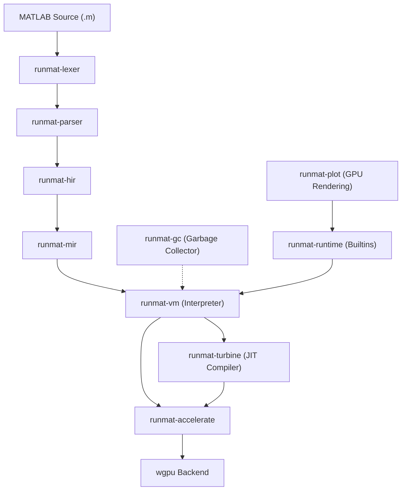
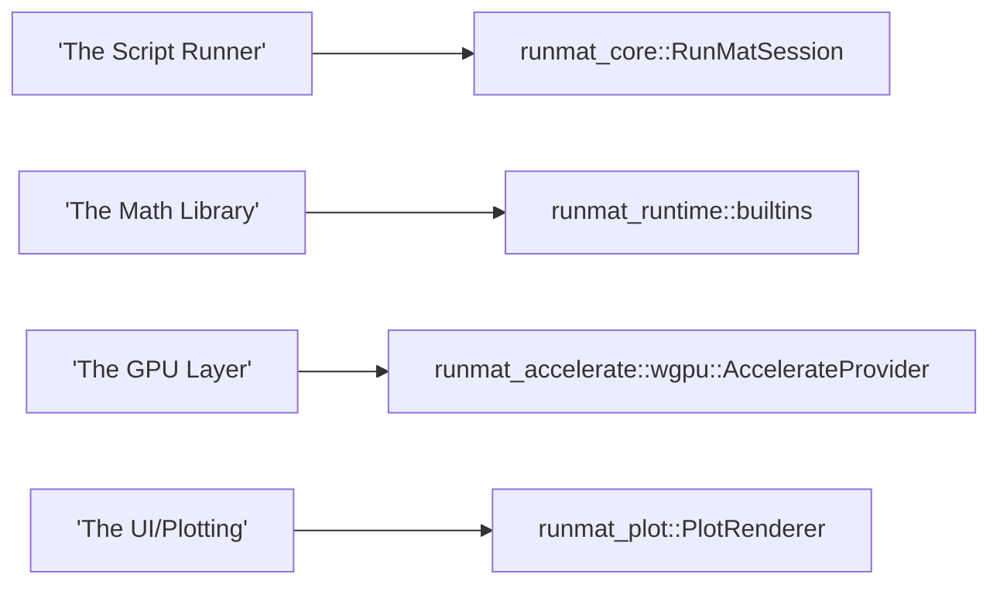

# RunMat Overview

<details>
<summary>Relevant source files</summary>

- [Cargo.lock](https://github.com/runmat-org/runmat/blob/82685330/Cargo.lock)
- [Cargo.toml](https://github.com/runmat-org/runmat/blob/82685330/Cargo.toml)
- [README.md](https://github.com/runmat-org/runmat/blob/82685330/README.md?plain=1)
- [crates/runmat-accelerate/Cargo.toml](https://github.com/runmat-org/runmat/blob/82685330/crates/runmat-accelerate/Cargo.toml)
- [crates/runmat-builtins/Cargo.toml](https://github.com/runmat-org/runmat/blob/82685330/crates/runmat-builtins/Cargo.toml)
- [crates/runmat-gc/Cargo.toml](https://github.com/runmat-org/runmat/blob/82685330/crates/runmat-gc/Cargo.toml)
- [crates/runmat-lexer/Cargo.toml](https://github.com/runmat-org/runmat/blob/82685330/crates/runmat-lexer/Cargo.toml)
- [crates/runmat-macros/Cargo.toml](https://github.com/runmat-org/runmat/blob/82685330/crates/runmat-macros/Cargo.toml)
- [crates/runmat-parser/Cargo.toml](https://github.com/runmat-org/runmat/blob/82685330/crates/runmat-parser/Cargo.toml)
- [crates/runmat-plot/Cargo.toml](https://github.com/runmat-org/runmat/blob/82685330/crates/runmat-plot/Cargo.toml)
- [crates/runmat-runtime/Cargo.toml](https://github.com/runmat-org/runmat/blob/82685330/crates/runmat-runtime/Cargo.toml)
- [crates/runmat-snapshot/Cargo.toml](https://github.com/runmat-org/runmat/blob/82685330/crates/runmat-snapshot/Cargo.toml)
- [crates/runmat-turbine/Cargo.toml](https://github.com/runmat-org/runmat/blob/82685330/crates/runmat-turbine/Cargo.toml)
- [docs/ARCHITECTURE.md](https://github.com/runmat-org/runmat/blob/82685330/docs/ARCHITECTURE.md?plain=1)
- [docs/CHANGELOG.md](https://github.com/runmat-org/runmat/blob/82685330/docs/CHANGELOG.md?plain=1)
- [docs/COMPATIBILITY.md](https://github.com/runmat-org/runmat/blob/82685330/docs/COMPATIBILITY.md?plain=1)
- [docs/ROADMAP.md](https://github.com/runmat-org/runmat/blob/82685330/docs/ROADMAP.md?plain=1)

</details>

RunMat is an open-source, high-performance runtime designed for numerical computing using MATLAB-style syntax [README.md #5-9](https://github.com/runmat-org/runmat/blob/82685330/README.md?plain=1#L5-L9) It is built in Rust and provides a multi-tiered execution model that targets both CPU and GPU hardware without requiring manual device management [README.md #42-46](https://github.com/runmat-org/runmat/blob/82685330/README.md?plain=1#L42-L46)

The system is designed to be a drop-in runtime for `.m` files, offering automatic operation fusion, a generational garbage collector, and a cross-platform GPU backend powered by `wgpu` [README.md #117-143](https://github.com/runmat-org/runmat/blob/82685330/README.md?plain=1#L117-L143)

## Key Capabilities

- MATLAB Compatibility: Supports standard `.m` file syntax, including arrays, complex control flow, and over 400 built-in functions [README.md #119-123](https://github.com/runmat-org/runmat/blob/82685330/README.md?plain=1#L119-L123)
- Automatic Fusion: Builds an internal graph of array operations to fuse elementwise math and reductions into optimized kernels [README.md #124-130](https://github.com/runmat-org/runmat/blob/82685330/README.md?plain=1#L124-L130)
- Tiered Execution: Combines a fast-startup VM interpreter with the Turbine JIT (based on Cranelift) for hot code paths [README.md #131-136](https://github.com/runmat-org/runmat/blob/82685330/README.md?plain=1#L131-L136)
- Cross-Platform GPU: Transparently offloads workloads to Metal, DirectX 12, Vulkan, or WebGPU using the `runmat-accelerate` crate [README.md #138-143](https://github.com/runmat-org/runmat/blob/82685330/README.md?plain=1#L138-L143)
- Async Runtime: Built on Rust futures, allowing non-blocking execution in web environments and CLI tools [README.md #144-150](https://github.com/runmat-org/runmat/blob/82685330/README.md?plain=1#L144-L150)
- Integrated Plotting: Features a GPU-accelerated 2D/3D plotting engine supporting 30+ plot types [README.md #158-163](https://github.com/runmat-org/runmat/blob/82685330/README.md?plain=1#L158-L163)

## System Architecture

The RunMat codebase is organized into a modular workspace of Rust crates [Cargo.toml #1-32](https://github.com/runmat-org/runmat/blob/82685330/Cargo.toml#L1-L32) The diagram below illustrates how source code flows through the compilation pipeline into the execution engines.

### The Compilation & Execution Flow



<details>
<summary>Rendered SVG</summary>

```svg
<svg id="mermaid-m3a8g1vjcoa" xmlns="http://www.w3.org/2000/svg" xmlns:xlink="http://www.w3.org/1999/xlink" class="flowchart" style="max-width: 100%; touch-action: none; user-select: none; cursor: grab; min-height: fit-content; max-height: 100%;" viewBox="-0.0041891429552265436 0 948.3755657859105 1197" role="graphics-document document" aria-roledescription="flowchart-v2" preserveAspectRatio="xMidYMid meet"><style>#mermaid-m3a8g1vjcoa{font-family:ui-sans-serif,-apple-system,system-ui,Segoe UI,Helvetica;font-size:16px;fill:#ccc;}@keyframes edge-animation-frame{from{stroke-dashoffset:0;}}@keyframes dash{to{stroke-dashoffset:0;}}#mermaid-m3a8g1vjcoa .edge-animation-slow{stroke-dasharray:9,5!important;stroke-dashoffset:900;animation:dash 50s linear infinite;stroke-linecap:round;}#mermaid-m3a8g1vjcoa .edge-animation-fast{stroke-dasharray:9,5!important;stroke-dashoffset:900;animation:dash 20s linear infinite;stroke-linecap:round;}#mermaid-m3a8g1vjcoa .error-icon{fill:#333;}#mermaid-m3a8g1vjcoa .error-text{fill:#cccccc;stroke:#cccccc;}#mermaid-m3a8g1vjcoa .edge-thickness-normal{stroke-width:1px;}#mermaid-m3a8g1vjcoa .edge-thickness-thick{stroke-width:3.5px;}#mermaid-m3a8g1vjcoa .edge-pattern-solid{stroke-dasharray:0;}#mermaid-m3a8g1vjcoa .edge-thickness-invisible{stroke-width:0;fill:none;}#mermaid-m3a8g1vjcoa .edge-pattern-dashed{stroke-dasharray:3;}#mermaid-m3a8g1vjcoa .edge-pattern-dotted{stroke-dasharray:2;}#mermaid-m3a8g1vjcoa .marker{fill:#666;stroke:#666;}#mermaid-m3a8g1vjcoa .marker.cross{stroke:#666;}#mermaid-m3a8g1vjcoa svg{font-family:ui-sans-serif,-apple-system,system-ui,Segoe UI,Helvetica;font-size:16px;}#mermaid-m3a8g1vjcoa p{margin:0;}#mermaid-m3a8g1vjcoa .label{font-family:ui-sans-serif,-apple-system,system-ui,Segoe UI,Helvetica;color:#fff;}#mermaid-m3a8g1vjcoa .cluster-label text{fill:#fff;}#mermaid-m3a8g1vjcoa .cluster-label span{color:#fff;}#mermaid-m3a8g1vjcoa .cluster-label span p{background-color:transparent;}#mermaid-m3a8g1vjcoa .label text,#mermaid-m3a8g1vjcoa span{fill:#fff;color:#fff;}#mermaid-m3a8g1vjcoa .node rect,#mermaid-m3a8g1vjcoa .node circle,#mermaid-m3a8g1vjcoa .node ellipse,#mermaid-m3a8g1vjcoa .node polygon,#mermaid-m3a8g1vjcoa .node path{fill:#111;stroke:#222;stroke-width:1px;}#mermaid-m3a8g1vjcoa .rough-node .label text,#mermaid-m3a8g1vjcoa .node .label text,#mermaid-m3a8g1vjcoa .image-shape .label,#mermaid-m3a8g1vjcoa .icon-shape .label{text-anchor:middle;}#mermaid-m3a8g1vjcoa .node .katex path{fill:#000;stroke:#000;stroke-width:1px;}#mermaid-m3a8g1vjcoa .rough-node .label,#mermaid-m3a8g1vjcoa .node .label,#mermaid-m3a8g1vjcoa .image-shape .label,#mermaid-m3a8g1vjcoa .icon-shape .label{text-align:center;}#mermaid-m3a8g1vjcoa .node.clickable{cursor:pointer;}#mermaid-m3a8g1vjcoa .root .anchor path{fill:#666!important;stroke-width:0;stroke:#666;}#mermaid-m3a8g1vjcoa .arrowheadPath{fill:#0b0b0b;}#mermaid-m3a8g1vjcoa .edgePath .path{stroke:#666;stroke-width:1px;}#mermaid-m3a8g1vjcoa .flowchart-link{stroke:#666;fill:none;}#mermaid-m3a8g1vjcoa .edgeLabel{background-color:#161616;text-align:center;}#mermaid-m3a8g1vjcoa .edgeLabel p{background-color:#161616;}#mermaid-m3a8g1vjcoa .edgeLabel rect{opacity:0.5;background-color:#161616;fill:#161616;}#mermaid-m3a8g1vjcoa .labelBkg{background-color:rgba(22, 22, 22, 0.5);}#mermaid-m3a8g1vjcoa .cluster rect{fill:#161616;stroke:#222;stroke-width:1px;}#mermaid-m3a8g1vjcoa .cluster text{fill:#fff;}#mermaid-m3a8g1vjcoa .cluster span{color:#fff;}#mermaid-m3a8g1vjcoa div.mermaidTooltip{position:absolute;text-align:center;max-width:200px;padding:2px;font-family:ui-sans-serif,-apple-system,system-ui,Segoe UI,Helvetica;font-size:12px;background:#333;border:1px solid hsl(0, 0%, 10%);border-radius:2px;pointer-events:none;z-index:100;}#mermaid-m3a8g1vjcoa .flowchartTitleText{text-anchor:middle;font-size:18px;fill:#ccc;}#mermaid-m3a8g1vjcoa rect.text{fill:none;stroke-width:0;}#mermaid-m3a8g1vjcoa .icon-shape,#mermaid-m3a8g1vjcoa .image-shape{background-color:#161616;text-align:center;}#mermaid-m3a8g1vjcoa .icon-shape p,#mermaid-m3a8g1vjcoa .image-shape p{background-color:#161616;padding:2px;}#mermaid-m3a8g1vjcoa .icon-shape .label rect,#mermaid-m3a8g1vjcoa .image-shape .label rect{opacity:0.5;background-color:#161616;fill:#161616;}#mermaid-m3a8g1vjcoa .label-icon{display:inline-block;height:1em;overflow:visible;vertical-align:-0.125em;}#mermaid-m3a8g1vjcoa .node .label-icon path{fill:currentColor;stroke:revert;stroke-width:revert;}#mermaid-m3a8g1vjcoa .node .neo-node{stroke:#222;}#mermaid-m3a8g1vjcoa [data-look="neo"].node rect,#mermaid-m3a8g1vjcoa [data-look="neo"].cluster rect,#mermaid-m3a8g1vjcoa [data-look="neo"].node polygon{stroke:url(#mermaid-m3a8g1vjcoa-gradient);filter:drop-shadow( 1px 2px 2px rgba(185,185,185,1));}#mermaid-m3a8g1vjcoa [data-look="neo"].node path{stroke:url(#mermaid-m3a8g1vjcoa-gradient);stroke-width:1px;}#mermaid-m3a8g1vjcoa [data-look="neo"].node .outer-path{filter:drop-shadow( 1px 2px 2px rgba(185,185,185,1));}#mermaid-m3a8g1vjcoa [data-look="neo"].node .neo-line path{stroke:#222;filter:none;}#mermaid-m3a8g1vjcoa [data-look="neo"].node circle{stroke:url(#mermaid-m3a8g1vjcoa-gradient);filter:drop-shadow( 1px 2px 2px rgba(185,185,185,1));}#mermaid-m3a8g1vjcoa [data-look="neo"].node circle .state-start{fill:#000000;}#mermaid-m3a8g1vjcoa [data-look="neo"].icon-shape .icon{fill:url(#mermaid-m3a8g1vjcoa-gradient);filter:drop-shadow( 1px 2px 2px rgba(185,185,185,1));}#mermaid-m3a8g1vjcoa [data-look="neo"].icon-shape .icon-neo path{stroke:url(#mermaid-m3a8g1vjcoa-gradient);filter:drop-shadow( 1px 2px 2px rgba(185,185,185,1));}#mermaid-m3a8g1vjcoa :root{--mermaid-font-family:"trebuchet ms",verdana,arial,sans-serif;}</style><g><marker id="mermaid-m3a8g1vjcoa_flowchart-v2-pointEnd" class="marker flowchart-v2" viewBox="0 0 10 10" refX="5" refY="5" markerUnits="userSpaceOnUse" markerWidth="8" markerHeight="8" orient="auto"><path d="M 0 0 L 10 5 L 0 10 z" class="arrowMarkerPath" style="stroke-width: 1; stroke-dasharray: 1, 0;"></path></marker><marker id="mermaid-m3a8g1vjcoa_flowchart-v2-pointStart" class="marker flowchart-v2" viewBox="0 0 10 10" refX="4.5" refY="5" markerUnits="userSpaceOnUse" markerWidth="8" markerHeight="8" orient="auto"><path d="M 0 5 L 10 10 L 10 0 z" class="arrowMarkerPath" style="stroke-width: 1; stroke-dasharray: 1, 0;"></path></marker><marker id="mermaid-m3a8g1vjcoa_flowchart-v2-pointEnd-margin" class="marker flowchart-v2" viewBox="0 0 11.5 14" refX="11.5" refY="7" markerUnits="userSpaceOnUse" markerWidth="10.5" markerHeight="14" orient="auto"><path d="M 0 0 L 11.5 7 L 0 14 z" class="arrowMarkerPath" style="stroke-width: 0; stroke-dasharray: 1, 0;"></path></marker><marker id="mermaid-m3a8g1vjcoa_flowchart-v2-pointStart-margin" class="marker flowchart-v2" viewBox="0 0 11.5 14" refX="1" refY="7" markerUnits="userSpaceOnUse" markerWidth="11.5" markerHeight="14" orient="auto"><polygon points="0,7 11.5,14 11.5,0" class="arrowMarkerPath" style="stroke-width: 0; stroke-dasharray: 1, 0;"></polygon></marker><marker id="mermaid-m3a8g1vjcoa_flowchart-v2-circleEnd" class="marker flowchart-v2" viewBox="0 0 10 10" refX="11" refY="5" markerUnits="userSpaceOnUse" markerWidth="11" markerHeight="11" orient="auto"><circle cx="5" cy="5" r="5" class="arrowMarkerPath" style="stroke-width: 1; stroke-dasharray: 1, 0;"></circle></marker><marker id="mermaid-m3a8g1vjcoa_flowchart-v2-circleStart" class="marker flowchart-v2" viewBox="0 0 10 10" refX="-1" refY="5" markerUnits="userSpaceOnUse" markerWidth="11" markerHeight="11" orient="auto"><circle cx="5" cy="5" r="5" class="arrowMarkerPath" style="stroke-width: 1; stroke-dasharray: 1, 0;"></circle></marker><marker id="mermaid-m3a8g1vjcoa_flowchart-v2-circleEnd-margin" class="marker flowchart-v2" viewBox="0 0 10 10" refY="5" refX="12.25" markerUnits="userSpaceOnUse" markerWidth="14" markerHeight="14" orient="auto"><circle cx="5" cy="5" r="5" class="arrowMarkerPath" style="stroke-width: 0; stroke-dasharray: 1, 0;"></circle></marker><marker id="mermaid-m3a8g1vjcoa_flowchart-v2-circleStart-margin" class="marker flowchart-v2" viewBox="0 0 10 10" refX="-2" refY="5" markerUnits="userSpaceOnUse" markerWidth="14" markerHeight="14" orient="auto"><circle cx="5" cy="5" r="5" class="arrowMarkerPath" style="stroke-width: 0; stroke-dasharray: 1, 0;"></circle></marker><marker id="mermaid-m3a8g1vjcoa_flowchart-v2-crossEnd" class="marker cross flowchart-v2" viewBox="0 0 11 11" refX="12" refY="5.2" markerUnits="userSpaceOnUse" markerWidth="11" markerHeight="11" orient="auto"><path d="M 1,1 l 9,9 M 10,1 l -9,9" class="arrowMarkerPath" style="stroke-width: 2; stroke-dasharray: 1, 0;"></path></marker><marker id="mermaid-m3a8g1vjcoa_flowchart-v2-crossStart" class="marker cross flowchart-v2" viewBox="0 0 11 11" refX="-1" refY="5.2" markerUnits="userSpaceOnUse" markerWidth="11" markerHeight="11" orient="auto"><path d="M 1,1 l 9,9 M 10,1 l -9,9" class="arrowMarkerPath" style="stroke-width: 2; stroke-dasharray: 1, 0;"></path></marker><marker id="mermaid-m3a8g1vjcoa_flowchart-v2-crossEnd-margin" class="marker cross flowchart-v2" viewBox="0 0 15 15" refX="17.7" refY="7.5" markerUnits="userSpaceOnUse" markerWidth="12" markerHeight="12" orient="auto"><path d="M 1,1 L 14,14 M 1,14 L 14,1" class="arrowMarkerPath" style="stroke-width: 2.5;"></path></marker><marker id="mermaid-m3a8g1vjcoa_flowchart-v2-crossStart-margin" class="marker cross flowchart-v2" viewBox="0 0 15 15" refX="-3.5" refY="7.5" markerUnits="userSpaceOnUse" markerWidth="12" markerHeight="12" orient="auto"><path d="M 1,1 L 14,14 M 1,14 L 14,1" class="arrowMarkerPath" style="stroke-width: 2.5; stroke-dasharray: 1, 0;"></path></marker><g class="root"><g class="clusters"><g class="cluster" id="mermaid-m3a8g1vjcoa-subGraph3" data-look="classic"><rect style="" x="309.171875" y="345" width="631.1953125" height="256"></rect><g class="cluster-label" transform="translate(562.53515625, 345)"><foreignObject width="124.46875" height="24"><div style="display: table-cell; white-space: nowrap; line-height: 1.5;" xmlns="http://www.w3.org/1999/xhtml"><span class="nodeLabel"><p>Support Systems</p></span></div></foreignObject></g></g><g class="cluster" id="mermaid-m3a8g1vjcoa-subGraph2" data-look="classic"><rect style="" x="68.5859375" y="651" width="791.8984375" height="538"></rect><g class="cluster-label" transform="translate(338.44921875, 651)"><foreignObject width="252.171875" height="24"><div style="display: table-cell; white-space: nowrap; line-height: 1.5;" xmlns="http://www.w3.org/1999/xhtml"><span class="nodeLabel"><p>Execution Tier (Code Entity Space)</p></span></div></foreignObject></g></g><g class="cluster" id="mermaid-m3a8g1vjcoa-subGraph0" data-look="classic"><rect style="" x="8" y="8" width="281.171875" height="593"></rect><g class="cluster-label" transform="translate(64.0078125, 8)"><foreignObject width="169.15625" height="24"><div style="display: table-cell; white-space: nowrap; line-height: 1.5;" xmlns="http://www.w3.org/1999/xhtml"><span class="nodeLabel"><p>Frontend (Source to IR)</p></span></div></foreignObject></g></g><g class="cluster" id="mermaid-m3a8g1vjcoa-subGraph1" data-look="classic"><rect style="" x="88.5859375" y="676" width="751.8984375" height="488"></rect><g class="cluster-label" transform="translate(382.36328125, 676)"><foreignObject width="164.34375" height="24"><div style="display: table-cell; white-space: nowrap; line-height: 1.5;" xmlns="http://www.w3.org/1999/xhtml"><span class="nodeLabel"><p>Hardware Acceleration</p></span></div></foreignObject></g></g></g><g class="edgePaths"><path d="M148.586,87L148.586,91.167C148.586,95.333,148.586,103.667,148.586,111.333C148.586,119,148.586,126,148.586,129.5L148.586,133" id="mermaid-m3a8g1vjcoa-L_A_B_0" class="edge-thickness-normal edge-pattern-solid edge-thickness-normal edge-pattern-solid flowchart-link" style=";" data-edge="true" data-et="edge" data-id="L_A_B_0" data-points="W3sieCI6MTQ4LjU4NTkzNzUsInkiOjg3fSx7IngiOjE0OC41ODU5Mzc1LCJ5IjoxMTJ9LHsieCI6MTQ4LjU4NTkzNzUsInkiOjEzN31d" data-look="classic" marker-end="url(#mermaid-m3a8g1vjcoa_flowchart-v2-pointEnd)"></path><path d="M148.586,191L148.586,195.167C148.586,199.333,148.586,207.667,148.586,215.333C148.586,223,148.586,230,148.586,233.5L148.586,237" id="mermaid-m3a8g1vjcoa-L_B_C_0" class="edge-thickness-normal edge-pattern-solid edge-thickness-normal edge-pattern-solid flowchart-link" style=";" data-edge="true" data-et="edge" data-id="L_B_C_0" data-points="W3sieCI6MTQ4LjU4NTkzNzUsInkiOjE5MX0seyJ4IjoxNDguNTg1OTM3NSwieSI6MjE2fSx7IngiOjE0OC41ODU5Mzc1LCJ5IjoyNDF9XQ==" data-look="classic" marker-end="url(#mermaid-m3a8g1vjcoa_flowchart-v2-pointEnd)"></path><path d="M148.586,295L148.586,299.167C148.586,303.333,148.586,311.667,148.586,320C148.586,328.333,148.586,336.667,148.586,346.333C148.586,356,148.586,367,148.586,372.5L148.586,378" id="mermaid-m3a8g1vjcoa-L_C_D_0" class="edge-thickness-normal edge-pattern-solid edge-thickness-normal edge-pattern-solid flowchart-link" style=";" data-edge="true" data-et="edge" data-id="L_C_D_0" data-points="W3sieCI6MTQ4LjU4NTkzNzUsInkiOjI5NX0seyJ4IjoxNDguNTg1OTM3NSwieSI6MzIwfSx7IngiOjE0OC41ODU5Mzc1LCJ5IjozNDV9LHsieCI6MTQ4LjU4NTkzNzUsInkiOjM4Mn1d" data-look="classic" marker-end="url(#mermaid-m3a8g1vjcoa_flowchart-v2-pointEnd)"></path><path d="M148.586,436L148.586,442.167C148.586,448.333,148.586,460.667,148.586,472.333C148.586,484,148.586,495,148.586,500.5L148.586,506" id="mermaid-m3a8g1vjcoa-L_D_E_0" class="edge-thickness-normal edge-pattern-solid edge-thickness-normal edge-pattern-solid flowchart-link" style=";" data-edge="true" data-et="edge" data-id="L_D_E_0" data-points="W3sieCI6MTQ4LjU4NTkzNzUsInkiOjQzNn0seyJ4IjoxNDguNTg1OTM3NSwieSI6NDczfSx7IngiOjE0OC41ODU5Mzc1LCJ5Ijo1MTB9XQ==" data-look="classic" marker-end="url(#mermaid-m3a8g1vjcoa_flowchart-v2-pointEnd)"></path><path d="M148.586,564L148.586,570.167C148.586,576.333,148.586,588.667,148.586,599C148.586,609.333,148.586,617.667,148.586,626C148.586,634.333,148.586,642.667,148.586,651C148.586,659.333,148.586,667.667,182.78,677.295C216.975,686.923,285.364,697.845,319.559,703.306L353.753,708.768" id="mermaid-m3a8g1vjcoa-L_E_F_0" class="edge-thickness-normal edge-pattern-solid edge-thickness-normal edge-pattern-solid flowchart-link" style=";" data-edge="true" data-et="edge" data-id="L_E_F_0" data-points="W3sieCI6MTQ4LjU4NTkzNzUsInkiOjU2NH0seyJ4IjoxNDguNTg1OTM3NSwieSI6NjAxfSx7IngiOjE0OC41ODU5Mzc1LCJ5Ijo2MjZ9LHsieCI6MTQ4LjU4NTkzNzUsInkiOjY1MX0seyJ4IjoxNDguNTg1OTM3NSwieSI6Njc2fSx7IngiOjM1Ny43MDMxMjUsInkiOjcwOS4zOTg1MzYyOTI3NDE1fV0=" data-look="classic" marker-end="url(#mermaid-m3a8g1vjcoa_flowchart-v2-pointEnd)"></path><path d="M578.7,755L594.83,759.167C610.961,763.333,643.223,771.667,659.354,779.333C675.484,787,675.484,794,675.484,797.5L675.484,801" id="mermaid-m3a8g1vjcoa-L_F_G_0" class="edge-thickness-normal edge-pattern-solid edge-thickness-normal edge-pattern-solid flowchart-link" style=";" data-edge="true" data-et="edge" data-id="L_F_G_0" data-points="W3sieCI6NTc4LjY5OTUxOTIzMDc2OTMsInkiOjc1NX0seyJ4Ijo2NzUuNDg0Mzc1LCJ5Ijo3ODB9LHsieCI6Njc1LjQ4NDM3NSwieSI6ODA1fV0=" data-look="classic" marker-end="url(#mermaid-m3a8g1vjcoa_flowchart-v2-pointEnd)"></path><path d="M357.703,748.539L327.969,753.783C298.236,759.026,238.768,769.513,209.035,785.423C179.301,801.333,179.301,822.667,179.301,846C179.301,869.333,179.301,894.667,211.621,914.348C243.942,934.03,308.583,948.06,340.903,955.075L373.224,962.09" id="mermaid-m3a8g1vjcoa-L_F_H_0" class="edge-thickness-normal edge-pattern-solid edge-thickness-normal edge-pattern-solid flowchart-link" style=";" data-edge="true" data-et="edge" data-id="L_F_H_0" data-points="W3sieCI6MzU3LjcwMzEyNSwieSI6NzQ4LjUzOTA1OTcwNTY0NDd9LHsieCI6MTc5LjMwMDc4MTI1LCJ5Ijo3ODB9LHsieCI6MTc5LjMwMDc4MTI1LCJ5Ijo4NDR9LHsieCI6MTc5LjMwMDc4MTI1LCJ5Ijo5MjB9LHsieCI6Mzc3LjEzMjgxMjUsInkiOjk2Mi45MzgyNTQyNjg5NDY5fV0=" data-look="classic" marker-end="url(#mermaid-m3a8g1vjcoa_flowchart-v2-pointEnd)"></path><path d="M675.484,883L675.484,889.167C675.484,895.333,675.484,907.667,656.722,919.798C637.96,931.929,600.437,943.859,581.675,949.823L562.913,955.788" id="mermaid-m3a8g1vjcoa-L_G_H_0" class="edge-thickness-normal edge-pattern-solid edge-thickness-normal edge-pattern-solid flowchart-link" style=";" data-edge="true" data-et="edge" data-id="L_G_H_0" data-points="W3sieCI6Njc1LjQ4NDM3NSwieSI6ODgzfSx7IngiOjY3NS40ODQzNzUsInkiOjkyMH0seyJ4Ijo1NTkuMTAwNTg1OTM3NSwieSI6OTU3fV0=" data-look="classic" marker-end="url(#mermaid-m3a8g1vjcoa_flowchart-v2-pointEnd)"></path><path d="M474.172,1011L474.172,1017.167C474.172,1023.333,474.172,1035.667,474.172,1047.333C474.172,1059,474.172,1070,474.172,1075.5L474.172,1081" id="mermaid-m3a8g1vjcoa-L_H_I_0" class="edge-thickness-normal edge-pattern-solid edge-thickness-normal edge-pattern-solid flowchart-link" style=";" data-edge="true" data-et="edge" data-id="L_H_I_0" data-points="W3sieCI6NDc0LjE3MTg3NSwieSI6MTAxMX0seyJ4Ijo0NzQuMTcxODc1LCJ5IjoxMDQ4fSx7IngiOjQ3NC4xNzE4NzUsInkiOjEwODV9XQ==" data-look="classic" marker-end="url(#mermaid-m3a8g1vjcoa_flowchart-v2-pointEnd)"></path><path d="M474.172,576L474.172,580.167C474.172,584.333,474.172,592.667,474.172,601C474.172,609.333,474.172,617.667,474.172,626C474.172,634.333,474.172,642.667,474.172,651C474.172,659.333,474.172,667.667,474.172,675.333C474.172,683,474.172,690,474.172,693.5L474.172,697" id="mermaid-m3a8g1vjcoa-L_J_F_0" class="edge-thickness-normal edge-pattern-dotted edge-thickness-normal edge-pattern-solid flowchart-link" style=";" data-edge="true" data-et="edge" data-id="L_J_F_0" data-points="W3sieCI6NDc0LjE3MTg3NSwieSI6NTc2fSx7IngiOjQ3NC4xNzE4NzUsInkiOjYwMX0seyJ4Ijo0NzQuMTcxODc1LCJ5Ijo2MjZ9LHsieCI6NDc0LjE3MTg3NSwieSI6NjUxfSx7IngiOjQ3NC4xNzE4NzUsInkiOjY3Nn0seyJ4Ijo0NzQuMTcxODc1LCJ5Ijo3MDF9XQ==" data-look="classic" marker-end="url(#mermaid-m3a8g1vjcoa_flowchart-v2-pointEnd)"></path><path d="M775.367,564L775.367,570.167C775.367,576.333,775.367,588.667,775.367,599C775.367,609.333,775.367,617.667,775.367,626C775.367,634.333,775.367,642.667,775.367,651C775.367,659.333,775.367,667.667,745.236,677.035C715.106,686.404,654.844,696.808,624.713,702.01L594.582,707.212" id="mermaid-m3a8g1vjcoa-L_K_F_0" class="edge-thickness-normal edge-pattern-solid edge-thickness-normal edge-pattern-solid flowchart-link" style=";" data-edge="true" data-et="edge" data-id="L_K_F_0" data-points="W3sieCI6Nzc1LjM2NzE4NzUsInkiOjU2NH0seyJ4Ijo3NzUuMzY3MTg3NSwieSI6NjAxfSx7IngiOjc3NS4zNjcxODc1LCJ5Ijo2MjZ9LHsieCI6Nzc1LjM2NzE4NzUsInkiOjY1MX0seyJ4Ijo3NzUuMzY3MTg3NSwieSI6Njc2fSx7IngiOjU5MC42NDA2MjUsInkiOjcwNy44OTIyMDAzNDc1NzM1fV0=" data-look="classic" marker-end="url(#mermaid-m3a8g1vjcoa_flowchart-v2-pointEnd)"></path><path d="M775.367,448L775.367,452.167C775.367,456.333,775.367,464.667,775.367,474.333C775.367,484,775.367,495,775.367,500.5L775.367,506" id="mermaid-m3a8g1vjcoa-L_L_K_0" class="edge-thickness-normal edge-pattern-solid edge-thickness-normal edge-pattern-solid flowchart-link" style=";" data-edge="true" data-et="edge" data-id="L_L_K_0" data-points="W3sieCI6Nzc1LjM2NzE4NzUsInkiOjQ0OH0seyJ4Ijo3NzUuMzY3MTg3NSwieSI6NDczfSx7IngiOjc3NS4zNjcxODc1LCJ5Ijo1MTB9XQ==" data-look="classic" marker-end="url(#mermaid-m3a8g1vjcoa_flowchart-v2-pointEnd)"></path></g><g class="edgeLabels"><g class="edgeLabel"><g class="label" data-id="L_A_B_0" transform="translate(0, 0)"><foreignObject width="0" height="0"><div style="display: table-cell; white-space: nowrap; line-height: 1.5; max-width: 200px; text-align: center;" xmlns="http://www.w3.org/1999/xhtml" class="labelBkg"><span class="edgeLabel"></span></div></foreignObject></g></g><g class="edgeLabel"><g class="label" data-id="L_B_C_0" transform="translate(0, 0)"><foreignObject width="0" height="0"><div style="display: table-cell; white-space: nowrap; line-height: 1.5; max-width: 200px; text-align: center;" xmlns="http://www.w3.org/1999/xhtml" class="labelBkg"><span class="edgeLabel"></span></div></foreignObject></g></g><g class="edgeLabel"><g class="label" data-id="L_C_D_0" transform="translate(0, 0)"><foreignObject width="0" height="0"><div style="display: table-cell; white-space: nowrap; line-height: 1.5; max-width: 200px; text-align: center;" xmlns="http://www.w3.org/1999/xhtml" class="labelBkg"><span class="edgeLabel"></span></div></foreignObject></g></g><g class="edgeLabel"><g class="label" data-id="L_D_E_0" transform="translate(0, 0)"><foreignObject width="0" height="0"><div style="display: table-cell; white-space: nowrap; line-height: 1.5; max-width: 200px; text-align: center;" xmlns="http://www.w3.org/1999/xhtml" class="labelBkg"><span class="edgeLabel"></span></div></foreignObject></g></g><g class="edgeLabel"><g class="label" data-id="L_E_F_0" transform="translate(0, 0)"><foreignObject width="0" height="0"><div style="display: table-cell; white-space: nowrap; line-height: 1.5; max-width: 200px; text-align: center;" xmlns="http://www.w3.org/1999/xhtml" class="labelBkg"><span class="edgeLabel"></span></div></foreignObject></g></g><g class="edgeLabel"><g class="label" data-id="L_F_G_0" transform="translate(0, 0)"><foreignObject width="0" height="0"><div style="display: table-cell; white-space: nowrap; line-height: 1.5; max-width: 200px; text-align: center;" xmlns="http://www.w3.org/1999/xhtml" class="labelBkg"><span class="edgeLabel"></span></div></foreignObject></g></g><g class="edgeLabel" transform="translate(179.30078125, 844)"><g class="label" data-id="L_F_H_0" transform="translate(-50.546875, -12)"><foreignObject width="101.09375" height="24"><div style="display: table-cell; white-space: nowrap; line-height: 1.5; max-width: 200px; text-align: center;" xmlns="http://www.w3.org/1999/xhtml" class="labelBkg"><span class="edgeLabel"><p>Fusion Engine</p></span></div></foreignObject></g></g><g class="edgeLabel" transform="translate(675.484375, 920)"><g class="label" data-id="L_G_H_0" transform="translate(-50.546875, -12)"><foreignObject width="101.09375" height="24"><div style="display: table-cell; white-space: nowrap; line-height: 1.5; max-width: 200px; text-align: center;" xmlns="http://www.w3.org/1999/xhtml" class="labelBkg"><span class="edgeLabel"><p>Fusion Engine</p></span></div></foreignObject></g></g><g class="edgeLabel" transform="translate(474.171875, 1048)"><g class="label" data-id="L_H_I_0" transform="translate(-54.359375, -12)"><foreignObject width="108.71875" height="24"><div style="display: table-cell; white-space: nowrap; line-height: 1.5; max-width: 200px; text-align: center;" xmlns="http://www.w3.org/1999/xhtml" class="labelBkg"><span class="edgeLabel"><p>WGSL Shaders</p></span></div></foreignObject></g></g><g class="edgeLabel"><g class="label" data-id="L_J_F_0" transform="translate(0, 0)"><foreignObject width="0" height="0"><div style="display: table-cell; white-space: nowrap; line-height: 1.5; max-width: 200px; text-align: center;" xmlns="http://www.w3.org/1999/xhtml" class="labelBkg"><span class="edgeLabel"></span></div></foreignObject></g></g><g class="edgeLabel"><g class="label" data-id="L_K_F_0" transform="translate(0, 0)"><foreignObject width="0" height="0"><div style="display: table-cell; white-space: nowrap; line-height: 1.5; max-width: 200px; text-align: center;" xmlns="http://www.w3.org/1999/xhtml" class="labelBkg"><span class="edgeLabel"></span></div></foreignObject></g></g><g class="edgeLabel"><g class="label" data-id="L_L_K_0" transform="translate(0, 0)"><foreignObject width="0" height="0"><div style="display: table-cell; white-space: nowrap; line-height: 1.5; max-width: 200px; text-align: center;" xmlns="http://www.w3.org/1999/xhtml" class="labelBkg"><span class="edgeLabel"></span></div></foreignObject></g></g></g><g class="nodes"><g class="node default" id="mermaid-m3a8g1vjcoa-flowchart-A-0" data-look="classic" transform="translate(148.5859375, 60)"><rect class="basic label-container" style="" x="-105.5859375" y="-27" width="211.171875" height="54"></rect><g class="label" style="" transform="translate(-75.5859375, -12)"><rect></rect><foreignObject width="151.171875" height="24"><div style="display: table-cell; white-space: nowrap; line-height: 1.5; max-width: 200px; text-align: center;" xmlns="http://www.w3.org/1999/xhtml"><span class="nodeLabel"><p>MATLAB Source (.m)</p></span></div></foreignObject></g></g><g class="node default" id="mermaid-m3a8g1vjcoa-flowchart-B-1" data-look="classic" transform="translate(148.5859375, 164)"><rect class="basic label-container" style="" x="-76.4609375" y="-27" width="152.921875" height="54"></rect><g class="label" style="" transform="translate(-46.4609375, -12)"><rect></rect><foreignObject width="92.921875" height="24"><div style="display: table-cell; white-space: nowrap; line-height: 1.5; max-width: 200px; text-align: center;" xmlns="http://www.w3.org/1999/xhtml"><span class="nodeLabel"><p>runmat-lexer</p></span></div></foreignObject></g></g><g class="node default" id="mermaid-m3a8g1vjcoa-flowchart-C-3" data-look="classic" transform="translate(148.5859375, 268)"><rect class="basic label-container" style="" x="-82.3203125" y="-27" width="164.640625" height="54"></rect><g class="label" style="" transform="translate(-52.3203125, -12)"><rect></rect><foreignObject width="104.640625" height="24"><div style="display: table-cell; white-space: nowrap; line-height: 1.5; max-width: 200px; text-align: center;" xmlns="http://www.w3.org/1999/xhtml"><span class="nodeLabel"><p>runmat-parser</p></span></div></foreignObject></g></g><g class="node default" id="mermaid-m3a8g1vjcoa-flowchart-D-5" data-look="classic" transform="translate(148.5859375, 409)"><rect class="basic label-container" style="" x="-68.453125" y="-27" width="136.90625" height="54"></rect><g class="label" style="" transform="translate(-38.453125, -12)"><rect></rect><foreignObject width="76.90625" height="24"><div style="display: table-cell; white-space: nowrap; line-height: 1.5; max-width: 200px; text-align: center;" xmlns="http://www.w3.org/1999/xhtml"><span class="nodeLabel"><p>runmat-hir</p></span></div></foreignObject></g></g><g class="node default" id="mermaid-m3a8g1vjcoa-flowchart-E-7" data-look="classic" transform="translate(148.5859375, 537)"><rect class="basic label-container" style="" x="-70.703125" y="-27" width="141.40625" height="54"></rect><g class="label" style="" transform="translate(-40.703125, -12)"><rect></rect><foreignObject width="81.40625" height="24"><div style="display: table-cell; white-space: nowrap; line-height: 1.5; max-width: 200px; text-align: center;" xmlns="http://www.w3.org/1999/xhtml"><span class="nodeLabel"><p>runmat-mir</p></span></div></foreignObject></g></g><g class="node default" id="mermaid-m3a8g1vjcoa-flowchart-F-9" data-look="classic" transform="translate(474.171875, 728)"><rect class="basic label-container" style="" x="-116.46875" y="-27" width="232.9375" height="54"></rect><g class="label" style="" transform="translate(-86.46875, -12)"><rect></rect><foreignObject width="172.9375" height="24"><div style="display: table-cell; white-space: nowrap; line-height: 1.5; max-width: 200px; text-align: center;" xmlns="http://www.w3.org/1999/xhtml"><span class="nodeLabel"><p>runmat-vm (Interpreter)</p></span></div></foreignObject></g></g><g class="node default" id="mermaid-m3a8g1vjcoa-flowchart-G-11" data-look="classic" transform="translate(675.484375, 844)"><rect class="basic label-container" style="" x="-130" y="-39" width="260" height="78"></rect><g class="label" style="" transform="translate(-100, -24)"><rect></rect><foreignObject width="200" height="48"><div style="display: table; white-space: break-spaces; line-height: 1.5; max-width: 200px; text-align: center; width: 200px;" xmlns="http://www.w3.org/1999/xhtml"><span class="nodeLabel"><p>runmat-turbine (JIT Compiler)</p></span></div></foreignObject></g></g><g class="node default" id="mermaid-m3a8g1vjcoa-flowchart-H-13" data-look="classic" transform="translate(474.171875, 984)"><rect class="basic label-container" style="" x="-97.0390625" y="-27" width="194.078125" height="54"></rect><g class="label" style="" transform="translate(-67.0390625, -12)"><rect></rect><foreignObject width="134.078125" height="24"><div style="display: table-cell; white-space: nowrap; line-height: 1.5; max-width: 200px; text-align: center;" xmlns="http://www.w3.org/1999/xhtml"><span class="nodeLabel"><p>runmat-accelerate</p></span></div></foreignObject></g></g><g class="node default" id="mermaid-m3a8g1vjcoa-flowchart-I-17" data-look="classic" transform="translate(474.171875, 1112)"><rect class="basic label-container" style="" x="-83.2890625" y="-27" width="166.578125" height="54"></rect><g class="label" style="" transform="translate(-53.2890625, -12)"><rect></rect><foreignObject width="106.578125" height="24"><div style="display: table-cell; white-space: nowrap; line-height: 1.5; max-width: 200px; text-align: center;" xmlns="http://www.w3.org/1999/xhtml"><span class="nodeLabel"><p>wgpu Backend</p></span></div></foreignObject></g></g><g class="node default" id="mermaid-m3a8g1vjcoa-flowchart-J-18" data-look="classic" transform="translate(474.171875, 537)"><rect class="basic label-container" style="" x="-130" y="-39" width="260" height="78"></rect><g class="label" style="" transform="translate(-100, -24)"><rect></rect><foreignObject width="200" height="48"><div style="display: table; white-space: break-spaces; line-height: 1.5; max-width: 200px; text-align: center; width: 200px;" xmlns="http://www.w3.org/1999/xhtml"><span class="nodeLabel"><p>runmat-gc (Garbage Collector)</p></span></div></foreignObject></g></g><g class="node default" id="mermaid-m3a8g1vjcoa-flowchart-K-20" data-look="classic" transform="translate(775.3671875, 537)"><rect class="basic label-container" style="" x="-121.1953125" y="-27" width="242.390625" height="54"></rect><g class="label" style="" transform="translate(-91.1953125, -12)"><rect></rect><foreignObject width="182.390625" height="24"><div style="display: table-cell; white-space: nowrap; line-height: 1.5; max-width: 200px; text-align: center;" xmlns="http://www.w3.org/1999/xhtml"><span class="nodeLabel"><p>runmat-runtime (Builtins)</p></span></div></foreignObject></g></g><g class="node default" id="mermaid-m3a8g1vjcoa-flowchart-L-22" data-look="classic" transform="translate(775.3671875, 409)"><rect class="basic label-container" style="" x="-130" y="-39" width="260" height="78"></rect><g class="label" style="" transform="translate(-100, -24)"><rect></rect><foreignObject width="200" height="48"><div style="display: table; white-space: break-spaces; line-height: 1.5; max-width: 200px; text-align: center; width: 200px;" xmlns="http://www.w3.org/1999/xhtml"><span class="nodeLabel"><p>runmat-plot (GPU Rendering)</p></span></div></foreignObject></g></g></g></g></g><defs><filter id="mermaid-m3a8g1vjcoa-drop-shadow" height="130%" width="130%"><feDropShadow dx="4" dy="4" stdDeviation="0" flood-opacity="0.06" flood-color="#000000"></feDropShadow></filter></defs><defs><filter id="mermaid-m3a8g1vjcoa-drop-shadow-small" height="150%" width="150%"><feDropShadow dx="2" dy="2" stdDeviation="0" flood-opacity="0.06" flood-color="#000000"></feDropShadow></filter></defs><linearGradient id="mermaid-m3a8g1vjcoa-gradient" gradientUnits="objectBoundingBox" x1="0%" y1="0%" x2="100%" y2="0%"><stop offset="0%" stop-color="#333" stop-opacity="1"></stop><stop offset="100%" stop-color="hsl(-120, 0%, 3.3333333333%)" stop-opacity="1"></stop></linearGradient></svg>
```

</details>

Sources: [Cargo.toml #1-32](https://github.com/runmat-org/runmat/blob/82685330/Cargo.toml#L1-L32) [README.md #131-143](https://github.com/runmat-org/runmat/blob/82685330/README.md?plain=1#L131-L143) [docs/ARCHITECTURE.md](https://github.com/runmat-org/runmat/blob/82685330/docs/ARCHITECTURE.md?plain=1)

## Subsystem Relationships

RunMat bridges the gap between high-level MATLAB syntax and low-level hardware primitives through several specialized layers:

### 1. Language Frontend

The frontend transforms raw text into structured Intermediate Representations (IR).

- `runmat-lexer`: Tokenizes source using the `logos` library [Cargo.toml #4](https://github.com/runmat-org/runmat/blob/82685330/Cargo.toml#L4-L4)
- `runmat-parser`: Generates an Abstract Syntax Tree (AST) [Cargo.toml #5](https://github.com/runmat-org/runmat/blob/82685330/Cargo.toml#L5-L5)
- `runmat-hir` & `runmat-mir`: Lower the AST into High-level and Mid-level IRs for analysis and optimization [Cargo.toml #6-7](https://github.com/runmat-org/runmat/blob/82685330/Cargo.toml#L6-L7)

### 2. Execution Engines

RunMat uses a V8-inspired tiered model for performance.

- VM Interpreter (`runmat-vm`): Executes bytecode immediately for low-latency startup [README.md #133](https://github.com/runmat-org/runmat/blob/82685330/README.md?plain=1#L133-L133)
- Turbine JIT (`runmat-turbine`): Compiles hot bytecode into machine code using `cranelift` [crates/runmat-turbine/Cargo.toml #5](https://github.com/runmat-org/runmat/blob/82685330/crates/runmat-turbine/Cargo.toml#L5-L5)
- Fusion Engine: Residing within `runmat-accelerate`, it detects groups of operations that can be executed as a single GPU kernel [README.md #124-130](https://github.com/runmat-org/runmat/blob/82685330/README.md?plain=1#L124-L130)

### 3. Memory & Runtime

- Generational GC (`runmat-gc`): A garbage collector tuned specifically for numeric workloads, featuring optional pointer compression [crates/runmat-gc/Cargo.toml #5](https://github.com/runmat-org/runmat/blob/82685330/crates/runmat-gc/Cargo.toml#L5-L5)
- Standard Library (`runmat-runtime`): Implements built-in functions using high-performance backends like BLAS/LAPACK (via Accelerate on macOS or OpenBLAS on Linux/Windows) [crates/runmat-runtime/Cargo.toml #88-92](https://github.com/runmat-org/runmat/blob/82685330/crates/runmat-runtime/Cargo.toml#L88-L92)

## Code Entity Map: From Logic to Implementation

This diagram maps high-level system concepts to the specific code entities and crates that implement them.



<details>
<summary>Rendered SVG</summary>

```svg
<svg id="mermaid-r1b18ewp6k" xmlns="http://www.w3.org/2000/svg" xmlns:xlink="http://www.w3.org/1999/xlink" class="flowchart" style="max-width: 100%; touch-action: none; user-select: none; cursor: grab; min-height: fit-content; max-height: 100%;" viewBox="-0.0007983017247852331 2.842170943040401e-14 756.7203466034496 451.99999999999994" role="graphics-document document" aria-roledescription="flowchart-v2" preserveAspectRatio="xMidYMid meet"><style>#mermaid-r1b18ewp6k{font-family:ui-sans-serif,-apple-system,system-ui,Segoe UI,Helvetica;font-size:16px;fill:#ccc;}@keyframes edge-animation-frame{from{stroke-dashoffset:0;}}@keyframes dash{to{stroke-dashoffset:0;}}#mermaid-r1b18ewp6k .edge-animation-slow{stroke-dasharray:9,5!important;stroke-dashoffset:900;animation:dash 50s linear infinite;stroke-linecap:round;}#mermaid-r1b18ewp6k .edge-animation-fast{stroke-dasharray:9,5!important;stroke-dashoffset:900;animation:dash 20s linear infinite;stroke-linecap:round;}#mermaid-r1b18ewp6k .error-icon{fill:#333;}#mermaid-r1b18ewp6k .error-text{fill:#cccccc;stroke:#cccccc;}#mermaid-r1b18ewp6k .edge-thickness-normal{stroke-width:1px;}#mermaid-r1b18ewp6k .edge-thickness-thick{stroke-width:3.5px;}#mermaid-r1b18ewp6k .edge-pattern-solid{stroke-dasharray:0;}#mermaid-r1b18ewp6k .edge-thickness-invisible{stroke-width:0;fill:none;}#mermaid-r1b18ewp6k .edge-pattern-dashed{stroke-dasharray:3;}#mermaid-r1b18ewp6k .edge-pattern-dotted{stroke-dasharray:2;}#mermaid-r1b18ewp6k .marker{fill:#666;stroke:#666;}#mermaid-r1b18ewp6k .marker.cross{stroke:#666;}#mermaid-r1b18ewp6k svg{font-family:ui-sans-serif,-apple-system,system-ui,Segoe UI,Helvetica;font-size:16px;}#mermaid-r1b18ewp6k p{margin:0;}#mermaid-r1b18ewp6k .label{font-family:ui-sans-serif,-apple-system,system-ui,Segoe UI,Helvetica;color:#fff;}#mermaid-r1b18ewp6k .cluster-label text{fill:#fff;}#mermaid-r1b18ewp6k .cluster-label span{color:#fff;}#mermaid-r1b18ewp6k .cluster-label span p{background-color:transparent;}#mermaid-r1b18ewp6k .label text,#mermaid-r1b18ewp6k span{fill:#fff;color:#fff;}#mermaid-r1b18ewp6k .node rect,#mermaid-r1b18ewp6k .node circle,#mermaid-r1b18ewp6k .node ellipse,#mermaid-r1b18ewp6k .node polygon,#mermaid-r1b18ewp6k .node path{fill:#111;stroke:#222;stroke-width:1px;}#mermaid-r1b18ewp6k .rough-node .label text,#mermaid-r1b18ewp6k .node .label text,#mermaid-r1b18ewp6k .image-shape .label,#mermaid-r1b18ewp6k .icon-shape .label{text-anchor:middle;}#mermaid-r1b18ewp6k .node .katex path{fill:#000;stroke:#000;stroke-width:1px;}#mermaid-r1b18ewp6k .rough-node .label,#mermaid-r1b18ewp6k .node .label,#mermaid-r1b18ewp6k .image-shape .label,#mermaid-r1b18ewp6k .icon-shape .label{text-align:center;}#mermaid-r1b18ewp6k .node.clickable{cursor:pointer;}#mermaid-r1b18ewp6k .root .anchor path{fill:#666!important;stroke-width:0;stroke:#666;}#mermaid-r1b18ewp6k .arrowheadPath{fill:#0b0b0b;}#mermaid-r1b18ewp6k .edgePath .path{stroke:#666;stroke-width:1px;}#mermaid-r1b18ewp6k .flowchart-link{stroke:#666;fill:none;}#mermaid-r1b18ewp6k .edgeLabel{background-color:#161616;text-align:center;}#mermaid-r1b18ewp6k .edgeLabel p{background-color:#161616;}#mermaid-r1b18ewp6k .edgeLabel rect{opacity:0.5;background-color:#161616;fill:#161616;}#mermaid-r1b18ewp6k .labelBkg{background-color:rgba(22, 22, 22, 0.5);}#mermaid-r1b18ewp6k .cluster rect{fill:#161616;stroke:#222;stroke-width:1px;}#mermaid-r1b18ewp6k .cluster text{fill:#fff;}#mermaid-r1b18ewp6k .cluster span{color:#fff;}#mermaid-r1b18ewp6k div.mermaidTooltip{position:absolute;text-align:center;max-width:200px;padding:2px;font-family:ui-sans-serif,-apple-system,system-ui,Segoe UI,Helvetica;font-size:12px;background:#333;border:1px solid hsl(0, 0%, 10%);border-radius:2px;pointer-events:none;z-index:100;}#mermaid-r1b18ewp6k .flowchartTitleText{text-anchor:middle;font-size:18px;fill:#ccc;}#mermaid-r1b18ewp6k rect.text{fill:none;stroke-width:0;}#mermaid-r1b18ewp6k .icon-shape,#mermaid-r1b18ewp6k .image-shape{background-color:#161616;text-align:center;}#mermaid-r1b18ewp6k .icon-shape p,#mermaid-r1b18ewp6k .image-shape p{background-color:#161616;padding:2px;}#mermaid-r1b18ewp6k .icon-shape .label rect,#mermaid-r1b18ewp6k .image-shape .label rect{opacity:0.5;background-color:#161616;fill:#161616;}#mermaid-r1b18ewp6k .label-icon{display:inline-block;height:1em;overflow:visible;vertical-align:-0.125em;}#mermaid-r1b18ewp6k .node .label-icon path{fill:currentColor;stroke:revert;stroke-width:revert;}#mermaid-r1b18ewp6k .node .neo-node{stroke:#222;}#mermaid-r1b18ewp6k [data-look="neo"].node rect,#mermaid-r1b18ewp6k [data-look="neo"].cluster rect,#mermaid-r1b18ewp6k [data-look="neo"].node polygon{stroke:url(#mermaid-r1b18ewp6k-gradient);filter:drop-shadow( 1px 2px 2px rgba(185,185,185,1));}#mermaid-r1b18ewp6k [data-look="neo"].node path{stroke:url(#mermaid-r1b18ewp6k-gradient);stroke-width:1px;}#mermaid-r1b18ewp6k [data-look="neo"].node .outer-path{filter:drop-shadow( 1px 2px 2px rgba(185,185,185,1));}#mermaid-r1b18ewp6k [data-look="neo"].node .neo-line path{stroke:#222;filter:none;}#mermaid-r1b18ewp6k [data-look="neo"].node circle{stroke:url(#mermaid-r1b18ewp6k-gradient);filter:drop-shadow( 1px 2px 2px rgba(185,185,185,1));}#mermaid-r1b18ewp6k [data-look="neo"].node circle .state-start{fill:#000000;}#mermaid-r1b18ewp6k [data-look="neo"].icon-shape .icon{fill:url(#mermaid-r1b18ewp6k-gradient);filter:drop-shadow( 1px 2px 2px rgba(185,185,185,1));}#mermaid-r1b18ewp6k [data-look="neo"].icon-shape .icon-neo path{stroke:url(#mermaid-r1b18ewp6k-gradient);filter:drop-shadow( 1px 2px 2px rgba(185,185,185,1));}#mermaid-r1b18ewp6k :root{--mermaid-font-family:"trebuchet ms",verdana,arial,sans-serif;}</style><g><marker id="mermaid-r1b18ewp6k_flowchart-v2-pointEnd" class="marker flowchart-v2" viewBox="0 0 10 10" refX="5" refY="5" markerUnits="userSpaceOnUse" markerWidth="8" markerHeight="8" orient="auto"><path d="M 0 0 L 10 5 L 0 10 z" class="arrowMarkerPath" style="stroke-width: 1; stroke-dasharray: 1, 0;"></path></marker><marker id="mermaid-r1b18ewp6k_flowchart-v2-pointStart" class="marker flowchart-v2" viewBox="0 0 10 10" refX="4.5" refY="5" markerUnits="userSpaceOnUse" markerWidth="8" markerHeight="8" orient="auto"><path d="M 0 5 L 10 10 L 10 0 z" class="arrowMarkerPath" style="stroke-width: 1; stroke-dasharray: 1, 0;"></path></marker><marker id="mermaid-r1b18ewp6k_flowchart-v2-pointEnd-margin" class="marker flowchart-v2" viewBox="0 0 11.5 14" refX="11.5" refY="7" markerUnits="userSpaceOnUse" markerWidth="10.5" markerHeight="14" orient="auto"><path d="M 0 0 L 11.5 7 L 0 14 z" class="arrowMarkerPath" style="stroke-width: 0; stroke-dasharray: 1, 0;"></path></marker><marker id="mermaid-r1b18ewp6k_flowchart-v2-pointStart-margin" class="marker flowchart-v2" viewBox="0 0 11.5 14" refX="1" refY="7" markerUnits="userSpaceOnUse" markerWidth="11.5" markerHeight="14" orient="auto"><polygon points="0,7 11.5,14 11.5,0" class="arrowMarkerPath" style="stroke-width: 0; stroke-dasharray: 1, 0;"></polygon></marker><marker id="mermaid-r1b18ewp6k_flowchart-v2-circleEnd" class="marker flowchart-v2" viewBox="0 0 10 10" refX="11" refY="5" markerUnits="userSpaceOnUse" markerWidth="11" markerHeight="11" orient="auto"><circle cx="5" cy="5" r="5" class="arrowMarkerPath" style="stroke-width: 1; stroke-dasharray: 1, 0;"></circle></marker><marker id="mermaid-r1b18ewp6k_flowchart-v2-circleStart" class="marker flowchart-v2" viewBox="0 0 10 10" refX="-1" refY="5" markerUnits="userSpaceOnUse" markerWidth="11" markerHeight="11" orient="auto"><circle cx="5" cy="5" r="5" class="arrowMarkerPath" style="stroke-width: 1; stroke-dasharray: 1, 0;"></circle></marker><marker id="mermaid-r1b18ewp6k_flowchart-v2-circleEnd-margin" class="marker flowchart-v2" viewBox="0 0 10 10" refY="5" refX="12.25" markerUnits="userSpaceOnUse" markerWidth="14" markerHeight="14" orient="auto"><circle cx="5" cy="5" r="5" class="arrowMarkerPath" style="stroke-width: 0; stroke-dasharray: 1, 0;"></circle></marker><marker id="mermaid-r1b18ewp6k_flowchart-v2-circleStart-margin" class="marker flowchart-v2" viewBox="0 0 10 10" refX="-2" refY="5" markerUnits="userSpaceOnUse" markerWidth="14" markerHeight="14" orient="auto"><circle cx="5" cy="5" r="5" class="arrowMarkerPath" style="stroke-width: 0; stroke-dasharray: 1, 0;"></circle></marker><marker id="mermaid-r1b18ewp6k_flowchart-v2-crossEnd" class="marker cross flowchart-v2" viewBox="0 0 11 11" refX="12" refY="5.2" markerUnits="userSpaceOnUse" markerWidth="11" markerHeight="11" orient="auto"><path d="M 1,1 l 9,9 M 10,1 l -9,9" class="arrowMarkerPath" style="stroke-width: 2; stroke-dasharray: 1, 0;"></path></marker><marker id="mermaid-r1b18ewp6k_flowchart-v2-crossStart" class="marker cross flowchart-v2" viewBox="0 0 11 11" refX="-1" refY="5.2" markerUnits="userSpaceOnUse" markerWidth="11" markerHeight="11" orient="auto"><path d="M 1,1 l 9,9 M 10,1 l -9,9" class="arrowMarkerPath" style="stroke-width: 2; stroke-dasharray: 1, 0;"></path></marker><marker id="mermaid-r1b18ewp6k_flowchart-v2-crossEnd-margin" class="marker cross flowchart-v2" viewBox="0 0 15 15" refX="17.7" refY="7.5" markerUnits="userSpaceOnUse" markerWidth="12" markerHeight="12" orient="auto"><path d="M 1,1 L 14,14 M 1,14 L 14,1" class="arrowMarkerPath" style="stroke-width: 2.5;"></path></marker><marker id="mermaid-r1b18ewp6k_flowchart-v2-crossStart-margin" class="marker cross flowchart-v2" viewBox="0 0 15 15" refX="-3.5" refY="7.5" markerUnits="userSpaceOnUse" markerWidth="12" markerHeight="12" orient="auto"><path d="M 1,1 L 14,14 M 1,14 L 14,1" class="arrowMarkerPath" style="stroke-width: 2.5; stroke-dasharray: 1, 0;"></path></marker><g class="root"><g class="clusters"><g class="cluster" id="mermaid-r1b18ewp6k-subGraph1" data-look="classic"><rect style="" x="307.734375" y="8" width="440.984375" height="436"></rect><g class="cluster-label" transform="translate(461.4375, 8)"><foreignObject width="133.578125" height="24"><div style="display: table-cell; white-space: nowrap; line-height: 1.5;" xmlns="http://www.w3.org/1999/xhtml"><span class="nodeLabel"><p>Code Entity Space</p></span></div></foreignObject></g></g><g class="cluster" id="mermaid-r1b18ewp6k-subGraph0" data-look="classic"><rect style="" x="8" y="8" width="249.734375" height="436"></rect><g class="cluster-label" transform="translate(35.71875, 8)"><foreignObject width="194.296875" height="24"><div style="display: table-cell; white-space: nowrap; line-height: 1.5;" xmlns="http://www.w3.org/1999/xhtml"><span class="nodeLabel"><p>Natural Language Concept</p></span></div></foreignObject></g></g></g><g class="edgePaths"><path d="M232.734,70L236.901,70C241.068,70,249.401,70,257.734,70C266.068,70,274.401,70,282.734,70C291.068,70,299.401,70,317.533,70C335.664,70,363.594,70,377.559,70L391.523,70" id="mermaid-r1b18ewp6k-L_N1_C1_0" class="edge-thickness-normal edge-pattern-solid edge-thickness-normal edge-pattern-solid flowchart-link" style=";" data-edge="true" data-et="edge" data-id="L_N1_C1_0" data-points="W3sieCI6MjMyLjczNDM3NSwieSI6NzB9LHsieCI6MjU3LjczNDM3NSwieSI6NzB9LHsieCI6MjgyLjczNDM3NSwieSI6NzB9LHsieCI6MzA3LjczNDM3NSwieSI6NzB9LHsieCI6MzkxLjUyMzQzNzUsInkiOjcwfV0=" data-look="classic"></path><path d="M229,174L233.789,174C238.578,174,248.156,174,257.112,174C266.068,174,274.401,174,282.734,174C291.068,174,299.401,174,320.574,174C341.747,174,375.76,174,392.767,174L409.773,174" id="mermaid-r1b18ewp6k-L_N2_C2_0" class="edge-thickness-normal edge-pattern-solid edge-thickness-normal edge-pattern-solid flowchart-link" style=";" data-edge="true" data-et="edge" data-id="L_N2_C2_0" data-points="W3sieCI6MjI5LCJ5IjoxNzR9LHsieCI6MjU3LjczNDM3NSwieSI6MTc0fSx7IngiOjI4Mi43MzQzNzUsInkiOjE3NH0seyJ4IjozMDcuNzM0Mzc1LCJ5IjoxNzR9LHsieCI6NDA5Ljc3MzQzNzUsInkiOjE3NH1d" data-look="classic"></path><path d="M221.68,278L227.689,278C233.698,278,245.716,278,255.892,278C266.068,278,274.401,278,282.734,278C291.068,278,299.401,278,307.734,278C316.068,278,324.401,278,328.568,278L332.734,278" id="mermaid-r1b18ewp6k-L_N3_C3_0" class="edge-thickness-normal edge-pattern-solid edge-thickness-normal edge-pattern-solid flowchart-link" style=";" data-edge="true" data-et="edge" data-id="L_N3_C3_0" data-points="W3sieCI6MjIxLjY3OTY4NzUsInkiOjI3OH0seyJ4IjoyNTcuNzM0Mzc1LCJ5IjoyNzh9LHsieCI6MjgyLjczNDM3NSwieSI6Mjc4fSx7IngiOjMwNy43MzQzNzUsInkiOjI3OH0seyJ4IjozMzIuNzM0Mzc1LCJ5IjoyNzh9XQ==" data-look="classic"></path><path d="M221.203,382L227.292,382C233.38,382,245.557,382,255.813,382C266.068,382,274.401,382,282.734,382C291.068,382,299.401,382,319.331,382C339.26,382,370.786,382,386.549,382L402.313,382" id="mermaid-r1b18ewp6k-L_N4_C4_0" class="edge-thickness-normal edge-pattern-solid edge-thickness-normal edge-pattern-solid flowchart-link" style=";" data-edge="true" data-et="edge" data-id="L_N4_C4_0" data-points="W3sieCI6MjIxLjIwMzEyNSwieSI6MzgyfSx7IngiOjI1Ny43MzQzNzUsInkiOjM4Mn0seyJ4IjoyODIuNzM0Mzc1LCJ5IjozODJ9LHsieCI6MzA3LjczNDM3NSwieSI6MzgyfSx7IngiOjQwMi4zMTI1LCJ5IjozODJ9XQ==" data-look="classic"></path></g><g class="edgeLabels"><g class="edgeLabel"><g class="label" data-id="L_N1_C1_0" transform="translate(0, 0)"><foreignObject width="0" height="0"><div style="display: table-cell; white-space: nowrap; line-height: 1.5; max-width: 200px; text-align: center;" xmlns="http://www.w3.org/1999/xhtml" class="labelBkg"><span class="edgeLabel"></span></div></foreignObject></g></g><g class="edgeLabel"><g class="label" data-id="L_N2_C2_0" transform="translate(0, 0)"><foreignObject width="0" height="0"><div style="display: table-cell; white-space: nowrap; line-height: 1.5; max-width: 200px; text-align: center;" xmlns="http://www.w3.org/1999/xhtml" class="labelBkg"><span class="edgeLabel"></span></div></foreignObject></g></g><g class="edgeLabel"><g class="label" data-id="L_N3_C3_0" transform="translate(0, 0)"><foreignObject width="0" height="0"><div style="display: table-cell; white-space: nowrap; line-height: 1.5; max-width: 200px; text-align: center;" xmlns="http://www.w3.org/1999/xhtml" class="labelBkg"><span class="edgeLabel"></span></div></foreignObject></g></g><g class="edgeLabel"><g class="label" data-id="L_N4_C4_0" transform="translate(0, 0)"><foreignObject width="0" height="0"><div style="display: table-cell; white-space: nowrap; line-height: 1.5; max-width: 200px; text-align: center;" xmlns="http://www.w3.org/1999/xhtml" class="labelBkg"><span class="edgeLabel"></span></div></foreignObject></g></g></g><g class="nodes"><g class="node default" id="mermaid-r1b18ewp6k-flowchart-N1-0" data-look="classic" transform="translate(132.8671875, 70)"><rect class="basic label-container" style="" x="-99.8671875" y="-27" width="199.734375" height="54"></rect><g class="label" style="" transform="translate(-69.8671875, -12)"><rect></rect><foreignObject width="139.734375" height="24"><div style="display: table-cell; white-space: nowrap; line-height: 1.5; max-width: 200px; text-align: center;" xmlns="http://www.w3.org/1999/xhtml"><span class="nodeLabel"><p>'The Script Runner'</p></span></div></foreignObject></g></g><g class="node default" id="mermaid-r1b18ewp6k-flowchart-N2-1" data-look="classic" transform="translate(132.8671875, 174)"><rect class="basic label-container" style="" x="-96.1328125" y="-27" width="192.265625" height="54"></rect><g class="label" style="" transform="translate(-66.1328125, -12)"><rect></rect><foreignObject width="132.265625" height="24"><div style="display: table-cell; white-space: nowrap; line-height: 1.5; max-width: 200px; text-align: center;" xmlns="http://www.w3.org/1999/xhtml"><span class="nodeLabel"><p>'The Math Library'</p></span></div></foreignObject></g></g><g class="node default" id="mermaid-r1b18ewp6k-flowchart-N3-2" data-look="classic" transform="translate(132.8671875, 278)"><rect class="basic label-container" style="" x="-88.8125" y="-27" width="177.625" height="54"></rect><g class="label" style="" transform="translate(-58.8125, -12)"><rect></rect><foreignObject width="117.625" height="24"><div style="display: table-cell; white-space: nowrap; line-height: 1.5; max-width: 200px; text-align: center;" xmlns="http://www.w3.org/1999/xhtml"><span class="nodeLabel"><p>'The GPU Layer'</p></span></div></foreignObject></g></g><g class="node default" id="mermaid-r1b18ewp6k-flowchart-N4-3" data-look="classic" transform="translate(132.8671875, 382)"><rect class="basic label-container" style="" x="-88.3359375" y="-27" width="176.671875" height="54"></rect><g class="label" style="" transform="translate(-58.3359375, -12)"><rect></rect><foreignObject width="116.671875" height="24"><div style="display: table-cell; white-space: nowrap; line-height: 1.5; max-width: 200px; text-align: center;" xmlns="http://www.w3.org/1999/xhtml"><span class="nodeLabel"><p>'The UI/Plotting'</p></span></div></foreignObject></g></g><g class="node default" id="mermaid-r1b18ewp6k-flowchart-C1-4" data-look="classic" transform="translate(528.2265625, 70)"><rect class="basic label-container" style="" x="-136.703125" y="-27" width="273.40625" height="54"></rect><g class="label" style="" transform="translate(-106.703125, -12)"><rect></rect><foreignObject width="213.40625" height="24"><div style="display: table; white-space: break-spaces; line-height: 1.5; max-width: 200px; text-align: center; width: 200px;" xmlns="http://www.w3.org/1999/xhtml"><span class="nodeLabel"><p>runmat_core::RunMatSession</p></span></div></foreignObject></g></g><g class="node default" id="mermaid-r1b18ewp6k-flowchart-C2-5" data-look="classic" transform="translate(528.2265625, 174)"><rect class="basic label-container" style="" x="-118.453125" y="-27" width="236.90625" height="54"></rect><g class="label" style="" transform="translate(-88.453125, -12)"><rect></rect><foreignObject width="176.90625" height="24"><div style="display: table-cell; white-space: nowrap; line-height: 1.5; max-width: 200px; text-align: center;" xmlns="http://www.w3.org/1999/xhtml"><span class="nodeLabel"><p>runmat_runtime::builtins</p></span></div></foreignObject></g></g><g class="node default" id="mermaid-r1b18ewp6k-flowchart-C3-6" data-look="classic" transform="translate(528.2265625, 278)"><rect class="basic label-container" style="" x="-195.4921875" y="-27" width="390.984375" height="54"></rect><g class="label" style="" transform="translate(-165.4921875, -12)"><rect></rect><foreignObject width="330.984375" height="24"><div style="display: table; white-space: break-spaces; line-height: 1.5; max-width: 200px; text-align: center; width: 200px;" xmlns="http://www.w3.org/1999/xhtml"><span class="nodeLabel"><p>runmat_accelerate::wgpu::AccelerateProvider</p></span></div></foreignObject></g></g><g class="node default" id="mermaid-r1b18ewp6k-flowchart-C4-7" data-look="classic" transform="translate(528.2265625, 382)"><rect class="basic label-container" style="" x="-125.9140625" y="-27" width="251.828125" height="54"></rect><g class="label" style="" transform="translate(-95.9140625, -12)"><rect></rect><foreignObject width="191.828125" height="24"><div style="display: table-cell; white-space: nowrap; line-height: 1.5; max-width: 200px; text-align: center;" xmlns="http://www.w3.org/1999/xhtml"><span class="nodeLabel"><p>runmat_plot::PlotRenderer</p></span></div></foreignObject></g></g></g></g></g><defs><filter id="mermaid-r1b18ewp6k-drop-shadow" height="130%" width="130%"><feDropShadow dx="4" dy="4" stdDeviation="0" flood-opacity="0.06" flood-color="#000000"></feDropShadow></filter></defs><defs><filter id="mermaid-r1b18ewp6k-drop-shadow-small" height="150%" width="150%"><feDropShadow dx="2" dy="2" stdDeviation="0" flood-opacity="0.06" flood-color="#000000"></feDropShadow></filter></defs><linearGradient id="mermaid-r1b18ewp6k-gradient" gradientUnits="objectBoundingBox" x1="0%" y1="0%" x2="100%" y2="0%"><stop offset="0%" stop-color="#333" stop-opacity="1"></stop><stop offset="100%" stop-color="hsl(-120, 0%, 3.3333333333%)" stop-opacity="1"></stop></linearGradient></svg>
```

</details>

Sources: [Cargo.toml #10-25](https://github.com/runmat-org/runmat/blob/82685330/Cargo.toml#L10-L25) [crates/runmat-runtime/Cargo.toml #2-15](https://github.com/runmat-org/runmat/blob/82685330/crates/runmat-runtime/Cargo.toml#L2-L15) [crates/runmat-plot/Cargo.toml #7](https://github.com/runmat-org/runmat/blob/82685330/crates/runmat-plot/Cargo.toml#L7-L7)

## Detailed Documentation

For deeper technical dives, see the following child pages:

- [Getting Started & Installation](https://app.devin.ai/org/runmat-org/wiki/runmat-org/runmat?branch=dev#1.1): How to install via `curl`, Homebrew, or `cargo`, and how to use the CLI and REPL.
- [Configuration Reference](https://app.devin.ai/org/runmat-org/wiki/runmat-org/runmat?branch=dev#1.2): Details on `runmat.toml`, project settings, and tuning the JIT/GPU engines.
- [MATLAB Language Compatibility](https://app.devin.ai/org/runmat-org/wiki/runmat-org/runmat?branch=dev#1.3): A breakdown of supported syntax, functions, and the "strict" vs "compat" modes.

Sources: [README.md #184-187](https://github.com/runmat-org/runmat/blob/82685330/README.md?plain=1#L184-L187) [docs/CHANGELOG.md #14-18](https://github.com/runmat-org/runmat/blob/82685330/docs/CHANGELOG.md?plain=1#L14-L18)
