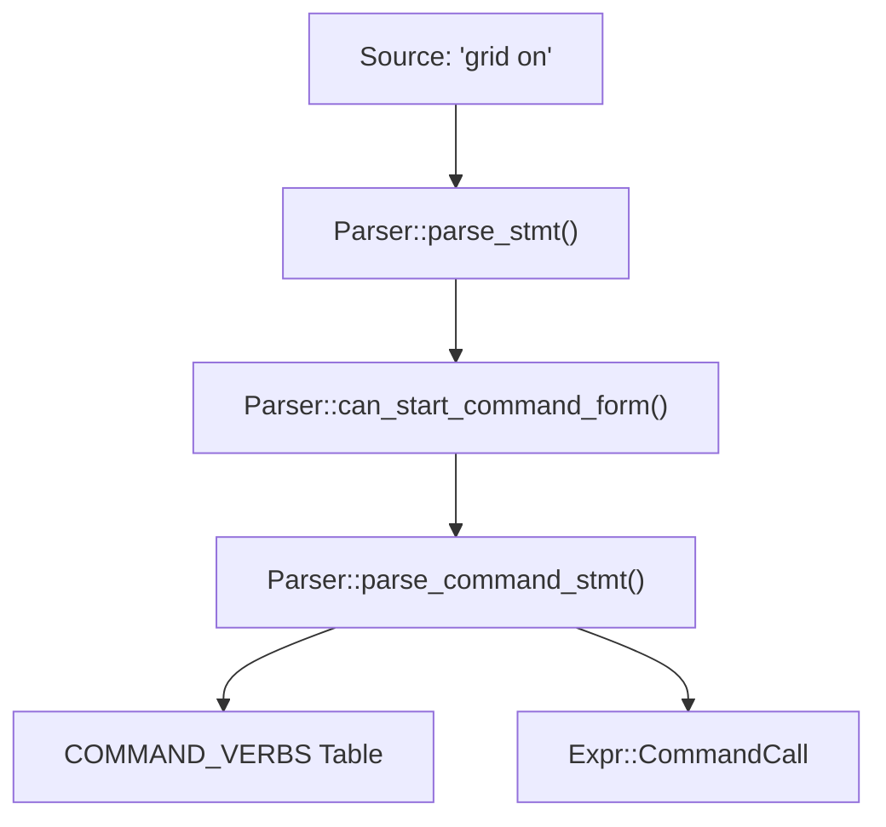

# Lexer & Parser

<details>
<summary>Relevant source files</summary>

- [crates/runmat-core/tests/command_controls.rs](https://github.com/runmat-org/runmat/blob/82685330/crates/runmat-core/tests/command_controls.rs)
- [crates/runmat-hir/tests/hir_lowering.rs](https://github.com/runmat-org/runmat/blob/82685330/crates/runmat-hir/tests/hir_lowering.rs)
- [crates/runmat-parser/src/ast.rs](https://github.com/runmat-org/runmat/blob/82685330/crates/runmat-parser/src/ast.rs)
- [crates/runmat-parser/src/lib.rs](https://github.com/runmat-org/runmat/blob/82685330/crates/runmat-parser/src/lib.rs)
- [crates/runmat-parser/src/options.rs](https://github.com/runmat-org/runmat/blob/82685330/crates/runmat-parser/src/options.rs)
- [crates/runmat-parser/src/parser/command.rs](https://github.com/runmat-org/runmat/blob/82685330/crates/runmat-parser/src/parser/command.rs)
- [crates/runmat-parser/src/parser/expr.rs](https://github.com/runmat-org/runmat/blob/82685330/crates/runmat-parser/src/parser/expr.rs)
- [crates/runmat-parser/src/parser/stmt.rs](https://github.com/runmat-org/runmat/blob/82685330/crates/runmat-parser/src/parser/stmt.rs)
- [crates/runmat-parser/tests/command_syntax.rs](https://github.com/runmat-org/runmat/blob/82685330/crates/runmat-parser/tests/command_syntax.rs)
- [crates/runmat-parser/tests/parser.rs](https://github.com/runmat-org/runmat/blob/82685330/crates/runmat-parser/tests/parser.rs)
- [crates/runmat-parser/tests/semicolon_parsing.rs](https://github.com/runmat-org/runmat/blob/82685330/crates/runmat-parser/tests/semicolon_parsing.rs)
- [crates/runmat-plot/src/web.rs](https://github.com/runmat-org/runmat/blob/82685330/crates/runmat-plot/src/web.rs)
- [crates/runmat-runtime/src/builtins/builtins-json/print.json](https://github.com/runmat-org/runmat/blob/82685330/crates/runmat-runtime/src/builtins/builtins-json/print.json)
- [crates/runmat-runtime/src/builtins/plotting/ops/cmds.rs](https://github.com/runmat-org/runmat/blob/82685330/crates/runmat-runtime/src/builtins/plotting/ops/cmds.rs)

</details>

The RunMat compilation pipeline begins with the transformation of raw MATLAB source text into a structured Abstract Syntax Tree (AST). This process is handled by two primary components: `runmat-lexer`, which tokenizes the input using the `logos` library, and `runmat-parser`, a hand-written recursive descent parser that handles the unique ambiguities of MATLAB syntax, including command-form calls and matrix literals.

## Tokenization (runmat-lexer)

The lexer converts source text into a stream of `Token` variants. It is built on the `logos` crate for high-performance regular expression matching.

### Key Token Categories

- Keywords: Standard MATLAB control flow tokens such as `if`, `for`, `while`, `function`, `classdef`, and `try` [crates/runmat-parser/src/parser/stmt.rs #15-22](https://github.com/runmat-org/runmat/blob/82685330/crates/runmat-parser/src/parser/stmt.rs#L15-L22)
- Operators: Arithmetic (`+`, `-`, `*`, `./`), logical (`&&`, `||`), and comparison (`==`, `>=`, `~=`) [crates/runmat-parser/src/parser/expr.rs #67-74](https://github.com/runmat-org/runmat/blob/82685330/crates/runmat-parser/src/parser/expr.rs#L67-L74)
- Structural: Brackets `[]`, braces `{}`, and parentheses `()` used for arrays, cell arrays, and indexing/calls [crates/runmat-parser/src/parser/stmt.rs #43-54](https://github.com/runmat-org/runmat/blob/82685330/crates/runmat-parser/src/parser/stmt.rs#L43-L54)
- MATLAB Specifics: The `transpose` operator (`'`), the `colon` operator (`:`), and the `ellipsis` (`...`) for line continuation [crates/runmat-parser/src/parser/command.rs #210-212](https://github.com/runmat-org/runmat/blob/82685330/crates/runmat-parser/src/parser/command.rs#L210-L212)

### Data Flow: Lexer to Parser

The parser consumes `TokenInfo` structures, which wrap a `Token` with its `Span` (byte offsets) and the original `lexeme` string [crates/runmat-parser/src/parser/mod.rs #5](https://github.com/runmat-org/runmat/blob/82685330/crates/runmat-parser/src/parser/mod.rs#L5-L5)

## Parser Implementation (runmat-parser)

The `Parser` struct maintains the state of the current token stream, the current position, and the configuration `CompatMode` [crates/runmat-parser/src/parser/mod.rs #5](https://github.com/runmat-org/runmat/blob/82685330/crates/runmat-parser/src/parser/mod.rs#L5-L5) It implements a recursive descent strategy to build the `Program` AST [crates/runmat-parser/src/lib.rs #7-11](https://github.com/runmat-org/runmat/blob/82685330/crates/runmat-parser/src/lib.rs#L7-L11)

### Statement Parsing & Semicolons

MATLAB uses newlines or semicolons to terminate statements. The parser distinguishes between these to determine if the result of an expression should be printed to the console (suppressed vs. unsuppressed) [crates/runmat-parser/src/parser/stmt.rs #8-12](https://github.com/runmat-org/runmat/blob/82685330/crates/runmat-parser/src/parser/stmt.rs#L8-L12)

| Terminator | Stmt Metadata | Result |
| --- | --- | --- |
| ; | suppressed: true | Value is computed but not displayed. |
| , or \n | suppressed: false | Value is displayed in the command window. |

Sources: [crates/runmat-parser/src/parser/stmt.rs #8-12](https://github.com/runmat-org/runmat/blob/82685330/crates/runmat-parser/src/parser/stmt.rs#L8-L12) [crates/runmat-parser/tests/semicolon_parsing.rs #77-94](https://github.com/runmat-org/runmat/blob/82685330/crates/runmat-parser/tests/semicolon_parsing.rs#L77-L94)

### Command-Form Syntax

One of the most complex aspects of the MATLAB grammar is the "command-form" call (e.g., `hold on` vs `hold('on')`). The parser uses a lookahead mechanism `can_start_command_form` to decide if an identifier should be treated as a function call with stringified arguments [crates/runmat-parser/src/parser/command.rs #157-162](https://github.com/runmat-org/runmat/blob/82685330/crates/runmat-parser/src/parser/command.rs#L157-L162)

#### Command Verb Resolution

The parser maintains a list of `COMMAND_VERBS` that dictate how arguments are stringified [crates/runmat-parser/src/parser/command.rs #23-134](https://github.com/runmat-org/runmat/blob/82685330/crates/runmat-parser/src/parser/command.rs#L23-L134)

Parser to AST Entity Mapping



<details>
<summary>Rendered SVG</summary>

```svg
<svg id="mermaid-fqu8i2cljkc" xmlns="http://www.w3.org/2000/svg" xmlns:xlink="http://www.w3.org/1999/xlink" class="flowchart" style="max-width: 100%; touch-action: none; user-select: none; cursor: grab; min-height: fit-content; max-height: 100%;" viewBox="0 0 630.5546875 634" role="graphics-document document" aria-roledescription="flowchart-v2" preserveAspectRatio="xMidYMid meet"><style>#mermaid-fqu8i2cljkc{font-family:ui-sans-serif,-apple-system,system-ui,Segoe UI,Helvetica;font-size:16px;fill:#ccc;}@keyframes edge-animation-frame{from{stroke-dashoffset:0;}}@keyframes dash{to{stroke-dashoffset:0;}}#mermaid-fqu8i2cljkc .edge-animation-slow{stroke-dasharray:9,5!important;stroke-dashoffset:900;animation:dash 50s linear infinite;stroke-linecap:round;}#mermaid-fqu8i2cljkc .edge-animation-fast{stroke-dasharray:9,5!important;stroke-dashoffset:900;animation:dash 20s linear infinite;stroke-linecap:round;}#mermaid-fqu8i2cljkc .error-icon{fill:#333;}#mermaid-fqu8i2cljkc .error-text{fill:#cccccc;stroke:#cccccc;}#mermaid-fqu8i2cljkc .edge-thickness-normal{stroke-width:1px;}#mermaid-fqu8i2cljkc .edge-thickness-thick{stroke-width:3.5px;}#mermaid-fqu8i2cljkc .edge-pattern-solid{stroke-dasharray:0;}#mermaid-fqu8i2cljkc .edge-thickness-invisible{stroke-width:0;fill:none;}#mermaid-fqu8i2cljkc .edge-pattern-dashed{stroke-dasharray:3;}#mermaid-fqu8i2cljkc .edge-pattern-dotted{stroke-dasharray:2;}#mermaid-fqu8i2cljkc .marker{fill:#666;stroke:#666;}#mermaid-fqu8i2cljkc .marker.cross{stroke:#666;}#mermaid-fqu8i2cljkc svg{font-family:ui-sans-serif,-apple-system,system-ui,Segoe UI,Helvetica;font-size:16px;}#mermaid-fqu8i2cljkc p{margin:0;}#mermaid-fqu8i2cljkc .label{font-family:ui-sans-serif,-apple-system,system-ui,Segoe UI,Helvetica;color:#fff;}#mermaid-fqu8i2cljkc .cluster-label text{fill:#fff;}#mermaid-fqu8i2cljkc .cluster-label span{color:#fff;}#mermaid-fqu8i2cljkc .cluster-label span p{background-color:transparent;}#mermaid-fqu8i2cljkc .label text,#mermaid-fqu8i2cljkc span{fill:#fff;color:#fff;}#mermaid-fqu8i2cljkc .node rect,#mermaid-fqu8i2cljkc .node circle,#mermaid-fqu8i2cljkc .node ellipse,#mermaid-fqu8i2cljkc .node polygon,#mermaid-fqu8i2cljkc .node path{fill:#111;stroke:#222;stroke-width:1px;}#mermaid-fqu8i2cljkc .rough-node .label text,#mermaid-fqu8i2cljkc .node .label text,#mermaid-fqu8i2cljkc .image-shape .label,#mermaid-fqu8i2cljkc .icon-shape .label{text-anchor:middle;}#mermaid-fqu8i2cljkc .node .katex path{fill:#000;stroke:#000;stroke-width:1px;}#mermaid-fqu8i2cljkc .rough-node .label,#mermaid-fqu8i2cljkc .node .label,#mermaid-fqu8i2cljkc .image-shape .label,#mermaid-fqu8i2cljkc .icon-shape .label{text-align:center;}#mermaid-fqu8i2cljkc .node.clickable{cursor:pointer;}#mermaid-fqu8i2cljkc .root .anchor path{fill:#666!important;stroke-width:0;stroke:#666;}#mermaid-fqu8i2cljkc .arrowheadPath{fill:#0b0b0b;}#mermaid-fqu8i2cljkc .edgePath .path{stroke:#666;stroke-width:1px;}#mermaid-fqu8i2cljkc .flowchart-link{stroke:#666;fill:none;}#mermaid-fqu8i2cljkc .edgeLabel{background-color:#161616;text-align:center;}#mermaid-fqu8i2cljkc .edgeLabel p{background-color:#161616;}#mermaid-fqu8i2cljkc .edgeLabel rect{opacity:0.5;background-color:#161616;fill:#161616;}#mermaid-fqu8i2cljkc .labelBkg{background-color:rgba(22, 22, 22, 0.5);}#mermaid-fqu8i2cljkc .cluster rect{fill:#161616;stroke:#222;stroke-width:1px;}#mermaid-fqu8i2cljkc .cluster text{fill:#fff;}#mermaid-fqu8i2cljkc .cluster span{color:#fff;}#mermaid-fqu8i2cljkc div.mermaidTooltip{position:absolute;text-align:center;max-width:200px;padding:2px;font-family:ui-sans-serif,-apple-system,system-ui,Segoe UI,Helvetica;font-size:12px;background:#333;border:1px solid hsl(0, 0%, 10%);border-radius:2px;pointer-events:none;z-index:100;}#mermaid-fqu8i2cljkc .flowchartTitleText{text-anchor:middle;font-size:18px;fill:#ccc;}#mermaid-fqu8i2cljkc rect.text{fill:none;stroke-width:0;}#mermaid-fqu8i2cljkc .icon-shape,#mermaid-fqu8i2cljkc .image-shape{background-color:#161616;text-align:center;}#mermaid-fqu8i2cljkc .icon-shape p,#mermaid-fqu8i2cljkc .image-shape p{background-color:#161616;padding:2px;}#mermaid-fqu8i2cljkc .icon-shape .label rect,#mermaid-fqu8i2cljkc .image-shape .label rect{opacity:0.5;background-color:#161616;fill:#161616;}#mermaid-fqu8i2cljkc .label-icon{display:inline-block;height:1em;overflow:visible;vertical-align:-0.125em;}#mermaid-fqu8i2cljkc .node .label-icon path{fill:currentColor;stroke:revert;stroke-width:revert;}#mermaid-fqu8i2cljkc .node .neo-node{stroke:#222;}#mermaid-fqu8i2cljkc [data-look="neo"].node rect,#mermaid-fqu8i2cljkc [data-look="neo"].cluster rect,#mermaid-fqu8i2cljkc [data-look="neo"].node polygon{stroke:url(#mermaid-fqu8i2cljkc-gradient);filter:drop-shadow( 1px 2px 2px rgba(185,185,185,1));}#mermaid-fqu8i2cljkc [data-look="neo"].node path{stroke:url(#mermaid-fqu8i2cljkc-gradient);stroke-width:1px;}#mermaid-fqu8i2cljkc [data-look="neo"].node .outer-path{filter:drop-shadow( 1px 2px 2px rgba(185,185,185,1));}#mermaid-fqu8i2cljkc [data-look="neo"].node .neo-line path{stroke:#222;filter:none;}#mermaid-fqu8i2cljkc [data-look="neo"].node circle{stroke:url(#mermaid-fqu8i2cljkc-gradient);filter:drop-shadow( 1px 2px 2px rgba(185,185,185,1));}#mermaid-fqu8i2cljkc [data-look="neo"].node circle .state-start{fill:#000000;}#mermaid-fqu8i2cljkc [data-look="neo"].icon-shape .icon{fill:url(#mermaid-fqu8i2cljkc-gradient);filter:drop-shadow( 1px 2px 2px rgba(185,185,185,1));}#mermaid-fqu8i2cljkc [data-look="neo"].icon-shape .icon-neo path{stroke:url(#mermaid-fqu8i2cljkc-gradient);filter:drop-shadow( 1px 2px 2px rgba(185,185,185,1));}#mermaid-fqu8i2cljkc :root{--mermaid-font-family:"trebuchet ms",verdana,arial,sans-serif;}</style><g><marker id="mermaid-fqu8i2cljkc_flowchart-v2-pointEnd" class="marker flowchart-v2" viewBox="0 0 10 10" refX="5" refY="5" markerUnits="userSpaceOnUse" markerWidth="8" markerHeight="8" orient="auto"><path d="M 0 0 L 10 5 L 0 10 z" class="arrowMarkerPath" style="stroke-width: 1; stroke-dasharray: 1, 0;"></path></marker><marker id="mermaid-fqu8i2cljkc_flowchart-v2-pointStart" class="marker flowchart-v2" viewBox="0 0 10 10" refX="4.5" refY="5" markerUnits="userSpaceOnUse" markerWidth="8" markerHeight="8" orient="auto"><path d="M 0 5 L 10 10 L 10 0 z" class="arrowMarkerPath" style="stroke-width: 1; stroke-dasharray: 1, 0;"></path></marker><marker id="mermaid-fqu8i2cljkc_flowchart-v2-pointEnd-margin" class="marker flowchart-v2" viewBox="0 0 11.5 14" refX="11.5" refY="7" markerUnits="userSpaceOnUse" markerWidth="10.5" markerHeight="14" orient="auto"><path d="M 0 0 L 11.5 7 L 0 14 z" class="arrowMarkerPath" style="stroke-width: 0; stroke-dasharray: 1, 0;"></path></marker><marker id="mermaid-fqu8i2cljkc_flowchart-v2-pointStart-margin" class="marker flowchart-v2" viewBox="0 0 11.5 14" refX="1" refY="7" markerUnits="userSpaceOnUse" markerWidth="11.5" markerHeight="14" orient="auto"><polygon points="0,7 11.5,14 11.5,0" class="arrowMarkerPath" style="stroke-width: 0; stroke-dasharray: 1, 0;"></polygon></marker><marker id="mermaid-fqu8i2cljkc_flowchart-v2-circleEnd" class="marker flowchart-v2" viewBox="0 0 10 10" refX="11" refY="5" markerUnits="userSpaceOnUse" markerWidth="11" markerHeight="11" orient="auto"><circle cx="5" cy="5" r="5" class="arrowMarkerPath" style="stroke-width: 1; stroke-dasharray: 1, 0;"></circle></marker><marker id="mermaid-fqu8i2cljkc_flowchart-v2-circleStart" class="marker flowchart-v2" viewBox="0 0 10 10" refX="-1" refY="5" markerUnits="userSpaceOnUse" markerWidth="11" markerHeight="11" orient="auto"><circle cx="5" cy="5" r="5" class="arrowMarkerPath" style="stroke-width: 1; stroke-dasharray: 1, 0;"></circle></marker><marker id="mermaid-fqu8i2cljkc_flowchart-v2-circleEnd-margin" class="marker flowchart-v2" viewBox="0 0 10 10" refY="5" refX="12.25" markerUnits="userSpaceOnUse" markerWidth="14" markerHeight="14" orient="auto"><circle cx="5" cy="5" r="5" class="arrowMarkerPath" style="stroke-width: 0; stroke-dasharray: 1, 0;"></circle></marker><marker id="mermaid-fqu8i2cljkc_flowchart-v2-circleStart-margin" class="marker flowchart-v2" viewBox="0 0 10 10" refX="-2" refY="5" markerUnits="userSpaceOnUse" markerWidth="14" markerHeight="14" orient="auto"><circle cx="5" cy="5" r="5" class="arrowMarkerPath" style="stroke-width: 0; stroke-dasharray: 1, 0;"></circle></marker><marker id="mermaid-fqu8i2cljkc_flowchart-v2-crossEnd" class="marker cross flowchart-v2" viewBox="0 0 11 11" refX="12" refY="5.2" markerUnits="userSpaceOnUse" markerWidth="11" markerHeight="11" orient="auto"><path d="M 1,1 l 9,9 M 10,1 l -9,9" class="arrowMarkerPath" style="stroke-width: 2; stroke-dasharray: 1, 0;"></path></marker><marker id="mermaid-fqu8i2cljkc_flowchart-v2-crossStart" class="marker cross flowchart-v2" viewBox="0 0 11 11" refX="-1" refY="5.2" markerUnits="userSpaceOnUse" markerWidth="11" markerHeight="11" orient="auto"><path d="M 1,1 l 9,9 M 10,1 l -9,9" class="arrowMarkerPath" style="stroke-width: 2; stroke-dasharray: 1, 0;"></path></marker><marker id="mermaid-fqu8i2cljkc_flowchart-v2-crossEnd-margin" class="marker cross flowchart-v2" viewBox="0 0 15 15" refX="17.7" refY="7.5" markerUnits="userSpaceOnUse" markerWidth="12" markerHeight="12" orient="auto"><path d="M 1,1 L 14,14 M 1,14 L 14,1" class="arrowMarkerPath" style="stroke-width: 2.5;"></path></marker><marker id="mermaid-fqu8i2cljkc_flowchart-v2-crossStart-margin" class="marker cross flowchart-v2" viewBox="0 0 15 15" refX="-3.5" refY="7.5" markerUnits="userSpaceOnUse" markerWidth="12" markerHeight="12" orient="auto"><path d="M 1,1 L 14,14 M 1,14 L 14,1" class="arrowMarkerPath" style="stroke-width: 2.5; stroke-dasharray: 1, 0;"></path></marker><g class="root"><g class="clusters"><g class="cluster" id="mermaid-fqu8i2cljkc-subGraph1" data-look="classic"><rect style="" x="8" y="162" width="614.5546875" height="464"></rect><g class="cluster-label" transform="translate(248.48828125, 162)"><foreignObject width="133.578125" height="24"><div style="display: table-cell; white-space: nowrap; line-height: 1.5;" xmlns="http://www.w3.org/1999/xhtml"><span class="nodeLabel"><p>Code Entity Space</p></span></div></foreignObject></g></g><g class="cluster" id="mermaid-fqu8i2cljkc-subGraph0" data-look="classic"><rect style="" x="195.71875" y="8" width="249.296875" height="104"></rect><g class="cluster-label" transform="translate(231.421875, 8)"><foreignObject width="177.890625" height="24"><div style="display: table-cell; white-space: nowrap; line-height: 1.5;" xmlns="http://www.w3.org/1999/xhtml"><span class="nodeLabel"><p>Natural Language Space</p></span></div></foreignObject></g></g></g><g class="edgePaths"><path d="M320.367,87L320.367,91.167C320.367,95.333,320.367,103.667,320.367,112C320.367,120.333,320.367,128.667,320.367,137C320.367,145.333,320.367,153.667,320.367,161.333C320.367,169,320.367,176,320.367,179.5L320.367,183" id="mermaid-fqu8i2cljkc-L_Input_P_0" class="edge-thickness-normal edge-pattern-solid edge-thickness-normal edge-pattern-solid flowchart-link" style=";" data-edge="true" data-et="edge" data-id="L_Input_P_0" data-points="W3sieCI6MzIwLjM2NzE4NzUsInkiOjg3fSx7IngiOjMyMC4zNjcxODc1LCJ5IjoxMTJ9LHsieCI6MzIwLjM2NzE4NzUsInkiOjEzN30seyJ4IjozMjAuMzY3MTg3NSwieSI6MTYyfSx7IngiOjMyMC4zNjcxODc1LCJ5IjoxODd9XQ==" data-look="classic" marker-end="url(#mermaid-fqu8i2cljkc_flowchart-v2-pointEnd)"></path><path d="M320.367,241L320.367,245.167C320.367,249.333,320.367,257.667,320.367,265.333C320.367,273,320.367,280,320.367,283.5L320.367,287" id="mermaid-fqu8i2cljkc-L_P_C_0" class="edge-thickness-normal edge-pattern-solid edge-thickness-normal edge-pattern-solid flowchart-link" style=";" data-edge="true" data-et="edge" data-id="L_P_C_0" data-points="W3sieCI6MzIwLjM2NzE4NzUsInkiOjI0MX0seyJ4IjozMjAuMzY3MTg3NSwieSI6MjY2fSx7IngiOjMyMC4zNjcxODc1LCJ5IjoyOTF9XQ==" data-look="classic" marker-end="url(#mermaid-fqu8i2cljkc_flowchart-v2-pointEnd)"></path><path d="M320.367,345L320.367,351.167C320.367,357.333,320.367,369.667,320.367,381.333C320.367,393,320.367,404,320.367,409.5L320.367,415" id="mermaid-fqu8i2cljkc-L_C_CS_0" class="edge-thickness-normal edge-pattern-solid edge-thickness-normal edge-pattern-solid flowchart-link" style=";" data-edge="true" data-et="edge" data-id="L_C_CS_0" data-points="W3sieCI6MzIwLjM2NzE4NzUsInkiOjM0NX0seyJ4IjozMjAuMzY3MTg3NSwieSI6MzgyfSx7IngiOjMyMC4zNjcxODc1LCJ5Ijo0MTl9XQ==" data-look="classic" marker-end="url(#mermaid-fqu8i2cljkc_flowchart-v2-pointEnd)"></path><path d="M262.686,473L249.511,479.167C236.337,485.333,209.989,497.667,196.815,509.333C183.641,521,183.641,532,183.641,537.5L183.641,543" id="mermaid-fqu8i2cljkc-L_CS_CV_0" class="edge-thickness-normal edge-pattern-solid edge-thickness-normal edge-pattern-solid flowchart-link" style=";" data-edge="true" data-et="edge" data-id="L_CS_CV_0" data-points="W3sieCI6MjYyLjY4NTY2ODk0NTMxMjUsInkiOjQ3M30seyJ4IjoxODMuNjQwNjI1LCJ5Ijo1MTB9LHsieCI6MTgzLjY0MDYyNSwieSI6NTQ3fV0=" data-look="classic" marker-end="url(#mermaid-fqu8i2cljkc_flowchart-v2-pointEnd)"></path><path d="M378.049,473L391.223,479.167C404.397,485.333,430.745,497.667,443.92,509.333C457.094,521,457.094,532,457.094,537.5L457.094,543" id="mermaid-fqu8i2cljkc-L_CS_AST_0" class="edge-thickness-normal edge-pattern-solid edge-thickness-normal edge-pattern-solid flowchart-link" style=";" data-edge="true" data-et="edge" data-id="L_CS_AST_0" data-points="W3sieCI6Mzc4LjA0ODcwNjA1NDY4NzUsInkiOjQ3M30seyJ4Ijo0NTcuMDkzNzUsInkiOjUxMH0seyJ4Ijo0NTcuMDkzNzUsInkiOjU0N31d" data-look="classic" marker-end="url(#mermaid-fqu8i2cljkc_flowchart-v2-pointEnd)"></path></g><g class="edgeLabels"><g class="edgeLabel"><g class="label" data-id="L_Input_P_0" transform="translate(0, 0)"><foreignObject width="0" height="0"><div style="display: table-cell; white-space: nowrap; line-height: 1.5; max-width: 200px; text-align: center;" xmlns="http://www.w3.org/1999/xhtml" class="labelBkg"><span class="edgeLabel"></span></div></foreignObject></g></g><g class="edgeLabel"><g class="label" data-id="L_P_C_0" transform="translate(0, 0)"><foreignObject width="0" height="0"><div style="display: table-cell; white-space: nowrap; line-height: 1.5; max-width: 200px; text-align: center;" xmlns="http://www.w3.org/1999/xhtml" class="labelBkg"><span class="edgeLabel"></span></div></foreignObject></g></g><g class="edgeLabel" transform="translate(320.3671875, 382)"><g class="label" data-id="L_C_CS_0" transform="translate(-51.8203125, -12)"><foreignObject width="103.640625" height="24"><div style="display: table-cell; white-space: nowrap; line-height: 1.5; max-width: 200px; text-align: center;" xmlns="http://www.w3.org/1999/xhtml" class="labelBkg"><span class="edgeLabel"><p>Matches 'grid'</p></span></div></foreignObject></g></g><g class="edgeLabel"><g class="label" data-id="L_CS_CV_0" transform="translate(0, 0)"><foreignObject width="0" height="0"><div style="display: table-cell; white-space: nowrap; line-height: 1.5; max-width: 200px; text-align: center;" xmlns="http://www.w3.org/1999/xhtml" class="labelBkg"><span class="edgeLabel"></span></div></foreignObject></g></g><g class="edgeLabel" transform="translate(457.09375, 510)"><g class="label" data-id="L_CS_AST_0" transform="translate(-34.3046875, -12)"><foreignObject width="68.609375" height="24"><div style="display: table-cell; white-space: nowrap; line-height: 1.5; max-width: 200px; text-align: center;" xmlns="http://www.w3.org/1999/xhtml" class="labelBkg"><span class="edgeLabel"><p>Produces</p></span></div></foreignObject></g></g></g><g class="nodes"><g class="node default" id="mermaid-fqu8i2cljkc-flowchart-Input-0" data-look="classic" transform="translate(320.3671875, 60)"><rect class="basic label-container" style="" x="-89.6484375" y="-27" width="179.296875" height="54"></rect><g class="label" style="" transform="translate(-59.6484375, -12)"><rect></rect><foreignObject width="119.296875" height="24"><div style="display: table-cell; white-space: nowrap; line-height: 1.5; max-width: 200px; text-align: center;" xmlns="http://www.w3.org/1999/xhtml"><span class="nodeLabel"><p>Source: 'grid on'</p></span></div></foreignObject></g></g><g class="node default" id="mermaid-fqu8i2cljkc-flowchart-P-1" data-look="classic" transform="translate(320.3671875, 214)"><rect class="basic label-container" style="" x="-104.2265625" y="-27" width="208.453125" height="54"></rect><g class="label" style="" transform="translate(-74.2265625, -12)"><rect></rect><foreignObject width="148.453125" height="24"><div style="display: table-cell; white-space: nowrap; line-height: 1.5; max-width: 200px; text-align: center;" xmlns="http://www.w3.org/1999/xhtml"><span class="nodeLabel"><p>Parser::parse_stmt()</p></span></div></foreignObject></g></g><g class="node default" id="mermaid-fqu8i2cljkc-flowchart-C-2" data-look="classic" transform="translate(320.3671875, 318)"><rect class="basic label-container" style="" x="-159.375" y="-27" width="318.75" height="54"></rect><g class="label" style="" transform="translate(-129.375, -12)"><rect></rect><foreignObject width="258.75" height="24"><div style="display: table; white-space: break-spaces; line-height: 1.5; max-width: 200px; text-align: center; width: 200px;" xmlns="http://www.w3.org/1999/xhtml"><span class="nodeLabel"><p>Parser::can_start_command_form()</p></span></div></foreignObject></g></g><g class="node default" id="mermaid-fqu8i2cljkc-flowchart-CS-3" data-look="classic" transform="translate(320.3671875, 446)"><rect class="basic label-container" style="" x="-144.53125" y="-27" width="289.0625" height="54"></rect><g class="label" style="" transform="translate(-114.53125, -12)"><rect></rect><foreignObject width="229.0625" height="24"><div style="display: table; white-space: break-spaces; line-height: 1.5; max-width: 200px; text-align: center; width: 200px;" xmlns="http://www.w3.org/1999/xhtml"><span class="nodeLabel"><p>Parser::parse_command_stmt()</p></span></div></foreignObject></g></g><g class="node default" id="mermaid-fqu8i2cljkc-flowchart-CV-4" data-look="classic" transform="translate(183.640625, 574)"><rect class="basic label-container" style="" x="-121.90625" y="-27" width="243.8125" height="54"></rect><g class="label" style="" transform="translate(-91.90625, -12)"><rect></rect><foreignObject width="183.8125" height="24"><div style="display: table-cell; white-space: nowrap; line-height: 1.5; max-width: 200px; text-align: center;" xmlns="http://www.w3.org/1999/xhtml"><span class="nodeLabel"><p>COMMAND_VERBS Table</p></span></div></foreignObject></g></g><g class="node default" id="mermaid-fqu8i2cljkc-flowchart-AST-5" data-look="classic" transform="translate(457.09375, 574)"><rect class="basic label-container" style="" x="-101.546875" y="-27" width="203.09375" height="54"></rect><g class="label" style="" transform="translate(-71.546875, -12)"><rect></rect><foreignObject width="143.09375" height="24"><div style="display: table-cell; white-space: nowrap; line-height: 1.5; max-width: 200px; text-align: center;" xmlns="http://www.w3.org/1999/xhtml"><span class="nodeLabel"><p>Expr::CommandCall</p></span></div></foreignObject></g></g></g></g></g><defs><filter id="mermaid-fqu8i2cljkc-drop-shadow" height="130%" width="130%"><feDropShadow dx="4" dy="4" stdDeviation="0" flood-opacity="0.06" flood-color="#000000"></feDropShadow></filter></defs><defs><filter id="mermaid-fqu8i2cljkc-drop-shadow-small" height="150%" width="150%"><feDropShadow dx="2" dy="2" stdDeviation="0" flood-opacity="0.06" flood-color="#000000"></feDropShadow></filter></defs><linearGradient id="mermaid-fqu8i2cljkc-gradient" gradientUnits="objectBoundingBox" x1="0%" y1="0%" x2="100%" y2="0%"><stop offset="0%" stop-color="#333" stop-opacity="1"></stop><stop offset="100%" stop-color="hsl(-120, 0%, 3.3333333333%)" stop-opacity="1"></stop></linearGradient></svg>
```

</details>

Sources: [crates/runmat-parser/src/parser/command.rs #137-155](https://github.com/runmat-org/runmat/blob/82685330/crates/runmat-parser/src/parser/command.rs#L137-L155) [crates/runmat-parser/src/parser/stmt.rs #81-83](https://github.com/runmat-org/runmat/blob/82685330/crates/runmat-parser/src/parser/stmt.rs#L81-L83)

### Expression Grammar

The expression parser follows standard operator precedence, starting from logical OR and descending to primary expressions (literals and identifiers) [crates/runmat-parser/src/parser/expr.rs #8-10](https://github.com/runmat-org/runmat/blob/82685330/crates/runmat-parser/src/parser/expr.rs#L8-L10)

Expression Precedence Hierarchy

1. Logical: `||` (OR), `&&` (AND) [crates/runmat-parser/src/parser/expr.rs #12-28](https://github.com/runmat-org/runmat/blob/82685330/crates/runmat-parser/src/parser/expr.rs#L12-L28)
2. Bitwise: `|`, `&` [crates/runmat-parser/src/parser/expr.rs #30-46](https://github.com/runmat-org/runmat/blob/82685330/crates/runmat-parser/src/parser/expr.rs#L30-L46)
3. Relational: `<`, `<=`, `>`, `>=`, `==`, `~=` [crates/runmat-parser/src/parser/expr.rs #64-79](https://github.com/runmat-org/runmat/blob/82685330/crates/runmat-parser/src/parser/expr.rs#L64-L79)
4. Additive: `+`, `-` [crates/runmat-parser/src/parser/expr.rs #83-134](https://github.com/runmat-org/runmat/blob/82685330/crates/runmat-parser/src/parser/expr.rs#L83-L134)
5. Multiplicative: `*`, `/`, `\`, `.*`, `./`, `.\` [crates/runmat-parser/src/parser/expr.rs #136-166](https://github.com/runmat-org/runmat/blob/82685330/crates/runmat-parser/src/parser/expr.rs#L136-L166)
6. Power: `^`, `.^` [crates/runmat-parser/src/parser/expr.rs #168-182](https://github.com/runmat-org/runmat/blob/82685330/crates/runmat-parser/src/parser/expr.rs#L168-L182)
7. Unary: `+`, `-`, `~` [crates/runmat-parser/src/parser/expr.rs #137](https://github.com/runmat-org/runmat/blob/82685330/crates/runmat-parser/src/parser/expr.rs#L137-L137)

### Matrix and Cell Array Parsing

The parser handles matrix literals `[]` and cell arrays `{}` by tracking "rows" of expressions. It uses a specialized `in_matrix_expr` flag to handle the whitespace-as-separator ambiguity (e.g., `[1 +2]` is `[3]` but `[1 + 2]` is `[1, 2]`) [crates/runmat-parser/src/parser/expr.rs #86-111](https://github.com/runmat-org/runmat/blob/82685330/crates/runmat-parser/src/parser/expr.rs#L86-L111)

## Abstract Syntax Tree (AST)

The resulting AST is defined in `crates/runmat-parser/src/ast.rs`. It consists of `Stmt` (Statements) and `Expr` (Expressions).

AST Structure Overview

Program+Vec<Stmt> body«enumeration»StmtExprStmt(Expr, bool, Span)Assign(String, Expr, bool, Span)If(Expr, Body, ElseIfs, ElseBody)Function(Name, Params, Outputs, Body)ClassDef(Name, Members)«enumeration»ExprBinary(Box<Expr>, BinOp, Box<Expr>)FuncCall(String, Vec<Expr>)CommandCall(String, Vec<Expr>)Tensor(Vec<Vec<Expr>>)Ident(String)Number(String)

Sources: [crates/runmat-parser/src/ast.rs #1-12](https://github.com/runmat-org/runmat/blob/82685330/crates/runmat-parser/src/ast.rs#L1-L12) [crates/runmat-parser/src/lib.rs #7-11](https://github.com/runmat-org/runmat/blob/82685330/crates/runmat-parser/src/lib.rs#L7-L11)

## Compatibility Modes

The parser behavior changes based on the `CompatMode` provided in `ParserOptions` [crates/runmat-parser/src/options.rs #9](https://github.com/runmat-org/runmat/blob/82685330/crates/runmat-parser/src/options.rs#L9-L9)

- Matlab: Standard behavior, allows command-form syntax and permissive parsing [crates/runmat-parser/src/parser/command.rs #138-142](https://github.com/runmat-org/runmat/blob/82685330/crates/runmat-parser/src/parser/command.rs#L138-L142)
- Strict: Disables command-form syntax; functions must be called with parentheses [crates/runmat-parser/src/parser/command.rs #138-142](https://github.com/runmat-org/runmat/blob/82685330/crates/runmat-parser/src/parser/command.rs#L138-L142)
- RunMat: Enables extended features like `async` and `isolated` function modifiers [crates/runmat-parser/src/parser/stmt.rs #40-42](https://github.com/runmat-org/runmat/blob/82685330/crates/runmat-parser/src/parser/stmt.rs#L40-L42)

Sources: [crates/runmat-parser/src/parser/command.rs #138-142](https://github.com/runmat-org/runmat/blob/82685330/crates/runmat-parser/src/parser/command.rs#L138-L142) [crates/runmat-parser/src/parser/stmt.rs #40-42](https://github.com/runmat-org/runmat/blob/82685330/crates/runmat-parser/src/parser/stmt.rs#L40-L42) [crates/runmat-hir/tests/hir_lowering.rs #70-76](https://github.com/runmat-org/runmat/blob/82685330/crates/runmat-hir/tests/hir_lowering.rs#L70-L76)
