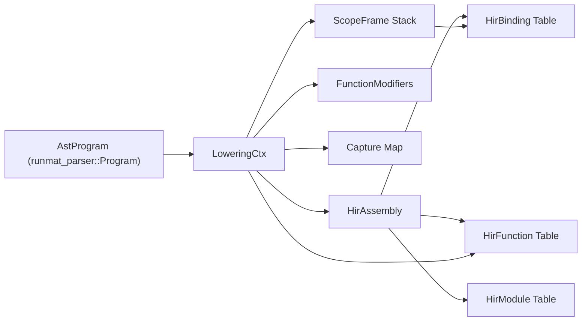
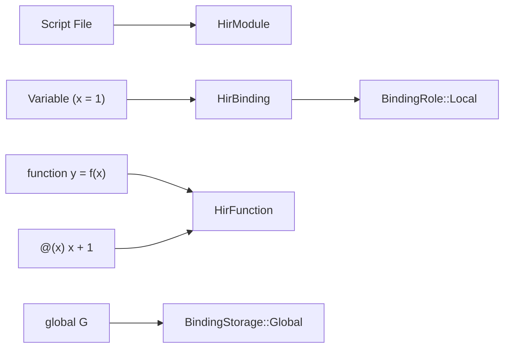

# High-Level IR (HIR)

<details>
<summary>Relevant source files</summary>

- [crates/runmat-hir/src/hir.rs](https://github.com/runmat-org/runmat/blob/82685330/crates/runmat-hir/src/hir.rs)
- [crates/runmat-hir/src/lib.rs](https://github.com/runmat-org/runmat/blob/82685330/crates/runmat-hir/src/lib.rs)
- [crates/runmat-hir/src/lowering/ctx.rs](https://github.com/runmat-org/runmat/blob/82685330/crates/runmat-hir/src/lowering/ctx.rs)
- [crates/runmat-hir/tests/attributes.rs](https://github.com/runmat-org/runmat/blob/82685330/crates/runmat-hir/tests/attributes.rs)
- [crates/runmat-hir/tests/binder_disambiguation.rs](https://github.com/runmat-org/runmat/blob/82685330/crates/runmat-hir/tests/binder_disambiguation.rs)
- [crates/runmat-hir/tests/coverage.rs](https://github.com/runmat-org/runmat/blob/82685330/crates/runmat-hir/tests/coverage.rs)
- [crates/runmat-hir/tests/fuzz_lowering.rs](https://github.com/runmat-org/runmat/blob/82685330/crates/runmat-hir/tests/fuzz_lowering.rs)
- [crates/runmat-hir/tests/hir.rs](https://github.com/runmat-org/runmat/blob/82685330/crates/runmat-hir/tests/hir.rs)
- [crates/runmat-hir/tests/lowering_extras.rs](https://github.com/runmat-org/runmat/blob/82685330/crates/runmat-hir/tests/lowering_extras.rs)
- [crates/runmat-runtime/src/builtins/acceleration/gpu/arrayfun.rs](https://github.com/runmat-org/runmat/blob/82685330/crates/runmat-runtime/src/builtins/acceleration/gpu/arrayfun.rs)
- [crates/runmat-runtime/src/builtins/cells/core/cellfun.rs](https://github.com/runmat-org/runmat/blob/82685330/crates/runmat-runtime/src/builtins/cells/core/cellfun.rs)
- [crates/runmat-runtime/src/lib.rs](https://github.com/runmat-org/runmat/blob/82685330/crates/runmat-runtime/src/lib.rs)
- [crates/runmat-runtime/src/user_functions.rs](https://github.com/runmat-org/runmat/blob/82685330/crates/runmat-runtime/src/user_functions.rs)
- [crates/runmat-vm/src/call/closures.rs](https://github.com/runmat-org/runmat/blob/82685330/crates/runmat-vm/src/call/closures.rs)
- [crates/runmat-vm/src/call/descriptor.rs](https://github.com/runmat-org/runmat/blob/82685330/crates/runmat-vm/src/call/descriptor.rs)

</details>

The High-Level IR (HIR) stage is the second phase of the RunMat compilation pipeline. It transforms the Abstract Syntax Tree (AST) produced by the parser into a semantically resolved representation. This stage is responsible for scope resolution, binding management, closure capture analysis, and flattening the nested MATLAB source structure into a canonical `HirAssembly`.

## Purpose and Scope

The primary goal of HIR lowering is to move from "Syntax Space" (where names are just strings) to "Entity Space" (where names are resolved to specific bindings, functions, or built-ins). Unlike the AST, the HIR is a structured collection of tables where entities reference each other via stable IDs (`BindingId`, `FunctionId`, etc.).

Key responsibilities include:

- Scope Resolution: Determining the owner and visibility of every identifier.
- Binding System: Distinguishing between local variables, parameters, globals, and persistents.
- Closure Capture: Identifying which variables from parent scopes are accessed by nested or anonymous functions.
- Lowering: Converting complex MATLAB constructs (like `global` declarations or multi-assignments) into simplified semantic nodes.

## The Lowering Context (`LoweringCtx`)

Lowering is driven by the `LoweringCtx` state machine. It maintains the current state of the assembly being built, the stack of lexical scopes, and the mapping of names to semantic entities.

### State Machine Structure

The `LoweringCtx` (defined in [crates/runmat-hir/src/lowering/ctx.rs #43-59](https://github.com/runmat-org/runmat/blob/82685330/crates/runmat-hir/src/lowering/ctx.rs#L43-L59)) tracks:

- `assembly`: The `HirAssembly` being populated [crates/runmat-hir/src/lowering/ctx.rs #44](https://github.com/runmat-org/runmat/blob/82685330/crates/runmat-hir/src/lowering/ctx.rs#L44-L44)
- `scopes`: A `Vec<ScopeFrame>` representing the lexical stack [crates/runmat-hir/src/lowering/ctx.rs #50](https://github.com/runmat-org/runmat/blob/82685330/crates/runmat-hir/src/lowering/ctx.rs#L50-L50)
- `captures`: A map tracking which `BindingId`s are captured by which `FunctionId` [crates/runmat-hir/src/lowering/ctx.rs #58](https://github.com/runmat-org/runmat/blob/82685330/crates/runmat-hir/src/lowering/ctx.rs#L58-L58)
- `next_*` counters: Monotonic counters for generating unique IDs within the assembly [crates/runmat-hir/src/lowering/ctx.rs #47-49](https://github.com/runmat-org/runmat/blob/82685330/crates/runmat-hir/src/lowering/ctx.rs#L47-L49)

### Scope Management

Each `ScopeFrame` tracks bindings for a specific function or script. It maps string names to `BindingId`s and manages `WorkspaceVisibility` [crates/runmat-hir/src/lowering/ctx.rs #37-41](https://github.com/runmat-org/runmat/blob/82685330/crates/runmat-hir/src/lowering/ctx.rs#L37-L41)

Lowering Data Flow The following diagram illustrates how the `LoweringCtx` bridges the gap between the Parser's AST and the final HIR Assembly.

Title: Lowering Context Data Flow



<details>
<summary>Rendered SVG</summary>

```svg
<svg id="mermaid-mce8wawz3n" xmlns="http://www.w3.org/2000/svg" xmlns:xlink="http://www.w3.org/1999/xlink" class="flowchart" style="max-width: 100%; touch-action: none; user-select: none; cursor: grab; min-height: fit-content; max-height: 100%;" viewBox="-0.003092041562695158 0 1646.6858715831254 628" role="graphics-document document" aria-roledescription="flowchart-v2" preserveAspectRatio="xMidYMid meet"><style>#mermaid-mce8wawz3n{font-family:ui-sans-serif,-apple-system,system-ui,Segoe UI,Helvetica;font-size:16px;fill:#ccc;}@keyframes edge-animation-frame{from{stroke-dashoffset:0;}}@keyframes dash{to{stroke-dashoffset:0;}}#mermaid-mce8wawz3n .edge-animation-slow{stroke-dasharray:9,5!important;stroke-dashoffset:900;animation:dash 50s linear infinite;stroke-linecap:round;}#mermaid-mce8wawz3n .edge-animation-fast{stroke-dasharray:9,5!important;stroke-dashoffset:900;animation:dash 20s linear infinite;stroke-linecap:round;}#mermaid-mce8wawz3n .error-icon{fill:#333;}#mermaid-mce8wawz3n .error-text{fill:#cccccc;stroke:#cccccc;}#mermaid-mce8wawz3n .edge-thickness-normal{stroke-width:1px;}#mermaid-mce8wawz3n .edge-thickness-thick{stroke-width:3.5px;}#mermaid-mce8wawz3n .edge-pattern-solid{stroke-dasharray:0;}#mermaid-mce8wawz3n .edge-thickness-invisible{stroke-width:0;fill:none;}#mermaid-mce8wawz3n .edge-pattern-dashed{stroke-dasharray:3;}#mermaid-mce8wawz3n .edge-pattern-dotted{stroke-dasharray:2;}#mermaid-mce8wawz3n .marker{fill:#666;stroke:#666;}#mermaid-mce8wawz3n .marker.cross{stroke:#666;}#mermaid-mce8wawz3n svg{font-family:ui-sans-serif,-apple-system,system-ui,Segoe UI,Helvetica;font-size:16px;}#mermaid-mce8wawz3n p{margin:0;}#mermaid-mce8wawz3n .label{font-family:ui-sans-serif,-apple-system,system-ui,Segoe UI,Helvetica;color:#fff;}#mermaid-mce8wawz3n .cluster-label text{fill:#fff;}#mermaid-mce8wawz3n .cluster-label span{color:#fff;}#mermaid-mce8wawz3n .cluster-label span p{background-color:transparent;}#mermaid-mce8wawz3n .label text,#mermaid-mce8wawz3n span{fill:#fff;color:#fff;}#mermaid-mce8wawz3n .node rect,#mermaid-mce8wawz3n .node circle,#mermaid-mce8wawz3n .node ellipse,#mermaid-mce8wawz3n .node polygon,#mermaid-mce8wawz3n .node path{fill:#111;stroke:#222;stroke-width:1px;}#mermaid-mce8wawz3n .rough-node .label text,#mermaid-mce8wawz3n .node .label text,#mermaid-mce8wawz3n .image-shape .label,#mermaid-mce8wawz3n .icon-shape .label{text-anchor:middle;}#mermaid-mce8wawz3n .node .katex path{fill:#000;stroke:#000;stroke-width:1px;}#mermaid-mce8wawz3n .rough-node .label,#mermaid-mce8wawz3n .node .label,#mermaid-mce8wawz3n .image-shape .label,#mermaid-mce8wawz3n .icon-shape .label{text-align:center;}#mermaid-mce8wawz3n .node.clickable{cursor:pointer;}#mermaid-mce8wawz3n .root .anchor path{fill:#666!important;stroke-width:0;stroke:#666;}#mermaid-mce8wawz3n .arrowheadPath{fill:#0b0b0b;}#mermaid-mce8wawz3n .edgePath .path{stroke:#666;stroke-width:1px;}#mermaid-mce8wawz3n .flowchart-link{stroke:#666;fill:none;}#mermaid-mce8wawz3n .edgeLabel{background-color:#161616;text-align:center;}#mermaid-mce8wawz3n .edgeLabel p{background-color:#161616;}#mermaid-mce8wawz3n .edgeLabel rect{opacity:0.5;background-color:#161616;fill:#161616;}#mermaid-mce8wawz3n .labelBkg{background-color:rgba(22, 22, 22, 0.5);}#mermaid-mce8wawz3n .cluster rect{fill:#161616;stroke:#222;stroke-width:1px;}#mermaid-mce8wawz3n .cluster text{fill:#fff;}#mermaid-mce8wawz3n .cluster span{color:#fff;}#mermaid-mce8wawz3n div.mermaidTooltip{position:absolute;text-align:center;max-width:200px;padding:2px;font-family:ui-sans-serif,-apple-system,system-ui,Segoe UI,Helvetica;font-size:12px;background:#333;border:1px solid hsl(0, 0%, 10%);border-radius:2px;pointer-events:none;z-index:100;}#mermaid-mce8wawz3n .flowchartTitleText{text-anchor:middle;font-size:18px;fill:#ccc;}#mermaid-mce8wawz3n rect.text{fill:none;stroke-width:0;}#mermaid-mce8wawz3n .icon-shape,#mermaid-mce8wawz3n .image-shape{background-color:#161616;text-align:center;}#mermaid-mce8wawz3n .icon-shape p,#mermaid-mce8wawz3n .image-shape p{background-color:#161616;padding:2px;}#mermaid-mce8wawz3n .icon-shape .label rect,#mermaid-mce8wawz3n .image-shape .label rect{opacity:0.5;background-color:#161616;fill:#161616;}#mermaid-mce8wawz3n .label-icon{display:inline-block;height:1em;overflow:visible;vertical-align:-0.125em;}#mermaid-mce8wawz3n .node .label-icon path{fill:currentColor;stroke:revert;stroke-width:revert;}#mermaid-mce8wawz3n .node .neo-node{stroke:#222;}#mermaid-mce8wawz3n [data-look="neo"].node rect,#mermaid-mce8wawz3n [data-look="neo"].cluster rect,#mermaid-mce8wawz3n [data-look="neo"].node polygon{stroke:url(#mermaid-mce8wawz3n-gradient);filter:drop-shadow( 1px 2px 2px rgba(185,185,185,1));}#mermaid-mce8wawz3n [data-look="neo"].node path{stroke:url(#mermaid-mce8wawz3n-gradient);stroke-width:1px;}#mermaid-mce8wawz3n [data-look="neo"].node .outer-path{filter:drop-shadow( 1px 2px 2px rgba(185,185,185,1));}#mermaid-mce8wawz3n [data-look="neo"].node .neo-line path{stroke:#222;filter:none;}#mermaid-mce8wawz3n [data-look="neo"].node circle{stroke:url(#mermaid-mce8wawz3n-gradient);filter:drop-shadow( 1px 2px 2px rgba(185,185,185,1));}#mermaid-mce8wawz3n [data-look="neo"].node circle .state-start{fill:#000000;}#mermaid-mce8wawz3n [data-look="neo"].icon-shape .icon{fill:url(#mermaid-mce8wawz3n-gradient);filter:drop-shadow( 1px 2px 2px rgba(185,185,185,1));}#mermaid-mce8wawz3n [data-look="neo"].icon-shape .icon-neo path{stroke:url(#mermaid-mce8wawz3n-gradient);filter:drop-shadow( 1px 2px 2px rgba(185,185,185,1));}#mermaid-mce8wawz3n :root{--mermaid-font-family:"trebuchet ms",verdana,arial,sans-serif;}</style><g><marker id="mermaid-mce8wawz3n_flowchart-v2-pointEnd" class="marker flowchart-v2" viewBox="0 0 10 10" refX="5" refY="5" markerUnits="userSpaceOnUse" markerWidth="8" markerHeight="8" orient="auto"><path d="M 0 0 L 10 5 L 0 10 z" class="arrowMarkerPath" style="stroke-width: 1; stroke-dasharray: 1, 0;"></path></marker><marker id="mermaid-mce8wawz3n_flowchart-v2-pointStart" class="marker flowchart-v2" viewBox="0 0 10 10" refX="4.5" refY="5" markerUnits="userSpaceOnUse" markerWidth="8" markerHeight="8" orient="auto"><path d="M 0 5 L 10 10 L 10 0 z" class="arrowMarkerPath" style="stroke-width: 1; stroke-dasharray: 1, 0;"></path></marker><marker id="mermaid-mce8wawz3n_flowchart-v2-pointEnd-margin" class="marker flowchart-v2" viewBox="0 0 11.5 14" refX="11.5" refY="7" markerUnits="userSpaceOnUse" markerWidth="10.5" markerHeight="14" orient="auto"><path d="M 0 0 L 11.5 7 L 0 14 z" class="arrowMarkerPath" style="stroke-width: 0; stroke-dasharray: 1, 0;"></path></marker><marker id="mermaid-mce8wawz3n_flowchart-v2-pointStart-margin" class="marker flowchart-v2" viewBox="0 0 11.5 14" refX="1" refY="7" markerUnits="userSpaceOnUse" markerWidth="11.5" markerHeight="14" orient="auto"><polygon points="0,7 11.5,14 11.5,0" class="arrowMarkerPath" style="stroke-width: 0; stroke-dasharray: 1, 0;"></polygon></marker><marker id="mermaid-mce8wawz3n_flowchart-v2-circleEnd" class="marker flowchart-v2" viewBox="0 0 10 10" refX="11" refY="5" markerUnits="userSpaceOnUse" markerWidth="11" markerHeight="11" orient="auto"><circle cx="5" cy="5" r="5" class="arrowMarkerPath" style="stroke-width: 1; stroke-dasharray: 1, 0;"></circle></marker><marker id="mermaid-mce8wawz3n_flowchart-v2-circleStart" class="marker flowchart-v2" viewBox="0 0 10 10" refX="-1" refY="5" markerUnits="userSpaceOnUse" markerWidth="11" markerHeight="11" orient="auto"><circle cx="5" cy="5" r="5" class="arrowMarkerPath" style="stroke-width: 1; stroke-dasharray: 1, 0;"></circle></marker><marker id="mermaid-mce8wawz3n_flowchart-v2-circleEnd-margin" class="marker flowchart-v2" viewBox="0 0 10 10" refY="5" refX="12.25" markerUnits="userSpaceOnUse" markerWidth="14" markerHeight="14" orient="auto"><circle cx="5" cy="5" r="5" class="arrowMarkerPath" style="stroke-width: 0; stroke-dasharray: 1, 0;"></circle></marker><marker id="mermaid-mce8wawz3n_flowchart-v2-circleStart-margin" class="marker flowchart-v2" viewBox="0 0 10 10" refX="-2" refY="5" markerUnits="userSpaceOnUse" markerWidth="14" markerHeight="14" orient="auto"><circle cx="5" cy="5" r="5" class="arrowMarkerPath" style="stroke-width: 0; stroke-dasharray: 1, 0;"></circle></marker><marker id="mermaid-mce8wawz3n_flowchart-v2-crossEnd" class="marker cross flowchart-v2" viewBox="0 0 11 11" refX="12" refY="5.2" markerUnits="userSpaceOnUse" markerWidth="11" markerHeight="11" orient="auto"><path d="M 1,1 l 9,9 M 10,1 l -9,9" class="arrowMarkerPath" style="stroke-width: 2; stroke-dasharray: 1, 0;"></path></marker><marker id="mermaid-mce8wawz3n_flowchart-v2-crossStart" class="marker cross flowchart-v2" viewBox="0 0 11 11" refX="-1" refY="5.2" markerUnits="userSpaceOnUse" markerWidth="11" markerHeight="11" orient="auto"><path d="M 1,1 l 9,9 M 10,1 l -9,9" class="arrowMarkerPath" style="stroke-width: 2; stroke-dasharray: 1, 0;"></path></marker><marker id="mermaid-mce8wawz3n_flowchart-v2-crossEnd-margin" class="marker cross flowchart-v2" viewBox="0 0 15 15" refX="17.7" refY="7.5" markerUnits="userSpaceOnUse" markerWidth="12" markerHeight="12" orient="auto"><path d="M 1,1 L 14,14 M 1,14 L 14,1" class="arrowMarkerPath" style="stroke-width: 2.5;"></path></marker><marker id="mermaid-mce8wawz3n_flowchart-v2-crossStart-margin" class="marker cross flowchart-v2" viewBox="0 0 15 15" refX="-3.5" refY="7.5" markerUnits="userSpaceOnUse" markerWidth="12" markerHeight="12" orient="auto"><path d="M 1,1 L 14,14 M 1,14 L 14,1" class="arrowMarkerPath" style="stroke-width: 2.5; stroke-dasharray: 1, 0;"></path></marker><g class="root"><g class="clusters"><g class="cluster" id="mermaid-mce8wawz3n-subGraph2" data-look="classic"><rect style="" x="8" y="363" width="734.3046875" height="257"></rect><g class="cluster-label" transform="translate(239.20703125, 363)"><foreignObject width="271.890625" height="24"><div style="display: table-cell; white-space: nowrap; line-height: 1.5;" xmlns="http://www.w3.org/1999/xhtml"><span class="nodeLabel"><p>HIR Assembly Space (runmat_hir::hir)</p></span></div></foreignObject></g></g><g class="cluster" id="mermaid-mce8wawz3n-subGraph1" data-look="classic"><rect style="" x="762.3046875" y="210" width="876.375" height="257"></rect><g class="cluster-label" transform="translate(1057.3125, 210)"><foreignObject width="286.359375" height="24"><div style="display: table-cell; white-space: nowrap; line-height: 1.5;" xmlns="http://www.w3.org/1999/xhtml"><span class="nodeLabel"><p>LoweringCtx (runmat_hir::lowering::ctx)</p></span></div></foreignObject></g></g><g class="cluster" id="mermaid-mce8wawz3n-subGraph0" data-look="classic"><rect style="" x="1000.5625" y="8" width="330" height="128"></rect><g class="cluster-label" transform="translate(1117.6328125, 8)"><foreignObject width="95.859375" height="24"><div style="display: table-cell; white-space: nowrap; line-height: 1.5;" xmlns="http://www.w3.org/1999/xhtml"><span class="nodeLabel"><p>Parser Space</p></span></div></foreignObject></g></g></g><g class="edgePaths"><path d="M1240.766,282.592L1267.186,289.827C1293.607,297.062,1346.448,311.531,1372.868,324.932C1399.289,338.333,1399.289,350.667,1406.917,360.699C1414.545,370.731,1429.8,378.461,1437.428,382.327L1445.056,386.192" id="mermaid-mce8wawz3n-L_LCtx_SF_0" class="edge-thickness-normal edge-pattern-solid edge-thickness-normal edge-pattern-solid flowchart-link" style=";" data-edge="true" data-et="edge" data-id="L_LCtx_SF_0" data-points="W3sieCI6MTI0MC43NjU2MjUsInkiOjI4Mi41OTI0MzkwODE0NTg3fSx7IngiOjEzOTkuMjg5MDYyNSwieSI6MzI2fSx7IngiOjEzOTkuMjg5MDYyNSwieSI6MzYzfSx7IngiOjE0NDguNjI0MjQ4Nzk4MDc3LCJ5IjozODh9XQ==" data-look="classic" marker-end="url(#mermaid-mce8wawz3n_flowchart-v2-pointEnd)"></path><path d="M1118.688,289L1107.982,295.167C1097.277,301.333,1075.865,313.667,1065.159,326C1054.453,338.333,1054.453,350.667,1054.453,360.333C1054.453,370,1054.453,377,1054.453,380.5L1054.453,384" id="mermaid-mce8wawz3n-L_LCtx_FM_0" class="edge-thickness-normal edge-pattern-solid edge-thickness-normal edge-pattern-solid flowchart-link" style=";" data-edge="true" data-et="edge" data-id="L_LCtx_FM_0" data-points="W3sieCI6MTExOC42ODgyMzI0MjE4NzUsInkiOjI4OX0seyJ4IjoxMDU0LjQ1MzEyNSwieSI6MzI2fSx7IngiOjEwNTQuNDUzMTI1LCJ5IjozNjN9LHsieCI6MTA1NC40NTMxMjUsInkiOjM4OH1d" data-look="classic" marker-end="url(#mermaid-mce8wawz3n_flowchart-v2-pointEnd)"></path><path d="M1212.437,289L1223.143,295.167C1233.848,301.333,1255.26,313.667,1265.966,326C1276.672,338.333,1276.672,350.667,1276.672,360.333C1276.672,370,1276.672,377,1276.672,380.5L1276.672,384" id="mermaid-mce8wawz3n-L_LCtx_Cap_0" class="edge-thickness-normal edge-pattern-solid edge-thickness-normal edge-pattern-solid flowchart-link" style=";" data-edge="true" data-et="edge" data-id="L_LCtx_Cap_0" data-points="W3sieCI6MTIxMi40MzY3Njc1NzgxMjUsInkiOjI4OX0seyJ4IjoxMjc2LjY3MTg3NSwieSI6MzI2fSx7IngiOjEyNzYuNjcxODc1LCJ5IjozNjN9LHsieCI6MTI3Ni42NzE4NzUsInkiOjM4OH1d" data-look="classic" marker-end="url(#mermaid-mce8wawz3n_flowchart-v2-pointEnd)"></path><path d="M189.804,442L180.16,446.167C170.515,450.333,151.226,458.667,141.582,469C131.938,479.333,131.938,491.667,131.938,503.333C131.938,515,131.938,526,131.938,531.5L131.938,537" id="mermaid-mce8wawz3n-L_HA_HM_0" class="edge-thickness-normal edge-pattern-solid edge-thickness-normal edge-pattern-solid flowchart-link" style=";" data-edge="true" data-et="edge" data-id="L_HA_HM_0" data-points="W3sieCI6MTg5LjgwNDQ2MjEzOTQyMzEsInkiOjQ0Mn0seyJ4IjoxMzEuOTM3NSwieSI6NDY3fSx7IngiOjEzMS45Mzc1LCJ5Ijo1MDR9LHsieCI6MTMxLjkzNzUsInkiOjU0MX1d" data-look="classic" marker-end="url(#mermaid-mce8wawz3n_flowchart-v2-pointEnd)"></path><path d="M255.335,442L255.803,446.167C256.272,450.333,257.208,458.667,257.676,469C258.145,479.333,258.145,491.667,267.807,503.656C277.469,515.645,296.794,527.29,306.457,533.113L316.119,538.935" id="mermaid-mce8wawz3n-L_HA_HF_0" class="edge-thickness-normal edge-pattern-solid edge-thickness-normal edge-pattern-solid flowchart-link" style=";" data-edge="true" data-et="edge" data-id="L_HA_HF_0" data-points="W3sieCI6MjU1LjMzNTAzNjA1NzY5MjMyLCJ5Ijo0NDJ9LHsieCI6MjU4LjE0NDUzMTI1LCJ5Ijo0Njd9LHsieCI6MjU4LjE0NDUzMTI1LCJ5Ijo1MDR9LHsieCI6MzE5LjU0NTQ3MTE5MTQwNjI1LCJ5Ijo1NDF9XQ==" data-look="classic" marker-end="url(#mermaid-mce8wawz3n_flowchart-v2-pointEnd)"></path><path d="M327.652,431.436L354.827,437.363C382.001,443.291,436.35,455.145,463.525,467.239C490.699,479.333,490.699,491.667,500.375,503.656C510.051,515.646,529.403,527.292,539.078,533.115L548.754,538.937" id="mermaid-mce8wawz3n-L_HA_HB_0" class="edge-thickness-normal edge-pattern-solid edge-thickness-normal edge-pattern-solid flowchart-link" style=";" data-edge="true" data-et="edge" data-id="L_HA_HB_0" data-points="W3sieCI6MzI3LjY1MjM0Mzc1LCJ5Ijo0MzEuNDM1ODUxMjIwNzExMTN9LHsieCI6NDkwLjY5OTIxODc1LCJ5Ijo0Njd9LHsieCI6NDkwLjY5OTIxODc1LCJ5Ijo1MDR9LHsieCI6NTUyLjE4MTQ1NzUxOTUzMTIsInkiOjU0MX1d" data-look="classic" marker-end="url(#mermaid-mce8wawz3n_flowchart-v2-pointEnd)"></path><path d="M1165.563,111L1165.563,115.167C1165.563,119.333,1165.563,127.667,1165.563,138C1165.563,148.333,1165.563,160.667,1165.563,173C1165.563,185.333,1165.563,197.667,1165.563,207.333C1165.563,217,1165.563,224,1165.563,227.5L1165.563,231" id="mermaid-mce8wawz3n-L_AST_LCtx_0" class="edge-thickness-normal edge-pattern-solid edge-thickness-normal edge-pattern-solid flowchart-link" style=";" data-edge="true" data-et="edge" data-id="L_AST_LCtx_0" data-points="W3sieCI6MTE2NS41NjI1LCJ5IjoxMTF9LHsieCI6MTE2NS41NjI1LCJ5IjoxMzZ9LHsieCI6MTE2NS41NjI1LCJ5IjoxNzN9LHsieCI6MTE2NS41NjI1LCJ5IjoyMTB9LHsieCI6MTE2NS41NjI1LCJ5IjoyMzV9XQ==" data-look="classic" marker-end="url(#mermaid-mce8wawz3n_flowchart-v2-pointEnd)"></path><path d="M1240.766,274.959L1290.132,283.466C1339.499,291.973,1438.232,308.986,1487.598,323.66C1536.965,338.333,1536.965,350.667,1534.528,360.447C1532.092,370.228,1527.219,377.456,1524.782,381.069L1522.346,384.683" id="mermaid-mce8wawz3n-L_LCtx_SF_2" class="edge-thickness-normal edge-pattern-solid edge-thickness-normal edge-pattern-solid flowchart-link" style=";" data-edge="true" data-et="edge" data-id="L_LCtx_SF_2" data-points="W3sieCI6MTI0MC43NjU2MjUsInkiOjI3NC45NTg5OTE5OTYxMjk1NX0seyJ4IjoxNTM2Ljk2NDg0Mzc1LCJ5IjozMjZ9LHsieCI6MTUzNi45NjQ4NDM3NSwieSI6MzYzfSx7IngiOjE1MjAuMTA5NzUwNjAwOTYxNCwieSI6Mzg4fV0=" data-look="classic" marker-end="url(#mermaid-mce8wawz3n_flowchart-v2-pointEnd)"></path><path d="M1501.906,442L1501.906,446.167C1501.906,450.333,1501.906,458.667,1358.025,469C1214.145,479.333,926.383,491.667,778.859,503.441C631.336,515.215,624.05,526.43,620.408,532.038L616.765,537.646" id="mermaid-mce8wawz3n-L_SF_HB_0" class="edge-thickness-normal edge-pattern-solid edge-thickness-normal edge-pattern-solid flowchart-link" style=";" data-edge="true" data-et="edge" data-id="L_SF_HB_0" data-points="W3sieCI6MTUwMS45MDYyNSwieSI6NDQyfSx7IngiOjE1MDEuOTA2MjUsInkiOjQ2N30seyJ4Ijo2MzguNjIxMDkzNzUsInkiOjUwNH0seyJ4Ijo2MTQuNTg1OTk4NTM1MTU2MiwieSI6NTQxfV0=" data-look="classic" marker-end="url(#mermaid-mce8wawz3n_flowchart-v2-pointEnd)"></path><path d="M1090.359,278.005L1052.772,286.004C1015.185,294.003,940.01,310.002,902.423,324.167C864.836,338.333,864.836,350.667,864.836,365.5C864.836,380.333,864.836,397.667,864.836,415C864.836,432.333,864.836,449.667,799.146,464.5C733.457,479.333,602.078,491.667,526.713,503.656C451.348,515.646,431.996,527.292,422.32,533.115L412.644,538.937" id="mermaid-mce8wawz3n-L_LCtx_HF_0" class="edge-thickness-normal edge-pattern-solid edge-thickness-normal edge-pattern-solid flowchart-link" style=";" data-edge="true" data-et="edge" data-id="L_LCtx_HF_0" data-points="W3sieCI6MTA5MC4zNTkzNzUsInkiOjI3OC4wMDQ1NzIyNTk4OTE0fSx7IngiOjg2NC44MzU5Mzc1LCJ5IjozMjZ9LHsieCI6ODY0LjgzNTkzNzUsInkiOjM2M30seyJ4Ijo4NjQuODM1OTM3NSwieSI6NDE1fSx7IngiOjg2NC44MzU5Mzc1LCJ5Ijo0Njd9LHsieCI6NDcwLjY5OTIxODc1LCJ5Ijo1MDR9LHsieCI6NDA5LjIxNjk3OTk4MDQ2ODc1LCJ5Ijo1NDF9XQ==" data-look="classic" marker-end="url(#mermaid-mce8wawz3n_flowchart-v2-pointEnd)"></path><path d="M1090.359,275.674L1044.228,284.061C998.096,292.449,905.833,309.225,859.702,323.779C813.57,338.333,813.57,350.667,733.248,364.275C652.925,377.883,492.28,392.767,411.958,400.208L331.635,407.65" id="mermaid-mce8wawz3n-L_LCtx_HA_0" class="edge-thickness-normal edge-pattern-solid edge-thickness-normal edge-pattern-solid flowchart-link" style=";" data-edge="true" data-et="edge" data-id="L_LCtx_HA_0" data-points="W3sieCI6MTA5MC4zNTkzNzUsInkiOjI3NS42NzM1OTg5MzQ2MzU0NH0seyJ4Ijo4MTMuNTcwMzEyNSwieSI6MzI2fSx7IngiOjgxMy41NzAzMTI1LCJ5IjozNjN9LHsieCI6MzI3LjY1MjM0Mzc1LCJ5Ijo0MDguMDE4ODk1NTAwNTc0MTZ9XQ==" data-look="classic" marker-end="url(#mermaid-mce8wawz3n_flowchart-v2-pointEnd)"></path></g><g class="edgeLabels"><g class="edgeLabel"><g class="label" data-id="L_LCtx_SF_0" transform="translate(0, 0)"><foreignObject width="0" height="0"><div style="display: table-cell; white-space: nowrap; line-height: 1.5; max-width: 200px; text-align: center;" xmlns="http://www.w3.org/1999/xhtml" class="labelBkg"><span class="edgeLabel"></span></div></foreignObject></g></g><g class="edgeLabel"><g class="label" data-id="L_LCtx_FM_0" transform="translate(0, 0)"><foreignObject width="0" height="0"><div style="display: table-cell; white-space: nowrap; line-height: 1.5; max-width: 200px; text-align: center;" xmlns="http://www.w3.org/1999/xhtml" class="labelBkg"><span class="edgeLabel"></span></div></foreignObject></g></g><g class="edgeLabel"><g class="label" data-id="L_LCtx_Cap_0" transform="translate(0, 0)"><foreignObject width="0" height="0"><div style="display: table-cell; white-space: nowrap; line-height: 1.5; max-width: 200px; text-align: center;" xmlns="http://www.w3.org/1999/xhtml" class="labelBkg"><span class="edgeLabel"></span></div></foreignObject></g></g><g class="edgeLabel"><g class="label" data-id="L_HA_HM_0" transform="translate(0, 0)"><foreignObject width="0" height="0"><div style="display: table-cell; white-space: nowrap; line-height: 1.5; max-width: 200px; text-align: center;" xmlns="http://www.w3.org/1999/xhtml" class="labelBkg"><span class="edgeLabel"></span></div></foreignObject></g></g><g class="edgeLabel"><g class="label" data-id="L_HA_HF_0" transform="translate(0, 0)"><foreignObject width="0" height="0"><div style="display: table-cell; white-space: nowrap; line-height: 1.5; max-width: 200px; text-align: center;" xmlns="http://www.w3.org/1999/xhtml" class="labelBkg"><span class="edgeLabel"></span></div></foreignObject></g></g><g class="edgeLabel"><g class="label" data-id="L_HA_HB_0" transform="translate(0, 0)"><foreignObject width="0" height="0"><div style="display: table-cell; white-space: nowrap; line-height: 1.5; max-width: 200px; text-align: center;" xmlns="http://www.w3.org/1999/xhtml" class="labelBkg"><span class="edgeLabel"></span></div></foreignObject></g></g><g class="edgeLabel" transform="translate(1165.5625, 173)"><g class="label" data-id="L_AST_LCtx_0" transform="translate(-60.328125, -12)"><foreignObject width="120.65625" height="24"><div style="display: table-cell; white-space: nowrap; line-height: 1.5; max-width: 200px; text-align: center;" xmlns="http://www.w3.org/1999/xhtml" class="labelBkg"><span class="edgeLabel"><p>lower_program()</p></span></div></foreignObject></g></g><g class="edgeLabel" transform="translate(1536.96484375, 326)"><g class="label" data-id="L_LCtx_SF_2" transform="translate(-50.1171875, -12)"><foreignObject width="100.234375" height="24"><div style="display: table-cell; white-space: nowrap; line-height: 1.5; max-width: 200px; text-align: center;" xmlns="http://www.w3.org/1999/xhtml" class="labelBkg"><span class="edgeLabel"><p>push_scope()</p></span></div></foreignObject></g></g><g class="edgeLabel" transform="translate(1060.71181, 485.90939)"><g class="label" data-id="L_SF_HB_0" transform="translate(-63.1484375, -12)"><foreignObject width="126.296875" height="24"><div style="display: table-cell; white-space: nowrap; line-height: 1.5; max-width: 200px; text-align: center;" xmlns="http://www.w3.org/1999/xhtml" class="labelBkg"><span class="edgeLabel"><p>resolve_binding()</p></span></div></foreignObject></g></g><g class="edgeLabel" transform="translate(864.8359375, 415)"><g class="label" data-id="L_LCtx_HF_0" transform="translate(-59.3203125, -12)"><foreignObject width="118.640625" height="24"><div style="display: table-cell; white-space: nowrap; line-height: 1.5; max-width: 200px; text-align: center;" xmlns="http://www.w3.org/1999/xhtml" class="labelBkg"><span class="edgeLabel"><p>lower_function()</p></span></div></foreignObject></g></g><g class="edgeLabel" transform="translate(813.5703125, 326)"><g class="label" data-id="L_LCtx_HA_0" transform="translate(-31.265625, -12)"><foreignObject width="62.53125" height="24"><div style="display: table-cell; white-space: nowrap; line-height: 1.5; max-width: 200px; text-align: center;" xmlns="http://www.w3.org/1999/xhtml" class="labelBkg"><span class="edgeLabel"><p>finalize()</p></span></div></foreignObject></g></g></g><g class="nodes"><g class="node default" id="mermaid-mce8wawz3n-flowchart-AST-0" data-look="classic" transform="translate(1165.5625, 72)"><rect class="basic label-container" style="" x="-130" y="-39" width="260" height="78"></rect><g class="label" style="" transform="translate(-100, -24)"><rect></rect><foreignObject width="200" height="48"><div style="display: table; white-space: break-spaces; line-height: 1.5; max-width: 200px; text-align: center; width: 200px;" xmlns="http://www.w3.org/1999/xhtml"><span class="nodeLabel"><p>AstProgram (runmat_parser::Program)</p></span></div></foreignObject></g></g><g class="node default" id="mermaid-mce8wawz3n-flowchart-LCtx-1" data-look="classic" transform="translate(1165.5625, 262)"><rect class="basic label-container" style="" x="-75.203125" y="-27" width="150.40625" height="54"></rect><g class="label" style="" transform="translate(-45.203125, -12)"><rect></rect><foreignObject width="90.40625" height="24"><div style="display: table-cell; white-space: nowrap; line-height: 1.5; max-width: 200px; text-align: center;" xmlns="http://www.w3.org/1999/xhtml"><span class="nodeLabel"><p>LoweringCtx</p></span></div></foreignObject></g></g><g class="node default" id="mermaid-mce8wawz3n-flowchart-SF-3" data-look="classic" transform="translate(1501.90625, 415)"><rect class="basic label-container" style="" x="-98.3125" y="-27" width="196.625" height="54"></rect><g class="label" style="" transform="translate(-68.3125, -12)"><rect></rect><foreignObject width="136.625" height="24"><div style="display: table-cell; white-space: nowrap; line-height: 1.5; max-width: 200px; text-align: center;" xmlns="http://www.w3.org/1999/xhtml"><span class="nodeLabel"><p>ScopeFrame Stack</p></span></div></foreignObject></g></g><g class="node default" id="mermaid-mce8wawz3n-flowchart-FM-5" data-look="classic" transform="translate(1054.453125, 415)"><rect class="basic label-container" style="" x="-95.296875" y="-27" width="190.59375" height="54"></rect><g class="label" style="" transform="translate(-65.296875, -12)"><rect></rect><foreignObject width="130.59375" height="24"><div style="display: table-cell; white-space: nowrap; line-height: 1.5; max-width: 200px; text-align: center;" xmlns="http://www.w3.org/1999/xhtml"><span class="nodeLabel"><p>FunctionModifiers</p></span></div></foreignObject></g></g><g class="node default" id="mermaid-mce8wawz3n-flowchart-Cap-7" data-look="classic" transform="translate(1276.671875, 415)"><rect class="basic label-container" style="" x="-76.921875" y="-27" width="153.84375" height="54"></rect><g class="label" style="" transform="translate(-46.921875, -12)"><rect></rect><foreignObject width="93.84375" height="24"><div style="display: table-cell; white-space: nowrap; line-height: 1.5; max-width: 200px; text-align: center;" xmlns="http://www.w3.org/1999/xhtml"><span class="nodeLabel"><p>Capture Map</p></span></div></foreignObject></g></g><g class="node default" id="mermaid-mce8wawz3n-flowchart-HA-8" data-look="classic" transform="translate(252.30078125, 415)"><rect class="basic label-container" style="" x="-75.3515625" y="-27" width="150.703125" height="54"></rect><g class="label" style="" transform="translate(-45.3515625, -12)"><rect></rect><foreignObject width="90.703125" height="24"><div style="display: table-cell; white-space: nowrap; line-height: 1.5; max-width: 200px; text-align: center;" xmlns="http://www.w3.org/1999/xhtml"><span class="nodeLabel"><p>HirAssembly</p></span></div></foreignObject></g></g><g class="node default" id="mermaid-mce8wawz3n-flowchart-HM-10" data-look="classic" transform="translate(131.9375, 568)"><rect class="basic label-container" style="" x="-88.9375" y="-27" width="177.875" height="54"></rect><g class="label" style="" transform="translate(-58.9375, -12)"><rect></rect><foreignObject width="117.875" height="24"><div style="display: table-cell; white-space: nowrap; line-height: 1.5; max-width: 200px; text-align: center;" xmlns="http://www.w3.org/1999/xhtml"><span class="nodeLabel"><p>HirModule Table</p></span></div></foreignObject></g></g><g class="node default" id="mermaid-mce8wawz3n-flowchart-HF-12" data-look="classic" transform="translate(364.3515625, 568)"><rect class="basic label-container" style="" x="-93.4765625" y="-27" width="186.953125" height="54"></rect><g class="label" style="" transform="translate(-63.4765625, -12)"><rect></rect><foreignObject width="126.953125" height="24"><div style="display: table-cell; white-space: nowrap; line-height: 1.5; max-width: 200px; text-align: center;" xmlns="http://www.w3.org/1999/xhtml"><span class="nodeLabel"><p>HirFunction Table</p></span></div></foreignObject></g></g><g class="node default" id="mermaid-mce8wawz3n-flowchart-HB-14" data-look="classic" transform="translate(597.046875, 568)"><rect class="basic label-container" style="" x="-89.21875" y="-27" width="178.4375" height="54"></rect><g class="label" style="" transform="translate(-59.21875, -12)"><rect></rect><foreignObject width="118.4375" height="24"><div style="display: table-cell; white-space: nowrap; line-height: 1.5; max-width: 200px; text-align: center;" xmlns="http://www.w3.org/1999/xhtml"><span class="nodeLabel"><p>HirBinding Table</p></span></div></foreignObject></g></g></g></g></g><defs><filter id="mermaid-mce8wawz3n-drop-shadow" height="130%" width="130%"><feDropShadow dx="4" dy="4" stdDeviation="0" flood-opacity="0.06" flood-color="#000000"></feDropShadow></filter></defs><defs><filter id="mermaid-mce8wawz3n-drop-shadow-small" height="150%" width="150%"><feDropShadow dx="2" dy="2" stdDeviation="0" flood-opacity="0.06" flood-color="#000000"></feDropShadow></filter></defs><linearGradient id="mermaid-mce8wawz3n-gradient" gradientUnits="objectBoundingBox" x1="0%" y1="0%" x2="100%" y2="0%"><stop offset="0%" stop-color="#333" stop-opacity="1"></stop><stop offset="100%" stop-color="hsl(-120, 0%, 3.3333333333%)" stop-opacity="1"></stop></linearGradient></svg>
```

</details>

Sources: [crates/runmat-hir/src/lowering/ctx.rs #43-81](https://github.com/runmat-org/runmat/blob/82685330/crates/runmat-hir/src/lowering/ctx.rs#L43-L81) [crates/runmat-hir/src/hir.rs #12-19](https://github.com/runmat-org/runmat/blob/82685330/crates/runmat-hir/src/hir.rs#L12-L19)

## The Binding System

RunMat uses a robust binding system to represent MATLAB's complex variable semantics. A `HirBinding` is a unique semantic identity for a name [crates/runmat-hir/src/hir.rs #139-147](https://github.com/runmat-org/runmat/blob/82685330/crates/runmat-hir/src/hir.rs#L139-L147)

### Binding Metadata

- `BindingRole`: Defines the purpose of the binding (e.g., `Parameter`, `Output`, `Local`, `ModuleBinding`) [crates/runmat-hir/src/hir.rs #156-162](https://github.com/runmat-org/runmat/blob/82685330/crates/runmat-hir/src/hir.rs#L156-L162)
- `BindingStorage`: Defines the lifetime and storage class (`Lexical`, `Global`, `Persistent`) [crates/runmat-hir/src/hir.rs #165-169](https://github.com/runmat-org/runmat/blob/82685330/crates/runmat-hir/src/hir.rs#L165-L169)
- `WorkspaceVisibility`: Controls whether the binding is exported to the user's workspace (`Hidden`, `TopLevel`, `ModuleVisible`) [crates/runmat-hir/src/hir.rs #172-177](https://github.com/runmat-org/runmat/blob/82685330/crates/runmat-hir/src/hir.rs#L172-L177)

### Resolution Logic

When the lowerer encounters an identifier:

1. It searches the `scopes` stack from top to bottom.
2. If found, it returns the existing `BindingId`.
3. If not found, it checks if the name refers to a known function or built-in.
4. If it is a new variable, it creates a new `HirBinding` and adds it to the current scope.

## Closure Capture Analysis

MATLAB supports nested functions and anonymous functions that capture variables from their enclosing lexical scopes. During lowering, the `LoweringCtx` performs capture analysis.

1. Detection: When a function accesses a `BindingId` that is not owned by itself, the lowerer identifies it as a potential capture.
2. Tracking: The access is recorded in the `captures` map of the `LoweringCtx` [crates/runmat-hir/src/lowering/ctx.rs #58](https://github.com/runmat-org/runmat/blob/82685330/crates/runmat-hir/src/lowering/ctx.rs#L58-L58)
3. Finalization: The captures are stored in the `HirFunction` as a `Vec<CapturedBinding>`, which includes both the `BindingId` and the `FunctionId` it was captured from [crates/runmat-hir/src/hir.rs #98](https://github.com/runmat-org/runmat/blob/82685330/crates/runmat-hir/src/hir.rs#L98-L98) [crates/runmat-hir/src/hir.rs #129-132](https://github.com/runmat-org/runmat/blob/82685330/crates/runmat-hir/src/hir.rs#L129-L132)

## HirAssembly Structure

The `HirAssembly` is the final product of the HIR stage. It is a flat, serializable structure containing all semantic information required for MIR lowering.

| Table | Description |
| --- | --- |
| modules | Metadata for source units (Scripts, Functions, Classes) crates/runmat-hir/src/hir.rs#27-36 |
| functions | All executable blocks (named, anonymous, methods, entrypoints) crates/runmat-hir/src/hir.rs#87-102 |
| classes | Semantic definitions of MATLAB classes, properties, and methods crates/runmat-hir/src/hir.rs#16 |
| bindings | The global table of all unique variable identities crates/runmat-hir/src/hir.rs#139-147 |
| entrypoints | Defined targets for execution (e.g., script start, specific function) crates/runmat-hir/src/hir.rs#50-56 |

Code Entity Mapping: HIR Components The following diagram maps MATLAB language concepts to their corresponding Rust structs in the `runmat-hir` crate.

Title: MATLAB to HIR Entity Mapping



<details>
<summary>Rendered SVG</summary>

```svg
<svg id="mermaid-v0z5gkpqbqo" xmlns="http://www.w3.org/2000/svg" xmlns:xlink="http://www.w3.org/1999/xlink" class="flowchart" style="max-width: 100%; touch-action: none; user-select: none; cursor: grab; min-height: fit-content; max-height: 100%;" viewBox="-0.00818079699467944 0 838.7507365939894 556" role="graphics-document document" aria-roledescription="flowchart-v2" preserveAspectRatio="xMidYMid meet"><style>#mermaid-v0z5gkpqbqo{font-family:ui-sans-serif,-apple-system,system-ui,Segoe UI,Helvetica;font-size:16px;fill:#ccc;}@keyframes edge-animation-frame{from{stroke-dashoffset:0;}}@keyframes dash{to{stroke-dashoffset:0;}}#mermaid-v0z5gkpqbqo .edge-animation-slow{stroke-dasharray:9,5!important;stroke-dashoffset:900;animation:dash 50s linear infinite;stroke-linecap:round;}#mermaid-v0z5gkpqbqo .edge-animation-fast{stroke-dasharray:9,5!important;stroke-dashoffset:900;animation:dash 20s linear infinite;stroke-linecap:round;}#mermaid-v0z5gkpqbqo .error-icon{fill:#333;}#mermaid-v0z5gkpqbqo .error-text{fill:#cccccc;stroke:#cccccc;}#mermaid-v0z5gkpqbqo .edge-thickness-normal{stroke-width:1px;}#mermaid-v0z5gkpqbqo .edge-thickness-thick{stroke-width:3.5px;}#mermaid-v0z5gkpqbqo .edge-pattern-solid{stroke-dasharray:0;}#mermaid-v0z5gkpqbqo .edge-thickness-invisible{stroke-width:0;fill:none;}#mermaid-v0z5gkpqbqo .edge-pattern-dashed{stroke-dasharray:3;}#mermaid-v0z5gkpqbqo .edge-pattern-dotted{stroke-dasharray:2;}#mermaid-v0z5gkpqbqo .marker{fill:#666;stroke:#666;}#mermaid-v0z5gkpqbqo .marker.cross{stroke:#666;}#mermaid-v0z5gkpqbqo svg{font-family:ui-sans-serif,-apple-system,system-ui,Segoe UI,Helvetica;font-size:16px;}#mermaid-v0z5gkpqbqo p{margin:0;}#mermaid-v0z5gkpqbqo .label{font-family:ui-sans-serif,-apple-system,system-ui,Segoe UI,Helvetica;color:#fff;}#mermaid-v0z5gkpqbqo .cluster-label text{fill:#fff;}#mermaid-v0z5gkpqbqo .cluster-label span{color:#fff;}#mermaid-v0z5gkpqbqo .cluster-label span p{background-color:transparent;}#mermaid-v0z5gkpqbqo .label text,#mermaid-v0z5gkpqbqo span{fill:#fff;color:#fff;}#mermaid-v0z5gkpqbqo .node rect,#mermaid-v0z5gkpqbqo .node circle,#mermaid-v0z5gkpqbqo .node ellipse,#mermaid-v0z5gkpqbqo .node polygon,#mermaid-v0z5gkpqbqo .node path{fill:#111;stroke:#222;stroke-width:1px;}#mermaid-v0z5gkpqbqo .rough-node .label text,#mermaid-v0z5gkpqbqo .node .label text,#mermaid-v0z5gkpqbqo .image-shape .label,#mermaid-v0z5gkpqbqo .icon-shape .label{text-anchor:middle;}#mermaid-v0z5gkpqbqo .node .katex path{fill:#000;stroke:#000;stroke-width:1px;}#mermaid-v0z5gkpqbqo .rough-node .label,#mermaid-v0z5gkpqbqo .node .label,#mermaid-v0z5gkpqbqo .image-shape .label,#mermaid-v0z5gkpqbqo .icon-shape .label{text-align:center;}#mermaid-v0z5gkpqbqo .node.clickable{cursor:pointer;}#mermaid-v0z5gkpqbqo .root .anchor path{fill:#666!important;stroke-width:0;stroke:#666;}#mermaid-v0z5gkpqbqo .arrowheadPath{fill:#0b0b0b;}#mermaid-v0z5gkpqbqo .edgePath .path{stroke:#666;stroke-width:1px;}#mermaid-v0z5gkpqbqo .flowchart-link{stroke:#666;fill:none;}#mermaid-v0z5gkpqbqo .edgeLabel{background-color:#161616;text-align:center;}#mermaid-v0z5gkpqbqo .edgeLabel p{background-color:#161616;}#mermaid-v0z5gkpqbqo .edgeLabel rect{opacity:0.5;background-color:#161616;fill:#161616;}#mermaid-v0z5gkpqbqo .labelBkg{background-color:rgba(22, 22, 22, 0.5);}#mermaid-v0z5gkpqbqo .cluster rect{fill:#161616;stroke:#222;stroke-width:1px;}#mermaid-v0z5gkpqbqo .cluster text{fill:#fff;}#mermaid-v0z5gkpqbqo .cluster span{color:#fff;}#mermaid-v0z5gkpqbqo div.mermaidTooltip{position:absolute;text-align:center;max-width:200px;padding:2px;font-family:ui-sans-serif,-apple-system,system-ui,Segoe UI,Helvetica;font-size:12px;background:#333;border:1px solid hsl(0, 0%, 10%);border-radius:2px;pointer-events:none;z-index:100;}#mermaid-v0z5gkpqbqo .flowchartTitleText{text-anchor:middle;font-size:18px;fill:#ccc;}#mermaid-v0z5gkpqbqo rect.text{fill:none;stroke-width:0;}#mermaid-v0z5gkpqbqo .icon-shape,#mermaid-v0z5gkpqbqo .image-shape{background-color:#161616;text-align:center;}#mermaid-v0z5gkpqbqo .icon-shape p,#mermaid-v0z5gkpqbqo .image-shape p{background-color:#161616;padding:2px;}#mermaid-v0z5gkpqbqo .icon-shape .label rect,#mermaid-v0z5gkpqbqo .image-shape .label rect{opacity:0.5;background-color:#161616;fill:#161616;}#mermaid-v0z5gkpqbqo .label-icon{display:inline-block;height:1em;overflow:visible;vertical-align:-0.125em;}#mermaid-v0z5gkpqbqo .node .label-icon path{fill:currentColor;stroke:revert;stroke-width:revert;}#mermaid-v0z5gkpqbqo .node .neo-node{stroke:#222;}#mermaid-v0z5gkpqbqo [data-look="neo"].node rect,#mermaid-v0z5gkpqbqo [data-look="neo"].cluster rect,#mermaid-v0z5gkpqbqo [data-look="neo"].node polygon{stroke:url(#mermaid-v0z5gkpqbqo-gradient);filter:drop-shadow( 1px 2px 2px rgba(185,185,185,1));}#mermaid-v0z5gkpqbqo [data-look="neo"].node path{stroke:url(#mermaid-v0z5gkpqbqo-gradient);stroke-width:1px;}#mermaid-v0z5gkpqbqo [data-look="neo"].node .outer-path{filter:drop-shadow( 1px 2px 2px rgba(185,185,185,1));}#mermaid-v0z5gkpqbqo [data-look="neo"].node .neo-line path{stroke:#222;filter:none;}#mermaid-v0z5gkpqbqo [data-look="neo"].node circle{stroke:url(#mermaid-v0z5gkpqbqo-gradient);filter:drop-shadow( 1px 2px 2px rgba(185,185,185,1));}#mermaid-v0z5gkpqbqo [data-look="neo"].node circle .state-start{fill:#000000;}#mermaid-v0z5gkpqbqo [data-look="neo"].icon-shape .icon{fill:url(#mermaid-v0z5gkpqbqo-gradient);filter:drop-shadow( 1px 2px 2px rgba(185,185,185,1));}#mermaid-v0z5gkpqbqo [data-look="neo"].icon-shape .icon-neo path{stroke:url(#mermaid-v0z5gkpqbqo-gradient);filter:drop-shadow( 1px 2px 2px rgba(185,185,185,1));}#mermaid-v0z5gkpqbqo :root{--mermaid-font-family:"trebuchet ms",verdana,arial,sans-serif;}</style><g><marker id="mermaid-v0z5gkpqbqo_flowchart-v2-pointEnd" class="marker flowchart-v2" viewBox="0 0 10 10" refX="5" refY="5" markerUnits="userSpaceOnUse" markerWidth="8" markerHeight="8" orient="auto"><path d="M 0 0 L 10 5 L 0 10 z" class="arrowMarkerPath" style="stroke-width: 1; stroke-dasharray: 1, 0;"></path></marker><marker id="mermaid-v0z5gkpqbqo_flowchart-v2-pointStart" class="marker flowchart-v2" viewBox="0 0 10 10" refX="4.5" refY="5" markerUnits="userSpaceOnUse" markerWidth="8" markerHeight="8" orient="auto"><path d="M 0 5 L 10 10 L 10 0 z" class="arrowMarkerPath" style="stroke-width: 1; stroke-dasharray: 1, 0;"></path></marker><marker id="mermaid-v0z5gkpqbqo_flowchart-v2-pointEnd-margin" class="marker flowchart-v2" viewBox="0 0 11.5 14" refX="11.5" refY="7" markerUnits="userSpaceOnUse" markerWidth="10.5" markerHeight="14" orient="auto"><path d="M 0 0 L 11.5 7 L 0 14 z" class="arrowMarkerPath" style="stroke-width: 0; stroke-dasharray: 1, 0;"></path></marker><marker id="mermaid-v0z5gkpqbqo_flowchart-v2-pointStart-margin" class="marker flowchart-v2" viewBox="0 0 11.5 14" refX="1" refY="7" markerUnits="userSpaceOnUse" markerWidth="11.5" markerHeight="14" orient="auto"><polygon points="0,7 11.5,14 11.5,0" class="arrowMarkerPath" style="stroke-width: 0; stroke-dasharray: 1, 0;"></polygon></marker><marker id="mermaid-v0z5gkpqbqo_flowchart-v2-circleEnd" class="marker flowchart-v2" viewBox="0 0 10 10" refX="11" refY="5" markerUnits="userSpaceOnUse" markerWidth="11" markerHeight="11" orient="auto"><circle cx="5" cy="5" r="5" class="arrowMarkerPath" style="stroke-width: 1; stroke-dasharray: 1, 0;"></circle></marker><marker id="mermaid-v0z5gkpqbqo_flowchart-v2-circleStart" class="marker flowchart-v2" viewBox="0 0 10 10" refX="-1" refY="5" markerUnits="userSpaceOnUse" markerWidth="11" markerHeight="11" orient="auto"><circle cx="5" cy="5" r="5" class="arrowMarkerPath" style="stroke-width: 1; stroke-dasharray: 1, 0;"></circle></marker><marker id="mermaid-v0z5gkpqbqo_flowchart-v2-circleEnd-margin" class="marker flowchart-v2" viewBox="0 0 10 10" refY="5" refX="12.25" markerUnits="userSpaceOnUse" markerWidth="14" markerHeight="14" orient="auto"><circle cx="5" cy="5" r="5" class="arrowMarkerPath" style="stroke-width: 0; stroke-dasharray: 1, 0;"></circle></marker><marker id="mermaid-v0z5gkpqbqo_flowchart-v2-circleStart-margin" class="marker flowchart-v2" viewBox="0 0 10 10" refX="-2" refY="5" markerUnits="userSpaceOnUse" markerWidth="14" markerHeight="14" orient="auto"><circle cx="5" cy="5" r="5" class="arrowMarkerPath" style="stroke-width: 0; stroke-dasharray: 1, 0;"></circle></marker><marker id="mermaid-v0z5gkpqbqo_flowchart-v2-crossEnd" class="marker cross flowchart-v2" viewBox="0 0 11 11" refX="12" refY="5.2" markerUnits="userSpaceOnUse" markerWidth="11" markerHeight="11" orient="auto"><path d="M 1,1 l 9,9 M 10,1 l -9,9" class="arrowMarkerPath" style="stroke-width: 2; stroke-dasharray: 1, 0;"></path></marker><marker id="mermaid-v0z5gkpqbqo_flowchart-v2-crossStart" class="marker cross flowchart-v2" viewBox="0 0 11 11" refX="-1" refY="5.2" markerUnits="userSpaceOnUse" markerWidth="11" markerHeight="11" orient="auto"><path d="M 1,1 l 9,9 M 10,1 l -9,9" class="arrowMarkerPath" style="stroke-width: 2; stroke-dasharray: 1, 0;"></path></marker><marker id="mermaid-v0z5gkpqbqo_flowchart-v2-crossEnd-margin" class="marker cross flowchart-v2" viewBox="0 0 15 15" refX="17.7" refY="7.5" markerUnits="userSpaceOnUse" markerWidth="12" markerHeight="12" orient="auto"><path d="M 1,1 L 14,14 M 1,14 L 14,1" class="arrowMarkerPath" style="stroke-width: 2.5;"></path></marker><marker id="mermaid-v0z5gkpqbqo_flowchart-v2-crossStart-margin" class="marker cross flowchart-v2" viewBox="0 0 15 15" refX="-3.5" refY="7.5" markerUnits="userSpaceOnUse" markerWidth="12" markerHeight="12" orient="auto"><path d="M 1,1 L 14,14 M 1,14 L 14,1" class="arrowMarkerPath" style="stroke-width: 2.5; stroke-dasharray: 1, 0;"></path></marker><g class="root"><g class="clusters"><g class="cluster" id="mermaid-v0z5gkpqbqo-subGraph1" data-look="classic"><rect style="" x="283.484375" y="8" width="276.609375" height="540"></rect><g class="cluster-label" transform="translate(339.890625, 8)"><foreignObject width="163.796875" height="24"><div style="display: table-cell; white-space: nowrap; line-height: 1.5;" xmlns="http://www.w3.org/1999/xhtml"><span class="nodeLabel"><p>HIR Entity (runmat-hir)</p></span></div></foreignObject></g></g><g class="cluster" id="mermaid-v0z5gkpqbqo-subGraph0" data-look="classic"><rect style="" x="8" y="8" width="225.484375" height="540"></rect><g class="cluster-label" transform="translate(51.828125, 8)"><foreignObject width="137.828125" height="24"><div style="display: table-cell; white-space: nowrap; line-height: 1.5;" xmlns="http://www.w3.org/1999/xhtml"><span class="nodeLabel"><p>MATLAB Language</p></span></div></foreignObject></g></g></g><g class="edgePaths"><path d="M186.813,70L194.591,70C202.37,70,217.927,70,229.872,70C241.818,70,250.151,70,258.484,70C266.818,70,275.151,70,290.46,70C305.768,70,328.052,70,339.194,70L350.336,70" id="mermaid-v0z5gkpqbqo-L_M_Script_E_Mod_0" class="edge-thickness-normal edge-pattern-solid edge-thickness-normal edge-pattern-solid flowchart-link" style=";" data-edge="true" data-et="edge" data-id="L_M_Script_E_Mod_0" data-points="W3sieCI6MTg2LjgxMjUsInkiOjcwfSx7IngiOjIzMy40ODQzNzUsInkiOjcwfSx7IngiOjI1OC40ODQzNzUsInkiOjcwfSx7IngiOjI4My40ODQzNzUsInkiOjcwfSx7IngiOjM1NC4zMzU5Mzc1LCJ5Ijo3MH1d" data-look="classic" marker-end="url(#mermaid-v0z5gkpqbqo_flowchart-v2-pointEnd)"></path><path d="M204.406,174L209.253,174C214.099,174,223.792,174,232.805,174C241.818,174,250.151,174,258.484,174C266.818,174,275.151,174,290.413,174C305.674,174,327.865,174,338.96,174L350.055,174" id="mermaid-v0z5gkpqbqo-L_M_Var_E_Bind_0" class="edge-thickness-normal edge-pattern-solid edge-thickness-normal edge-pattern-solid flowchart-link" style=";" data-edge="true" data-et="edge" data-id="L_M_Var_E_Bind_0" data-points="W3sieCI6MjA0LjQwNjI1LCJ5IjoxNzR9LHsieCI6MjMzLjQ4NDM3NSwieSI6MTc0fSx7IngiOjI1OC40ODQzNzUsInkiOjE3NH0seyJ4IjoyODMuNDg0Mzc1LCJ5IjoxNzR9LHsieCI6MzU0LjA1NDY4NzUsInkiOjE3NH1d" data-look="classic" marker-end="url(#mermaid-v0z5gkpqbqo_flowchart-v2-pointEnd)"></path><path d="M208.484,278L212.651,278C216.818,278,225.151,278,233.484,278C241.818,278,250.151,278,258.484,278C266.818,278,275.151,278,289.776,281.932C304.401,285.864,325.317,293.728,335.775,297.66L346.233,301.592" id="mermaid-v0z5gkpqbqo-L_M_Func_E_Func_0" class="edge-thickness-normal edge-pattern-solid edge-thickness-normal edge-pattern-solid flowchart-link" style=";" data-edge="true" data-et="edge" data-id="L_M_Func_E_Func_0" data-points="W3sieCI6MjA4LjQ4NDM3NSwieSI6Mjc4fSx7IngiOjIzMy40ODQzNzUsInkiOjI3OH0seyJ4IjoyNTguNDg0Mzc1LCJ5IjoyNzh9LHsieCI6MjgzLjQ4NDM3NSwieSI6Mjc4fSx7IngiOjM0OS45NzcwMTMyMjExNTM4LCJ5IjozMDN9XQ==" data-look="classic" marker-end="url(#mermaid-v0z5gkpqbqo_flowchart-v2-pointEnd)"></path><path d="M186.523,382L194.35,382C202.177,382,217.831,382,229.824,382C241.818,382,250.151,382,258.484,382C266.818,382,275.151,382,289.776,378.068C304.401,374.136,325.317,366.272,335.775,362.34L346.233,358.408" id="mermaid-v0z5gkpqbqo-L_M_Anon_E_Func_0" class="edge-thickness-normal edge-pattern-solid edge-thickness-normal edge-pattern-solid flowchart-link" style=";" data-edge="true" data-et="edge" data-id="L_M_Anon_E_Func_0" data-points="W3sieCI6MTg2LjUyMzQzNzUsInkiOjM4Mn0seyJ4IjoyMzMuNDg0Mzc1LCJ5IjozODJ9LHsieCI6MjU4LjQ4NDM3NSwieSI6MzgyfSx7IngiOjI4My40ODQzNzUsInkiOjM4Mn0seyJ4IjozNDkuOTc3MDEzMjIxMTUzOCwieSI6MzU3fV0=" data-look="classic" marker-end="url(#mermaid-v0z5gkpqbqo_flowchart-v2-pointEnd)"></path><path d="M180.695,486L189.493,486C198.292,486,215.888,486,228.853,486C241.818,486,250.151,486,258.484,486C266.818,486,275.151,486,282.818,486C290.484,486,297.484,486,300.984,486L304.484,486" id="mermaid-v0z5gkpqbqo-L_M_Global_E_Store_0" class="edge-thickness-normal edge-pattern-solid edge-thickness-normal edge-pattern-solid flowchart-link" style=";" data-edge="true" data-et="edge" data-id="L_M_Global_E_Store_0" data-points="W3sieCI6MTgwLjY5NTMxMjUsInkiOjQ4Nn0seyJ4IjoyMzMuNDg0Mzc1LCJ5Ijo0ODZ9LHsieCI6MjU4LjQ4NDM3NSwieSI6NDg2fSx7IngiOjI4My40ODQzNzUsInkiOjQ4Nn0seyJ4IjozMDguNDg0Mzc1LCJ5Ijo0ODZ9XQ==" data-look="classic" marker-end="url(#mermaid-v0z5gkpqbqo_flowchart-v2-pointEnd)"></path><path d="M489.523,174L501.285,174C513.047,174,536.57,174,554.77,174C572.969,174,585.844,174,598.052,174C610.26,174,621.802,174,627.573,174L633.344,174" id="mermaid-v0z5gkpqbqo-L_E_Bind_E_BindRole_0" class="edge-thickness-normal edge-pattern-solid edge-thickness-normal edge-pattern-solid flowchart-link" style=";" data-edge="true" data-et="edge" data-id="L_E_Bind_E_BindRole_0" data-points="W3sieCI6NDg5LjUyMzQzNzUsInkiOjE3NH0seyJ4Ijo1NjAuMDkzNzUsInkiOjE3NH0seyJ4Ijo1OTguNzE4NzUsInkiOjE3NH0seyJ4Ijo2MzcuMzQzNzUsInkiOjE3NH1d" data-look="classic" marker-end="url(#mermaid-v0z5gkpqbqo_flowchart-v2-pointEnd)"></path></g><g class="edgeLabels"><g class="edgeLabel"><g class="label" data-id="L_M_Script_E_Mod_0" transform="translate(0, 0)"><foreignObject width="0" height="0"><div style="display: table-cell; white-space: nowrap; line-height: 1.5; max-width: 200px; text-align: center;" xmlns="http://www.w3.org/1999/xhtml" class="labelBkg"><span class="edgeLabel"></span></div></foreignObject></g></g><g class="edgeLabel"><g class="label" data-id="L_M_Var_E_Bind_0" transform="translate(0, 0)"><foreignObject width="0" height="0"><div style="display: table-cell; white-space: nowrap; line-height: 1.5; max-width: 200px; text-align: center;" xmlns="http://www.w3.org/1999/xhtml" class="labelBkg"><span class="edgeLabel"></span></div></foreignObject></g></g><g class="edgeLabel"><g class="label" data-id="L_M_Func_E_Func_0" transform="translate(0, 0)"><foreignObject width="0" height="0"><div style="display: table-cell; white-space: nowrap; line-height: 1.5; max-width: 200px; text-align: center;" xmlns="http://www.w3.org/1999/xhtml" class="labelBkg"><span class="edgeLabel"></span></div></foreignObject></g></g><g class="edgeLabel"><g class="label" data-id="L_M_Anon_E_Func_0" transform="translate(0, 0)"><foreignObject width="0" height="0"><div style="display: table-cell; white-space: nowrap; line-height: 1.5; max-width: 200px; text-align: center;" xmlns="http://www.w3.org/1999/xhtml" class="labelBkg"><span class="edgeLabel"></span></div></foreignObject></g></g><g class="edgeLabel"><g class="label" data-id="L_M_Global_E_Store_0" transform="translate(0, 0)"><foreignObject width="0" height="0"><div style="display: table-cell; white-space: nowrap; line-height: 1.5; max-width: 200px; text-align: center;" xmlns="http://www.w3.org/1999/xhtml" class="labelBkg"><span class="edgeLabel"></span></div></foreignObject></g></g><g class="edgeLabel" transform="translate(598.71875, 174)"><g class="label" data-id="L_E_Bind_E_BindRole_0" transform="translate(-13.625, -12)"><foreignObject width="27.25" height="24"><div style="display: table-cell; white-space: nowrap; line-height: 1.5; max-width: 200px; text-align: center;" xmlns="http://www.w3.org/1999/xhtml" class="labelBkg"><span class="edgeLabel"><p>role</p></span></div></foreignObject></g></g></g><g class="nodes"><g class="node default" id="mermaid-v0z5gkpqbqo-flowchart-M_Script-0" data-look="classic" transform="translate(120.7421875, 70)"><rect class="basic label-container" style="" x="-66.0703125" y="-27" width="132.140625" height="54"></rect><g class="label" style="" transform="translate(-36.0703125, -12)"><rect></rect><foreignObject width="72.140625" height="24"><div style="display: table-cell; white-space: nowrap; line-height: 1.5; max-width: 200px; text-align: center;" xmlns="http://www.w3.org/1999/xhtml"><span class="nodeLabel"><p>Script File</p></span></div></foreignObject></g></g><g class="node default" id="mermaid-v0z5gkpqbqo-flowchart-M_Var-1" data-look="classic" transform="translate(120.7421875, 174)"><rect class="basic label-container" style="" x="-83.6640625" y="-27" width="167.328125" height="54"></rect><g class="label" style="" transform="translate(-53.6640625, -12)"><rect></rect><foreignObject width="107.328125" height="24"><div style="display: table-cell; white-space: nowrap; line-height: 1.5; max-width: 200px; text-align: center;" xmlns="http://www.w3.org/1999/xhtml"><span class="nodeLabel"><p>Variable (x = 1)</p></span></div></foreignObject></g></g><g class="node default" id="mermaid-v0z5gkpqbqo-flowchart-M_Func-2" data-look="classic" transform="translate(120.7421875, 278)"><rect class="basic label-container" style="" x="-87.7421875" y="-27" width="175.484375" height="54"></rect><g class="label" style="" transform="translate(-57.7421875, -12)"><rect></rect><foreignObject width="115.484375" height="24"><div style="display: table-cell; white-space: nowrap; line-height: 1.5; max-width: 200px; text-align: center;" xmlns="http://www.w3.org/1999/xhtml"><span class="nodeLabel"><p>function y = f(x)</p></span></div></foreignObject></g></g><g class="node default" id="mermaid-v0z5gkpqbqo-flowchart-M_Anon-3" data-look="classic" transform="translate(120.7421875, 382)"><rect class="basic label-container" style="" x="-65.78125" y="-27" width="131.5625" height="54"></rect><g class="label" style="" transform="translate(-35.78125, -12)"><rect></rect><foreignObject width="71.5625" height="24"><div style="display: table-cell; white-space: nowrap; line-height: 1.5; max-width: 200px; text-align: center;" xmlns="http://www.w3.org/1999/xhtml"><span class="nodeLabel"><p>@(x) x + 1</p></span></div></foreignObject></g></g><g class="node default" id="mermaid-v0z5gkpqbqo-flowchart-M_Global-4" data-look="classic" transform="translate(120.7421875, 486)"><rect class="basic label-container" style="" x="-59.953125" y="-27" width="119.90625" height="54"></rect><g class="label" style="" transform="translate(-29.953125, -12)"><rect></rect><foreignObject width="59.90625" height="24"><div style="display: table-cell; white-space: nowrap; line-height: 1.5; max-width: 200px; text-align: center;" xmlns="http://www.w3.org/1999/xhtml"><span class="nodeLabel"><p>global G</p></span></div></foreignObject></g></g><g class="node default" id="mermaid-v0z5gkpqbqo-flowchart-E_Mod-5" data-look="classic" transform="translate(421.7890625, 70)"><rect class="basic label-container" style="" x="-67.453125" y="-27" width="134.90625" height="54"></rect><g class="label" style="" transform="translate(-37.453125, -12)"><rect></rect><foreignObject width="74.90625" height="24"><div style="display: table-cell; white-space: nowrap; line-height: 1.5; max-width: 200px; text-align: center;" xmlns="http://www.w3.org/1999/xhtml"><span class="nodeLabel"><p>HirModule</p></span></div></foreignObject></g></g><g class="node default" id="mermaid-v0z5gkpqbqo-flowchart-E_Bind-6" data-look="classic" transform="translate(421.7890625, 174)"><rect class="basic label-container" style="" x="-67.734375" y="-27" width="135.46875" height="54"></rect><g class="label" style="" transform="translate(-37.734375, -12)"><rect></rect><foreignObject width="75.46875" height="24"><div style="display: table-cell; white-space: nowrap; line-height: 1.5; max-width: 200px; text-align: center;" xmlns="http://www.w3.org/1999/xhtml"><span class="nodeLabel"><p>HirBinding</p></span></div></foreignObject></g></g><g class="node default" id="mermaid-v0z5gkpqbqo-flowchart-E_Func-7" data-look="classic" transform="translate(421.7890625, 330)"><rect class="basic label-container" style="" x="-71.9921875" y="-27" width="143.984375" height="54"></rect><g class="label" style="" transform="translate(-41.9921875, -12)"><rect></rect><foreignObject width="83.984375" height="24"><div style="display: table-cell; white-space: nowrap; line-height: 1.5; max-width: 200px; text-align: center;" xmlns="http://www.w3.org/1999/xhtml"><span class="nodeLabel"><p>HirFunction</p></span></div></foreignObject></g></g><g class="node default" id="mermaid-v0z5gkpqbqo-flowchart-E_Store-8" data-look="classic" transform="translate(421.7890625, 486)"><rect class="basic label-container" style="" x="-113.3046875" y="-27" width="226.609375" height="54"></rect><g class="label" style="" transform="translate(-83.3046875, -12)"><rect></rect><foreignObject width="166.609375" height="24"><div style="display: table-cell; white-space: nowrap; line-height: 1.5; max-width: 200px; text-align: center;" xmlns="http://www.w3.org/1999/xhtml"><span class="nodeLabel"><p>BindingStorage::Global</p></span></div></foreignObject></g></g><g class="node default" id="mermaid-v0z5gkpqbqo-flowchart-E_BindRole-20" data-look="classic" transform="translate(734.0390625, 174)"><rect class="basic label-container" style="" x="-96.6953125" y="-27" width="193.390625" height="54"></rect><g class="label" style="" transform="translate(-66.6953125, -12)"><rect></rect><foreignObject width="133.390625" height="24"><div style="display: table-cell; white-space: nowrap; line-height: 1.5; max-width: 200px; text-align: center;" xmlns="http://www.w3.org/1999/xhtml"><span class="nodeLabel"><p>BindingRole::Local</p></span></div></foreignObject></g></g></g></g></g><defs><filter id="mermaid-v0z5gkpqbqo-drop-shadow" height="130%" width="130%"><feDropShadow dx="4" dy="4" stdDeviation="0" flood-opacity="0.06" flood-color="#000000"></feDropShadow></filter></defs><defs><filter id="mermaid-v0z5gkpqbqo-drop-shadow-small" height="150%" width="150%"><feDropShadow dx="2" dy="2" stdDeviation="0" flood-opacity="0.06" flood-color="#000000"></feDropShadow></filter></defs><linearGradient id="mermaid-v0z5gkpqbqo-gradient" gradientUnits="objectBoundingBox" x1="0%" y1="0%" x2="100%" y2="0%"><stop offset="0%" stop-color="#333" stop-opacity="1"></stop><stop offset="100%" stop-color="hsl(-120, 0%, 3.3333333333%)" stop-opacity="1"></stop></linearGradient></svg>
```

</details>

Sources: [crates/runmat-hir/src/hir.rs #27-102](https://github.com/runmat-org/runmat/blob/82685330/crates/runmat-hir/src/hir.rs#L27-L102) [crates/runmat-hir/src/hir.rs #139-169](https://github.com/runmat-org/runmat/blob/82685330/crates/runmat-hir/src/hir.rs#L139-L169)

## Callable Resolution and Fallback Policies

During lowering, calls are resolved into `HirCall` nodes. Because MATLAB allows functions to be shadowed by variables or resolved at runtime, the HIR uses `CallableIdentity` and `CallableFallbackPolicy` to guide the VM.

### CallableIdentity

This enum defines how a callee is identified:

- `BoundFunction(FunctionId)`: A direct reference to a function in the assembly [crates/runmat-vm/src/call/descriptor.rs #110](https://github.com/runmat-org/runmat/blob/82685330/crates/runmat-vm/src/call/descriptor.rs#L110-L110)
- `Builtin(BuiltinId)`: A reference to a host-provided built-in function [crates/runmat-vm/src/call/descriptor.rs #190](https://github.com/runmat-org/runmat/blob/82685330/crates/runmat-vm/src/call/descriptor.rs#L190-L190)
- `ExternalName(QualifiedName)`: A name that must be resolved across module boundaries [crates/runmat-vm/src/call/descriptor.rs #90](https://github.com/runmat-org/runmat/blob/82685330/crates/runmat-vm/src/call/descriptor.rs#L90-L90)
- `DynamicName(SymbolName)`: A name that can only be resolved at runtime (e.g., `eval` or dynamic shadowing) [crates/runmat-vm/src/call/descriptor.rs #202](https://github.com/runmat-org/runmat/blob/82685330/crates/runmat-vm/src/call/descriptor.rs#L202-L202)

### CallableFallbackPolicy

Determines what the VM should do if the primary identity fails to resolve:

- `None`: No fallback allowed.
- `ExternalBoundary`: Look for the function in the external project/path [crates/runmat-runtime/src/lib.rs #161](https://github.com/runmat-org/runmat/blob/82685330/crates/runmat-runtime/src/lib.rs#L161-L161)
- `RuntimeNameResolution`: Perform a full search of the workspace and path at runtime [crates/runmat-runtime/src/lib.rs #167](https://github.com/runmat-org/runmat/blob/82685330/crates/runmat-runtime/src/lib.rs#L167-L167)

Sources: [crates/runmat-hir/src/hir.rs #1-19](https://github.com/runmat-org/runmat/blob/82685330/crates/runmat-hir/src/hir.rs#L1-L19) [crates/runmat-hir/src/lowering/ctx.rs #1-169](https://github.com/runmat-org/runmat/blob/82685330/crates/runmat-hir/src/lowering/ctx.rs#L1-L169) [crates/runmat-vm/src/call/descriptor.rs #1-204](https://github.com/runmat-org/runmat/blob/82685330/crates/runmat-vm/src/call/descriptor.rs#L1-L204) [crates/runmat-runtime/src/lib.rs #133-180](https://github.com/runmat-org/runmat/blob/82685330/crates/runmat-runtime/src/lib.rs#L133-L180)
