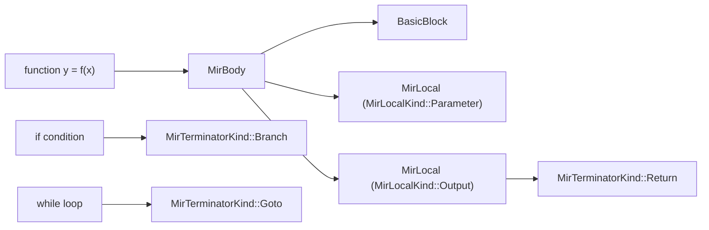
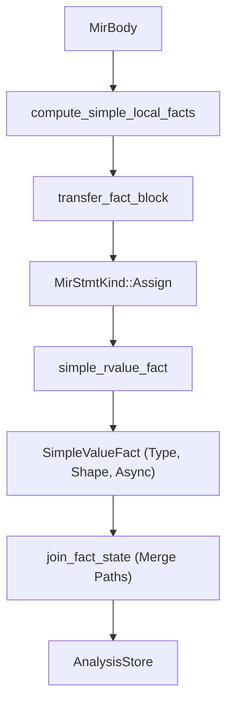

# Mid-Level IR (MIR)

<details>
<summary>Relevant source files</summary>

- [crates/runmat-mir/src/analysis/dataflow.rs](https://github.com/runmat-org/runmat/blob/82685330/crates/runmat-mir/src/analysis/dataflow.rs)
- [crates/runmat-mir/src/analysis/facts.rs](https://github.com/runmat-org/runmat/blob/82685330/crates/runmat-mir/src/analysis/facts.rs)
- [crates/runmat-mir/src/analysis/mod.rs](https://github.com/runmat-org/runmat/blob/82685330/crates/runmat-mir/src/analysis/mod.rs)
- [crates/runmat-mir/src/analysis/spawn_safety.rs](https://github.com/runmat-org/runmat/blob/82685330/crates/runmat-mir/src/analysis/spawn_safety.rs)
- [crates/runmat-mir/src/analysis/store.rs](https://github.com/runmat-org/runmat/blob/82685330/crates/runmat-mir/src/analysis/store.rs)
- [crates/runmat-mir/src/async_.rs](https://github.com/runmat-org/runmat/blob/82685330/crates/runmat-mir/src/async_.rs)
- [crates/runmat-mir/src/body.rs](https://github.com/runmat-org/runmat/blob/82685330/crates/runmat-mir/src/body.rs)
- [crates/runmat-mir/src/call.rs](https://github.com/runmat-org/runmat/blob/82685330/crates/runmat-mir/src/call.rs)
- [crates/runmat-mir/src/lowering/control_flow.rs](https://github.com/runmat-org/runmat/blob/82685330/crates/runmat-mir/src/lowering/control_flow.rs)
- [crates/runmat-mir/src/lowering/ctx.rs](https://github.com/runmat-org/runmat/blob/82685330/crates/runmat-mir/src/lowering/ctx.rs)
- [crates/runmat-mir/src/lowering/expr.rs](https://github.com/runmat-org/runmat/blob/82685330/crates/runmat-mir/src/lowering/expr.rs)
- [crates/runmat-mir/src/lowering/function.rs](https://github.com/runmat-org/runmat/blob/82685330/crates/runmat-mir/src/lowering/function.rs)
- [crates/runmat-mir/src/lowering/place.rs](https://github.com/runmat-org/runmat/blob/82685330/crates/runmat-mir/src/lowering/place.rs)
- [crates/runmat-mir/src/lowering/stmt.rs](https://github.com/runmat-org/runmat/blob/82685330/crates/runmat-mir/src/lowering/stmt.rs)
- [crates/runmat-mir/src/rvalue.rs](https://github.com/runmat-org/runmat/blob/82685330/crates/runmat-mir/src/rvalue.rs)
- [crates/runmat-mir/src/stmt.rs](https://github.com/runmat-org/runmat/blob/82685330/crates/runmat-mir/src/stmt.rs)
- [crates/runmat-mir/src/terminator.rs](https://github.com/runmat-org/runmat/blob/82685330/crates/runmat-mir/src/terminator.rs)
- [crates/runmat-mir/tests/lowering.rs](https://github.com/runmat-org/runmat/blob/82685330/crates/runmat-mir/tests/lowering.rs)

</details>

The Mid-Level IR (MIR) represents the stage in the RunMat compilation pipeline where High-Level IR (HIR) is lowered into a Control-Flow Graph (CFG) of Basic Blocks. While HIR maintains a structure close to the original MATLAB AST (nested loops, if-statements), MIR flattens these into explicit jumps, branch targets, and local variable slots (locals). This representation is used for dataflow analysis, type inference, and as the primary input for bytecode generation.

### Sources:

- [crates/runmat-mir/src/body.rs #1-20](https://github.com/runmat-org/runmat/blob/82685330/crates/runmat-mir/src/body.rs#L1-L20)
- [crates/runmat-mir/src/lowering/function.rs #7-25](https://github.com/runmat-org/runmat/blob/82685330/crates/runmat-mir/src/lowering/function.rs#L7-L25)

---

## MIR Structure & CFG

A MIR program is organized into a `MirAssembly`, which contains a collection of `MirBody` objects indexed by their `FunctionId`. Each `MirBody` consists of a list of `MirLocal` declarations and a graph of `BasicBlock` nodes.

### Basic Blocks and Control Flow

Every `BasicBlock` contains a sequence of `MirStmt` and exactly one `MirTerminator`.

- `MirStmt`: Linear operations like assignments (`Assign`), multi-assignments (`MultiAssign`), or expressions evaluated for side effects (`Expr`).
- `MirTerminator`: Dictates the transfer of control. Kinds include `Goto`, `Branch` (conditional), `Switch`, `Return`, `Await`, and `TryCatch`.

### MIR Data Entity Mapping

The following diagram bridges the conceptual MATLAB control flow to the internal MIR representation.



<details>
<summary>Rendered SVG</summary>

```svg
<svg id="mermaid-1fro0jisyuf" xmlns="http://www.w3.org/2000/svg" xmlns:xlink="http://www.w3.org/1999/xlink" class="flowchart" style="max-width: 100%; touch-action: none; user-select: none; cursor: grab; min-height: fit-content; max-height: 100%;" viewBox="-0.008638731718065173 0 959.2594649634361 506" role="graphics-document document" aria-roledescription="flowchart-v2" preserveAspectRatio="xMidYMid meet"><style>#mermaid-1fro0jisyuf{font-family:ui-sans-serif,-apple-system,system-ui,Segoe UI,Helvetica;font-size:16px;fill:#ccc;}@keyframes edge-animation-frame{from{stroke-dashoffset:0;}}@keyframes dash{to{stroke-dashoffset:0;}}#mermaid-1fro0jisyuf .edge-animation-slow{stroke-dasharray:9,5!important;stroke-dashoffset:900;animation:dash 50s linear infinite;stroke-linecap:round;}#mermaid-1fro0jisyuf .edge-animation-fast{stroke-dasharray:9,5!important;stroke-dashoffset:900;animation:dash 20s linear infinite;stroke-linecap:round;}#mermaid-1fro0jisyuf .error-icon{fill:#333;}#mermaid-1fro0jisyuf .error-text{fill:#cccccc;stroke:#cccccc;}#mermaid-1fro0jisyuf .edge-thickness-normal{stroke-width:1px;}#mermaid-1fro0jisyuf .edge-thickness-thick{stroke-width:3.5px;}#mermaid-1fro0jisyuf .edge-pattern-solid{stroke-dasharray:0;}#mermaid-1fro0jisyuf .edge-thickness-invisible{stroke-width:0;fill:none;}#mermaid-1fro0jisyuf .edge-pattern-dashed{stroke-dasharray:3;}#mermaid-1fro0jisyuf .edge-pattern-dotted{stroke-dasharray:2;}#mermaid-1fro0jisyuf .marker{fill:#666;stroke:#666;}#mermaid-1fro0jisyuf .marker.cross{stroke:#666;}#mermaid-1fro0jisyuf svg{font-family:ui-sans-serif,-apple-system,system-ui,Segoe UI,Helvetica;font-size:16px;}#mermaid-1fro0jisyuf p{margin:0;}#mermaid-1fro0jisyuf .label{font-family:ui-sans-serif,-apple-system,system-ui,Segoe UI,Helvetica;color:#fff;}#mermaid-1fro0jisyuf .cluster-label text{fill:#fff;}#mermaid-1fro0jisyuf .cluster-label span{color:#fff;}#mermaid-1fro0jisyuf .cluster-label span p{background-color:transparent;}#mermaid-1fro0jisyuf .label text,#mermaid-1fro0jisyuf span{fill:#fff;color:#fff;}#mermaid-1fro0jisyuf .node rect,#mermaid-1fro0jisyuf .node circle,#mermaid-1fro0jisyuf .node ellipse,#mermaid-1fro0jisyuf .node polygon,#mermaid-1fro0jisyuf .node path{fill:#111;stroke:#222;stroke-width:1px;}#mermaid-1fro0jisyuf .rough-node .label text,#mermaid-1fro0jisyuf .node .label text,#mermaid-1fro0jisyuf .image-shape .label,#mermaid-1fro0jisyuf .icon-shape .label{text-anchor:middle;}#mermaid-1fro0jisyuf .node .katex path{fill:#000;stroke:#000;stroke-width:1px;}#mermaid-1fro0jisyuf .rough-node .label,#mermaid-1fro0jisyuf .node .label,#mermaid-1fro0jisyuf .image-shape .label,#mermaid-1fro0jisyuf .icon-shape .label{text-align:center;}#mermaid-1fro0jisyuf .node.clickable{cursor:pointer;}#mermaid-1fro0jisyuf .root .anchor path{fill:#666!important;stroke-width:0;stroke:#666;}#mermaid-1fro0jisyuf .arrowheadPath{fill:#0b0b0b;}#mermaid-1fro0jisyuf .edgePath .path{stroke:#666;stroke-width:1px;}#mermaid-1fro0jisyuf .flowchart-link{stroke:#666;fill:none;}#mermaid-1fro0jisyuf .edgeLabel{background-color:#161616;text-align:center;}#mermaid-1fro0jisyuf .edgeLabel p{background-color:#161616;}#mermaid-1fro0jisyuf .edgeLabel rect{opacity:0.5;background-color:#161616;fill:#161616;}#mermaid-1fro0jisyuf .labelBkg{background-color:rgba(22, 22, 22, 0.5);}#mermaid-1fro0jisyuf .cluster rect{fill:#161616;stroke:#222;stroke-width:1px;}#mermaid-1fro0jisyuf .cluster text{fill:#fff;}#mermaid-1fro0jisyuf .cluster span{color:#fff;}#mermaid-1fro0jisyuf div.mermaidTooltip{position:absolute;text-align:center;max-width:200px;padding:2px;font-family:ui-sans-serif,-apple-system,system-ui,Segoe UI,Helvetica;font-size:12px;background:#333;border:1px solid hsl(0, 0%, 10%);border-radius:2px;pointer-events:none;z-index:100;}#mermaid-1fro0jisyuf .flowchartTitleText{text-anchor:middle;font-size:18px;fill:#ccc;}#mermaid-1fro0jisyuf rect.text{fill:none;stroke-width:0;}#mermaid-1fro0jisyuf .icon-shape,#mermaid-1fro0jisyuf .image-shape{background-color:#161616;text-align:center;}#mermaid-1fro0jisyuf .icon-shape p,#mermaid-1fro0jisyuf .image-shape p{background-color:#161616;padding:2px;}#mermaid-1fro0jisyuf .icon-shape .label rect,#mermaid-1fro0jisyuf .image-shape .label rect{opacity:0.5;background-color:#161616;fill:#161616;}#mermaid-1fro0jisyuf .label-icon{display:inline-block;height:1em;overflow:visible;vertical-align:-0.125em;}#mermaid-1fro0jisyuf .node .label-icon path{fill:currentColor;stroke:revert;stroke-width:revert;}#mermaid-1fro0jisyuf .node .neo-node{stroke:#222;}#mermaid-1fro0jisyuf [data-look="neo"].node rect,#mermaid-1fro0jisyuf [data-look="neo"].cluster rect,#mermaid-1fro0jisyuf [data-look="neo"].node polygon{stroke:url(#mermaid-1fro0jisyuf-gradient);filter:drop-shadow( 1px 2px 2px rgba(185,185,185,1));}#mermaid-1fro0jisyuf [data-look="neo"].node path{stroke:url(#mermaid-1fro0jisyuf-gradient);stroke-width:1px;}#mermaid-1fro0jisyuf [data-look="neo"].node .outer-path{filter:drop-shadow( 1px 2px 2px rgba(185,185,185,1));}#mermaid-1fro0jisyuf [data-look="neo"].node .neo-line path{stroke:#222;filter:none;}#mermaid-1fro0jisyuf [data-look="neo"].node circle{stroke:url(#mermaid-1fro0jisyuf-gradient);filter:drop-shadow( 1px 2px 2px rgba(185,185,185,1));}#mermaid-1fro0jisyuf [data-look="neo"].node circle .state-start{fill:#000000;}#mermaid-1fro0jisyuf [data-look="neo"].icon-shape .icon{fill:url(#mermaid-1fro0jisyuf-gradient);filter:drop-shadow( 1px 2px 2px rgba(185,185,185,1));}#mermaid-1fro0jisyuf [data-look="neo"].icon-shape .icon-neo path{stroke:url(#mermaid-1fro0jisyuf-gradient);filter:drop-shadow( 1px 2px 2px rgba(185,185,185,1));}#mermaid-1fro0jisyuf :root{--mermaid-font-family:"trebuchet ms",verdana,arial,sans-serif;}</style><g><marker id="mermaid-1fro0jisyuf_flowchart-v2-pointEnd" class="marker flowchart-v2" viewBox="0 0 10 10" refX="5" refY="5" markerUnits="userSpaceOnUse" markerWidth="8" markerHeight="8" orient="auto"><path d="M 0 0 L 10 5 L 0 10 z" class="arrowMarkerPath" style="stroke-width: 1; stroke-dasharray: 1, 0;"></path></marker><marker id="mermaid-1fro0jisyuf_flowchart-v2-pointStart" class="marker flowchart-v2" viewBox="0 0 10 10" refX="4.5" refY="5" markerUnits="userSpaceOnUse" markerWidth="8" markerHeight="8" orient="auto"><path d="M 0 5 L 10 10 L 10 0 z" class="arrowMarkerPath" style="stroke-width: 1; stroke-dasharray: 1, 0;"></path></marker><marker id="mermaid-1fro0jisyuf_flowchart-v2-pointEnd-margin" class="marker flowchart-v2" viewBox="0 0 11.5 14" refX="11.5" refY="7" markerUnits="userSpaceOnUse" markerWidth="10.5" markerHeight="14" orient="auto"><path d="M 0 0 L 11.5 7 L 0 14 z" class="arrowMarkerPath" style="stroke-width: 0; stroke-dasharray: 1, 0;"></path></marker><marker id="mermaid-1fro0jisyuf_flowchart-v2-pointStart-margin" class="marker flowchart-v2" viewBox="0 0 11.5 14" refX="1" refY="7" markerUnits="userSpaceOnUse" markerWidth="11.5" markerHeight="14" orient="auto"><polygon points="0,7 11.5,14 11.5,0" class="arrowMarkerPath" style="stroke-width: 0; stroke-dasharray: 1, 0;"></polygon></marker><marker id="mermaid-1fro0jisyuf_flowchart-v2-circleEnd" class="marker flowchart-v2" viewBox="0 0 10 10" refX="11" refY="5" markerUnits="userSpaceOnUse" markerWidth="11" markerHeight="11" orient="auto"><circle cx="5" cy="5" r="5" class="arrowMarkerPath" style="stroke-width: 1; stroke-dasharray: 1, 0;"></circle></marker><marker id="mermaid-1fro0jisyuf_flowchart-v2-circleStart" class="marker flowchart-v2" viewBox="0 0 10 10" refX="-1" refY="5" markerUnits="userSpaceOnUse" markerWidth="11" markerHeight="11" orient="auto"><circle cx="5" cy="5" r="5" class="arrowMarkerPath" style="stroke-width: 1; stroke-dasharray: 1, 0;"></circle></marker><marker id="mermaid-1fro0jisyuf_flowchart-v2-circleEnd-margin" class="marker flowchart-v2" viewBox="0 0 10 10" refY="5" refX="12.25" markerUnits="userSpaceOnUse" markerWidth="14" markerHeight="14" orient="auto"><circle cx="5" cy="5" r="5" class="arrowMarkerPath" style="stroke-width: 0; stroke-dasharray: 1, 0;"></circle></marker><marker id="mermaid-1fro0jisyuf_flowchart-v2-circleStart-margin" class="marker flowchart-v2" viewBox="0 0 10 10" refX="-2" refY="5" markerUnits="userSpaceOnUse" markerWidth="14" markerHeight="14" orient="auto"><circle cx="5" cy="5" r="5" class="arrowMarkerPath" style="stroke-width: 0; stroke-dasharray: 1, 0;"></circle></marker><marker id="mermaid-1fro0jisyuf_flowchart-v2-crossEnd" class="marker cross flowchart-v2" viewBox="0 0 11 11" refX="12" refY="5.2" markerUnits="userSpaceOnUse" markerWidth="11" markerHeight="11" orient="auto"><path d="M 1,1 l 9,9 M 10,1 l -9,9" class="arrowMarkerPath" style="stroke-width: 2; stroke-dasharray: 1, 0;"></path></marker><marker id="mermaid-1fro0jisyuf_flowchart-v2-crossStart" class="marker cross flowchart-v2" viewBox="0 0 11 11" refX="-1" refY="5.2" markerUnits="userSpaceOnUse" markerWidth="11" markerHeight="11" orient="auto"><path d="M 1,1 l 9,9 M 10,1 l -9,9" class="arrowMarkerPath" style="stroke-width: 2; stroke-dasharray: 1, 0;"></path></marker><marker id="mermaid-1fro0jisyuf_flowchart-v2-crossEnd-margin" class="marker cross flowchart-v2" viewBox="0 0 15 15" refX="17.7" refY="7.5" markerUnits="userSpaceOnUse" markerWidth="12" markerHeight="12" orient="auto"><path d="M 1,1 L 14,14 M 1,14 L 14,1" class="arrowMarkerPath" style="stroke-width: 2.5;"></path></marker><marker id="mermaid-1fro0jisyuf_flowchart-v2-crossStart-margin" class="marker cross flowchart-v2" viewBox="0 0 15 15" refX="-3.5" refY="7.5" markerUnits="userSpaceOnUse" markerWidth="12" markerHeight="12" orient="auto"><path d="M 1,1 L 14,14 M 1,14 L 14,1" class="arrowMarkerPath" style="stroke-width: 2.5; stroke-dasharray: 1, 0;"></path></marker><g class="root"><g class="clusters"><g class="cluster" id="mermaid-1fro0jisyuf-subGraph1" data-look="classic"><rect style="" x="8" y="162" width="943.2421875" height="336"></rect><g class="cluster-label" transform="translate(323.44140625, 162)"><foreignObject width="312.359375" height="24"><div style="display: table-cell; white-space: nowrap; line-height: 1.5;" xmlns="http://www.w3.org/1999/xhtml"><span class="nodeLabel"><p>MIR Code Entity Space (crates/runmat-mir)</p></span></div></foreignObject></g></g><g class="cluster" id="mermaid-1fro0jisyuf-subGraph0" data-look="classic"><rect style="" x="143.4921875" y="8" width="755.8046875" height="104"></rect><g class="cluster-label" transform="translate(437.97265625, 8)"><foreignObject width="166.84375" height="24"><div style="display: table-cell; white-space: nowrap; line-height: 1.5;" xmlns="http://www.w3.org/1999/xhtml"><span class="nodeLabel"><p>MATLAB Source Space</p></span></div></foreignObject></g></g></g><g class="edgePaths"><path d="M266.234,87L266.234,91.167C266.234,95.333,266.234,103.667,266.234,112C266.234,120.333,266.234,128.667,266.234,137C266.234,145.333,266.234,153.667,266.234,161.333C266.234,169,266.234,176,266.234,179.5L266.234,183" id="mermaid-1fro0jisyuf-L_S3_B1_0" class="edge-thickness-normal edge-pattern-solid edge-thickness-normal edge-pattern-solid flowchart-link" style=";" data-edge="true" data-et="edge" data-id="L_S3_B1_0" data-points="W3sieCI6MjY2LjIzNDM3NSwieSI6ODd9LHsieCI6MjY2LjIzNDM3NSwieSI6MTEyfSx7IngiOjI2Ni4yMzQzNzUsInkiOjEzN30seyJ4IjoyNjYuMjM0Mzc1LCJ5IjoxNjJ9LHsieCI6MjY2LjIzNDM3NSwieSI6MTg3fV0=" data-look="classic" marker-end="url(#mermaid-1fro0jisyuf_flowchart-v2-pointEnd)"></path><path d="M316.04,241L323.726,245.167C331.412,249.333,346.784,257.667,354.47,265.333C362.156,273,362.156,280,362.156,283.5L362.156,287" id="mermaid-1fro0jisyuf-L_B1_L1_0" class="edge-thickness-normal edge-pattern-solid edge-thickness-normal edge-pattern-solid flowchart-link" style=";" data-edge="true" data-et="edge" data-id="L_B1_L1_0" data-points="W3sieCI6MzE2LjAzOTk2Mzk0MjMwNzcsInkiOjI0MX0seyJ4IjozNjIuMTU2MjUsInkiOjI2Nn0seyJ4IjozNjIuMTU2MjUsInkiOjI5MX1d" data-look="classic" marker-end="url(#mermaid-1fro0jisyuf_flowchart-v2-pointEnd)"></path><path d="M326.398,221.539L385.538,228.949C444.678,236.359,562.958,251.18,622.098,262.09C681.238,273,681.238,280,681.238,283.5L681.238,287" id="mermaid-1fro0jisyuf-L_B1_L2_0" class="edge-thickness-normal edge-pattern-solid edge-thickness-normal edge-pattern-solid flowchart-link" style=";" data-edge="true" data-et="edge" data-id="L_B1_L2_0" data-points="W3sieCI6MzI2LjM5ODQzNzUsInkiOjIyMS41Mzg1NTg1NjAyNTQ1M30seyJ4Ijo2ODEuMjM4MjgxMjUsInkiOjI2Nn0seyJ4Ijo2ODEuMjM4MjgxMjUsInkiOjI5MX1d" data-look="classic" marker-end="url(#mermaid-1fro0jisyuf_flowchart-v2-pointEnd)"></path><path d="M206.07,234.361L190.488,239.634C174.906,244.907,143.742,255.454,128.16,266.227C112.578,277,112.578,288,112.578,293.5L112.578,299" id="mermaid-1fro0jisyuf-L_B1_BB_0" class="edge-thickness-normal edge-pattern-solid edge-thickness-normal edge-pattern-solid flowchart-link" style=";" data-edge="true" data-et="edge" data-id="L_B1_BB_0" data-points="W3sieCI6MjA2LjA3MDMxMjUsInkiOjIzNC4zNjA1ODU3MjMwMDE4M30seyJ4IjoxMTIuNTc4MTI1LCJ5IjoyNjZ9LHsieCI6MTEyLjU3ODEyNSwieSI6MzAzfV0=" data-look="classic" marker-end="url(#mermaid-1fro0jisyuf_flowchart-v2-pointEnd)"></path><path d="M502.852,87L502.852,91.167C502.852,95.333,502.852,103.667,502.852,112C502.852,120.333,502.852,128.667,502.852,137C502.852,145.333,502.852,153.667,502.852,161.333C502.852,169,502.852,176,502.852,179.5L502.852,183" id="mermaid-1fro0jisyuf-L_S1_T1_0" class="edge-thickness-normal edge-pattern-solid edge-thickness-normal edge-pattern-solid flowchart-link" style=";" data-edge="true" data-et="edge" data-id="L_S1_T1_0" data-points="W3sieCI6NTAyLjg1MTU2MjUsInkiOjg3fSx7IngiOjUwMi44NTE1NjI1LCJ5IjoxMTJ9LHsieCI6NTAyLjg1MTU2MjUsInkiOjEzN30seyJ4Ijo1MDIuODUxNTYyNSwieSI6MTYyfSx7IngiOjUwMi44NTE1NjI1LCJ5IjoxODd9XQ==" data-look="classic" marker-end="url(#mermaid-1fro0jisyuf_flowchart-v2-pointEnd)"></path><path d="M797.773,87L797.773,91.167C797.773,95.333,797.773,103.667,797.773,112C797.773,120.333,797.773,128.667,797.773,137C797.773,145.333,797.773,153.667,797.773,161.333C797.773,169,797.773,176,797.773,179.5L797.773,183" id="mermaid-1fro0jisyuf-L_S2_T2_0" class="edge-thickness-normal edge-pattern-solid edge-thickness-normal edge-pattern-solid flowchart-link" style=";" data-edge="true" data-et="edge" data-id="L_S2_T2_0" data-points="W3sieCI6Nzk3Ljc3MzQzNzUsInkiOjg3fSx7IngiOjc5Ny43NzM0Mzc1LCJ5IjoxMTJ9LHsieCI6Nzk3Ljc3MzQzNzUsInkiOjEzN30seyJ4Ijo3OTcuNzczNDM3NSwieSI6MTYyfSx7IngiOjc5Ny43NzM0Mzc1LCJ5IjoxODd9XQ==" data-look="classic" marker-end="url(#mermaid-1fro0jisyuf_flowchart-v2-pointEnd)"></path><path d="M681.238,369L681.238,373.167C681.238,377.333,681.238,385.667,681.238,393.333C681.238,401,681.238,408,681.238,411.5L681.238,415" id="mermaid-1fro0jisyuf-L_L2_T3_0" class="edge-thickness-normal edge-pattern-solid edge-thickness-normal edge-pattern-solid flowchart-link" style=";" data-edge="true" data-et="edge" data-id="L_L2_T3_0" data-points="W3sieCI6NjgxLjIzODI4MTI1LCJ5IjozNjl9LHsieCI6NjgxLjIzODI4MTI1LCJ5IjozOTR9LHsieCI6NjgxLjIzODI4MTI1LCJ5Ijo0MTl9XQ==" data-look="classic" marker-end="url(#mermaid-1fro0jisyuf_flowchart-v2-pointEnd)"></path></g><g class="edgeLabels"><g class="edgeLabel"><g class="label" data-id="L_S3_B1_0" transform="translate(0, 0)"><foreignObject width="0" height="0"><div style="display: table-cell; white-space: nowrap; line-height: 1.5; max-width: 200px; text-align: center;" xmlns="http://www.w3.org/1999/xhtml" class="labelBkg"><span class="edgeLabel"></span></div></foreignObject></g></g><g class="edgeLabel"><g class="label" data-id="L_B1_L1_0" transform="translate(0, 0)"><foreignObject width="0" height="0"><div style="display: table-cell; white-space: nowrap; line-height: 1.5; max-width: 200px; text-align: center;" xmlns="http://www.w3.org/1999/xhtml" class="labelBkg"><span class="edgeLabel"></span></div></foreignObject></g></g><g class="edgeLabel"><g class="label" data-id="L_B1_L2_0" transform="translate(0, 0)"><foreignObject width="0" height="0"><div style="display: table-cell; white-space: nowrap; line-height: 1.5; max-width: 200px; text-align: center;" xmlns="http://www.w3.org/1999/xhtml" class="labelBkg"><span class="edgeLabel"></span></div></foreignObject></g></g><g class="edgeLabel"><g class="label" data-id="L_B1_BB_0" transform="translate(0, 0)"><foreignObject width="0" height="0"><div style="display: table-cell; white-space: nowrap; line-height: 1.5; max-width: 200px; text-align: center;" xmlns="http://www.w3.org/1999/xhtml" class="labelBkg"><span class="edgeLabel"></span></div></foreignObject></g></g><g class="edgeLabel"><g class="label" data-id="L_S1_T1_0" transform="translate(0, 0)"><foreignObject width="0" height="0"><div style="display: table-cell; white-space: nowrap; line-height: 1.5; max-width: 200px; text-align: center;" xmlns="http://www.w3.org/1999/xhtml" class="labelBkg"><span class="edgeLabel"></span></div></foreignObject></g></g><g class="edgeLabel"><g class="label" data-id="L_S2_T2_0" transform="translate(0, 0)"><foreignObject width="0" height="0"><div style="display: table-cell; white-space: nowrap; line-height: 1.5; max-width: 200px; text-align: center;" xmlns="http://www.w3.org/1999/xhtml" class="labelBkg"><span class="edgeLabel"></span></div></foreignObject></g></g><g class="edgeLabel"><g class="label" data-id="L_L2_T3_0" transform="translate(0, 0)"><foreignObject width="0" height="0"><div style="display: table-cell; white-space: nowrap; line-height: 1.5; max-width: 200px; text-align: center;" xmlns="http://www.w3.org/1999/xhtml" class="labelBkg"><span class="edgeLabel"></span></div></foreignObject></g></g></g><g class="nodes"><g class="node default" id="mermaid-1fro0jisyuf-flowchart-S1-0" data-look="classic" transform="translate(502.8515625, 60)"><rect class="basic label-container" style="" x="-70.2890625" y="-27" width="140.578125" height="54"></rect><g class="label" style="" transform="translate(-40.2890625, -12)"><rect></rect><foreignObject width="80.578125" height="24"><div style="display: table-cell; white-space: nowrap; line-height: 1.5; max-width: 200px; text-align: center;" xmlns="http://www.w3.org/1999/xhtml"><span class="nodeLabel"><p>if condition</p></span></div></foreignObject></g></g><g class="node default" id="mermaid-1fro0jisyuf-flowchart-S2-1" data-look="classic" transform="translate(797.7734375, 60)"><rect class="basic label-container" style="" x="-66.5234375" y="-27" width="133.046875" height="54"></rect><g class="label" style="" transform="translate(-36.5234375, -12)"><rect></rect><foreignObject width="73.046875" height="24"><div style="display: table-cell; white-space: nowrap; line-height: 1.5; max-width: 200px; text-align: center;" xmlns="http://www.w3.org/1999/xhtml"><span class="nodeLabel"><p>while loop</p></span></div></foreignObject></g></g><g class="node default" id="mermaid-1fro0jisyuf-flowchart-S3-2" data-look="classic" transform="translate(266.234375, 60)"><rect class="basic label-container" style="" x="-87.7421875" y="-27" width="175.484375" height="54"></rect><g class="label" style="" transform="translate(-57.7421875, -12)"><rect></rect><foreignObject width="115.484375" height="24"><div style="display: table-cell; white-space: nowrap; line-height: 1.5; max-width: 200px; text-align: center;" xmlns="http://www.w3.org/1999/xhtml"><span class="nodeLabel"><p>function y = f(x)</p></span></div></foreignObject></g></g><g class="node default" id="mermaid-1fro0jisyuf-flowchart-B1-3" data-look="classic" transform="translate(266.234375, 214)"><rect class="basic label-container" style="" x="-60.1640625" y="-27" width="120.328125" height="54"></rect><g class="label" style="" transform="translate(-30.1640625, -12)"><rect></rect><foreignObject width="60.328125" height="24"><div style="display: table-cell; white-space: nowrap; line-height: 1.5; max-width: 200px; text-align: center;" xmlns="http://www.w3.org/1999/xhtml"><span class="nodeLabel"><p>MirBody</p></span></div></foreignObject></g></g><g class="node default" id="mermaid-1fro0jisyuf-flowchart-BB-4" data-look="classic" transform="translate(112.578125, 330)"><rect class="basic label-container" style="" x="-69.578125" y="-27" width="139.15625" height="54"></rect><g class="label" style="" transform="translate(-39.578125, -12)"><rect></rect><foreignObject width="79.15625" height="24"><div style="display: table-cell; white-space: nowrap; line-height: 1.5; max-width: 200px; text-align: center;" xmlns="http://www.w3.org/1999/xhtml"><span class="nodeLabel"><p>BasicBlock</p></span></div></foreignObject></g></g><g class="node default" id="mermaid-1fro0jisyuf-flowchart-T1-5" data-look="classic" transform="translate(502.8515625, 214)"><rect class="basic label-container" style="" x="-126.453125" y="-27" width="252.90625" height="54"></rect><g class="label" style="" transform="translate(-96.453125, -12)"><rect></rect><foreignObject width="192.90625" height="24"><div style="display: table-cell; white-space: nowrap; line-height: 1.5; max-width: 200px; text-align: center;" xmlns="http://www.w3.org/1999/xhtml"><span class="nodeLabel"><p>MirTerminatorKind::Branch</p></span></div></foreignObject></g></g><g class="node default" id="mermaid-1fro0jisyuf-flowchart-T2-6" data-look="classic" transform="translate(797.7734375, 214)"><rect class="basic label-container" style="" x="-118.46875" y="-27" width="236.9375" height="54"></rect><g class="label" style="" transform="translate(-88.46875, -12)"><rect></rect><foreignObject width="176.9375" height="24"><div style="display: table-cell; white-space: nowrap; line-height: 1.5; max-width: 200px; text-align: center;" xmlns="http://www.w3.org/1999/xhtml"><span class="nodeLabel"><p>MirTerminatorKind::Goto</p></span></div></foreignObject></g></g><g class="node default" id="mermaid-1fro0jisyuf-flowchart-T3-7" data-look="classic" transform="translate(681.23828125, 446)"><rect class="basic label-container" style="" x="-124.9296875" y="-27" width="249.859375" height="54"></rect><g class="label" style="" transform="translate(-94.9296875, -12)"><rect></rect><foreignObject width="189.859375" height="24"><div style="display: table-cell; white-space: nowrap; line-height: 1.5; max-width: 200px; text-align: center;" xmlns="http://www.w3.org/1999/xhtml"><span class="nodeLabel"><p>MirTerminatorKind::Return</p></span></div></foreignObject></g></g><g class="node default" id="mermaid-1fro0jisyuf-flowchart-L1-8" data-look="classic" transform="translate(362.15625, 330)"><rect class="basic label-container" style="" x="-130" y="-39" width="260" height="78"></rect><g class="label" style="" transform="translate(-100, -24)"><rect></rect><foreignObject width="200" height="48"><div style="display: table; white-space: break-spaces; line-height: 1.5; max-width: 200px; text-align: center; width: 200px;" xmlns="http://www.w3.org/1999/xhtml"><span class="nodeLabel"><p>MirLocal (MirLocalKind::Parameter)</p></span></div></foreignObject></g></g><g class="node default" id="mermaid-1fro0jisyuf-flowchart-L2-9" data-look="classic" transform="translate(681.23828125, 330)"><rect class="basic label-container" style="" x="-130" y="-39" width="260" height="78"></rect><g class="label" style="" transform="translate(-100, -24)"><rect></rect><foreignObject width="200" height="48"><div style="display: table; white-space: break-spaces; line-height: 1.5; max-width: 200px; text-align: center; width: 200px;" xmlns="http://www.w3.org/1999/xhtml"><span class="nodeLabel"><p>MirLocal (MirLocalKind::Output)</p></span></div></foreignObject></g></g></g></g></g><defs><filter id="mermaid-1fro0jisyuf-drop-shadow" height="130%" width="130%"><feDropShadow dx="4" dy="4" stdDeviation="0" flood-opacity="0.06" flood-color="#000000"></feDropShadow></filter></defs><defs><filter id="mermaid-1fro0jisyuf-drop-shadow-small" height="150%" width="150%"><feDropShadow dx="2" dy="2" stdDeviation="0" flood-opacity="0.06" flood-color="#000000"></feDropShadow></filter></defs><linearGradient id="mermaid-1fro0jisyuf-gradient" gradientUnits="objectBoundingBox" x1="0%" y1="0%" x2="100%" y2="0%"><stop offset="0%" stop-color="#333" stop-opacity="1"></stop><stop offset="100%" stop-color="hsl(-120, 0%, 3.3333333333%)" stop-opacity="1"></stop></linearGradient></svg>
```

</details>

### Sources:

- [crates/runmat-mir/src/body.rs #1-15](https://github.com/runmat-org/runmat/blob/82685330/crates/runmat-mir/src/body.rs#L1-L15)
- [crates/runmat-mir/src/terminator.rs #1-30](https://github.com/runmat-org/runmat/blob/82685330/crates/runmat-mir/src/terminator.rs#L1-L30)
- [crates/runmat-mir/src/stmt.rs #1-20](https://github.com/runmat-org/runmat/blob/82685330/crates/runmat-mir/src/stmt.rs#L1-L20)

---

## MIR Lowering (HIR → MIR)

Lowering is performed by the `lower_assembly` function, which iterates through HIR functions and utilizes a `ControlFlowBuilder` to construct the CFG.

### ControlFlowBuilder & Continuation Passing

The `ControlFlowBuilder` handles the conversion of nested HIR structures into flat blocks using a continuation-passing approach. When encountering a branch or an `await` point, the builder:

1. Allocates a `fresh_block()` for the continuation.
2. Lowers the "current" block's terminator to point to the new block.
3. Recursively lowers the remaining statements into the continuation block.

### MirLocal Slots

MIR replaces HIR `BindingId` references with `MirLocalId` slots. Locals are categorized by `MirLocalKind`:

- `Parameter`: Input arguments to the function.
- `Output`: Variables that will be returned.
- `Binding`: Standard local variables.
- `Capture`: Variables captured from an outer scope (closures).
- `Temporary`: Compiler-generated slots for intermediate expression results.

### Sources:

- [crates/runmat-mir/src/lowering/function.rs #7-61](https://github.com/runmat-org/runmat/blob/82685330/crates/runmat-mir/src/lowering/function.rs#L7-L61)
- [crates/runmat-mir/src/lowering/control_flow.rs #15-110](https://github.com/runmat-org/runmat/blob/82685330/crates/runmat-mir/src/lowering/control_flow.rs#L15-L110)
- [crates/runmat-mir/src/lowering/ctx.rs #7-89](https://github.com/runmat-org/runmat/blob/82685330/crates/runmat-mir/src/lowering/ctx.rs#L7-L89)

---

## Rvalues and Indexing Plans

MIR expressions are represented as `MirRvalue`. Unlike HIR expressions, `MirRvalue` is shallow; its operands are usually `MirOperand::Local` or `MirOperand::Constant`.

### Indexing Operations

MATLAB indexing is complex (supporting `end`, `:`, and logical masks). MIR lowers these into a `MirIndexing` structure containing `MirIndexComponent`s.

- `MirIndexPlan`: Determines if the access is `Scalar`, `Slice`, or `Cell`.
- `MirRvalue::Index`: Represents a read operation.
- `MirStmtKind::Assign` with `MirPlace::Index`: Represents a write/mutation operation.

### Rvalue Kinds

| Kind | Description |
| --- | --- |
| Use | Simple move or copy of an operand. |
| Binary / Unary | Arithmetic and logical operations. |
| Call | Function invocation with MirCallee (Static or Dynamic). |
| Aggregate | Construction of Tensors or Cell arrays. |
| ShortCircuit | Logical && and ` |

### Sources:

- [crates/runmat-mir/src/rvalue.rs #8-59](https://github.com/runmat-org/runmat/blob/82685330/crates/runmat-mir/src/rvalue.rs#L8-L59)
- [crates/runmat-mir/src/lowering/expr.rs #15-165](https://github.com/runmat-org/runmat/blob/82685330/crates/runmat-mir/src/lowering/expr.rs#L15-L165)
- [crates/runmat-mir/src/call.rs #10-38](https://github.com/runmat-org/runmat/blob/82685330/crates/runmat-mir/src/call.rs#L10-L38)

---

## MIR Dataflow Analysis

Once lowered, the `AnalysisStore` tracks facts about `MirLocal` slots across the CFG using a fixed-point iteration engine in `compute_simple_local_facts`.

### Analysis Logic Flow

The diagram below illustrates how the analysis engine processes a `MirBody` to produce type and shape facts.



<details>
<summary>Rendered SVG</summary>

```svg
<svg id="mermaid-2dvraq26z73" xmlns="http://www.w3.org/2000/svg" xmlns:xlink="http://www.w3.org/1999/xlink" class="flowchart" style="max-width: 100%; touch-action: none; user-select: none; cursor: grab; min-height: fit-content; max-height: 100%;" viewBox="0 0 283.421875 846" role="graphics-document document" aria-roledescription="flowchart-v2" preserveAspectRatio="xMidYMid meet"><style>#mermaid-2dvraq26z73{font-family:ui-sans-serif,-apple-system,system-ui,Segoe UI,Helvetica;font-size:16px;fill:#ccc;}@keyframes edge-animation-frame{from{stroke-dashoffset:0;}}@keyframes dash{to{stroke-dashoffset:0;}}#mermaid-2dvraq26z73 .edge-animation-slow{stroke-dasharray:9,5!important;stroke-dashoffset:900;animation:dash 50s linear infinite;stroke-linecap:round;}#mermaid-2dvraq26z73 .edge-animation-fast{stroke-dasharray:9,5!important;stroke-dashoffset:900;animation:dash 20s linear infinite;stroke-linecap:round;}#mermaid-2dvraq26z73 .error-icon{fill:#333;}#mermaid-2dvraq26z73 .error-text{fill:#cccccc;stroke:#cccccc;}#mermaid-2dvraq26z73 .edge-thickness-normal{stroke-width:1px;}#mermaid-2dvraq26z73 .edge-thickness-thick{stroke-width:3.5px;}#mermaid-2dvraq26z73 .edge-pattern-solid{stroke-dasharray:0;}#mermaid-2dvraq26z73 .edge-thickness-invisible{stroke-width:0;fill:none;}#mermaid-2dvraq26z73 .edge-pattern-dashed{stroke-dasharray:3;}#mermaid-2dvraq26z73 .edge-pattern-dotted{stroke-dasharray:2;}#mermaid-2dvraq26z73 .marker{fill:#666;stroke:#666;}#mermaid-2dvraq26z73 .marker.cross{stroke:#666;}#mermaid-2dvraq26z73 svg{font-family:ui-sans-serif,-apple-system,system-ui,Segoe UI,Helvetica;font-size:16px;}#mermaid-2dvraq26z73 p{margin:0;}#mermaid-2dvraq26z73 .label{font-family:ui-sans-serif,-apple-system,system-ui,Segoe UI,Helvetica;color:#fff;}#mermaid-2dvraq26z73 .cluster-label text{fill:#fff;}#mermaid-2dvraq26z73 .cluster-label span{color:#fff;}#mermaid-2dvraq26z73 .cluster-label span p{background-color:transparent;}#mermaid-2dvraq26z73 .label text,#mermaid-2dvraq26z73 span{fill:#fff;color:#fff;}#mermaid-2dvraq26z73 .node rect,#mermaid-2dvraq26z73 .node circle,#mermaid-2dvraq26z73 .node ellipse,#mermaid-2dvraq26z73 .node polygon,#mermaid-2dvraq26z73 .node path{fill:#111;stroke:#222;stroke-width:1px;}#mermaid-2dvraq26z73 .rough-node .label text,#mermaid-2dvraq26z73 .node .label text,#mermaid-2dvraq26z73 .image-shape .label,#mermaid-2dvraq26z73 .icon-shape .label{text-anchor:middle;}#mermaid-2dvraq26z73 .node .katex path{fill:#000;stroke:#000;stroke-width:1px;}#mermaid-2dvraq26z73 .rough-node .label,#mermaid-2dvraq26z73 .node .label,#mermaid-2dvraq26z73 .image-shape .label,#mermaid-2dvraq26z73 .icon-shape .label{text-align:center;}#mermaid-2dvraq26z73 .node.clickable{cursor:pointer;}#mermaid-2dvraq26z73 .root .anchor path{fill:#666!important;stroke-width:0;stroke:#666;}#mermaid-2dvraq26z73 .arrowheadPath{fill:#0b0b0b;}#mermaid-2dvraq26z73 .edgePath .path{stroke:#666;stroke-width:1px;}#mermaid-2dvraq26z73 .flowchart-link{stroke:#666;fill:none;}#mermaid-2dvraq26z73 .edgeLabel{background-color:#161616;text-align:center;}#mermaid-2dvraq26z73 .edgeLabel p{background-color:#161616;}#mermaid-2dvraq26z73 .edgeLabel rect{opacity:0.5;background-color:#161616;fill:#161616;}#mermaid-2dvraq26z73 .labelBkg{background-color:rgba(22, 22, 22, 0.5);}#mermaid-2dvraq26z73 .cluster rect{fill:#161616;stroke:#222;stroke-width:1px;}#mermaid-2dvraq26z73 .cluster text{fill:#fff;}#mermaid-2dvraq26z73 .cluster span{color:#fff;}#mermaid-2dvraq26z73 div.mermaidTooltip{position:absolute;text-align:center;max-width:200px;padding:2px;font-family:ui-sans-serif,-apple-system,system-ui,Segoe UI,Helvetica;font-size:12px;background:#333;border:1px solid hsl(0, 0%, 10%);border-radius:2px;pointer-events:none;z-index:100;}#mermaid-2dvraq26z73 .flowchartTitleText{text-anchor:middle;font-size:18px;fill:#ccc;}#mermaid-2dvraq26z73 rect.text{fill:none;stroke-width:0;}#mermaid-2dvraq26z73 .icon-shape,#mermaid-2dvraq26z73 .image-shape{background-color:#161616;text-align:center;}#mermaid-2dvraq26z73 .icon-shape p,#mermaid-2dvraq26z73 .image-shape p{background-color:#161616;padding:2px;}#mermaid-2dvraq26z73 .icon-shape .label rect,#mermaid-2dvraq26z73 .image-shape .label rect{opacity:0.5;background-color:#161616;fill:#161616;}#mermaid-2dvraq26z73 .label-icon{display:inline-block;height:1em;overflow:visible;vertical-align:-0.125em;}#mermaid-2dvraq26z73 .node .label-icon path{fill:currentColor;stroke:revert;stroke-width:revert;}#mermaid-2dvraq26z73 .node .neo-node{stroke:#222;}#mermaid-2dvraq26z73 [data-look="neo"].node rect,#mermaid-2dvraq26z73 [data-look="neo"].cluster rect,#mermaid-2dvraq26z73 [data-look="neo"].node polygon{stroke:url(#mermaid-2dvraq26z73-gradient);filter:drop-shadow( 1px 2px 2px rgba(185,185,185,1));}#mermaid-2dvraq26z73 [data-look="neo"].node path{stroke:url(#mermaid-2dvraq26z73-gradient);stroke-width:1px;}#mermaid-2dvraq26z73 [data-look="neo"].node .outer-path{filter:drop-shadow( 1px 2px 2px rgba(185,185,185,1));}#mermaid-2dvraq26z73 [data-look="neo"].node .neo-line path{stroke:#222;filter:none;}#mermaid-2dvraq26z73 [data-look="neo"].node circle{stroke:url(#mermaid-2dvraq26z73-gradient);filter:drop-shadow( 1px 2px 2px rgba(185,185,185,1));}#mermaid-2dvraq26z73 [data-look="neo"].node circle .state-start{fill:#000000;}#mermaid-2dvraq26z73 [data-look="neo"].icon-shape .icon{fill:url(#mermaid-2dvraq26z73-gradient);filter:drop-shadow( 1px 2px 2px rgba(185,185,185,1));}#mermaid-2dvraq26z73 [data-look="neo"].icon-shape .icon-neo path{stroke:url(#mermaid-2dvraq26z73-gradient);filter:drop-shadow( 1px 2px 2px rgba(185,185,185,1));}#mermaid-2dvraq26z73 :root{--mermaid-font-family:"trebuchet ms",verdana,arial,sans-serif;}</style><g><marker id="mermaid-2dvraq26z73_flowchart-v2-pointEnd" class="marker flowchart-v2" viewBox="0 0 10 10" refX="5" refY="5" markerUnits="userSpaceOnUse" markerWidth="8" markerHeight="8" orient="auto"><path d="M 0 0 L 10 5 L 0 10 z" class="arrowMarkerPath" style="stroke-width: 1; stroke-dasharray: 1, 0;"></path></marker><marker id="mermaid-2dvraq26z73_flowchart-v2-pointStart" class="marker flowchart-v2" viewBox="0 0 10 10" refX="4.5" refY="5" markerUnits="userSpaceOnUse" markerWidth="8" markerHeight="8" orient="auto"><path d="M 0 5 L 10 10 L 10 0 z" class="arrowMarkerPath" style="stroke-width: 1; stroke-dasharray: 1, 0;"></path></marker><marker id="mermaid-2dvraq26z73_flowchart-v2-pointEnd-margin" class="marker flowchart-v2" viewBox="0 0 11.5 14" refX="11.5" refY="7" markerUnits="userSpaceOnUse" markerWidth="10.5" markerHeight="14" orient="auto"><path d="M 0 0 L 11.5 7 L 0 14 z" class="arrowMarkerPath" style="stroke-width: 0; stroke-dasharray: 1, 0;"></path></marker><marker id="mermaid-2dvraq26z73_flowchart-v2-pointStart-margin" class="marker flowchart-v2" viewBox="0 0 11.5 14" refX="1" refY="7" markerUnits="userSpaceOnUse" markerWidth="11.5" markerHeight="14" orient="auto"><polygon points="0,7 11.5,14 11.5,0" class="arrowMarkerPath" style="stroke-width: 0; stroke-dasharray: 1, 0;"></polygon></marker><marker id="mermaid-2dvraq26z73_flowchart-v2-circleEnd" class="marker flowchart-v2" viewBox="0 0 10 10" refX="11" refY="5" markerUnits="userSpaceOnUse" markerWidth="11" markerHeight="11" orient="auto"><circle cx="5" cy="5" r="5" class="arrowMarkerPath" style="stroke-width: 1; stroke-dasharray: 1, 0;"></circle></marker><marker id="mermaid-2dvraq26z73_flowchart-v2-circleStart" class="marker flowchart-v2" viewBox="0 0 10 10" refX="-1" refY="5" markerUnits="userSpaceOnUse" markerWidth="11" markerHeight="11" orient="auto"><circle cx="5" cy="5" r="5" class="arrowMarkerPath" style="stroke-width: 1; stroke-dasharray: 1, 0;"></circle></marker><marker id="mermaid-2dvraq26z73_flowchart-v2-circleEnd-margin" class="marker flowchart-v2" viewBox="0 0 10 10" refY="5" refX="12.25" markerUnits="userSpaceOnUse" markerWidth="14" markerHeight="14" orient="auto"><circle cx="5" cy="5" r="5" class="arrowMarkerPath" style="stroke-width: 0; stroke-dasharray: 1, 0;"></circle></marker><marker id="mermaid-2dvraq26z73_flowchart-v2-circleStart-margin" class="marker flowchart-v2" viewBox="0 0 10 10" refX="-2" refY="5" markerUnits="userSpaceOnUse" markerWidth="14" markerHeight="14" orient="auto"><circle cx="5" cy="5" r="5" class="arrowMarkerPath" style="stroke-width: 0; stroke-dasharray: 1, 0;"></circle></marker><marker id="mermaid-2dvraq26z73_flowchart-v2-crossEnd" class="marker cross flowchart-v2" viewBox="0 0 11 11" refX="12" refY="5.2" markerUnits="userSpaceOnUse" markerWidth="11" markerHeight="11" orient="auto"><path d="M 1,1 l 9,9 M 10,1 l -9,9" class="arrowMarkerPath" style="stroke-width: 2; stroke-dasharray: 1, 0;"></path></marker><marker id="mermaid-2dvraq26z73_flowchart-v2-crossStart" class="marker cross flowchart-v2" viewBox="0 0 11 11" refX="-1" refY="5.2" markerUnits="userSpaceOnUse" markerWidth="11" markerHeight="11" orient="auto"><path d="M 1,1 l 9,9 M 10,1 l -9,9" class="arrowMarkerPath" style="stroke-width: 2; stroke-dasharray: 1, 0;"></path></marker><marker id="mermaid-2dvraq26z73_flowchart-v2-crossEnd-margin" class="marker cross flowchart-v2" viewBox="0 0 15 15" refX="17.7" refY="7.5" markerUnits="userSpaceOnUse" markerWidth="12" markerHeight="12" orient="auto"><path d="M 1,1 L 14,14 M 1,14 L 14,1" class="arrowMarkerPath" style="stroke-width: 2.5;"></path></marker><marker id="mermaid-2dvraq26z73_flowchart-v2-crossStart-margin" class="marker cross flowchart-v2" viewBox="0 0 15 15" refX="-3.5" refY="7.5" markerUnits="userSpaceOnUse" markerWidth="12" markerHeight="12" orient="auto"><path d="M 1,1 L 14,14 M 1,14 L 14,1" class="arrowMarkerPath" style="stroke-width: 2.5; stroke-dasharray: 1, 0;"></path></marker><g class="root"><g class="clusters"></g><g class="edgePaths"><path d="M141.711,62L141.711,66.167C141.711,70.333,141.711,78.667,141.711,86.333C141.711,94,141.711,101,141.711,104.5L141.711,108" id="mermaid-2dvraq26z73-L_A_B_0" class="edge-thickness-normal edge-pattern-solid edge-thickness-normal edge-pattern-solid flowchart-link" style=";" data-edge="true" data-et="edge" data-id="L_A_B_0" data-points="W3sieCI6MTQxLjcxMDkzNzUsInkiOjYyfSx7IngiOjE0MS43MTA5Mzc1LCJ5Ijo4N30seyJ4IjoxNDEuNzEwOTM3NSwieSI6MTEyfV0=" data-look="classic" marker-end="url(#mermaid-2dvraq26z73_flowchart-v2-pointEnd)"></path><path d="M141.711,166L141.711,170.167C141.711,174.333,141.711,182.667,141.711,190.333C141.711,198,141.711,205,141.711,208.5L141.711,212" id="mermaid-2dvraq26z73-L_B_C_0" class="edge-thickness-normal edge-pattern-solid edge-thickness-normal edge-pattern-solid flowchart-link" style=";" data-edge="true" data-et="edge" data-id="L_B_C_0" data-points="W3sieCI6MTQxLjcxMDkzNzUsInkiOjE2Nn0seyJ4IjoxNDEuNzEwOTM3NSwieSI6MTkxfSx7IngiOjE0MS43MTA5Mzc1LCJ5IjoyMTZ9XQ==" data-look="classic" marker-end="url(#mermaid-2dvraq26z73_flowchart-v2-pointEnd)"></path><path d="M141.711,270L141.711,274.167C141.711,278.333,141.711,286.667,141.711,294.333C141.711,302,141.711,309,141.711,312.5L141.711,316" id="mermaid-2dvraq26z73-L_C_D_0" class="edge-thickness-normal edge-pattern-solid edge-thickness-normal edge-pattern-solid flowchart-link" style=";" data-edge="true" data-et="edge" data-id="L_C_D_0" data-points="W3sieCI6MTQxLjcxMDkzNzUsInkiOjI3MH0seyJ4IjoxNDEuNzEwOTM3NSwieSI6Mjk1fSx7IngiOjE0MS43MTA5Mzc1LCJ5IjozMjB9XQ==" data-look="classic" marker-end="url(#mermaid-2dvraq26z73_flowchart-v2-pointEnd)"></path><path d="M141.711,374L141.711,378.167C141.711,382.333,141.711,390.667,141.711,398.333C141.711,406,141.711,413,141.711,416.5L141.711,420" id="mermaid-2dvraq26z73-L_D_E_0" class="edge-thickness-normal edge-pattern-solid edge-thickness-normal edge-pattern-solid flowchart-link" style=";" data-edge="true" data-et="edge" data-id="L_D_E_0" data-points="W3sieCI6MTQxLjcxMDkzNzUsInkiOjM3NH0seyJ4IjoxNDEuNzEwOTM3NSwieSI6Mzk5fSx7IngiOjE0MS43MTA5Mzc1LCJ5Ijo0MjR9XQ==" data-look="classic" marker-end="url(#mermaid-2dvraq26z73_flowchart-v2-pointEnd)"></path><path d="M141.711,478L141.711,482.167C141.711,486.333,141.711,494.667,141.711,502.333C141.711,510,141.711,517,141.711,520.5L141.711,524" id="mermaid-2dvraq26z73-L_E_F_0" class="edge-thickness-normal edge-pattern-solid edge-thickness-normal edge-pattern-solid flowchart-link" style=";" data-edge="true" data-et="edge" data-id="L_E_F_0" data-points="W3sieCI6MTQxLjcxMDkzNzUsInkiOjQ3OH0seyJ4IjoxNDEuNzEwOTM3NSwieSI6NTAzfSx7IngiOjE0MS43MTA5Mzc1LCJ5Ijo1Mjh9XQ==" data-look="classic" marker-end="url(#mermaid-2dvraq26z73_flowchart-v2-pointEnd)"></path><path d="M141.711,606L141.711,610.167C141.711,614.333,141.711,622.667,141.711,630.333C141.711,638,141.711,645,141.711,648.5L141.711,652" id="mermaid-2dvraq26z73-L_F_G_0" class="edge-thickness-normal edge-pattern-solid edge-thickness-normal edge-pattern-solid flowchart-link" style=";" data-edge="true" data-et="edge" data-id="L_F_G_0" data-points="W3sieCI6MTQxLjcxMDkzNzUsInkiOjYwNn0seyJ4IjoxNDEuNzEwOTM3NSwieSI6NjMxfSx7IngiOjE0MS43MTA5Mzc1LCJ5Ijo2NTZ9XQ==" data-look="classic" marker-end="url(#mermaid-2dvraq26z73_flowchart-v2-pointEnd)"></path><path d="M141.711,734L141.711,738.167C141.711,742.333,141.711,750.667,141.711,758.333C141.711,766,141.711,773,141.711,776.5L141.711,780" id="mermaid-2dvraq26z73-L_G_H_0" class="edge-thickness-normal edge-pattern-solid edge-thickness-normal edge-pattern-solid flowchart-link" style=";" data-edge="true" data-et="edge" data-id="L_G_H_0" data-points="W3sieCI6MTQxLjcxMDkzNzUsInkiOjczNH0seyJ4IjoxNDEuNzEwOTM3NSwieSI6NzU5fSx7IngiOjE0MS43MTA5Mzc1LCJ5Ijo3ODR9XQ==" data-look="classic" marker-end="url(#mermaid-2dvraq26z73_flowchart-v2-pointEnd)"></path></g><g class="edgeLabels"><g class="edgeLabel"><g class="label" data-id="L_A_B_0" transform="translate(0, 0)"><foreignObject width="0" height="0"><div style="display: table-cell; white-space: nowrap; line-height: 1.5; max-width: 200px; text-align: center;" xmlns="http://www.w3.org/1999/xhtml" class="labelBkg"><span class="edgeLabel"></span></div></foreignObject></g></g><g class="edgeLabel"><g class="label" data-id="L_B_C_0" transform="translate(0, 0)"><foreignObject width="0" height="0"><div style="display: table-cell; white-space: nowrap; line-height: 1.5; max-width: 200px; text-align: center;" xmlns="http://www.w3.org/1999/xhtml" class="labelBkg"><span class="edgeLabel"></span></div></foreignObject></g></g><g class="edgeLabel"><g class="label" data-id="L_C_D_0" transform="translate(0, 0)"><foreignObject width="0" height="0"><div style="display: table-cell; white-space: nowrap; line-height: 1.5; max-width: 200px; text-align: center;" xmlns="http://www.w3.org/1999/xhtml" class="labelBkg"><span class="edgeLabel"></span></div></foreignObject></g></g><g class="edgeLabel"><g class="label" data-id="L_D_E_0" transform="translate(0, 0)"><foreignObject width="0" height="0"><div style="display: table-cell; white-space: nowrap; line-height: 1.5; max-width: 200px; text-align: center;" xmlns="http://www.w3.org/1999/xhtml" class="labelBkg"><span class="edgeLabel"></span></div></foreignObject></g></g><g class="edgeLabel"><g class="label" data-id="L_E_F_0" transform="translate(0, 0)"><foreignObject width="0" height="0"><div style="display: table-cell; white-space: nowrap; line-height: 1.5; max-width: 200px; text-align: center;" xmlns="http://www.w3.org/1999/xhtml" class="labelBkg"><span class="edgeLabel"></span></div></foreignObject></g></g><g class="edgeLabel"><g class="label" data-id="L_F_G_0" transform="translate(0, 0)"><foreignObject width="0" height="0"><div style="display: table-cell; white-space: nowrap; line-height: 1.5; max-width: 200px; text-align: center;" xmlns="http://www.w3.org/1999/xhtml" class="labelBkg"><span class="edgeLabel"></span></div></foreignObject></g></g><g class="edgeLabel"><g class="label" data-id="L_G_H_0" transform="translate(0, 0)"><foreignObject width="0" height="0"><div style="display: table-cell; white-space: nowrap; line-height: 1.5; max-width: 200px; text-align: center;" xmlns="http://www.w3.org/1999/xhtml" class="labelBkg"><span class="edgeLabel"></span></div></foreignObject></g></g></g><g class="nodes"><g class="node default" id="mermaid-2dvraq26z73-flowchart-A-0" data-look="classic" transform="translate(141.7109375, 35)"><rect class="basic label-container" style="" x="-60.1640625" y="-27" width="120.328125" height="54"></rect><g class="label" style="" transform="translate(-30.1640625, -12)"><rect></rect><foreignObject width="60.328125" height="24"><div style="display: table-cell; white-space: nowrap; line-height: 1.5; max-width: 200px; text-align: center;" xmlns="http://www.w3.org/1999/xhtml"><span class="nodeLabel"><p>MirBody</p></span></div></foreignObject></g></g><g class="node default" id="mermaid-2dvraq26z73-flowchart-B-1" data-look="classic" transform="translate(141.7109375, 139)"><rect class="basic label-container" style="" x="-133.7109375" y="-27" width="267.421875" height="54"></rect><g class="label" style="" transform="translate(-103.7109375, -12)"><rect></rect><foreignObject width="207.421875" height="24"><div style="display: table; white-space: break-spaces; line-height: 1.5; max-width: 200px; text-align: center; width: 200px;" xmlns="http://www.w3.org/1999/xhtml"><span class="nodeLabel"><p>compute_simple_local_facts</p></span></div></foreignObject></g></g><g class="node default" id="mermaid-2dvraq26z73-flowchart-C-3" data-look="classic" transform="translate(141.7109375, 243)"><rect class="basic label-container" style="" x="-100.7890625" y="-27" width="201.578125" height="54"></rect><g class="label" style="" transform="translate(-70.7890625, -12)"><rect></rect><foreignObject width="141.578125" height="24"><div style="display: table-cell; white-space: nowrap; line-height: 1.5; max-width: 200px; text-align: center;" xmlns="http://www.w3.org/1999/xhtml"><span class="nodeLabel"><p>transfer_fact_block</p></span></div></foreignObject></g></g><g class="node default" id="mermaid-2dvraq26z73-flowchart-D-5" data-look="classic" transform="translate(141.7109375, 347)"><rect class="basic label-container" style="" x="-103.625" y="-27" width="207.25" height="54"></rect><g class="label" style="" transform="translate(-73.625, -12)"><rect></rect><foreignObject width="147.25" height="24"><div style="display: table-cell; white-space: nowrap; line-height: 1.5; max-width: 200px; text-align: center;" xmlns="http://www.w3.org/1999/xhtml"><span class="nodeLabel"><p>MirStmtKind::Assign</p></span></div></foreignObject></g></g><g class="node default" id="mermaid-2dvraq26z73-flowchart-E-7" data-look="classic" transform="translate(141.7109375, 451)"><rect class="basic label-container" style="" x="-98.40625" y="-27" width="196.8125" height="54"></rect><g class="label" style="" transform="translate(-68.40625, -12)"><rect></rect><foreignObject width="136.8125" height="24"><div style="display: table-cell; white-space: nowrap; line-height: 1.5; max-width: 200px; text-align: center;" xmlns="http://www.w3.org/1999/xhtml"><span class="nodeLabel"><p>simple_rvalue_fact</p></span></div></foreignObject></g></g><g class="node default" id="mermaid-2dvraq26z73-flowchart-F-9" data-look="classic" transform="translate(141.7109375, 567)"><rect class="basic label-container" style="" x="-130" y="-39" width="260" height="78"></rect><g class="label" style="" transform="translate(-100, -24)"><rect></rect><foreignObject width="200" height="48"><div style="display: table; white-space: break-spaces; line-height: 1.5; max-width: 200px; text-align: center; width: 200px;" xmlns="http://www.w3.org/1999/xhtml"><span class="nodeLabel"><p>SimpleValueFact (Type, Shape, Async)</p></span></div></foreignObject></g></g><g class="node default" id="mermaid-2dvraq26z73-flowchart-G-11" data-look="classic" transform="translate(141.7109375, 695)"><rect class="basic label-container" style="" x="-130" y="-39" width="260" height="78"></rect><g class="label" style="" transform="translate(-100, -24)"><rect></rect><foreignObject width="200" height="48"><div style="display: table; white-space: break-spaces; line-height: 1.5; max-width: 200px; text-align: center; width: 200px;" xmlns="http://www.w3.org/1999/xhtml"><span class="nodeLabel"><p>join_fact_state (Merge Paths)</p></span></div></foreignObject></g></g><g class="node default" id="mermaid-2dvraq26z73-flowchart-H-13" data-look="classic" transform="translate(141.7109375, 811)"><rect class="basic label-container" style="" x="-79.21875" y="-27" width="158.4375" height="54"></rect><g class="label" style="" transform="translate(-49.21875, -12)"><rect></rect><foreignObject width="98.4375" height="24"><div style="display: table-cell; white-space: nowrap; line-height: 1.5; max-width: 200px; text-align: center;" xmlns="http://www.w3.org/1999/xhtml"><span class="nodeLabel"><p>AnalysisStore</p></span></div></foreignObject></g></g></g></g></g><defs><filter id="mermaid-2dvraq26z73-drop-shadow" height="130%" width="130%"><feDropShadow dx="4" dy="4" stdDeviation="0" flood-opacity="0.06" flood-color="#000000"></feDropShadow></filter></defs><defs><filter id="mermaid-2dvraq26z73-drop-shadow-small" height="150%" width="150%"><feDropShadow dx="2" dy="2" stdDeviation="0" flood-opacity="0.06" flood-color="#000000"></feDropShadow></filter></defs><linearGradient id="mermaid-2dvraq26z73-gradient" gradientUnits="objectBoundingBox" x1="0%" y1="0%" x2="100%" y2="0%"><stop offset="0%" stop-color="#333" stop-opacity="1"></stop><stop offset="100%" stop-color="hsl(-120, 0%, 3.3333333333%)" stop-opacity="1"></stop></linearGradient></svg>
```

</details>

### Key Analysis Facts

- `InitFact`: Tracks if a local is `Unassigned`, `MaybeAssigned`, or `DefinitelyAssigned`. Used for definite assignment validation.
- `SimpleValueFact`: Aggregates `TypeFact` (e.g., Double, Struct), `ShapeFact` (dimensions), and `ValueFlowFact`.
- `SpawnSafetyFact`: Analyzes if a closure or function is safe to `spawn` on a background thread based on its captures and effects.

### Sources:

- [crates/runmat-mir/src/analysis/dataflow.rs #42-114](https://github.com/runmat-org/runmat/blob/82685330/crates/runmat-mir/src/analysis/dataflow.rs#L42-L114)
- [crates/runmat-mir/src/analysis/store.rs #9-13](https://github.com/runmat-org/runmat/blob/82685330/crates/runmat-mir/src/analysis/store.rs#L9-L13)
- [crates/runmat-mir/src/analysis/facts.rs #4-10](https://github.com/runmat-org/runmat/blob/82685330/crates/runmat-mir/src/analysis/facts.rs#L4-L10)
- [crates/runmat-mir/src/analysis/spawn_safety.rs #15-76](https://github.com/runmat-org/runmat/blob/82685330/crates/runmat-mir/src/analysis/spawn_safety.rs#L15-L76)
