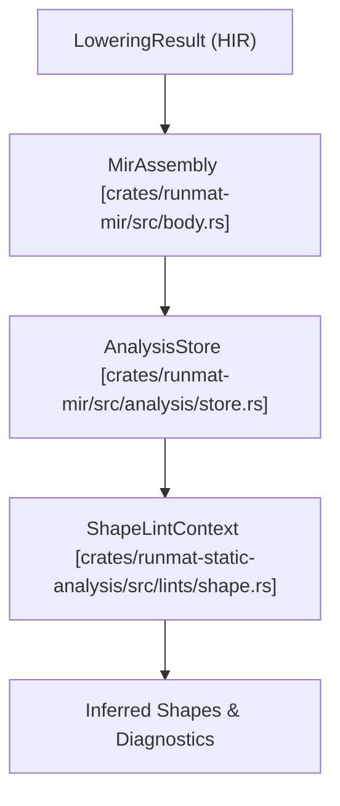
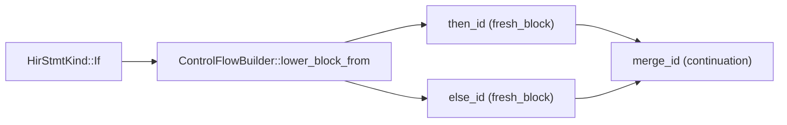

# MIR Analysis & Static Analysis

<details>
<summary>Relevant source files</summary>

- [crates/runmat-mir/src/analysis/dataflow.rs](https://github.com/runmat-org/runmat/blob/82685330/crates/runmat-mir/src/analysis/dataflow.rs)
- [crates/runmat-mir/src/analysis/facts.rs](https://github.com/runmat-org/runmat/blob/82685330/crates/runmat-mir/src/analysis/facts.rs)
- [crates/runmat-mir/src/analysis/mod.rs](https://github.com/runmat-org/runmat/blob/82685330/crates/runmat-mir/src/analysis/mod.rs)
- [crates/runmat-mir/src/analysis/spawn_safety.rs](https://github.com/runmat-org/runmat/blob/82685330/crates/runmat-mir/src/analysis/spawn_safety.rs)
- [crates/runmat-mir/src/analysis/store.rs](https://github.com/runmat-org/runmat/blob/82685330/crates/runmat-mir/src/analysis/store.rs)
- [crates/runmat-mir/src/async_.rs](https://github.com/runmat-org/runmat/blob/82685330/crates/runmat-mir/src/async_.rs)
- [crates/runmat-mir/src/body.rs](https://github.com/runmat-org/runmat/blob/82685330/crates/runmat-mir/src/body.rs)
- [crates/runmat-mir/src/call.rs](https://github.com/runmat-org/runmat/blob/82685330/crates/runmat-mir/src/call.rs)
- [crates/runmat-mir/src/lowering/control_flow.rs](https://github.com/runmat-org/runmat/blob/82685330/crates/runmat-mir/src/lowering/control_flow.rs)
- [crates/runmat-mir/src/lowering/ctx.rs](https://github.com/runmat-org/runmat/blob/82685330/crates/runmat-mir/src/lowering/ctx.rs)
- [crates/runmat-mir/src/lowering/expr.rs](https://github.com/runmat-org/runmat/blob/82685330/crates/runmat-mir/src/lowering/expr.rs)
- [crates/runmat-mir/src/lowering/function.rs](https://github.com/runmat-org/runmat/blob/82685330/crates/runmat-mir/src/lowering/function.rs)
- [crates/runmat-mir/src/lowering/place.rs](https://github.com/runmat-org/runmat/blob/82685330/crates/runmat-mir/src/lowering/place.rs)
- [crates/runmat-mir/src/lowering/stmt.rs](https://github.com/runmat-org/runmat/blob/82685330/crates/runmat-mir/src/lowering/stmt.rs)
- [crates/runmat-mir/src/rvalue.rs](https://github.com/runmat-org/runmat/blob/82685330/crates/runmat-mir/src/rvalue.rs)
- [crates/runmat-mir/src/stmt.rs](https://github.com/runmat-org/runmat/blob/82685330/crates/runmat-mir/src/stmt.rs)
- [crates/runmat-mir/src/terminator.rs](https://github.com/runmat-org/runmat/blob/82685330/crates/runmat-mir/src/terminator.rs)
- [crates/runmat-mir/tests/lowering.rs](https://github.com/runmat-org/runmat/blob/82685330/crates/runmat-mir/tests/lowering.rs)
- [crates/runmat-static-analysis/src/lib.rs](https://github.com/runmat-org/runmat/blob/82685330/crates/runmat-static-analysis/src/lib.rs)
- [crates/runmat-static-analysis/src/lints/mod.rs](https://github.com/runmat-org/runmat/blob/82685330/crates/runmat-static-analysis/src/lints/mod.rs)
- [crates/runmat-static-analysis/src/lints/shape.rs](https://github.com/runmat-org/runmat/blob/82685330/crates/runmat-static-analysis/src/lints/shape.rs)

</details>

Mid-Level IR (MIR) Analysis is the primary stage for dataflow reasoning and validation in the RunMat compilation pipeline. This layer bridges the gap between the structural representation of the High-Level IR (HIR) and the execution-ready bytecode. It performs type/shape inference, definite assignment checking, and spawn-safety validation to ensure program correctness before runtime.

## MIR Analysis Architecture

The analysis system operates on the `MirAssembly` structure, iterating through `MirBody` objects. The core of the analysis is a fixed-point dataflow engine that propagates "facts" across the Control Flow Graph (CFG).

### Analysis Data Structures

The results of these analyses are aggregated into an `AnalysisStore`, which serves as a central repository for metadata about MIR locals and global function properties.

| Entity | Role | Source |
| --- | --- | --- |
| AnalysisStore | Stores MirLocalFact entries and MirDiagnostic collections. | crates/runmat-mir/src/analysis/store.rs#9-13 |
| MirLocalKey | A unique identifier for a local variable, combining FunctionId and MirLocalId. | crates/runmat-mir/src/analysis/store.rs#15-19 |
| MirLocalFact | Contains inferred TypeFact, ShapeFact, ValueFlowFact, and AsyncValueFact. | crates/runmat-mir/src/analysis/dataflow.rs#51-62 |
| SimpleValueFact | Internal structure used during dataflow to track type, shape, and async state. | crates/runmat-mir/src/analysis/dataflow.rs#23-29 |

Sources: [crates/runmat-mir/src/analysis/store.rs #9-19](https://github.com/runmat-org/runmat/blob/82685330/crates/runmat-mir/src/analysis/store.rs#L9-L19) [crates/runmat-mir/src/analysis/dataflow.rs #23-62](https://github.com/runmat-org/runmat/blob/82685330/crates/runmat-mir/src/analysis/dataflow.rs#L23-L62)

### Dataflow Engine Implementation

The dataflow engine uses a worklist algorithm to compute facts for each `BasicBlock`.

1. Initialization: `compute_simple_local_facts` initializes `in_states` and `out_states` for all blocks in a `MirBody` [crates/runmat-mir/src/analysis/dataflow.rs #67-81](https://github.com/runmat-org/runmat/blob/82685330/crates/runmat-mir/src/analysis/dataflow.rs#L67-L81)
2. Transfer: The `transfer_fact_block` function updates facts based on `MirStmtKind::Assign` and `MirStmtKind::MultiAssign` within a block [crates/runmat-mir/src/analysis/dataflow.rs #116-139](https://github.com/runmat-org/runmat/blob/82685330/crates/runmat-mir/src/analysis/dataflow.rs#L116-L139)
3. Join: When multiple CFG edges meet, `join_fact_state` merges facts using lattice-based logic (e.g., merging specific types into `TypeFact::Unknown` if they conflict) [crates/runmat-mir/src/analysis/dataflow.rs #157-172](https://github.com/runmat-org/runmat/blob/82685330/crates/runmat-mir/src/analysis/dataflow.rs#L157-L172)

Sources: [crates/runmat-mir/src/analysis/dataflow.rs #67-172](https://github.com/runmat-org/runmat/blob/82685330/crates/runmat-mir/src/analysis/dataflow.rs#L67-L172)

## Key Analysis Domains

### 1. Definite Assignment (InitFact)

The `InitFact` analysis determines if a `MirLocal` is assigned before use. It tracks three states: `Unassigned`, `MaybeAssigned`, and `DefinitelyAssigned` [crates/runmat-mir/src/analysis/store.rs #48-53](https://github.com/runmat-org/runmat/blob/82685330/crates/runmat-mir/src/analysis/store.rs#L48-L53) This is critical for MATLAB semantics where accessing an uninitialized variable triggers a runtime error.

### 2. Type & Shape Inference

The `SimpleValueFact` tracks the evolution of array shapes and types.

- Rvalue Inference: `simple_rvalue_fact` determines facts from constants, aggregates (tensors/cells), and calls [crates/runmat-mir/src/analysis/dataflow.rs #175-199](https://github.com/runmat-org/runmat/blob/82685330/crates/runmat-mir/src/analysis/dataflow.rs#L175-L199)
- Shape Propagation: For operations like `MirRvalue::Binary`, the system attempts to resolve resulting shapes (e.g., matrix multiplication dimensions) [crates/runmat-static-analysis/src/lints/shape.rs #151-159](https://github.com/runmat-org/runmat/blob/82685330/crates/runmat-static-analysis/src/lints/shape.rs#L151-L159)

### 3. Spawn-Safety Checking

RunMat performs static validation on `spawn` expressions to ensure that closures captured for parallel execution do not violate memory safety or MATLAB's execution model.

- Capture Scanning: `analyze_capture_facts` walks the MIR to find all `reads_captures` and `writes_captures` [crates/runmat-mir/src/analysis/spawn_safety.rs #15-17](https://github.com/runmat-org/runmat/blob/82685330/crates/runmat-mir/src/analysis/spawn_safety.rs#L15-L17)
- Safety Fact: It produces a `SpawnSafetyFact`, identifying if a task is `RequiresIsolation` or is safe for shared execution [crates/runmat-mir/src/analysis/dataflow.rs #185-190](https://github.com/runmat-org/runmat/blob/82685330/crates/runmat-mir/src/analysis/dataflow.rs#L185-L190)

Sources: [crates/runmat-mir/src/analysis/store.rs #48-53](https://github.com/runmat-org/runmat/blob/82685330/crates/runmat-mir/src/analysis/store.rs#L48-L53) [crates/runmat-mir/src/analysis/dataflow.rs #175-199](https://github.com/runmat-org/runmat/blob/82685330/crates/runmat-mir/src/analysis/dataflow.rs#L175-L199) [crates/runmat-mir/src/analysis/spawn_safety.rs #15-76](https://github.com/runmat-org/runmat/blob/82685330/crates/runmat-mir/src/analysis/spawn_safety.rs#L15-L76) [crates/runmat-static-analysis/src/lints/shape.rs #151-159](https://github.com/runmat-org/runmat/blob/82685330/crates/runmat-static-analysis/src/lints/shape.rs#L151-L159)

## Static Analysis & Linting (runmat-static-analysis)

The `runmat-static-analysis` crate provides a linting layer on top of the MIR analysis. It consumes the `AnalysisStore` to produce user-facing diagnostics.

### Shape Linting Workflow

The `lint_shapes` function serves as the entry point for dimension-related validation.

#### Logic to Code Mapping: Shape Inference



<details>
<summary>Rendered SVG</summary>

```svg
<svg id="mermaid-3alj592nhoe" xmlns="http://www.w3.org/2000/svg" xmlns:xlink="http://www.w3.org/1999/xlink" class="flowchart" style="max-width: 100%; touch-action: none; user-select: none; cursor: grab; min-height: fit-content; max-height: 100%;" viewBox="0 0 346 800" role="graphics-document document" aria-roledescription="flowchart-v2" preserveAspectRatio="xMidYMid meet"><style>#mermaid-3alj592nhoe{font-family:ui-sans-serif,-apple-system,system-ui,Segoe UI,Helvetica;font-size:16px;fill:#ccc;}@keyframes edge-animation-frame{from{stroke-dashoffset:0;}}@keyframes dash{to{stroke-dashoffset:0;}}#mermaid-3alj592nhoe .edge-animation-slow{stroke-dasharray:9,5!important;stroke-dashoffset:900;animation:dash 50s linear infinite;stroke-linecap:round;}#mermaid-3alj592nhoe .edge-animation-fast{stroke-dasharray:9,5!important;stroke-dashoffset:900;animation:dash 20s linear infinite;stroke-linecap:round;}#mermaid-3alj592nhoe .error-icon{fill:#333;}#mermaid-3alj592nhoe .error-text{fill:#cccccc;stroke:#cccccc;}#mermaid-3alj592nhoe .edge-thickness-normal{stroke-width:1px;}#mermaid-3alj592nhoe .edge-thickness-thick{stroke-width:3.5px;}#mermaid-3alj592nhoe .edge-pattern-solid{stroke-dasharray:0;}#mermaid-3alj592nhoe .edge-thickness-invisible{stroke-width:0;fill:none;}#mermaid-3alj592nhoe .edge-pattern-dashed{stroke-dasharray:3;}#mermaid-3alj592nhoe .edge-pattern-dotted{stroke-dasharray:2;}#mermaid-3alj592nhoe .marker{fill:#666;stroke:#666;}#mermaid-3alj592nhoe .marker.cross{stroke:#666;}#mermaid-3alj592nhoe svg{font-family:ui-sans-serif,-apple-system,system-ui,Segoe UI,Helvetica;font-size:16px;}#mermaid-3alj592nhoe p{margin:0;}#mermaid-3alj592nhoe .label{font-family:ui-sans-serif,-apple-system,system-ui,Segoe UI,Helvetica;color:#fff;}#mermaid-3alj592nhoe .cluster-label text{fill:#fff;}#mermaid-3alj592nhoe .cluster-label span{color:#fff;}#mermaid-3alj592nhoe .cluster-label span p{background-color:transparent;}#mermaid-3alj592nhoe .label text,#mermaid-3alj592nhoe span{fill:#fff;color:#fff;}#mermaid-3alj592nhoe .node rect,#mermaid-3alj592nhoe .node circle,#mermaid-3alj592nhoe .node ellipse,#mermaid-3alj592nhoe .node polygon,#mermaid-3alj592nhoe .node path{fill:#111;stroke:#222;stroke-width:1px;}#mermaid-3alj592nhoe .rough-node .label text,#mermaid-3alj592nhoe .node .label text,#mermaid-3alj592nhoe .image-shape .label,#mermaid-3alj592nhoe .icon-shape .label{text-anchor:middle;}#mermaid-3alj592nhoe .node .katex path{fill:#000;stroke:#000;stroke-width:1px;}#mermaid-3alj592nhoe .rough-node .label,#mermaid-3alj592nhoe .node .label,#mermaid-3alj592nhoe .image-shape .label,#mermaid-3alj592nhoe .icon-shape .label{text-align:center;}#mermaid-3alj592nhoe .node.clickable{cursor:pointer;}#mermaid-3alj592nhoe .root .anchor path{fill:#666!important;stroke-width:0;stroke:#666;}#mermaid-3alj592nhoe .arrowheadPath{fill:#0b0b0b;}#mermaid-3alj592nhoe .edgePath .path{stroke:#666;stroke-width:1px;}#mermaid-3alj592nhoe .flowchart-link{stroke:#666;fill:none;}#mermaid-3alj592nhoe .edgeLabel{background-color:#161616;text-align:center;}#mermaid-3alj592nhoe .edgeLabel p{background-color:#161616;}#mermaid-3alj592nhoe .edgeLabel rect{opacity:0.5;background-color:#161616;fill:#161616;}#mermaid-3alj592nhoe .labelBkg{background-color:rgba(22, 22, 22, 0.5);}#mermaid-3alj592nhoe .cluster rect{fill:#161616;stroke:#222;stroke-width:1px;}#mermaid-3alj592nhoe .cluster text{fill:#fff;}#mermaid-3alj592nhoe .cluster span{color:#fff;}#mermaid-3alj592nhoe div.mermaidTooltip{position:absolute;text-align:center;max-width:200px;padding:2px;font-family:ui-sans-serif,-apple-system,system-ui,Segoe UI,Helvetica;font-size:12px;background:#333;border:1px solid hsl(0, 0%, 10%);border-radius:2px;pointer-events:none;z-index:100;}#mermaid-3alj592nhoe .flowchartTitleText{text-anchor:middle;font-size:18px;fill:#ccc;}#mermaid-3alj592nhoe rect.text{fill:none;stroke-width:0;}#mermaid-3alj592nhoe .icon-shape,#mermaid-3alj592nhoe .image-shape{background-color:#161616;text-align:center;}#mermaid-3alj592nhoe .icon-shape p,#mermaid-3alj592nhoe .image-shape p{background-color:#161616;padding:2px;}#mermaid-3alj592nhoe .icon-shape .label rect,#mermaid-3alj592nhoe .image-shape .label rect{opacity:0.5;background-color:#161616;fill:#161616;}#mermaid-3alj592nhoe .label-icon{display:inline-block;height:1em;overflow:visible;vertical-align:-0.125em;}#mermaid-3alj592nhoe .node .label-icon path{fill:currentColor;stroke:revert;stroke-width:revert;}#mermaid-3alj592nhoe .node .neo-node{stroke:#222;}#mermaid-3alj592nhoe [data-look="neo"].node rect,#mermaid-3alj592nhoe [data-look="neo"].cluster rect,#mermaid-3alj592nhoe [data-look="neo"].node polygon{stroke:url(#mermaid-3alj592nhoe-gradient);filter:drop-shadow( 1px 2px 2px rgba(185,185,185,1));}#mermaid-3alj592nhoe [data-look="neo"].node path{stroke:url(#mermaid-3alj592nhoe-gradient);stroke-width:1px;}#mermaid-3alj592nhoe [data-look="neo"].node .outer-path{filter:drop-shadow( 1px 2px 2px rgba(185,185,185,1));}#mermaid-3alj592nhoe [data-look="neo"].node .neo-line path{stroke:#222;filter:none;}#mermaid-3alj592nhoe [data-look="neo"].node circle{stroke:url(#mermaid-3alj592nhoe-gradient);filter:drop-shadow( 1px 2px 2px rgba(185,185,185,1));}#mermaid-3alj592nhoe [data-look="neo"].node circle .state-start{fill:#000000;}#mermaid-3alj592nhoe [data-look="neo"].icon-shape .icon{fill:url(#mermaid-3alj592nhoe-gradient);filter:drop-shadow( 1px 2px 2px rgba(185,185,185,1));}#mermaid-3alj592nhoe [data-look="neo"].icon-shape .icon-neo path{stroke:url(#mermaid-3alj592nhoe-gradient);filter:drop-shadow( 1px 2px 2px rgba(185,185,185,1));}#mermaid-3alj592nhoe :root{--mermaid-font-family:"trebuchet ms",verdana,arial,sans-serif;}</style><g><marker id="mermaid-3alj592nhoe_flowchart-v2-pointEnd" class="marker flowchart-v2" viewBox="0 0 10 10" refX="5" refY="5" markerUnits="userSpaceOnUse" markerWidth="8" markerHeight="8" orient="auto"><path d="M 0 0 L 10 5 L 0 10 z" class="arrowMarkerPath" style="stroke-width: 1; stroke-dasharray: 1, 0;"></path></marker><marker id="mermaid-3alj592nhoe_flowchart-v2-pointStart" class="marker flowchart-v2" viewBox="0 0 10 10" refX="4.5" refY="5" markerUnits="userSpaceOnUse" markerWidth="8" markerHeight="8" orient="auto"><path d="M 0 5 L 10 10 L 10 0 z" class="arrowMarkerPath" style="stroke-width: 1; stroke-dasharray: 1, 0;"></path></marker><marker id="mermaid-3alj592nhoe_flowchart-v2-pointEnd-margin" class="marker flowchart-v2" viewBox="0 0 11.5 14" refX="11.5" refY="7" markerUnits="userSpaceOnUse" markerWidth="10.5" markerHeight="14" orient="auto"><path d="M 0 0 L 11.5 7 L 0 14 z" class="arrowMarkerPath" style="stroke-width: 0; stroke-dasharray: 1, 0;"></path></marker><marker id="mermaid-3alj592nhoe_flowchart-v2-pointStart-margin" class="marker flowchart-v2" viewBox="0 0 11.5 14" refX="1" refY="7" markerUnits="userSpaceOnUse" markerWidth="11.5" markerHeight="14" orient="auto"><polygon points="0,7 11.5,14 11.5,0" class="arrowMarkerPath" style="stroke-width: 0; stroke-dasharray: 1, 0;"></polygon></marker><marker id="mermaid-3alj592nhoe_flowchart-v2-circleEnd" class="marker flowchart-v2" viewBox="0 0 10 10" refX="11" refY="5" markerUnits="userSpaceOnUse" markerWidth="11" markerHeight="11" orient="auto"><circle cx="5" cy="5" r="5" class="arrowMarkerPath" style="stroke-width: 1; stroke-dasharray: 1, 0;"></circle></marker><marker id="mermaid-3alj592nhoe_flowchart-v2-circleStart" class="marker flowchart-v2" viewBox="0 0 10 10" refX="-1" refY="5" markerUnits="userSpaceOnUse" markerWidth="11" markerHeight="11" orient="auto"><circle cx="5" cy="5" r="5" class="arrowMarkerPath" style="stroke-width: 1; stroke-dasharray: 1, 0;"></circle></marker><marker id="mermaid-3alj592nhoe_flowchart-v2-circleEnd-margin" class="marker flowchart-v2" viewBox="0 0 10 10" refY="5" refX="12.25" markerUnits="userSpaceOnUse" markerWidth="14" markerHeight="14" orient="auto"><circle cx="5" cy="5" r="5" class="arrowMarkerPath" style="stroke-width: 0; stroke-dasharray: 1, 0;"></circle></marker><marker id="mermaid-3alj592nhoe_flowchart-v2-circleStart-margin" class="marker flowchart-v2" viewBox="0 0 10 10" refX="-2" refY="5" markerUnits="userSpaceOnUse" markerWidth="14" markerHeight="14" orient="auto"><circle cx="5" cy="5" r="5" class="arrowMarkerPath" style="stroke-width: 0; stroke-dasharray: 1, 0;"></circle></marker><marker id="mermaid-3alj592nhoe_flowchart-v2-crossEnd" class="marker cross flowchart-v2" viewBox="0 0 11 11" refX="12" refY="5.2" markerUnits="userSpaceOnUse" markerWidth="11" markerHeight="11" orient="auto"><path d="M 1,1 l 9,9 M 10,1 l -9,9" class="arrowMarkerPath" style="stroke-width: 2; stroke-dasharray: 1, 0;"></path></marker><marker id="mermaid-3alj592nhoe_flowchart-v2-crossStart" class="marker cross flowchart-v2" viewBox="0 0 11 11" refX="-1" refY="5.2" markerUnits="userSpaceOnUse" markerWidth="11" markerHeight="11" orient="auto"><path d="M 1,1 l 9,9 M 10,1 l -9,9" class="arrowMarkerPath" style="stroke-width: 2; stroke-dasharray: 1, 0;"></path></marker><marker id="mermaid-3alj592nhoe_flowchart-v2-crossEnd-margin" class="marker cross flowchart-v2" viewBox="0 0 15 15" refX="17.7" refY="7.5" markerUnits="userSpaceOnUse" markerWidth="12" markerHeight="12" orient="auto"><path d="M 1,1 L 14,14 M 1,14 L 14,1" class="arrowMarkerPath" style="stroke-width: 2.5;"></path></marker><marker id="mermaid-3alj592nhoe_flowchart-v2-crossStart-margin" class="marker cross flowchart-v2" viewBox="0 0 15 15" refX="-3.5" refY="7.5" markerUnits="userSpaceOnUse" markerWidth="12" markerHeight="12" orient="auto"><path d="M 1,1 L 14,14 M 1,14 L 14,1" class="arrowMarkerPath" style="stroke-width: 2.5; stroke-dasharray: 1, 0;"></path></marker><g class="root"><g class="clusters"><g class="cluster" id="mermaid-3alj592nhoe-subGraph0" data-look="classic"><rect style="" x="8" y="136" width="330" height="504"></rect><g class="cluster-label" transform="translate(124.8828125, 136)"><foreignObject width="96.234375" height="24"><div style="display: table-cell; white-space: nowrap; line-height: 1.5;" xmlns="http://www.w3.org/1999/xhtml"><span class="nodeLabel"><p>Code Entities</p></span></div></foreignObject></g></g></g><g class="edgePaths"><path d="M173,62L173,68.167C173,74.333,173,86.667,173,99C173,111.333,173,123.667,173,133.333C173,143,173,150,173,153.5L173,157" id="mermaid-3alj592nhoe-L_A_B_0" class="edge-thickness-normal edge-pattern-solid edge-thickness-normal edge-pattern-solid flowchart-link" style=";" data-edge="true" data-et="edge" data-id="L_A_B_0" data-points="W3sieCI6MTczLCJ5Ijo2Mn0seyJ4IjoxNzMsInkiOjk5fSx7IngiOjE3MywieSI6MTM2fSx7IngiOjE3MywieSI6MTYxfV0=" data-look="classic" marker-end="url(#mermaid-3alj592nhoe_flowchart-v2-pointEnd)"></path><path d="M173,263L173,269.167C173,275.333,173,287.667,173,299.333C173,311,173,322,173,327.5L173,333" id="mermaid-3alj592nhoe-L_B_C_0" class="edge-thickness-normal edge-pattern-solid edge-thickness-normal edge-pattern-solid flowchart-link" style=";" data-edge="true" data-et="edge" data-id="L_B_C_0" data-points="W3sieCI6MTczLCJ5IjoyNjN9LHsieCI6MTczLCJ5IjozMDB9LHsieCI6MTczLCJ5IjozMzd9XQ==" data-look="classic" marker-end="url(#mermaid-3alj592nhoe_flowchart-v2-pointEnd)"></path><path d="M173,439L173,445.167C173,451.333,173,463.667,173,475.333C173,487,173,498,173,503.5L173,509" id="mermaid-3alj592nhoe-L_C_D_0" class="edge-thickness-normal edge-pattern-solid edge-thickness-normal edge-pattern-solid flowchart-link" style=";" data-edge="true" data-et="edge" data-id="L_C_D_0" data-points="W3sieCI6MTczLCJ5Ijo0Mzl9LHsieCI6MTczLCJ5Ijo0NzZ9LHsieCI6MTczLCJ5Ijo1MTN9XQ==" data-look="classic" marker-end="url(#mermaid-3alj592nhoe_flowchart-v2-pointEnd)"></path><path d="M173,615L173,619.167C173,623.333,173,631.667,173,642C173,652.333,173,664.667,173,676.333C173,688,173,699,173,704.5L173,710" id="mermaid-3alj592nhoe-L_D_E_0" class="edge-thickness-normal edge-pattern-solid edge-thickness-normal edge-pattern-solid flowchart-link" style=";" data-edge="true" data-et="edge" data-id="L_D_E_0" data-points="W3sieCI6MTczLCJ5Ijo2MTV9LHsieCI6MTczLCJ5Ijo2NDB9LHsieCI6MTczLCJ5Ijo2Nzd9LHsieCI6MTczLCJ5Ijo3MTR9XQ==" data-look="classic" marker-end="url(#mermaid-3alj592nhoe_flowchart-v2-pointEnd)"></path></g><g class="edgeLabels"><g class="edgeLabel" transform="translate(173, 99)"><g class="label" data-id="L_A_B_0" transform="translate(-63.703125, -12)"><foreignObject width="127.40625" height="24"><div style="display: table-cell; white-space: nowrap; line-height: 1.5; max-width: 200px; text-align: center;" xmlns="http://www.w3.org/1999/xhtml" class="labelBkg"><span class="edgeLabel"><p>lower_assembly()</p></span></div></foreignObject></g></g><g class="edgeLabel" transform="translate(173, 300)"><g class="label" data-id="L_B_C_0" transform="translate(-71.8828125, -12)"><foreignObject width="143.765625" height="24"><div style="display: table-cell; white-space: nowrap; line-height: 1.5; max-width: 200px; text-align: center;" xmlns="http://www.w3.org/1999/xhtml" class="labelBkg"><span class="edgeLabel"><p>analyze_assembly()</p></span></div></foreignObject></g></g><g class="edgeLabel" transform="translate(173, 476)"><g class="label" data-id="L_C_D_0" transform="translate(-78.09375, -12)"><foreignObject width="156.1875" height="24"><div style="display: table-cell; white-space: nowrap; line-height: 1.5; max-width: 200px; text-align: center;" xmlns="http://www.w3.org/1999/xhtml" class="labelBkg"><span class="edgeLabel"><p>seed_from_analysis()</p></span></div></foreignObject></g></g><g class="edgeLabel" transform="translate(173, 677)"><g class="label" data-id="L_D_E_0" transform="translate(-76.4921875, -12)"><foreignObject width="152.984375" height="24"><div style="display: table-cell; white-space: nowrap; line-height: 1.5; max-width: 200px; text-align: center;" xmlns="http://www.w3.org/1999/xhtml" class="labelBkg"><span class="edgeLabel"><p>walk_mir_assembly()</p></span></div></foreignObject></g></g></g><g class="nodes"><g class="node default" id="mermaid-3alj592nhoe-flowchart-A-0" data-look="classic" transform="translate(173, 35)"><rect class="basic label-container" style="" x="-106.1015625" y="-27" width="212.203125" height="54"></rect><g class="label" style="" transform="translate(-76.1015625, -12)"><rect></rect><foreignObject width="152.203125" height="24"><div style="display: table-cell; white-space: nowrap; line-height: 1.5; max-width: 200px; text-align: center;" xmlns="http://www.w3.org/1999/xhtml"><span class="nodeLabel"><p>LoweringResult (HIR)</p></span></div></foreignObject></g></g><g class="node default" id="mermaid-3alj592nhoe-flowchart-B-1" data-look="classic" transform="translate(173, 212)"><rect class="basic label-container" style="" x="-130" y="-51" width="260" height="102"></rect><g class="label" style="" transform="translate(-100, -36)"><rect></rect><foreignObject width="200" height="72"><div style="display: table; white-space: break-spaces; line-height: 1.5; max-width: 200px; text-align: center; width: 200px;" xmlns="http://www.w3.org/1999/xhtml"><span class="nodeLabel"><p>MirAssembly [crates/runmat-mir/src/body.rs]</p></span></div></foreignObject></g></g><g class="node default" id="mermaid-3alj592nhoe-flowchart-C-3" data-look="classic" transform="translate(173, 388)"><rect class="basic label-container" style="" x="-130" y="-51" width="260" height="102"></rect><g class="label" style="" transform="translate(-100, -36)"><rect></rect><foreignObject width="200" height="72"><div style="display: table; white-space: break-spaces; line-height: 1.5; max-width: 200px; text-align: center; width: 200px;" xmlns="http://www.w3.org/1999/xhtml"><span class="nodeLabel"><p>AnalysisStore [crates/runmat-mir/src/analysis/store.rs]</p></span></div></foreignObject></g></g><g class="node default" id="mermaid-3alj592nhoe-flowchart-D-5" data-look="classic" transform="translate(173, 564)"><rect class="basic label-container" style="" x="-130" y="-51" width="260" height="102"></rect><g class="label" style="" transform="translate(-100, -36)"><rect></rect><foreignObject width="200" height="72"><div style="display: table; white-space: break-spaces; line-height: 1.5; max-width: 200px; text-align: center; width: 200px;" xmlns="http://www.w3.org/1999/xhtml"><span class="nodeLabel"><p>ShapeLintContext [crates/runmat-static-analysis/src/lints/shape.rs]</p></span></div></foreignObject></g></g><g class="node default" id="mermaid-3alj592nhoe-flowchart-E-7" data-look="classic" transform="translate(173, 753)"><rect class="basic label-container" style="" x="-130" y="-39" width="260" height="78"></rect><g class="label" style="" transform="translate(-100, -24)"><rect></rect><foreignObject width="200" height="48"><div style="display: table; white-space: break-spaces; line-height: 1.5; max-width: 200px; text-align: center; width: 200px;" xmlns="http://www.w3.org/1999/xhtml"><span class="nodeLabel"><p>Inferred Shapes &amp; Diagnostics</p></span></div></foreignObject></g></g></g></g></g><defs><filter id="mermaid-3alj592nhoe-drop-shadow" height="130%" width="130%"><feDropShadow dx="4" dy="4" stdDeviation="0" flood-opacity="0.06" flood-color="#000000"></feDropShadow></filter></defs><defs><filter id="mermaid-3alj592nhoe-drop-shadow-small" height="150%" width="150%"><feDropShadow dx="2" dy="2" stdDeviation="0" flood-opacity="0.06" flood-color="#000000"></feDropShadow></filter></defs><linearGradient id="mermaid-3alj592nhoe-gradient" gradientUnits="objectBoundingBox" x1="0%" y1="0%" x2="100%" y2="0%"><stop offset="0%" stop-color="#333" stop-opacity="1"></stop><stop offset="100%" stop-color="hsl(-120, 0%, 3.3333333333%)" stop-opacity="1"></stop></linearGradient></svg>
```

</details>

Implementation Details:

- Seeding: `seed_from_analysis` populates the linting environment with facts already discovered by the core MIR dataflow [crates/runmat-static-analysis/src/lints/shape.rs #64-81](https://github.com/runmat-org/runmat/blob/82685330/crates/runmat-static-analysis/src/lints/shape.rs#L64-L81)
- Refinement: `walk_mir_assembly` performs a second pass to specifically track numeric constants and integer vectors (like `[1 2 3]`) that are often used as shape arguments in functions like `reshape` or `zeros` [crates/runmat-static-analysis/src/lints/shape.rs #83-105](https://github.com/runmat-org/runmat/blob/82685330/crates/runmat-static-analysis/src/lints/shape.rs#L83-L105)
- Diagnostic Generation: If a binary operation (e.g., `+`) is performed on incompatible shapes, a `HirDiagnostic` is generated with `HirDiagnosticSeverity::Error` [crates/runmat-static-analysis/src/lints/shape.rs #35-42](https://github.com/runmat-org/runmat/blob/82685330/crates/runmat-static-analysis/src/lints/shape.rs#L35-L42)

Sources: [crates/runmat-static-analysis/src/lints/shape.rs #6-105](https://github.com/runmat-org/runmat/blob/82685330/crates/runmat-static-analysis/src/lints/shape.rs#L6-L105) [crates/runmat-mir/src/analysis/store.rs #9-13](https://github.com/runmat-org/runmat/blob/82685330/crates/runmat-mir/src/analysis/store.rs#L9-L13)

## Control Flow Lowering to MIR

The analysis relies on a well-formed CFG generated by the `ControlFlowBuilder`. This builder transforms nested HIR structures into `BasicBlock` sequences.

#### Logic to Code Mapping: CFG Construction



<details>
<summary>Rendered SVG</summary>

```svg
<svg id="mermaid-gpqfoc8bmic" xmlns="http://www.w3.org/2000/svg" xmlns:xlink="http://www.w3.org/1999/xlink" class="flowchart" style="max-width: 100%; touch-action: none; user-select: none; cursor: grab; min-height: fit-content; max-height: 100%;" viewBox="-0.029666179337255016 0 1217.6218323586745 244" role="graphics-document document" aria-roledescription="flowchart-v2" preserveAspectRatio="xMidYMid meet"><style>#mermaid-gpqfoc8bmic{font-family:ui-sans-serif,-apple-system,system-ui,Segoe UI,Helvetica;font-size:16px;fill:#ccc;}@keyframes edge-animation-frame{from{stroke-dashoffset:0;}}@keyframes dash{to{stroke-dashoffset:0;}}#mermaid-gpqfoc8bmic .edge-animation-slow{stroke-dasharray:9,5!important;stroke-dashoffset:900;animation:dash 50s linear infinite;stroke-linecap:round;}#mermaid-gpqfoc8bmic .edge-animation-fast{stroke-dasharray:9,5!important;stroke-dashoffset:900;animation:dash 20s linear infinite;stroke-linecap:round;}#mermaid-gpqfoc8bmic .error-icon{fill:#333;}#mermaid-gpqfoc8bmic .error-text{fill:#cccccc;stroke:#cccccc;}#mermaid-gpqfoc8bmic .edge-thickness-normal{stroke-width:1px;}#mermaid-gpqfoc8bmic .edge-thickness-thick{stroke-width:3.5px;}#mermaid-gpqfoc8bmic .edge-pattern-solid{stroke-dasharray:0;}#mermaid-gpqfoc8bmic .edge-thickness-invisible{stroke-width:0;fill:none;}#mermaid-gpqfoc8bmic .edge-pattern-dashed{stroke-dasharray:3;}#mermaid-gpqfoc8bmic .edge-pattern-dotted{stroke-dasharray:2;}#mermaid-gpqfoc8bmic .marker{fill:#666;stroke:#666;}#mermaid-gpqfoc8bmic .marker.cross{stroke:#666;}#mermaid-gpqfoc8bmic svg{font-family:ui-sans-serif,-apple-system,system-ui,Segoe UI,Helvetica;font-size:16px;}#mermaid-gpqfoc8bmic p{margin:0;}#mermaid-gpqfoc8bmic .label{font-family:ui-sans-serif,-apple-system,system-ui,Segoe UI,Helvetica;color:#fff;}#mermaid-gpqfoc8bmic .cluster-label text{fill:#fff;}#mermaid-gpqfoc8bmic .cluster-label span{color:#fff;}#mermaid-gpqfoc8bmic .cluster-label span p{background-color:transparent;}#mermaid-gpqfoc8bmic .label text,#mermaid-gpqfoc8bmic span{fill:#fff;color:#fff;}#mermaid-gpqfoc8bmic .node rect,#mermaid-gpqfoc8bmic .node circle,#mermaid-gpqfoc8bmic .node ellipse,#mermaid-gpqfoc8bmic .node polygon,#mermaid-gpqfoc8bmic .node path{fill:#111;stroke:#222;stroke-width:1px;}#mermaid-gpqfoc8bmic .rough-node .label text,#mermaid-gpqfoc8bmic .node .label text,#mermaid-gpqfoc8bmic .image-shape .label,#mermaid-gpqfoc8bmic .icon-shape .label{text-anchor:middle;}#mermaid-gpqfoc8bmic .node .katex path{fill:#000;stroke:#000;stroke-width:1px;}#mermaid-gpqfoc8bmic .rough-node .label,#mermaid-gpqfoc8bmic .node .label,#mermaid-gpqfoc8bmic .image-shape .label,#mermaid-gpqfoc8bmic .icon-shape .label{text-align:center;}#mermaid-gpqfoc8bmic .node.clickable{cursor:pointer;}#mermaid-gpqfoc8bmic .root .anchor path{fill:#666!important;stroke-width:0;stroke:#666;}#mermaid-gpqfoc8bmic .arrowheadPath{fill:#0b0b0b;}#mermaid-gpqfoc8bmic .edgePath .path{stroke:#666;stroke-width:1px;}#mermaid-gpqfoc8bmic .flowchart-link{stroke:#666;fill:none;}#mermaid-gpqfoc8bmic .edgeLabel{background-color:#161616;text-align:center;}#mermaid-gpqfoc8bmic .edgeLabel p{background-color:#161616;}#mermaid-gpqfoc8bmic .edgeLabel rect{opacity:0.5;background-color:#161616;fill:#161616;}#mermaid-gpqfoc8bmic .labelBkg{background-color:rgba(22, 22, 22, 0.5);}#mermaid-gpqfoc8bmic .cluster rect{fill:#161616;stroke:#222;stroke-width:1px;}#mermaid-gpqfoc8bmic .cluster text{fill:#fff;}#mermaid-gpqfoc8bmic .cluster span{color:#fff;}#mermaid-gpqfoc8bmic div.mermaidTooltip{position:absolute;text-align:center;max-width:200px;padding:2px;font-family:ui-sans-serif,-apple-system,system-ui,Segoe UI,Helvetica;font-size:12px;background:#333;border:1px solid hsl(0, 0%, 10%);border-radius:2px;pointer-events:none;z-index:100;}#mermaid-gpqfoc8bmic .flowchartTitleText{text-anchor:middle;font-size:18px;fill:#ccc;}#mermaid-gpqfoc8bmic rect.text{fill:none;stroke-width:0;}#mermaid-gpqfoc8bmic .icon-shape,#mermaid-gpqfoc8bmic .image-shape{background-color:#161616;text-align:center;}#mermaid-gpqfoc8bmic .icon-shape p,#mermaid-gpqfoc8bmic .image-shape p{background-color:#161616;padding:2px;}#mermaid-gpqfoc8bmic .icon-shape .label rect,#mermaid-gpqfoc8bmic .image-shape .label rect{opacity:0.5;background-color:#161616;fill:#161616;}#mermaid-gpqfoc8bmic .label-icon{display:inline-block;height:1em;overflow:visible;vertical-align:-0.125em;}#mermaid-gpqfoc8bmic .node .label-icon path{fill:currentColor;stroke:revert;stroke-width:revert;}#mermaid-gpqfoc8bmic .node .neo-node{stroke:#222;}#mermaid-gpqfoc8bmic [data-look="neo"].node rect,#mermaid-gpqfoc8bmic [data-look="neo"].cluster rect,#mermaid-gpqfoc8bmic [data-look="neo"].node polygon{stroke:url(#mermaid-gpqfoc8bmic-gradient);filter:drop-shadow( 1px 2px 2px rgba(185,185,185,1));}#mermaid-gpqfoc8bmic [data-look="neo"].node path{stroke:url(#mermaid-gpqfoc8bmic-gradient);stroke-width:1px;}#mermaid-gpqfoc8bmic [data-look="neo"].node .outer-path{filter:drop-shadow( 1px 2px 2px rgba(185,185,185,1));}#mermaid-gpqfoc8bmic [data-look="neo"].node .neo-line path{stroke:#222;filter:none;}#mermaid-gpqfoc8bmic [data-look="neo"].node circle{stroke:url(#mermaid-gpqfoc8bmic-gradient);filter:drop-shadow( 1px 2px 2px rgba(185,185,185,1));}#mermaid-gpqfoc8bmic [data-look="neo"].node circle .state-start{fill:#000000;}#mermaid-gpqfoc8bmic [data-look="neo"].icon-shape .icon{fill:url(#mermaid-gpqfoc8bmic-gradient);filter:drop-shadow( 1px 2px 2px rgba(185,185,185,1));}#mermaid-gpqfoc8bmic [data-look="neo"].icon-shape .icon-neo path{stroke:url(#mermaid-gpqfoc8bmic-gradient);filter:drop-shadow( 1px 2px 2px rgba(185,185,185,1));}#mermaid-gpqfoc8bmic :root{--mermaid-font-family:"trebuchet ms",verdana,arial,sans-serif;}</style><g><marker id="mermaid-gpqfoc8bmic_flowchart-v2-pointEnd" class="marker flowchart-v2" viewBox="0 0 10 10" refX="5" refY="5" markerUnits="userSpaceOnUse" markerWidth="8" markerHeight="8" orient="auto"><path d="M 0 0 L 10 5 L 0 10 z" class="arrowMarkerPath" style="stroke-width: 1; stroke-dasharray: 1, 0;"></path></marker><marker id="mermaid-gpqfoc8bmic_flowchart-v2-pointStart" class="marker flowchart-v2" viewBox="0 0 10 10" refX="4.5" refY="5" markerUnits="userSpaceOnUse" markerWidth="8" markerHeight="8" orient="auto"><path d="M 0 5 L 10 10 L 10 0 z" class="arrowMarkerPath" style="stroke-width: 1; stroke-dasharray: 1, 0;"></path></marker><marker id="mermaid-gpqfoc8bmic_flowchart-v2-pointEnd-margin" class="marker flowchart-v2" viewBox="0 0 11.5 14" refX="11.5" refY="7" markerUnits="userSpaceOnUse" markerWidth="10.5" markerHeight="14" orient="auto"><path d="M 0 0 L 11.5 7 L 0 14 z" class="arrowMarkerPath" style="stroke-width: 0; stroke-dasharray: 1, 0;"></path></marker><marker id="mermaid-gpqfoc8bmic_flowchart-v2-pointStart-margin" class="marker flowchart-v2" viewBox="0 0 11.5 14" refX="1" refY="7" markerUnits="userSpaceOnUse" markerWidth="11.5" markerHeight="14" orient="auto"><polygon points="0,7 11.5,14 11.5,0" class="arrowMarkerPath" style="stroke-width: 0; stroke-dasharray: 1, 0;"></polygon></marker><marker id="mermaid-gpqfoc8bmic_flowchart-v2-circleEnd" class="marker flowchart-v2" viewBox="0 0 10 10" refX="11" refY="5" markerUnits="userSpaceOnUse" markerWidth="11" markerHeight="11" orient="auto"><circle cx="5" cy="5" r="5" class="arrowMarkerPath" style="stroke-width: 1; stroke-dasharray: 1, 0;"></circle></marker><marker id="mermaid-gpqfoc8bmic_flowchart-v2-circleStart" class="marker flowchart-v2" viewBox="0 0 10 10" refX="-1" refY="5" markerUnits="userSpaceOnUse" markerWidth="11" markerHeight="11" orient="auto"><circle cx="5" cy="5" r="5" class="arrowMarkerPath" style="stroke-width: 1; stroke-dasharray: 1, 0;"></circle></marker><marker id="mermaid-gpqfoc8bmic_flowchart-v2-circleEnd-margin" class="marker flowchart-v2" viewBox="0 0 10 10" refY="5" refX="12.25" markerUnits="userSpaceOnUse" markerWidth="14" markerHeight="14" orient="auto"><circle cx="5" cy="5" r="5" class="arrowMarkerPath" style="stroke-width: 0; stroke-dasharray: 1, 0;"></circle></marker><marker id="mermaid-gpqfoc8bmic_flowchart-v2-circleStart-margin" class="marker flowchart-v2" viewBox="0 0 10 10" refX="-2" refY="5" markerUnits="userSpaceOnUse" markerWidth="14" markerHeight="14" orient="auto"><circle cx="5" cy="5" r="5" class="arrowMarkerPath" style="stroke-width: 0; stroke-dasharray: 1, 0;"></circle></marker><marker id="mermaid-gpqfoc8bmic_flowchart-v2-crossEnd" class="marker cross flowchart-v2" viewBox="0 0 11 11" refX="12" refY="5.2" markerUnits="userSpaceOnUse" markerWidth="11" markerHeight="11" orient="auto"><path d="M 1,1 l 9,9 M 10,1 l -9,9" class="arrowMarkerPath" style="stroke-width: 2; stroke-dasharray: 1, 0;"></path></marker><marker id="mermaid-gpqfoc8bmic_flowchart-v2-crossStart" class="marker cross flowchart-v2" viewBox="0 0 11 11" refX="-1" refY="5.2" markerUnits="userSpaceOnUse" markerWidth="11" markerHeight="11" orient="auto"><path d="M 1,1 l 9,9 M 10,1 l -9,9" class="arrowMarkerPath" style="stroke-width: 2; stroke-dasharray: 1, 0;"></path></marker><marker id="mermaid-gpqfoc8bmic_flowchart-v2-crossEnd-margin" class="marker cross flowchart-v2" viewBox="0 0 15 15" refX="17.7" refY="7.5" markerUnits="userSpaceOnUse" markerWidth="12" markerHeight="12" orient="auto"><path d="M 1,1 L 14,14 M 1,14 L 14,1" class="arrowMarkerPath" style="stroke-width: 2.5;"></path></marker><marker id="mermaid-gpqfoc8bmic_flowchart-v2-crossStart-margin" class="marker cross flowchart-v2" viewBox="0 0 15 15" refX="-3.5" refY="7.5" markerUnits="userSpaceOnUse" markerWidth="12" markerHeight="12" orient="auto"><path d="M 1,1 L 14,14 M 1,14 L 14,1" class="arrowMarkerPath" style="stroke-width: 2.5; stroke-dasharray: 1, 0;"></path></marker><g class="root"><g class="clusters"><g class="cluster" id="mermaid-gpqfoc8bmic-subGraph1" data-look="classic"><rect style="" x="274.203125" y="8" width="935.359375" height="228"></rect><g class="cluster-label" transform="translate(525.5078125, 8)"><foreignObject width="432.75" height="24"><div style="display: table-cell; white-space: nowrap; line-height: 1.5;" xmlns="http://www.w3.org/1999/xhtml"><span class="nodeLabel"><p>MIR Builder [crates/runmat-mir/src/lowering/control_flow.rs]</p></span></div></foreignObject></g></g><g class="cluster" id="mermaid-gpqfoc8bmic-subGraph0" data-look="classic"><rect style="" x="8" y="60" width="216.203125" height="124"></rect><g class="cluster-label" transform="translate(67.2265625, 60)"><foreignObject width="97.75" height="24"><div style="display: table-cell; white-space: nowrap; line-height: 1.5;" xmlns="http://www.w3.org/1999/xhtml"><span class="nodeLabel"><p>HIR Structure</p></span></div></foreignObject></g></g></g><g class="edgePaths"><path d="M199.203,122L203.37,122C207.536,122,215.87,122,224.203,122C232.536,122,240.87,122,249.203,122C257.536,122,265.87,122,273.536,122C281.203,122,288.203,122,291.703,122L295.203,122" id="mermaid-gpqfoc8bmic-L_H_STMT_CFB_0" class="edge-thickness-normal edge-pattern-solid edge-thickness-normal edge-pattern-solid flowchart-link" style=";" data-edge="true" data-et="edge" data-id="L_H_STMT_CFB_0" data-points="W3sieCI6MTk5LjIwMzEyNSwieSI6MTIyfSx7IngiOjIyNC4yMDMxMjUsInkiOjEyMn0seyJ4IjoyNDkuMjAzMTI1LCJ5IjoxMjJ9LHsieCI6Mjc0LjIwMzEyNSwieSI6MTIyfSx7IngiOjI5OS4yMDMxMjUsInkiOjEyMn1d" data-look="classic" marker-end="url(#mermaid-gpqfoc8bmic_flowchart-v2-pointEnd)"></path><path d="M567.367,95L582.829,90.833C598.292,86.667,629.216,78.333,648.178,74.167C667.141,70,674.141,70,677.641,70L681.141,70" id="mermaid-gpqfoc8bmic-L_CFB_THEN_0" class="edge-thickness-normal edge-pattern-solid edge-thickness-normal edge-pattern-solid flowchart-link" style=";" data-edge="true" data-et="edge" data-id="L_CFB_THEN_0" data-points="W3sieCI6NTY3LjM2NzE4NzUsInkiOjk1fSx7IngiOjY2MC4xNDA2MjUsInkiOjcwfSx7IngiOjY4NS4xNDA2MjUsInkiOjcwfV0=" data-look="classic" marker-end="url(#mermaid-gpqfoc8bmic_flowchart-v2-pointEnd)"></path><path d="M567.367,149L582.829,153.167C598.292,157.333,629.216,165.667,648.454,169.833C667.693,174,675.245,174,679.021,174L682.797,174" id="mermaid-gpqfoc8bmic-L_CFB_ELSE_0" class="edge-thickness-normal edge-pattern-solid edge-thickness-normal edge-pattern-solid flowchart-link" style=";" data-edge="true" data-et="edge" data-id="L_CFB_ELSE_0" data-points="W3sieCI6NTY3LjM2NzE4NzUsInkiOjE0OX0seyJ4Ijo2NjAuMTQwNjI1LCJ5IjoxNzR9LHsieCI6Njg2Ljc5Njg3NSwieSI6MTc0fV0=" data-look="classic" marker-end="url(#mermaid-gpqfoc8bmic_flowchart-v2-pointEnd)"></path><path d="M901,70L905.167,70C909.333,70,917.667,70,932.568,73.937C947.47,77.874,968.939,85.748,979.674,89.686L990.409,93.623" id="mermaid-gpqfoc8bmic-L_THEN_MERGE_0" class="edge-thickness-normal edge-pattern-solid edge-thickness-normal edge-pattern-solid flowchart-link" style=";" data-edge="true" data-et="edge" data-id="L_THEN_MERGE_0" data-points="W3sieCI6OTAxLCJ5Ijo3MH0seyJ4Ijo5MjYsInkiOjcwfSx7IngiOjk5NC4xNjQwNjI1LCJ5Ijo5NX1d" data-look="classic" marker-end="url(#mermaid-gpqfoc8bmic_flowchart-v2-pointEnd)"></path><path d="M899.344,174L903.786,174C908.229,174,917.115,174,932.292,170.063C947.47,166.126,968.939,158.252,979.674,154.314L990.409,150.377" id="mermaid-gpqfoc8bmic-L_ELSE_MERGE_0" class="edge-thickness-normal edge-pattern-solid edge-thickness-normal edge-pattern-solid flowchart-link" style=";" data-edge="true" data-et="edge" data-id="L_ELSE_MERGE_0" data-points="W3sieCI6ODk5LjM0Mzc1LCJ5IjoxNzR9LHsieCI6OTI2LCJ5IjoxNzR9LHsieCI6OTk0LjE2NDA2MjUsInkiOjE0OX1d" data-look="classic" marker-end="url(#mermaid-gpqfoc8bmic_flowchart-v2-pointEnd)"></path></g><g class="edgeLabels"><g class="edgeLabel"><g class="label" data-id="L_H_STMT_CFB_0" transform="translate(0, 0)"><foreignObject width="0" height="0"><div style="display: table-cell; white-space: nowrap; line-height: 1.5; max-width: 200px; text-align: center;" xmlns="http://www.w3.org/1999/xhtml" class="labelBkg"><span class="edgeLabel"></span></div></foreignObject></g></g><g class="edgeLabel"><g class="label" data-id="L_CFB_THEN_0" transform="translate(0, 0)"><foreignObject width="0" height="0"><div style="display: table-cell; white-space: nowrap; line-height: 1.5; max-width: 200px; text-align: center;" xmlns="http://www.w3.org/1999/xhtml" class="labelBkg"><span class="edgeLabel"></span></div></foreignObject></g></g><g class="edgeLabel"><g class="label" data-id="L_CFB_ELSE_0" transform="translate(0, 0)"><foreignObject width="0" height="0"><div style="display: table-cell; white-space: nowrap; line-height: 1.5; max-width: 200px; text-align: center;" xmlns="http://www.w3.org/1999/xhtml" class="labelBkg"><span class="edgeLabel"></span></div></foreignObject></g></g><g class="edgeLabel"><g class="label" data-id="L_THEN_MERGE_0" transform="translate(0, 0)"><foreignObject width="0" height="0"><div style="display: table-cell; white-space: nowrap; line-height: 1.5; max-width: 200px; text-align: center;" xmlns="http://www.w3.org/1999/xhtml" class="labelBkg"><span class="edgeLabel"></span></div></foreignObject></g></g><g class="edgeLabel"><g class="label" data-id="L_ELSE_MERGE_0" transform="translate(0, 0)"><foreignObject width="0" height="0"><div style="display: table-cell; white-space: nowrap; line-height: 1.5; max-width: 200px; text-align: center;" xmlns="http://www.w3.org/1999/xhtml" class="labelBkg"><span class="edgeLabel"></span></div></foreignObject></g></g></g><g class="nodes"><g class="node default" id="mermaid-gpqfoc8bmic-flowchart-H_STMT-0" data-look="classic" transform="translate(116.1015625, 122)"><rect class="basic label-container" style="" x="-83.1015625" y="-27" width="166.203125" height="54"></rect><g class="label" style="" transform="translate(-53.1015625, -12)"><rect></rect><foreignObject width="106.203125" height="24"><div style="display: table-cell; white-space: nowrap; line-height: 1.5; max-width: 200px; text-align: center;" xmlns="http://www.w3.org/1999/xhtml"><span class="nodeLabel"><p>HirStmtKind::If</p></span></div></foreignObject></g></g><g class="node default" id="mermaid-gpqfoc8bmic-flowchart-CFB-1" data-look="classic" transform="translate(467.171875, 122)"><rect class="basic label-container" style="" x="-167.96875" y="-27" width="335.9375" height="54"></rect><g class="label" style="" transform="translate(-137.96875, -12)"><rect></rect><foreignObject width="275.9375" height="24"><div style="display: table; white-space: break-spaces; line-height: 1.5; max-width: 200px; text-align: center; width: 200px;" xmlns="http://www.w3.org/1999/xhtml"><span class="nodeLabel"><p>ControlFlowBuilder::lower_block_from</p></span></div></foreignObject></g></g><g class="node default" id="mermaid-gpqfoc8bmic-flowchart-THEN-2" data-look="classic" transform="translate(793.0703125, 70)"><rect class="basic label-container" style="" x="-107.9296875" y="-27" width="215.859375" height="54"></rect><g class="label" style="" transform="translate(-77.9296875, -12)"><rect></rect><foreignObject width="155.859375" height="24"><div style="display: table-cell; white-space: nowrap; line-height: 1.5; max-width: 200px; text-align: center;" xmlns="http://www.w3.org/1999/xhtml"><span class="nodeLabel"><p>then_id (fresh_block)</p></span></div></foreignObject></g></g><g class="node default" id="mermaid-gpqfoc8bmic-flowchart-ELSE-3" data-look="classic" transform="translate(793.0703125, 174)"><rect class="basic label-container" style="" x="-106.2734375" y="-27" width="212.546875" height="54"></rect><g class="label" style="" transform="translate(-76.2734375, -12)"><rect></rect><foreignObject width="152.546875" height="24"><div style="display: table-cell; white-space: nowrap; line-height: 1.5; max-width: 200px; text-align: center;" xmlns="http://www.w3.org/1999/xhtml"><span class="nodeLabel"><p>else_id (fresh_block)</p></span></div></foreignObject></g></g><g class="node default" id="mermaid-gpqfoc8bmic-flowchart-MERGE-4" data-look="classic" transform="translate(1067.78125, 122)"><rect class="basic label-container" style="" x="-116.78125" y="-27" width="233.5625" height="54"></rect><g class="label" style="" transform="translate(-86.78125, -12)"><rect></rect><foreignObject width="173.5625" height="24"><div style="display: table-cell; white-space: nowrap; line-height: 1.5; max-width: 200px; text-align: center;" xmlns="http://www.w3.org/1999/xhtml"><span class="nodeLabel"><p>merge_id (continuation)</p></span></div></foreignObject></g></g></g></g></g><defs><filter id="mermaid-gpqfoc8bmic-drop-shadow" height="130%" width="130%"><feDropShadow dx="4" dy="4" stdDeviation="0" flood-opacity="0.06" flood-color="#000000"></feDropShadow></filter></defs><defs><filter id="mermaid-gpqfoc8bmic-drop-shadow-small" height="150%" width="150%"><feDropShadow dx="2" dy="2" stdDeviation="0" flood-opacity="0.06" flood-color="#000000"></feDropShadow></filter></defs><linearGradient id="mermaid-gpqfoc8bmic-gradient" gradientUnits="objectBoundingBox" x1="0%" y1="0%" x2="100%" y2="0%"><stop offset="0%" stop-color="#333" stop-opacity="1"></stop><stop offset="100%" stop-color="hsl(-120, 0%, 3.3333333333%)" stop-opacity="1"></stop></linearGradient></svg>
```

</details>

Key Builder Functions:

- `lower_function_body`: Entry point that initializes the `BlockLoweringEnv` and creates the first `BasicBlock` [crates/runmat-mir/src/lowering/control_flow.rs #40-58](https://github.com/runmat-org/runmat/blob/82685330/crates/runmat-mir/src/lowering/control_flow.rs#L40-L58)
- `lower_block_from`: Recursive function that handles statement-by-statement lowering. When it encounters control-flow (like `If` or `Await`), it splits the current block and creates continuations [crates/runmat-mir/src/lowering/control_flow.rs #60-122](https://github.com/runmat-org/runmat/blob/82685330/crates/runmat-mir/src/lowering/control_flow.rs#L60-L122)
- `lower_continuation_target`: Manages the "continuation-passing" style of the builder, ensuring that the code following a block (like the code after an `if/end`) is correctly linked via a `Goto` terminator [crates/runmat-mir/src/lowering/control_flow.rs #132-142](https://github.com/runmat-org/runmat/blob/82685330/crates/runmat-mir/src/lowering/control_flow.rs#L132-L142)

Sources: [crates/runmat-mir/src/lowering/control_flow.rs #40-142](https://github.com/runmat-org/runmat/blob/82685330/crates/runmat-mir/src/lowering/control_flow.rs#L40-L142)
