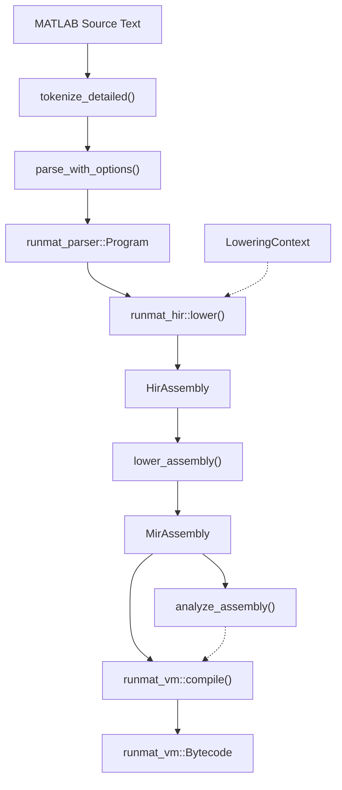

# Compilation Pipeline

<details>
<summary>Relevant source files</summary>

- [Cargo.lock](https://github.com/runmat-org/runmat/blob/82685330/Cargo.lock)
- [Cargo.toml](https://github.com/runmat-org/runmat/blob/82685330/Cargo.toml)
- [crates/runmat-accelerate/Cargo.toml](https://github.com/runmat-org/runmat/blob/82685330/crates/runmat-accelerate/Cargo.toml)
- [crates/runmat-builtins/Cargo.toml](https://github.com/runmat-org/runmat/blob/82685330/crates/runmat-builtins/Cargo.toml)
- [crates/runmat-core/src/execution/mod.rs](https://github.com/runmat-org/runmat/blob/82685330/crates/runmat-core/src/execution/mod.rs)
- [crates/runmat-core/src/execution/types.rs](https://github.com/runmat-org/runmat/blob/82685330/crates/runmat-core/src/execution/types.rs)
- [crates/runmat-core/src/fusion/mod.rs](https://github.com/runmat-org/runmat/blob/82685330/crates/runmat-core/src/fusion/mod.rs)
- [crates/runmat-core/src/fusion/snapshot.rs](https://github.com/runmat-org/runmat/blob/82685330/crates/runmat-core/src/fusion/snapshot.rs)
- [crates/runmat-core/src/fusion/types.rs](https://github.com/runmat-org/runmat/blob/82685330/crates/runmat-core/src/fusion/types.rs)
- [crates/runmat-core/src/profiling.rs](https://github.com/runmat-org/runmat/blob/82685330/crates/runmat-core/src/profiling.rs)
- [crates/runmat-core/src/session/compile.rs](https://github.com/runmat-org/runmat/blob/82685330/crates/runmat-core/src/session/compile.rs)
- [crates/runmat-core/src/session/config.rs](https://github.com/runmat-org/runmat/blob/82685330/crates/runmat-core/src/session/config.rs)
- [crates/runmat-core/src/session/mod.rs](https://github.com/runmat-org/runmat/blob/82685330/crates/runmat-core/src/session/mod.rs)
- [crates/runmat-core/src/session/run.rs](https://github.com/runmat-org/runmat/blob/82685330/crates/runmat-core/src/session/run.rs)
- [crates/runmat-core/src/session/snapshot.rs](https://github.com/runmat-org/runmat/blob/82685330/crates/runmat-core/src/session/snapshot.rs)
- [crates/runmat-core/src/session/workspace.rs](https://github.com/runmat-org/runmat/blob/82685330/crates/runmat-core/src/session/workspace.rs)
- [crates/runmat-core/src/tests.rs](https://github.com/runmat-org/runmat/blob/82685330/crates/runmat-core/src/tests.rs)
- [crates/runmat-core/src/workspace/emit.rs](https://github.com/runmat-org/runmat/blob/82685330/crates/runmat-core/src/workspace/emit.rs)
- [crates/runmat-core/src/workspace/mod.rs](https://github.com/runmat-org/runmat/blob/82685330/crates/runmat-core/src/workspace/mod.rs)
- [crates/runmat-core/tests/fusion_regressions.rs](https://github.com/runmat-org/runmat/blob/82685330/crates/runmat-core/tests/fusion_regressions.rs)
- [crates/runmat-gc/Cargo.toml](https://github.com/runmat-org/runmat/blob/82685330/crates/runmat-gc/Cargo.toml)
- [crates/runmat-lexer/Cargo.toml](https://github.com/runmat-org/runmat/blob/82685330/crates/runmat-lexer/Cargo.toml)
- [crates/runmat-macros/Cargo.toml](https://github.com/runmat-org/runmat/blob/82685330/crates/runmat-macros/Cargo.toml)
- [crates/runmat-parser/Cargo.toml](https://github.com/runmat-org/runmat/blob/82685330/crates/runmat-parser/Cargo.toml)
- [crates/runmat-plot/Cargo.toml](https://github.com/runmat-org/runmat/blob/82685330/crates/runmat-plot/Cargo.toml)
- [crates/runmat-runtime/Cargo.toml](https://github.com/runmat-org/runmat/blob/82685330/crates/runmat-runtime/Cargo.toml)
- [crates/runmat-snapshot/Cargo.toml](https://github.com/runmat-org/runmat/blob/82685330/crates/runmat-snapshot/Cargo.toml)
- [crates/runmat-turbine/Cargo.toml](https://github.com/runmat-org/runmat/blob/82685330/crates/runmat-turbine/Cargo.toml)
- [crates/runmat-vm/src/ops/cells.rs](https://github.com/runmat-org/runmat/blob/82685330/crates/runmat-vm/src/ops/cells.rs)

</details>

The RunMat compilation pipeline is a multi-stage transformation process that converts MATLAB source text into executable bytecode. This pipeline is designed to support MATLAB's dynamic semantics while enabling optimizations like static analysis, type inference, and JIT compilation. The pipeline is primarily orchestrated by the `RunMatSession` within the `runmat-core` crate [crates/runmat-core/src/session/compile.rs #61-108](https://github.com/runmat-org/runmat/blob/82685330/crates/runmat-core/src/session/compile.rs#L61-L108)

### Pipeline Overview

The pipeline follows a linear progression through several intermediate representations (IRs), each serving a specific purpose in the lifecycle of a MATLAB program:

1. Lexer & Parser: Converts raw text into a Concrete Syntax Tree (CST) and then an Abstract Syntax Tree (AST).
2. High-Level IR (HIR): Resolves scopes, performs variable binding, and handles MATLAB-specific constructs like command-form syntax and closure captures.
3. Mid-Level IR (MIR): Lowers the HIR into a Control-Flow Graph (CFG) consisting of basic blocks, suitable for dataflow analysis.
4. Static Analysis: Performs type/shape inference and definite assignment checks on the MIR.
5. Bytecode Compilation: Translates the MIR and analysis facts into optimized bytecode for the RunMat Virtual Machine (VM).

### System Architecture Diagram

The following diagram maps the logical pipeline stages to the specific code entities and crates responsible for each transformation.

Title: Source to Bytecode Transformation Map



<details>
<summary>Rendered SVG</summary>

```svg
<svg id="mermaid-34t0cbutel" xmlns="http://www.w3.org/2000/svg" xmlns:xlink="http://www.w3.org/1999/xlink" class="flowchart" style="max-width: 100%; touch-action: none; user-select: none; cursor: grab; min-height: fit-content; max-height: 100%;" viewBox="-129.88736261518255 0 942.9583189803651 1360" role="graphics-document document" aria-roledescription="flowchart-v2" preserveAspectRatio="xMidYMid meet"><style>#mermaid-34t0cbutel{font-family:ui-sans-serif,-apple-system,system-ui,Segoe UI,Helvetica;font-size:16px;fill:#ccc;}@keyframes edge-animation-frame{from{stroke-dashoffset:0;}}@keyframes dash{to{stroke-dashoffset:0;}}#mermaid-34t0cbutel .edge-animation-slow{stroke-dasharray:9,5!important;stroke-dashoffset:900;animation:dash 50s linear infinite;stroke-linecap:round;}#mermaid-34t0cbutel .edge-animation-fast{stroke-dasharray:9,5!important;stroke-dashoffset:900;animation:dash 20s linear infinite;stroke-linecap:round;}#mermaid-34t0cbutel .error-icon{fill:#333;}#mermaid-34t0cbutel .error-text{fill:#cccccc;stroke:#cccccc;}#mermaid-34t0cbutel .edge-thickness-normal{stroke-width:1px;}#mermaid-34t0cbutel .edge-thickness-thick{stroke-width:3.5px;}#mermaid-34t0cbutel .edge-pattern-solid{stroke-dasharray:0;}#mermaid-34t0cbutel .edge-thickness-invisible{stroke-width:0;fill:none;}#mermaid-34t0cbutel .edge-pattern-dashed{stroke-dasharray:3;}#mermaid-34t0cbutel .edge-pattern-dotted{stroke-dasharray:2;}#mermaid-34t0cbutel .marker{fill:#666;stroke:#666;}#mermaid-34t0cbutel .marker.cross{stroke:#666;}#mermaid-34t0cbutel svg{font-family:ui-sans-serif,-apple-system,system-ui,Segoe UI,Helvetica;font-size:16px;}#mermaid-34t0cbutel p{margin:0;}#mermaid-34t0cbutel .label{font-family:ui-sans-serif,-apple-system,system-ui,Segoe UI,Helvetica;color:#fff;}#mermaid-34t0cbutel .cluster-label text{fill:#fff;}#mermaid-34t0cbutel .cluster-label span{color:#fff;}#mermaid-34t0cbutel .cluster-label span p{background-color:transparent;}#mermaid-34t0cbutel .label text,#mermaid-34t0cbutel span{fill:#fff;color:#fff;}#mermaid-34t0cbutel .node rect,#mermaid-34t0cbutel .node circle,#mermaid-34t0cbutel .node ellipse,#mermaid-34t0cbutel .node polygon,#mermaid-34t0cbutel .node path{fill:#111;stroke:#222;stroke-width:1px;}#mermaid-34t0cbutel .rough-node .label text,#mermaid-34t0cbutel .node .label text,#mermaid-34t0cbutel .image-shape .label,#mermaid-34t0cbutel .icon-shape .label{text-anchor:middle;}#mermaid-34t0cbutel .node .katex path{fill:#000;stroke:#000;stroke-width:1px;}#mermaid-34t0cbutel .rough-node .label,#mermaid-34t0cbutel .node .label,#mermaid-34t0cbutel .image-shape .label,#mermaid-34t0cbutel .icon-shape .label{text-align:center;}#mermaid-34t0cbutel .node.clickable{cursor:pointer;}#mermaid-34t0cbutel .root .anchor path{fill:#666!important;stroke-width:0;stroke:#666;}#mermaid-34t0cbutel .arrowheadPath{fill:#0b0b0b;}#mermaid-34t0cbutel .edgePath .path{stroke:#666;stroke-width:1px;}#mermaid-34t0cbutel .flowchart-link{stroke:#666;fill:none;}#mermaid-34t0cbutel .edgeLabel{background-color:#161616;text-align:center;}#mermaid-34t0cbutel .edgeLabel p{background-color:#161616;}#mermaid-34t0cbutel .edgeLabel rect{opacity:0.5;background-color:#161616;fill:#161616;}#mermaid-34t0cbutel .labelBkg{background-color:rgba(22, 22, 22, 0.5);}#mermaid-34t0cbutel .cluster rect{fill:#161616;stroke:#222;stroke-width:1px;}#mermaid-34t0cbutel .cluster text{fill:#fff;}#mermaid-34t0cbutel .cluster span{color:#fff;}#mermaid-34t0cbutel div.mermaidTooltip{position:absolute;text-align:center;max-width:200px;padding:2px;font-family:ui-sans-serif,-apple-system,system-ui,Segoe UI,Helvetica;font-size:12px;background:#333;border:1px solid hsl(0, 0%, 10%);border-radius:2px;pointer-events:none;z-index:100;}#mermaid-34t0cbutel .flowchartTitleText{text-anchor:middle;font-size:18px;fill:#ccc;}#mermaid-34t0cbutel rect.text{fill:none;stroke-width:0;}#mermaid-34t0cbutel .icon-shape,#mermaid-34t0cbutel .image-shape{background-color:#161616;text-align:center;}#mermaid-34t0cbutel .icon-shape p,#mermaid-34t0cbutel .image-shape p{background-color:#161616;padding:2px;}#mermaid-34t0cbutel .icon-shape .label rect,#mermaid-34t0cbutel .image-shape .label rect{opacity:0.5;background-color:#161616;fill:#161616;}#mermaid-34t0cbutel .label-icon{display:inline-block;height:1em;overflow:visible;vertical-align:-0.125em;}#mermaid-34t0cbutel .node .label-icon path{fill:currentColor;stroke:revert;stroke-width:revert;}#mermaid-34t0cbutel .node .neo-node{stroke:#222;}#mermaid-34t0cbutel [data-look="neo"].node rect,#mermaid-34t0cbutel [data-look="neo"].cluster rect,#mermaid-34t0cbutel [data-look="neo"].node polygon{stroke:url(#mermaid-34t0cbutel-gradient);filter:drop-shadow( 1px 2px 2px rgba(185,185,185,1));}#mermaid-34t0cbutel [data-look="neo"].node path{stroke:url(#mermaid-34t0cbutel-gradient);stroke-width:1px;}#mermaid-34t0cbutel [data-look="neo"].node .outer-path{filter:drop-shadow( 1px 2px 2px rgba(185,185,185,1));}#mermaid-34t0cbutel [data-look="neo"].node .neo-line path{stroke:#222;filter:none;}#mermaid-34t0cbutel [data-look="neo"].node circle{stroke:url(#mermaid-34t0cbutel-gradient);filter:drop-shadow( 1px 2px 2px rgba(185,185,185,1));}#mermaid-34t0cbutel [data-look="neo"].node circle .state-start{fill:#000000;}#mermaid-34t0cbutel [data-look="neo"].icon-shape .icon{fill:url(#mermaid-34t0cbutel-gradient);filter:drop-shadow( 1px 2px 2px rgba(185,185,185,1));}#mermaid-34t0cbutel [data-look="neo"].icon-shape .icon-neo path{stroke:url(#mermaid-34t0cbutel-gradient);filter:drop-shadow( 1px 2px 2px rgba(185,185,185,1));}#mermaid-34t0cbutel :root{--mermaid-font-family:"trebuchet ms",verdana,arial,sans-serif;}</style><g><marker id="mermaid-34t0cbutel_flowchart-v2-pointEnd" class="marker flowchart-v2" viewBox="0 0 10 10" refX="5" refY="5" markerUnits="userSpaceOnUse" markerWidth="8" markerHeight="8" orient="auto"><path d="M 0 0 L 10 5 L 0 10 z" class="arrowMarkerPath" style="stroke-width: 1; stroke-dasharray: 1, 0;"></path></marker><marker id="mermaid-34t0cbutel_flowchart-v2-pointStart" class="marker flowchart-v2" viewBox="0 0 10 10" refX="4.5" refY="5" markerUnits="userSpaceOnUse" markerWidth="8" markerHeight="8" orient="auto"><path d="M 0 5 L 10 10 L 10 0 z" class="arrowMarkerPath" style="stroke-width: 1; stroke-dasharray: 1, 0;"></path></marker><marker id="mermaid-34t0cbutel_flowchart-v2-pointEnd-margin" class="marker flowchart-v2" viewBox="0 0 11.5 14" refX="11.5" refY="7" markerUnits="userSpaceOnUse" markerWidth="10.5" markerHeight="14" orient="auto"><path d="M 0 0 L 11.5 7 L 0 14 z" class="arrowMarkerPath" style="stroke-width: 0; stroke-dasharray: 1, 0;"></path></marker><marker id="mermaid-34t0cbutel_flowchart-v2-pointStart-margin" class="marker flowchart-v2" viewBox="0 0 11.5 14" refX="1" refY="7" markerUnits="userSpaceOnUse" markerWidth="11.5" markerHeight="14" orient="auto"><polygon points="0,7 11.5,14 11.5,0" class="arrowMarkerPath" style="stroke-width: 0; stroke-dasharray: 1, 0;"></polygon></marker><marker id="mermaid-34t0cbutel_flowchart-v2-circleEnd" class="marker flowchart-v2" viewBox="0 0 10 10" refX="11" refY="5" markerUnits="userSpaceOnUse" markerWidth="11" markerHeight="11" orient="auto"><circle cx="5" cy="5" r="5" class="arrowMarkerPath" style="stroke-width: 1; stroke-dasharray: 1, 0;"></circle></marker><marker id="mermaid-34t0cbutel_flowchart-v2-circleStart" class="marker flowchart-v2" viewBox="0 0 10 10" refX="-1" refY="5" markerUnits="userSpaceOnUse" markerWidth="11" markerHeight="11" orient="auto"><circle cx="5" cy="5" r="5" class="arrowMarkerPath" style="stroke-width: 1; stroke-dasharray: 1, 0;"></circle></marker><marker id="mermaid-34t0cbutel_flowchart-v2-circleEnd-margin" class="marker flowchart-v2" viewBox="0 0 10 10" refY="5" refX="12.25" markerUnits="userSpaceOnUse" markerWidth="14" markerHeight="14" orient="auto"><circle cx="5" cy="5" r="5" class="arrowMarkerPath" style="stroke-width: 0; stroke-dasharray: 1, 0;"></circle></marker><marker id="mermaid-34t0cbutel_flowchart-v2-circleStart-margin" class="marker flowchart-v2" viewBox="0 0 10 10" refX="-2" refY="5" markerUnits="userSpaceOnUse" markerWidth="14" markerHeight="14" orient="auto"><circle cx="5" cy="5" r="5" class="arrowMarkerPath" style="stroke-width: 0; stroke-dasharray: 1, 0;"></circle></marker><marker id="mermaid-34t0cbutel_flowchart-v2-crossEnd" class="marker cross flowchart-v2" viewBox="0 0 11 11" refX="12" refY="5.2" markerUnits="userSpaceOnUse" markerWidth="11" markerHeight="11" orient="auto"><path d="M 1,1 l 9,9 M 10,1 l -9,9" class="arrowMarkerPath" style="stroke-width: 2; stroke-dasharray: 1, 0;"></path></marker><marker id="mermaid-34t0cbutel_flowchart-v2-crossStart" class="marker cross flowchart-v2" viewBox="0 0 11 11" refX="-1" refY="5.2" markerUnits="userSpaceOnUse" markerWidth="11" markerHeight="11" orient="auto"><path d="M 1,1 l 9,9 M 10,1 l -9,9" class="arrowMarkerPath" style="stroke-width: 2; stroke-dasharray: 1, 0;"></path></marker><marker id="mermaid-34t0cbutel_flowchart-v2-crossEnd-margin" class="marker cross flowchart-v2" viewBox="0 0 15 15" refX="17.7" refY="7.5" markerUnits="userSpaceOnUse" markerWidth="12" markerHeight="12" orient="auto"><path d="M 1,1 L 14,14 M 1,14 L 14,1" class="arrowMarkerPath" style="stroke-width: 2.5;"></path></marker><marker id="mermaid-34t0cbutel_flowchart-v2-crossStart-margin" class="marker cross flowchart-v2" viewBox="0 0 15 15" refX="-3.5" refY="7.5" markerUnits="userSpaceOnUse" markerWidth="12" markerHeight="12" orient="auto"><path d="M 1,1 L 14,14 M 1,14 L 14,1" class="arrowMarkerPath" style="stroke-width: 2.5; stroke-dasharray: 1, 0;"></path></marker><g class="root"><g class="clusters"><g class="cluster" id="mermaid-34t0cbutel-runmat-vm" data-look="classic"><rect style="" x="308.83984375" y="1144" width="312.0390625" height="208"></rect><g class="cluster-label" transform="translate(424.765625, 1144)"><foreignObject width="80.1875" height="24"><div style="display: table-cell; white-space: nowrap; line-height: 1.5;" xmlns="http://www.w3.org/1999/xhtml"><span class="nodeLabel"><p>runmat-vm</p></span></div></foreignObject></g></g><g class="cluster" id="mermaid-34t0cbutel-runmat-mir" data-look="classic"><rect style="" x="317.06640625" y="782" width="358.1171875" height="312"></rect><g class="cluster-label" transform="translate(455.421875, 782)"><foreignObject width="81.40625" height="24"><div style="display: table-cell; white-space: nowrap; line-height: 1.5;" xmlns="http://www.w3.org/1999/xhtml"><span class="nodeLabel"><p>runmat-mir</p></span></div></foreignObject></g></g><g class="cluster" id="mermaid-34t0cbutel-runmat-hir" data-look="classic"><rect style="" x="335.65625" y="395" width="274.421875" height="337"></rect><g class="cluster-label" transform="translate(434.4140625, 395)"><foreignObject width="76.90625" height="24"><div style="display: table-cell; white-space: nowrap; line-height: 1.5;" xmlns="http://www.w3.org/1999/xhtml"><span class="nodeLabel"><p>runmat-hir</p></span></div></foreignObject></g></g><g class="cluster" id="mermaid-34t0cbutel-subGraph1" data-look="classic"><rect style="" x="8" y="162" width="307.65625" height="337"></rect><g class="cluster-label" transform="translate(53.3203125, 162)"><foreignObject width="217.015625" height="24"><div style="display: table-cell; white-space: nowrap; line-height: 1.5;" xmlns="http://www.w3.org/1999/xhtml"><span class="nodeLabel"><p>runmat-lexer &amp; runmat-parser</p></span></div></foreignObject></g></g><g class="cluster" id="mermaid-34t0cbutel-subGraph0" data-look="classic"><rect style="" x="20.8828125" y="8" width="281.890625" height="104"></rect><g class="cluster-label" transform="translate(40.8828125, 8)"><foreignObject width="241.890625" height="24"><div style="display: table-cell; white-space: nowrap; line-height: 1.5;" xmlns="http://www.w3.org/1999/xhtml"><span class="nodeLabel"><p>Natural Language / Source Space</p></span></div></foreignObject></g></g></g><g class="edgePaths"><path d="M161.828,87L161.828,91.167C161.828,95.333,161.828,103.667,161.828,112C161.828,120.333,161.828,128.667,161.828,137C161.828,145.333,161.828,153.667,161.828,161.333C161.828,169,161.828,176,161.828,179.5L161.828,183" id="mermaid-34t0cbutel-L_Input_Lexer_0" class="edge-thickness-normal edge-pattern-solid edge-thickness-normal edge-pattern-solid flowchart-link" style=";" data-edge="true" data-et="edge" data-id="L_Input_Lexer_0" data-points="W3sieCI6MTYxLjgyODEyNSwieSI6ODd9LHsieCI6MTYxLjgyODEyNSwieSI6MTEyfSx7IngiOjE2MS44MjgxMjUsInkiOjEzN30seyJ4IjoxNjEuODI4MTI1LCJ5IjoxNjJ9LHsieCI6MTYxLjgyODEyNSwieSI6MTg3fV0=" data-look="classic" marker-end="url(#mermaid-34t0cbutel_flowchart-v2-pointEnd)"></path><path d="M161.828,241L161.828,245.167C161.828,249.333,161.828,257.667,161.828,265.333C161.828,273,161.828,280,161.828,283.5L161.828,287" id="mermaid-34t0cbutel-L_Lexer_Parser_0" class="edge-thickness-normal edge-pattern-solid edge-thickness-normal edge-pattern-solid flowchart-link" style=";" data-edge="true" data-et="edge" data-id="L_Lexer_Parser_0" data-points="W3sieCI6MTYxLjgyODEyNSwieSI6MjQxfSx7IngiOjE2MS44MjgxMjUsInkiOjI2Nn0seyJ4IjoxNjEuODI4MTI1LCJ5IjoyOTF9XQ==" data-look="classic" marker-end="url(#mermaid-34t0cbutel_flowchart-v2-pointEnd)"></path><path d="M161.828,345L161.828,349.167C161.828,353.333,161.828,361.667,161.828,370C161.828,378.333,161.828,386.667,161.828,394.333C161.828,402,161.828,409,161.828,412.5L161.828,416" id="mermaid-34t0cbutel-L_Parser_AST_0" class="edge-thickness-normal edge-pattern-solid edge-thickness-normal edge-pattern-solid flowchart-link" style=";" data-edge="true" data-et="edge" data-id="L_Parser_AST_0" data-points="W3sieCI6MTYxLjgyODEyNSwieSI6MzQ1fSx7IngiOjE2MS44MjgxMjUsInkiOjM3MH0seyJ4IjoxNjEuODI4MTI1LCJ5IjozOTV9LHsieCI6MTYxLjgyODEyNSwieSI6NDIwfV0=" data-look="classic" marker-end="url(#mermaid-34t0cbutel_flowchart-v2-pointEnd)"></path><path d="M161.828,474L161.828,478.167C161.828,482.333,161.828,490.667,203.65,499C245.471,507.333,329.115,515.667,375.019,523.551C420.923,531.436,429.088,538.871,433.17,542.589L437.253,546.307" id="mermaid-34t0cbutel-L_AST_HIR_Lower_0" class="edge-thickness-normal edge-pattern-solid edge-thickness-normal edge-pattern-solid flowchart-link" style=";" data-edge="true" data-et="edge" data-id="L_AST_HIR_Lower_0" data-points="W3sieCI6MTYxLjgyODEyNSwieSI6NDc0fSx7IngiOjE2MS44MjgxMjUsInkiOjQ5OX0seyJ4Ijo0MTIuNzU3ODEyNSwieSI6NTI0fSx7IngiOjQ0MC4yMTA0ODY3Nzg4NDYxMywieSI6NTQ5fV0=" data-look="classic" marker-end="url(#mermaid-34t0cbutel_flowchart-v2-pointEnd)"></path><path d="M479.859,474L479.859,478.167C479.859,482.333,479.859,490.667,479.859,499C479.859,507.333,479.859,515.667,479.184,523.345C478.509,531.024,477.158,538.048,476.482,541.56L475.807,545.072" id="mermaid-34t0cbutel-L_LoweringCtx_HIR_Lower_0" class="edge-thickness-normal edge-pattern-dotted edge-thickness-normal edge-pattern-solid flowchart-link" style=";" data-edge="true" data-et="edge" data-id="L_LoweringCtx_HIR_Lower_0" data-points="W3sieCI6NDc5Ljg1OTM3NSwieSI6NDc0fSx7IngiOjQ3OS44NTkzNzUsInkiOjQ5OX0seyJ4Ijo0NzkuODU5Mzc1LCJ5Ijo1MjR9LHsieCI6NDc1LjA1MTY4MjY5MjMwNzcsInkiOjU0OX1d" data-look="classic" marker-end="url(#mermaid-34t0cbutel_flowchart-v2-pointEnd)"></path><path d="M469.859,603L469.859,607.167C469.859,611.333,469.859,619.667,469.859,627.333C469.859,635,469.859,642,469.859,645.5L469.859,649" id="mermaid-34t0cbutel-L_HIR_Lower_Assembly_0" class="edge-thickness-normal edge-pattern-solid edge-thickness-normal edge-pattern-solid flowchart-link" style=";" data-edge="true" data-et="edge" data-id="L_HIR_Lower_Assembly_0" data-points="W3sieCI6NDY5Ljg1OTM3NSwieSI6NjAzfSx7IngiOjQ2OS44NTkzNzUsInkiOjYyOH0seyJ4Ijo0NjkuODU5Mzc1LCJ5Ijo2NTN9XQ==" data-look="classic" marker-end="url(#mermaid-34t0cbutel_flowchart-v2-pointEnd)"></path><path d="M469.859,707L469.859,711.167C469.859,715.333,469.859,723.667,469.859,732C469.859,740.333,469.859,748.667,469.859,757C469.859,765.333,469.859,773.667,469.859,781.333C469.859,789,469.859,796,469.859,799.5L469.859,803" id="mermaid-34t0cbutel-L_Assembly_MIR_Lower_0" class="edge-thickness-normal edge-pattern-solid edge-thickness-normal edge-pattern-solid flowchart-link" style=";" data-edge="true" data-et="edge" data-id="L_Assembly_MIR_Lower_0" data-points="W3sieCI6NDY5Ljg1OTM3NSwieSI6NzA3fSx7IngiOjQ2OS44NTkzNzUsInkiOjczMn0seyJ4Ijo0NjkuODU5Mzc1LCJ5Ijo3NTd9LHsieCI6NDY5Ljg1OTM3NSwieSI6NzgyfSx7IngiOjQ2OS44NTkzNzUsInkiOjgwN31d" data-look="classic" marker-end="url(#mermaid-34t0cbutel_flowchart-v2-pointEnd)"></path><path d="M469.859,861L469.859,865.167C469.859,869.333,469.859,877.667,469.859,885.333C469.859,893,469.859,900,469.859,903.5L469.859,907" id="mermaid-34t0cbutel-L_MIR_Lower_MIR_Data_0" class="edge-thickness-normal edge-pattern-solid edge-thickness-normal edge-pattern-solid flowchart-link" style=";" data-edge="true" data-et="edge" data-id="L_MIR_Lower_MIR_Data_0" data-points="W3sieCI6NDY5Ljg1OTM3NSwieSI6ODYxfSx7IngiOjQ2OS44NTkzNzUsInkiOjg4Nn0seyJ4Ijo0NjkuODU5Mzc1LCJ5Ijo5MTF9XQ==" data-look="classic" marker-end="url(#mermaid-34t0cbutel_flowchart-v2-pointEnd)"></path><path d="M505.396,965L510.88,969.167C516.364,973.333,527.333,981.667,532.817,989.333C538.301,997,538.301,1004,538.301,1007.5L538.301,1011" id="mermaid-34t0cbutel-L_MIR_Data_Analysis_0" class="edge-thickness-normal edge-pattern-solid edge-thickness-normal edge-pattern-solid flowchart-link" style=";" data-edge="true" data-et="edge" data-id="L_MIR_Data_Analysis_0" data-points="W3sieCI6NTA1LjM5NjI1OTAxNDQyMzEsInkiOjk2NX0seyJ4Ijo1MzguMzAwNzgxMjUsInkiOjk5MH0seyJ4Ijo1MzguMzAwNzgxMjUsInkiOjEwMTV9XQ==" data-look="classic" marker-end="url(#mermaid-34t0cbutel_flowchart-v2-pointEnd)"></path><path d="M434.322,965L428.838,969.167C423.354,973.333,412.386,981.667,406.902,994.5C401.418,1007.333,401.418,1024.667,401.418,1042C401.418,1059.333,401.418,1076.667,401.418,1089.5C401.418,1102.333,401.418,1110.667,401.418,1119C401.418,1127.333,401.418,1135.667,406.371,1143.597C411.324,1151.527,421.231,1159.053,426.184,1162.817L431.137,1166.58" id="mermaid-34t0cbutel-L_MIR_Data_Compiler_0" class="edge-thickness-normal edge-pattern-solid edge-thickness-normal edge-pattern-solid flowchart-link" style=";" data-edge="true" data-et="edge" data-id="L_MIR_Data_Compiler_0" data-points="W3sieCI6NDM0LjMyMjQ5MDk4NTU3NjksInkiOjk2NX0seyJ4Ijo0MDEuNDE3OTY4NzUsInkiOjk5MH0seyJ4Ijo0MDEuNDE3OTY4NzUsInkiOjEwNDJ9LHsieCI6NDAxLjQxNzk2ODc1LCJ5IjoxMDk0fSx7IngiOjQwMS40MTc5Njg3NSwieSI6MTExOX0seyJ4Ijo0MDEuNDE3OTY4NzUsInkiOjExNDR9LHsieCI6NDM0LjMyMjQ5MDk4NTU3NjksInkiOjExNjl9XQ==" data-look="classic" marker-end="url(#mermaid-34t0cbutel_flowchart-v2-pointEnd)"></path><path d="M538.301,1069L538.301,1073.167C538.301,1077.333,538.301,1085.667,538.301,1094C538.301,1102.333,538.301,1110.667,538.301,1119C538.301,1127.333,538.301,1135.667,533.348,1143.597C528.394,1151.527,518.488,1159.053,513.535,1162.817L508.581,1166.58" id="mermaid-34t0cbutel-L_Analysis_Compiler_0" class="edge-thickness-normal edge-pattern-dotted edge-thickness-normal edge-pattern-solid flowchart-link" style=";" data-edge="true" data-et="edge" data-id="L_Analysis_Compiler_0" data-points="W3sieCI6NTM4LjMwMDc4MTI1LCJ5IjoxMDY5fSx7IngiOjUzOC4zMDA3ODEyNSwieSI6MTA5NH0seyJ4Ijo1MzguMzAwNzgxMjUsInkiOjExMTl9LHsieCI6NTM4LjMwMDc4MTI1LCJ5IjoxMTQ0fSx7IngiOjUwNS4zOTYyNTkwMTQ0MjMxLCJ5IjoxMTY5fV0=" data-look="classic" marker-end="url(#mermaid-34t0cbutel_flowchart-v2-pointEnd)"></path><path d="M469.859,1223L469.859,1227.167C469.859,1231.333,469.859,1239.667,469.859,1247.333C469.859,1255,469.859,1262,469.859,1265.5L469.859,1269" id="mermaid-34t0cbutel-L_Compiler_Bytecode_0" class="edge-thickness-normal edge-pattern-solid edge-thickness-normal edge-pattern-solid flowchart-link" style=";" data-edge="true" data-et="edge" data-id="L_Compiler_Bytecode_0" data-points="W3sieCI6NDY5Ljg1OTM3NSwieSI6MTIyM30seyJ4Ijo0NjkuODU5Mzc1LCJ5IjoxMjQ4fSx7IngiOjQ2OS44NTkzNzUsInkiOjEyNzN9XQ==" data-look="classic" marker-end="url(#mermaid-34t0cbutel_flowchart-v2-pointEnd)"></path></g><g class="edgeLabels"><g class="edgeLabel"><g class="label" data-id="L_Input_Lexer_0" transform="translate(0, 0)"><foreignObject width="0" height="0"><div style="display: table-cell; white-space: nowrap; line-height: 1.5; max-width: 200px; text-align: center;" xmlns="http://www.w3.org/1999/xhtml" class="labelBkg"><span class="edgeLabel"></span></div></foreignObject></g></g><g class="edgeLabel"><g class="label" data-id="L_Lexer_Parser_0" transform="translate(0, 0)"><foreignObject width="0" height="0"><div style="display: table-cell; white-space: nowrap; line-height: 1.5; max-width: 200px; text-align: center;" xmlns="http://www.w3.org/1999/xhtml" class="labelBkg"><span class="edgeLabel"></span></div></foreignObject></g></g><g class="edgeLabel"><g class="label" data-id="L_Parser_AST_0" transform="translate(0, 0)"><foreignObject width="0" height="0"><div style="display: table-cell; white-space: nowrap; line-height: 1.5; max-width: 200px; text-align: center;" xmlns="http://www.w3.org/1999/xhtml" class="labelBkg"><span class="edgeLabel"></span></div></foreignObject></g></g><g class="edgeLabel"><g class="label" data-id="L_AST_HIR_Lower_0" transform="translate(0, 0)"><foreignObject width="0" height="0"><div style="display: table-cell; white-space: nowrap; line-height: 1.5; max-width: 200px; text-align: center;" xmlns="http://www.w3.org/1999/xhtml" class="labelBkg"><span class="edgeLabel"></span></div></foreignObject></g></g><g class="edgeLabel"><g class="label" data-id="L_LoweringCtx_HIR_Lower_0" transform="translate(0, 0)"><foreignObject width="0" height="0"><div style="display: table-cell; white-space: nowrap; line-height: 1.5; max-width: 200px; text-align: center;" xmlns="http://www.w3.org/1999/xhtml" class="labelBkg"><span class="edgeLabel"></span></div></foreignObject></g></g><g class="edgeLabel"><g class="label" data-id="L_HIR_Lower_Assembly_0" transform="translate(0, 0)"><foreignObject width="0" height="0"><div style="display: table-cell; white-space: nowrap; line-height: 1.5; max-width: 200px; text-align: center;" xmlns="http://www.w3.org/1999/xhtml" class="labelBkg"><span class="edgeLabel"></span></div></foreignObject></g></g><g class="edgeLabel"><g class="label" data-id="L_Assembly_MIR_Lower_0" transform="translate(0, 0)"><foreignObject width="0" height="0"><div style="display: table-cell; white-space: nowrap; line-height: 1.5; max-width: 200px; text-align: center;" xmlns="http://www.w3.org/1999/xhtml" class="labelBkg"><span class="edgeLabel"></span></div></foreignObject></g></g><g class="edgeLabel"><g class="label" data-id="L_MIR_Lower_MIR_Data_0" transform="translate(0, 0)"><foreignObject width="0" height="0"><div style="display: table-cell; white-space: nowrap; line-height: 1.5; max-width: 200px; text-align: center;" xmlns="http://www.w3.org/1999/xhtml" class="labelBkg"><span class="edgeLabel"></span></div></foreignObject></g></g><g class="edgeLabel"><g class="label" data-id="L_MIR_Data_Analysis_0" transform="translate(0, 0)"><foreignObject width="0" height="0"><div style="display: table-cell; white-space: nowrap; line-height: 1.5; max-width: 200px; text-align: center;" xmlns="http://www.w3.org/1999/xhtml" class="labelBkg"><span class="edgeLabel"></span></div></foreignObject></g></g><g class="edgeLabel"><g class="label" data-id="L_MIR_Data_Compiler_0" transform="translate(0, 0)"><foreignObject width="0" height="0"><div style="display: table-cell; white-space: nowrap; line-height: 1.5; max-width: 200px; text-align: center;" xmlns="http://www.w3.org/1999/xhtml" class="labelBkg"><span class="edgeLabel"></span></div></foreignObject></g></g><g class="edgeLabel"><g class="label" data-id="L_Analysis_Compiler_0" transform="translate(0, 0)"><foreignObject width="0" height="0"><div style="display: table-cell; white-space: nowrap; line-height: 1.5; max-width: 200px; text-align: center;" xmlns="http://www.w3.org/1999/xhtml" class="labelBkg"><span class="edgeLabel"></span></div></foreignObject></g></g><g class="edgeLabel"><g class="label" data-id="L_Compiler_Bytecode_0" transform="translate(0, 0)"><foreignObject width="0" height="0"><div style="display: table-cell; white-space: nowrap; line-height: 1.5; max-width: 200px; text-align: center;" xmlns="http://www.w3.org/1999/xhtml" class="labelBkg"><span class="edgeLabel"></span></div></foreignObject></g></g></g><g class="nodes"><g class="node default" id="mermaid-34t0cbutel-flowchart-Input-0" data-look="classic" transform="translate(161.828125, 60)"><rect class="basic label-container" style="" x="-105.9453125" y="-27" width="211.890625" height="54"></rect><g class="label" style="" transform="translate(-75.9453125, -12)"><rect></rect><foreignObject width="151.890625" height="24"><div style="display: table-cell; white-space: nowrap; line-height: 1.5; max-width: 200px; text-align: center;" xmlns="http://www.w3.org/1999/xhtml"><span class="nodeLabel"><p>MATLAB Source Text</p></span></div></foreignObject></g></g><g class="node default" id="mermaid-34t0cbutel-flowchart-Lexer-1" data-look="classic" transform="translate(161.828125, 214)"><rect class="basic label-container" style="" x="-99.4140625" y="-27" width="198.828125" height="54"></rect><g class="label" style="" transform="translate(-69.4140625, -12)"><rect></rect><foreignObject width="138.828125" height="24"><div style="display: table-cell; white-space: nowrap; line-height: 1.5; max-width: 200px; text-align: center;" xmlns="http://www.w3.org/1999/xhtml"><span class="nodeLabel"><p>tokenize_detailed()</p></span></div></foreignObject></g></g><g class="node default" id="mermaid-34t0cbutel-flowchart-Parser-2" data-look="classic" transform="translate(161.828125, 318)"><rect class="basic label-container" style="" x="-106.1484375" y="-27" width="212.296875" height="54"></rect><g class="label" style="" transform="translate(-76.1484375, -12)"><rect></rect><foreignObject width="152.296875" height="24"><div style="display: table-cell; white-space: nowrap; line-height: 1.5; max-width: 200px; text-align: center;" xmlns="http://www.w3.org/1999/xhtml"><span class="nodeLabel"><p>parse_with_options()</p></span></div></foreignObject></g></g><g class="node default" id="mermaid-34t0cbutel-flowchart-AST-3" data-look="classic" transform="translate(161.828125, 447)"><rect class="basic label-container" style="" x="-118.828125" y="-27" width="237.65625" height="54"></rect><g class="label" style="" transform="translate(-88.828125, -12)"><rect></rect><foreignObject width="177.65625" height="24"><div style="display: table-cell; white-space: nowrap; line-height: 1.5; max-width: 200px; text-align: center;" xmlns="http://www.w3.org/1999/xhtml"><span class="nodeLabel"><p>runmat_parser::Program</p></span></div></foreignObject></g></g><g class="node default" id="mermaid-34t0cbutel-flowchart-LoweringCtx-4" data-look="classic" transform="translate(479.859375, 447)"><rect class="basic label-container" style="" x="-91.234375" y="-27" width="182.46875" height="54"></rect><g class="label" style="" transform="translate(-61.234375, -12)"><rect></rect><foreignObject width="122.46875" height="24"><div style="display: table-cell; white-space: nowrap; line-height: 1.5; max-width: 200px; text-align: center;" xmlns="http://www.w3.org/1999/xhtml"><span class="nodeLabel"><p>LoweringContext</p></span></div></foreignObject></g></g><g class="node default" id="mermaid-34t0cbutel-flowchart-HIR_Lower-5" data-look="classic" transform="translate(469.859375, 576)"><rect class="basic label-container" style="" x="-99.203125" y="-27" width="198.40625" height="54"></rect><g class="label" style="" transform="translate(-69.203125, -12)"><rect></rect><foreignObject width="138.40625" height="24"><div style="display: table-cell; white-space: nowrap; line-height: 1.5; max-width: 200px; text-align: center;" xmlns="http://www.w3.org/1999/xhtml"><span class="nodeLabel"><p>runmat_hir::lower()</p></span></div></foreignObject></g></g><g class="node default" id="mermaid-34t0cbutel-flowchart-Assembly-6" data-look="classic" transform="translate(469.859375, 680)"><rect class="basic label-container" style="" x="-75.3515625" y="-27" width="150.703125" height="54"></rect><g class="label" style="" transform="translate(-45.3515625, -12)"><rect></rect><foreignObject width="90.703125" height="24"><div style="display: table-cell; white-space: nowrap; line-height: 1.5; max-width: 200px; text-align: center;" xmlns="http://www.w3.org/1999/xhtml"><span class="nodeLabel"><p>HirAssembly</p></span></div></foreignObject></g></g><g class="node default" id="mermaid-34t0cbutel-flowchart-MIR_Lower-7" data-look="classic" transform="translate(469.859375, 834)"><rect class="basic label-container" style="" x="-93.703125" y="-27" width="187.40625" height="54"></rect><g class="label" style="" transform="translate(-63.703125, -12)"><rect></rect><foreignObject width="127.40625" height="24"><div style="display: table-cell; white-space: nowrap; line-height: 1.5; max-width: 200px; text-align: center;" xmlns="http://www.w3.org/1999/xhtml"><span class="nodeLabel"><p>lower_assembly()</p></span></div></foreignObject></g></g><g class="node default" id="mermaid-34t0cbutel-flowchart-MIR_Data-8" data-look="classic" transform="translate(469.859375, 938)"><rect class="basic label-container" style="" x="-76.40625" y="-27" width="152.8125" height="54"></rect><g class="label" style="" transform="translate(-46.40625, -12)"><rect></rect><foreignObject width="92.8125" height="24"><div style="display: table-cell; white-space: nowrap; line-height: 1.5; max-width: 200px; text-align: center;" xmlns="http://www.w3.org/1999/xhtml"><span class="nodeLabel"><p>MirAssembly</p></span></div></foreignObject></g></g><g class="node default" id="mermaid-34t0cbutel-flowchart-Analysis-9" data-look="classic" transform="translate(538.30078125, 1042)"><rect class="basic label-container" style="" x="-101.8828125" y="-27" width="203.765625" height="54"></rect><g class="label" style="" transform="translate(-71.8828125, -12)"><rect></rect><foreignObject width="143.765625" height="24"><div style="display: table-cell; white-space: nowrap; line-height: 1.5; max-width: 200px; text-align: center;" xmlns="http://www.w3.org/1999/xhtml"><span class="nodeLabel"><p>analyze_assembly()</p></span></div></foreignObject></g></g><g class="node default" id="mermaid-34t0cbutel-flowchart-Compiler-10" data-look="classic" transform="translate(469.859375, 1196)"><rect class="basic label-container" style="" x="-110.0234375" y="-27" width="220.046875" height="54"></rect><g class="label" style="" transform="translate(-80.0234375, -12)"><rect></rect><foreignObject width="160.046875" height="24"><div style="display: table-cell; white-space: nowrap; line-height: 1.5; max-width: 200px; text-align: center;" xmlns="http://www.w3.org/1999/xhtml"><span class="nodeLabel"><p>runmat_vm::compile()</p></span></div></foreignObject></g></g><g class="node default" id="mermaid-34t0cbutel-flowchart-Bytecode-11" data-look="classic" transform="translate(469.859375, 1300)"><rect class="basic label-container" style="" x="-110.15625" y="-27" width="220.3125" height="54"></rect><g class="label" style="" transform="translate(-80.15625, -12)"><rect></rect><foreignObject width="160.3125" height="24"><div style="display: table-cell; white-space: nowrap; line-height: 1.5; max-width: 200px; text-align: center;" xmlns="http://www.w3.org/1999/xhtml"><span class="nodeLabel"><p>runmat_vm::Bytecode</p></span></div></foreignObject></g></g></g></g></g><defs><filter id="mermaid-34t0cbutel-drop-shadow" height="130%" width="130%"><feDropShadow dx="4" dy="4" stdDeviation="0" flood-opacity="0.06" flood-color="#000000"></feDropShadow></filter></defs><defs><filter id="mermaid-34t0cbutel-drop-shadow-small" height="150%" width="150%"><feDropShadow dx="2" dy="2" stdDeviation="0" flood-opacity="0.06" flood-color="#000000"></feDropShadow></filter></defs><linearGradient id="mermaid-34t0cbutel-gradient" gradientUnits="objectBoundingBox" x1="0%" y1="0%" x2="100%" y2="0%"><stop offset="0%" stop-color="#333" stop-opacity="1"></stop><stop offset="100%" stop-color="hsl(-120, 0%, 3.3333333333%)" stop-opacity="1"></stop></linearGradient></svg>
```

</details>

Sources: [crates/runmat-core/src/session/compile.rs #61-108](https://github.com/runmat-org/runmat/blob/82685330/crates/runmat-core/src/session/compile.rs#L61-L108) [crates/runmat-core/src/session/mod.rs #108-115](https://github.com/runmat-org/runmat/blob/82685330/crates/runmat-core/src/session/mod.rs#L108-L115)

---

### Pipeline Stages

#### 2.1 Lexer & Parser

The first stage uses the `runmat-lexer` crate (powered by the `logos` library) to tokenize input. The `runmat-parser` then consumes these tokens to produce a `Program` AST [crates/runmat-core/src/session/compile.rs #67-70](https://github.com/runmat-org/runmat/blob/82685330/crates/runmat-core/src/session/compile.rs#L67-L70) This stage handles MATLAB's unique syntax rules, such as the distinction between row vectors and matrix rows based on whitespace or semicolons.

For details, see [Lexer & Parser](https://app.devin.ai/org/runmat-org/wiki/runmat-org/runmat?branch=dev#2.1).

#### 2.2 High-Level IR (HIR)

The HIR lowering stage transforms the AST into a `HirAssembly` [crates/runmat-hir/src/lib.rs #1-10](https://github.com/runmat-org/runmat/blob/82685330/crates/runmat-hir/src/lib.rs#L1-L10) This process uses a `LoweringContext` to resolve variable bindings (`HirBinding`) and determine whether an identifier refers to a local variable, a global, or a function call [crates/runmat-core/src/session/compile.rs #71-84](https://github.com/runmat-org/runmat/blob/82685330/crates/runmat-core/src/session/compile.rs#L71-L84)

For details, see [High-Level IR (HIR)](https://app.devin.ai/org/runmat-org/wiki/runmat-org/runmat?branch=dev#2.2).

#### 2.3 Mid-Level IR (MIR)

The `runmat-mir` crate flattens the HIR into a Control-Flow Graph (CFG) [crates/runmat-core/src/session/compile.rs #85-88](https://github.com/runmat-org/runmat/blob/82685330/crates/runmat-core/src/session/compile.rs#L85-L88) The MIR is organized into `BasicBlock` structures and uses `MirLocal` slots to represent stack locations. This representation is critical for optimizations and subsequent JIT lowering.

For details, see [Mid-Level IR (MIR)](https://app.devin.ai/org/runmat-org/wiki/runmat-org/runmat?branch=dev#2.3).

#### 2.4 MIR Analysis & Static Analysis

Before bytecode generation, the `AnalysisStore` is populated by running dataflow passes over the MIR [crates/runmat-core/src/session/compile.rs #89-92](https://github.com/runmat-org/runmat/blob/82685330/crates/runmat-core/src/session/compile.rs#L89-L92) This includes:

- Definite Assignment: Ensuring variables are initialized before use.
- Type/Shape Inference: Predicting tensor dimensions and numeric types to select optimized VM opcodes.

For details, see [MIR Analysis & Static Analysis](https://app.devin.ai/org/runmat-org/wiki/runmat-org/runmat?branch=dev#2.4).

---

### Execution Preparation

Once the bytecode is generated, the `RunMatSession` prepares it for the VM by integrating it with the `FunctionRegistry` [crates/runmat-core/src/session/compile.rs #98-107](https://github.com/runmat-org/runmat/blob/82685330/crates/runmat-core/src/session/compile.rs#L98-L107) This allows the interactive REPL to maintain state and function definitions across multiple execution requests.

Title: Session Compilation Lifecycle

runmat-vmrunmat-mirrunmat-hirRunMatSessionrunmat-vmrunmat-mirrunmat-hirRunMatSessionlower(ast | LoweringContext)HirAssemblylower_assembly(HirAssembly)MirAssemblyanalyze_assembly(MirAssembly)AnalysisStorecompile(HirAssembly | MirAssembly | Entrypoint)Bytecodeupdate function_registry

Sources: [crates/runmat-core/src/session/compile.rs #61-108](https://github.com/runmat-org/runmat/blob/82685330/crates/runmat-core/src/session/compile.rs#L61-L108) [crates/runmat-core/src/session/mod.rs #57-106](https://github.com/runmat-org/runmat/blob/82685330/crates/runmat-core/src/session/mod.rs#L57-L106)
