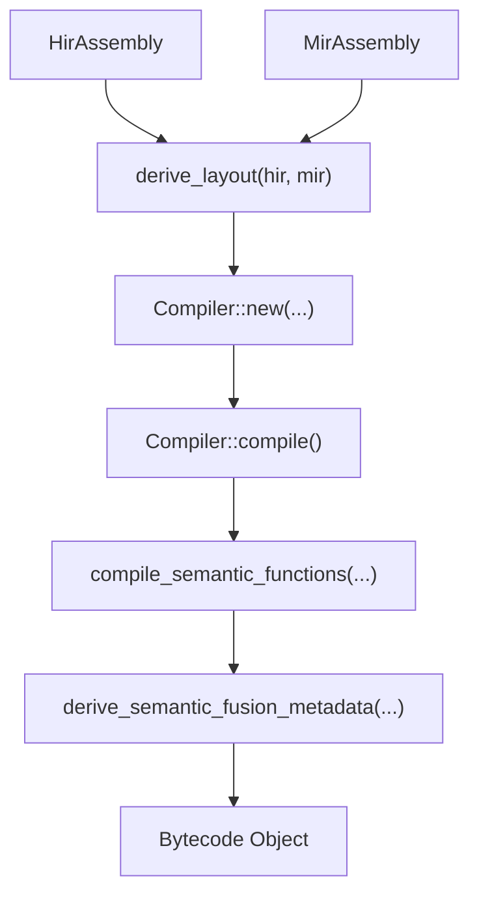

# Bytecode Compilation (MIR → Bytecode)

<details>
<summary>Relevant source files</summary>

- [crates/runmat-turbine/src/compiler.rs](https://github.com/runmat-org/runmat/blob/82685330/crates/runmat-turbine/src/compiler.rs)
- [crates/runmat-turbine/src/lib.rs](https://github.com/runmat-org/runmat/blob/82685330/crates/runmat-turbine/src/lib.rs)
- [crates/runmat-turbine/tests/jit.rs](https://github.com/runmat-org/runmat/blob/82685330/crates/runmat-turbine/tests/jit.rs)
- [crates/runmat-vm/src/bytecode/compile.rs](https://github.com/runmat-org/runmat/blob/82685330/crates/runmat-vm/src/bytecode/compile.rs)
- [crates/runmat-vm/src/bytecode/instr.rs](https://github.com/runmat-org/runmat/blob/82685330/crates/runmat-vm/src/bytecode/instr.rs)
- [crates/runmat-vm/src/bytecode/mod.rs](https://github.com/runmat-org/runmat/blob/82685330/crates/runmat-vm/src/bytecode/mod.rs)
- [crates/runmat-vm/src/bytecode/program.rs](https://github.com/runmat-org/runmat/blob/82685330/crates/runmat-vm/src/bytecode/program.rs)
- [crates/runmat-vm/src/call/shared.rs](https://github.com/runmat-org/runmat/blob/82685330/crates/runmat-vm/src/call/shared.rs)
- [crates/runmat-vm/src/compiler/core.rs](https://github.com/runmat-org/runmat/blob/82685330/crates/runmat-vm/src/compiler/core.rs)
- [crates/runmat-vm/src/interpreter/dispatch/calls.rs](https://github.com/runmat-org/runmat/blob/82685330/crates/runmat-vm/src/interpreter/dispatch/calls.rs)
- [crates/runmat-vm/src/interpreter/dispatch/indexing.rs](https://github.com/runmat-org/runmat/blob/82685330/crates/runmat-vm/src/interpreter/dispatch/indexing.rs)
- [crates/runmat-vm/src/interpreter/dispatch/mod.rs](https://github.com/runmat-org/runmat/blob/82685330/crates/runmat-vm/src/interpreter/dispatch/mod.rs)
- [crates/runmat-vm/src/interpreter/runner.rs](https://github.com/runmat-org/runmat/blob/82685330/crates/runmat-vm/src/interpreter/runner.rs)
- [crates/runmat-vm/src/interpreter/state.rs](https://github.com/runmat-org/runmat/blob/82685330/crates/runmat-vm/src/interpreter/state.rs)
- [crates/runmat-vm/src/lib.rs](https://github.com/runmat-org/runmat/blob/82685330/crates/runmat-vm/src/lib.rs)
- [crates/runmat-vm/tests/functions.rs](https://github.com/runmat-org/runmat/blob/82685330/crates/runmat-vm/tests/functions.rs)
- [docs-tmp/COMPLETION_AUDIT.md](https://github.com/runmat-org/runmat/blob/82685330/docs-tmp/COMPLETION_AUDIT.md?plain=1)
- [docs-tmp/DELIVERABLE_AUDIT.md](https://github.com/runmat-org/runmat/blob/82685330/docs-tmp/DELIVERABLE_AUDIT.md?plain=1)
- [docs-tmp/NEXT_STEPS.md](https://github.com/runmat-org/runmat/blob/82685330/docs-tmp/NEXT_STEPS.md?plain=1)
- [docs-tmp/PROGRESS.md](https://github.com/runmat-org/runmat/blob/82685330/docs-tmp/PROGRESS.md?plain=1)

</details>

The Bytecode Compilation stage is the final phase of the RunMat compilation pipeline before execution. It transforms the Mid-Level Intermediate Representation (MIR) into a linear sequence of virtual machine instructions (`Instr`). This process is managed by the `Compiler` struct within the `runmat-vm` crate, which handles layout mapping, jump patching, and the generation of acceleration metadata for the JIT and GPU tiers.

## The Compiler Architecture

The `Compiler` struct is the central entity responsible for lowering a `MirBody` into VM bytecode. It maintains the state of the instruction stream, variable counts, and metadata required for the interpreter loop.

### Key Data Structures

- `Compiler`: Orchestrates the lowering of MIR statements and terminators into instructions. [crates/runmat-vm/src/compiler/core.rs #29-42](https://github.com/runmat-org/runmat/blob/82685330/crates/runmat-vm/src/compiler/core.rs#L29-L42)
- `Instr`: The bytecode instruction set used by the `runmat-vm` interpreter. [crates/runmat-vm/src/bytecode/instr.rs #1-20](https://github.com/runmat-org/runmat/blob/82685330/crates/runmat-vm/src/bytecode/instr.rs#L1-L20)
- `VmAssemblyLayout`: Maps MIR locals and HIR bindings to specific stack slots in the VM's `ExecutionContext`. [crates/runmat-vm/src/layout/mod.rs #1-10](https://github.com/runmat-org/runmat/blob/82685330/crates/runmat-vm/src/layout/mod.rs#L1-L10)
- `FunctionRegistry`: A collection of `FunctionBytecode` objects representing semantic functions (subfunctions, nested functions) defined within a file. [crates/runmat-vm/src/bytecode/mod.rs #31](https://github.com/runmat-org/runmat/blob/82685330/crates/runmat-vm/src/bytecode/mod.rs#L31-L31)

### Data Flow: MIR to Bytecode

The entry point for compilation is the `compile` function in `runmat-vm::bytecode::compile`.



<details>
<summary>Rendered SVG</summary>

```svg
<svg id="mermaid-maw86rojd2p" xmlns="http://www.w3.org/2000/svg" xmlns:xlink="http://www.w3.org/1999/xlink" class="flowchart" style="max-width: 100%; touch-action: none; user-select: none; cursor: grab; min-height: fit-content; max-height: 100%;" viewBox="0 0 450.31640625 794" role="graphics-document document" aria-roledescription="flowchart-v2" preserveAspectRatio="xMidYMid meet"><style>#mermaid-maw86rojd2p{font-family:ui-sans-serif,-apple-system,system-ui,Segoe UI,Helvetica;font-size:16px;fill:#ccc;}@keyframes edge-animation-frame{from{stroke-dashoffset:0;}}@keyframes dash{to{stroke-dashoffset:0;}}#mermaid-maw86rojd2p .edge-animation-slow{stroke-dasharray:9,5!important;stroke-dashoffset:900;animation:dash 50s linear infinite;stroke-linecap:round;}#mermaid-maw86rojd2p .edge-animation-fast{stroke-dasharray:9,5!important;stroke-dashoffset:900;animation:dash 20s linear infinite;stroke-linecap:round;}#mermaid-maw86rojd2p .error-icon{fill:#333;}#mermaid-maw86rojd2p .error-text{fill:#cccccc;stroke:#cccccc;}#mermaid-maw86rojd2p .edge-thickness-normal{stroke-width:1px;}#mermaid-maw86rojd2p .edge-thickness-thick{stroke-width:3.5px;}#mermaid-maw86rojd2p .edge-pattern-solid{stroke-dasharray:0;}#mermaid-maw86rojd2p .edge-thickness-invisible{stroke-width:0;fill:none;}#mermaid-maw86rojd2p .edge-pattern-dashed{stroke-dasharray:3;}#mermaid-maw86rojd2p .edge-pattern-dotted{stroke-dasharray:2;}#mermaid-maw86rojd2p .marker{fill:#666;stroke:#666;}#mermaid-maw86rojd2p .marker.cross{stroke:#666;}#mermaid-maw86rojd2p svg{font-family:ui-sans-serif,-apple-system,system-ui,Segoe UI,Helvetica;font-size:16px;}#mermaid-maw86rojd2p p{margin:0;}#mermaid-maw86rojd2p .label{font-family:ui-sans-serif,-apple-system,system-ui,Segoe UI,Helvetica;color:#fff;}#mermaid-maw86rojd2p .cluster-label text{fill:#fff;}#mermaid-maw86rojd2p .cluster-label span{color:#fff;}#mermaid-maw86rojd2p .cluster-label span p{background-color:transparent;}#mermaid-maw86rojd2p .label text,#mermaid-maw86rojd2p span{fill:#fff;color:#fff;}#mermaid-maw86rojd2p .node rect,#mermaid-maw86rojd2p .node circle,#mermaid-maw86rojd2p .node ellipse,#mermaid-maw86rojd2p .node polygon,#mermaid-maw86rojd2p .node path{fill:#111;stroke:#222;stroke-width:1px;}#mermaid-maw86rojd2p .rough-node .label text,#mermaid-maw86rojd2p .node .label text,#mermaid-maw86rojd2p .image-shape .label,#mermaid-maw86rojd2p .icon-shape .label{text-anchor:middle;}#mermaid-maw86rojd2p .node .katex path{fill:#000;stroke:#000;stroke-width:1px;}#mermaid-maw86rojd2p .rough-node .label,#mermaid-maw86rojd2p .node .label,#mermaid-maw86rojd2p .image-shape .label,#mermaid-maw86rojd2p .icon-shape .label{text-align:center;}#mermaid-maw86rojd2p .node.clickable{cursor:pointer;}#mermaid-maw86rojd2p .root .anchor path{fill:#666!important;stroke-width:0;stroke:#666;}#mermaid-maw86rojd2p .arrowheadPath{fill:#0b0b0b;}#mermaid-maw86rojd2p .edgePath .path{stroke:#666;stroke-width:1px;}#mermaid-maw86rojd2p .flowchart-link{stroke:#666;fill:none;}#mermaid-maw86rojd2p .edgeLabel{background-color:#161616;text-align:center;}#mermaid-maw86rojd2p .edgeLabel p{background-color:#161616;}#mermaid-maw86rojd2p .edgeLabel rect{opacity:0.5;background-color:#161616;fill:#161616;}#mermaid-maw86rojd2p .labelBkg{background-color:rgba(22, 22, 22, 0.5);}#mermaid-maw86rojd2p .cluster rect{fill:#161616;stroke:#222;stroke-width:1px;}#mermaid-maw86rojd2p .cluster text{fill:#fff;}#mermaid-maw86rojd2p .cluster span{color:#fff;}#mermaid-maw86rojd2p div.mermaidTooltip{position:absolute;text-align:center;max-width:200px;padding:2px;font-family:ui-sans-serif,-apple-system,system-ui,Segoe UI,Helvetica;font-size:12px;background:#333;border:1px solid hsl(0, 0%, 10%);border-radius:2px;pointer-events:none;z-index:100;}#mermaid-maw86rojd2p .flowchartTitleText{text-anchor:middle;font-size:18px;fill:#ccc;}#mermaid-maw86rojd2p rect.text{fill:none;stroke-width:0;}#mermaid-maw86rojd2p .icon-shape,#mermaid-maw86rojd2p .image-shape{background-color:#161616;text-align:center;}#mermaid-maw86rojd2p .icon-shape p,#mermaid-maw86rojd2p .image-shape p{background-color:#161616;padding:2px;}#mermaid-maw86rojd2p .icon-shape .label rect,#mermaid-maw86rojd2p .image-shape .label rect{opacity:0.5;background-color:#161616;fill:#161616;}#mermaid-maw86rojd2p .label-icon{display:inline-block;height:1em;overflow:visible;vertical-align:-0.125em;}#mermaid-maw86rojd2p .node .label-icon path{fill:currentColor;stroke:revert;stroke-width:revert;}#mermaid-maw86rojd2p .node .neo-node{stroke:#222;}#mermaid-maw86rojd2p [data-look="neo"].node rect,#mermaid-maw86rojd2p [data-look="neo"].cluster rect,#mermaid-maw86rojd2p [data-look="neo"].node polygon{stroke:url(#mermaid-maw86rojd2p-gradient);filter:drop-shadow( 1px 2px 2px rgba(185,185,185,1));}#mermaid-maw86rojd2p [data-look="neo"].node path{stroke:url(#mermaid-maw86rojd2p-gradient);stroke-width:1px;}#mermaid-maw86rojd2p [data-look="neo"].node .outer-path{filter:drop-shadow( 1px 2px 2px rgba(185,185,185,1));}#mermaid-maw86rojd2p [data-look="neo"].node .neo-line path{stroke:#222;filter:none;}#mermaid-maw86rojd2p [data-look="neo"].node circle{stroke:url(#mermaid-maw86rojd2p-gradient);filter:drop-shadow( 1px 2px 2px rgba(185,185,185,1));}#mermaid-maw86rojd2p [data-look="neo"].node circle .state-start{fill:#000000;}#mermaid-maw86rojd2p [data-look="neo"].icon-shape .icon{fill:url(#mermaid-maw86rojd2p-gradient);filter:drop-shadow( 1px 2px 2px rgba(185,185,185,1));}#mermaid-maw86rojd2p [data-look="neo"].icon-shape .icon-neo path{stroke:url(#mermaid-maw86rojd2p-gradient);filter:drop-shadow( 1px 2px 2px rgba(185,185,185,1));}#mermaid-maw86rojd2p :root{--mermaid-font-family:"trebuchet ms",verdana,arial,sans-serif;}</style><g><marker id="mermaid-maw86rojd2p_flowchart-v2-pointEnd" class="marker flowchart-v2" viewBox="0 0 10 10" refX="5" refY="5" markerUnits="userSpaceOnUse" markerWidth="8" markerHeight="8" orient="auto"><path d="M 0 0 L 10 5 L 0 10 z" class="arrowMarkerPath" style="stroke-width: 1; stroke-dasharray: 1, 0;"></path></marker><marker id="mermaid-maw86rojd2p_flowchart-v2-pointStart" class="marker flowchart-v2" viewBox="0 0 10 10" refX="4.5" refY="5" markerUnits="userSpaceOnUse" markerWidth="8" markerHeight="8" orient="auto"><path d="M 0 5 L 10 10 L 10 0 z" class="arrowMarkerPath" style="stroke-width: 1; stroke-dasharray: 1, 0;"></path></marker><marker id="mermaid-maw86rojd2p_flowchart-v2-pointEnd-margin" class="marker flowchart-v2" viewBox="0 0 11.5 14" refX="11.5" refY="7" markerUnits="userSpaceOnUse" markerWidth="10.5" markerHeight="14" orient="auto"><path d="M 0 0 L 11.5 7 L 0 14 z" class="arrowMarkerPath" style="stroke-width: 0; stroke-dasharray: 1, 0;"></path></marker><marker id="mermaid-maw86rojd2p_flowchart-v2-pointStart-margin" class="marker flowchart-v2" viewBox="0 0 11.5 14" refX="1" refY="7" markerUnits="userSpaceOnUse" markerWidth="11.5" markerHeight="14" orient="auto"><polygon points="0,7 11.5,14 11.5,0" class="arrowMarkerPath" style="stroke-width: 0; stroke-dasharray: 1, 0;"></polygon></marker><marker id="mermaid-maw86rojd2p_flowchart-v2-circleEnd" class="marker flowchart-v2" viewBox="0 0 10 10" refX="11" refY="5" markerUnits="userSpaceOnUse" markerWidth="11" markerHeight="11" orient="auto"><circle cx="5" cy="5" r="5" class="arrowMarkerPath" style="stroke-width: 1; stroke-dasharray: 1, 0;"></circle></marker><marker id="mermaid-maw86rojd2p_flowchart-v2-circleStart" class="marker flowchart-v2" viewBox="0 0 10 10" refX="-1" refY="5" markerUnits="userSpaceOnUse" markerWidth="11" markerHeight="11" orient="auto"><circle cx="5" cy="5" r="5" class="arrowMarkerPath" style="stroke-width: 1; stroke-dasharray: 1, 0;"></circle></marker><marker id="mermaid-maw86rojd2p_flowchart-v2-circleEnd-margin" class="marker flowchart-v2" viewBox="0 0 10 10" refY="5" refX="12.25" markerUnits="userSpaceOnUse" markerWidth="14" markerHeight="14" orient="auto"><circle cx="5" cy="5" r="5" class="arrowMarkerPath" style="stroke-width: 0; stroke-dasharray: 1, 0;"></circle></marker><marker id="mermaid-maw86rojd2p_flowchart-v2-circleStart-margin" class="marker flowchart-v2" viewBox="0 0 10 10" refX="-2" refY="5" markerUnits="userSpaceOnUse" markerWidth="14" markerHeight="14" orient="auto"><circle cx="5" cy="5" r="5" class="arrowMarkerPath" style="stroke-width: 0; stroke-dasharray: 1, 0;"></circle></marker><marker id="mermaid-maw86rojd2p_flowchart-v2-crossEnd" class="marker cross flowchart-v2" viewBox="0 0 11 11" refX="12" refY="5.2" markerUnits="userSpaceOnUse" markerWidth="11" markerHeight="11" orient="auto"><path d="M 1,1 l 9,9 M 10,1 l -9,9" class="arrowMarkerPath" style="stroke-width: 2; stroke-dasharray: 1, 0;"></path></marker><marker id="mermaid-maw86rojd2p_flowchart-v2-crossStart" class="marker cross flowchart-v2" viewBox="0 0 11 11" refX="-1" refY="5.2" markerUnits="userSpaceOnUse" markerWidth="11" markerHeight="11" orient="auto"><path d="M 1,1 l 9,9 M 10,1 l -9,9" class="arrowMarkerPath" style="stroke-width: 2; stroke-dasharray: 1, 0;"></path></marker><marker id="mermaid-maw86rojd2p_flowchart-v2-crossEnd-margin" class="marker cross flowchart-v2" viewBox="0 0 15 15" refX="17.7" refY="7.5" markerUnits="userSpaceOnUse" markerWidth="12" markerHeight="12" orient="auto"><path d="M 1,1 L 14,14 M 1,14 L 14,1" class="arrowMarkerPath" style="stroke-width: 2.5;"></path></marker><marker id="mermaid-maw86rojd2p_flowchart-v2-crossStart-margin" class="marker cross flowchart-v2" viewBox="0 0 15 15" refX="-3.5" refY="7.5" markerUnits="userSpaceOnUse" markerWidth="12" markerHeight="12" orient="auto"><path d="M 1,1 L 14,14 M 1,14 L 14,1" class="arrowMarkerPath" style="stroke-width: 2.5; stroke-dasharray: 1, 0;"></path></marker><g class="root"><g class="clusters"><g class="cluster" id="mermaid-maw86rojd2p-subGraph1" data-look="classic"><rect style="" x="8" y="162" width="434.0625" height="520"></rect><g class="cluster-label" transform="translate(102.6953125, 162)"><foreignObject width="244.671875" height="24"><div style="display: table-cell; white-space: nowrap; line-height: 1.5;" xmlns="http://www.w3.org/1999/xhtml"><span class="nodeLabel"><p>Compilation Process (runmat-vm)</p></span></div></foreignObject></g></g><g class="cluster" id="mermaid-maw86rojd2p-subGraph0" data-look="classic"><rect style="" x="18.80078125" y="8" width="423.515625" height="104"></rect><g class="cluster-label" transform="translate(179.22265625, 8)"><foreignObject width="102.671875" height="24"><div style="display: table-cell; white-space: nowrap; line-height: 1.5;" xmlns="http://www.w3.org/1999/xhtml"><span class="nodeLabel"><p>Input Artifacts</p></span></div></foreignObject></g></g></g><g class="edgePaths"><path d="M129.152,87L129.152,91.167C129.152,95.333,129.152,103.667,129.152,112C129.152,120.333,129.152,128.667,129.152,137C129.152,145.333,129.152,153.667,136.643,161.695C144.134,169.722,159.115,177.445,166.606,181.306L174.096,185.167" id="mermaid-maw86rojd2p-L_HIR_Layout_0" class="edge-thickness-normal edge-pattern-solid edge-thickness-normal edge-pattern-solid flowchart-link" style=";" data-edge="true" data-et="edge" data-id="L_HIR_Layout_0" data-points="W3sieCI6MTI5LjE1MjM0Mzc1LCJ5Ijo4N30seyJ4IjoxMjkuMTUyMzQzNzUsInkiOjExMn0seyJ4IjoxMjkuMTUyMzQzNzUsInkiOjEzN30seyJ4IjoxMjkuMTUyMzQzNzUsInkiOjE2Mn0seyJ4IjoxNzcuNjUxODE3OTA4NjUzODQsInkiOjE4N31d" data-look="classic" marker-end="url(#mermaid-maw86rojd2p_flowchart-v2-pointEnd)"></path><path d="M330.91,87L330.91,91.167C330.91,95.333,330.91,103.667,330.91,112C330.91,120.333,330.91,128.667,330.91,137C330.91,145.333,330.91,153.667,323.419,161.695C315.929,169.722,300.947,177.445,293.457,181.306L285.966,185.167" id="mermaid-maw86rojd2p-L_MIR_Layout_0" class="edge-thickness-normal edge-pattern-solid edge-thickness-normal edge-pattern-solid flowchart-link" style=";" data-edge="true" data-et="edge" data-id="L_MIR_Layout_0" data-points="W3sieCI6MzMwLjkxMDE1NjI1LCJ5Ijo4N30seyJ4IjozMzAuOTEwMTU2MjUsInkiOjExMn0seyJ4IjozMzAuOTEwMTU2MjUsInkiOjEzN30seyJ4IjozMzAuOTEwMTU2MjUsInkiOjE2Mn0seyJ4IjoyODIuNDEwNjgyMDkxMzQ2MTMsInkiOjE4N31d" data-look="classic" marker-end="url(#mermaid-maw86rojd2p_flowchart-v2-pointEnd)"></path><path d="M230.031,241L230.031,245.167C230.031,249.333,230.031,257.667,230.031,265.333C230.031,273,230.031,280,230.031,283.5L230.031,287" id="mermaid-maw86rojd2p-L_Layout_CompInit_0" class="edge-thickness-normal edge-pattern-solid edge-thickness-normal edge-pattern-solid flowchart-link" style=";" data-edge="true" data-et="edge" data-id="L_Layout_CompInit_0" data-points="W3sieCI6MjMwLjAzMTI1LCJ5IjoyNDF9LHsieCI6MjMwLjAzMTI1LCJ5IjoyNjZ9LHsieCI6MjMwLjAzMTI1LCJ5IjoyOTF9XQ==" data-look="classic" marker-end="url(#mermaid-maw86rojd2p_flowchart-v2-pointEnd)"></path><path d="M230.031,345L230.031,349.167C230.031,353.333,230.031,361.667,230.031,369.333C230.031,377,230.031,384,230.031,387.5L230.031,391" id="mermaid-maw86rojd2p-L_CompInit_Lowering_0" class="edge-thickness-normal edge-pattern-solid edge-thickness-normal edge-pattern-solid flowchart-link" style=";" data-edge="true" data-et="edge" data-id="L_CompInit_Lowering_0" data-points="W3sieCI6MjMwLjAzMTI1LCJ5IjozNDV9LHsieCI6MjMwLjAzMTI1LCJ5IjozNzB9LHsieCI6MjMwLjAzMTI1LCJ5IjozOTV9XQ==" data-look="classic" marker-end="url(#mermaid-maw86rojd2p_flowchart-v2-pointEnd)"></path><path d="M230.031,449L230.031,453.167C230.031,457.333,230.031,465.667,230.031,473.333C230.031,481,230.031,488,230.031,491.5L230.031,495" id="mermaid-maw86rojd2p-L_Lowering_Semantic_0" class="edge-thickness-normal edge-pattern-solid edge-thickness-normal edge-pattern-solid flowchart-link" style=";" data-edge="true" data-et="edge" data-id="L_Lowering_Semantic_0" data-points="W3sieCI6MjMwLjAzMTI1LCJ5Ijo0NDl9LHsieCI6MjMwLjAzMTI1LCJ5Ijo0NzR9LHsieCI6MjMwLjAzMTI1LCJ5Ijo0OTl9XQ==" data-look="classic" marker-end="url(#mermaid-maw86rojd2p_flowchart-v2-pointEnd)"></path><path d="M230.031,553L230.031,557.167C230.031,561.333,230.031,569.667,230.031,577.333C230.031,585,230.031,592,230.031,595.5L230.031,599" id="mermaid-maw86rojd2p-L_Semantic_Accel_0" class="edge-thickness-normal edge-pattern-solid edge-thickness-normal edge-pattern-solid flowchart-link" style=";" data-edge="true" data-et="edge" data-id="L_Semantic_Accel_0" data-points="W3sieCI6MjMwLjAzMTI1LCJ5Ijo1NTN9LHsieCI6MjMwLjAzMTI1LCJ5Ijo1Nzh9LHsieCI6MjMwLjAzMTI1LCJ5Ijo2MDN9XQ==" data-look="classic" marker-end="url(#mermaid-maw86rojd2p_flowchart-v2-pointEnd)"></path><path d="M230.031,657L230.031,661.167C230.031,665.333,230.031,673.667,230.031,682C230.031,690.333,230.031,698.667,230.031,706.333C230.031,714,230.031,721,230.031,724.5L230.031,728" id="mermaid-maw86rojd2p-L_Accel_BC_0" class="edge-thickness-normal edge-pattern-solid edge-thickness-normal edge-pattern-solid flowchart-link" style=";" data-edge="true" data-et="edge" data-id="L_Accel_BC_0" data-points="W3sieCI6MjMwLjAzMTI1LCJ5Ijo2NTd9LHsieCI6MjMwLjAzMTI1LCJ5Ijo2ODJ9LHsieCI6MjMwLjAzMTI1LCJ5Ijo3MDd9LHsieCI6MjMwLjAzMTI1LCJ5Ijo3MzJ9XQ==" data-look="classic" marker-end="url(#mermaid-maw86rojd2p_flowchart-v2-pointEnd)"></path></g><g class="edgeLabels"><g class="edgeLabel"><g class="label" data-id="L_HIR_Layout_0" transform="translate(0, 0)"><foreignObject width="0" height="0"><div style="display: table-cell; white-space: nowrap; line-height: 1.5; max-width: 200px; text-align: center;" xmlns="http://www.w3.org/1999/xhtml" class="labelBkg"><span class="edgeLabel"></span></div></foreignObject></g></g><g class="edgeLabel"><g class="label" data-id="L_MIR_Layout_0" transform="translate(0, 0)"><foreignObject width="0" height="0"><div style="display: table-cell; white-space: nowrap; line-height: 1.5; max-width: 200px; text-align: center;" xmlns="http://www.w3.org/1999/xhtml" class="labelBkg"><span class="edgeLabel"></span></div></foreignObject></g></g><g class="edgeLabel"><g class="label" data-id="L_Layout_CompInit_0" transform="translate(0, 0)"><foreignObject width="0" height="0"><div style="display: table-cell; white-space: nowrap; line-height: 1.5; max-width: 200px; text-align: center;" xmlns="http://www.w3.org/1999/xhtml" class="labelBkg"><span class="edgeLabel"></span></div></foreignObject></g></g><g class="edgeLabel"><g class="label" data-id="L_CompInit_Lowering_0" transform="translate(0, 0)"><foreignObject width="0" height="0"><div style="display: table-cell; white-space: nowrap; line-height: 1.5; max-width: 200px; text-align: center;" xmlns="http://www.w3.org/1999/xhtml" class="labelBkg"><span class="edgeLabel"></span></div></foreignObject></g></g><g class="edgeLabel"><g class="label" data-id="L_Lowering_Semantic_0" transform="translate(0, 0)"><foreignObject width="0" height="0"><div style="display: table-cell; white-space: nowrap; line-height: 1.5; max-width: 200px; text-align: center;" xmlns="http://www.w3.org/1999/xhtml" class="labelBkg"><span class="edgeLabel"></span></div></foreignObject></g></g><g class="edgeLabel"><g class="label" data-id="L_Semantic_Accel_0" transform="translate(0, 0)"><foreignObject width="0" height="0"><div style="display: table-cell; white-space: nowrap; line-height: 1.5; max-width: 200px; text-align: center;" xmlns="http://www.w3.org/1999/xhtml" class="labelBkg"><span class="edgeLabel"></span></div></foreignObject></g></g><g class="edgeLabel"><g class="label" data-id="L_Accel_BC_0" transform="translate(0, 0)"><foreignObject width="0" height="0"><div style="display: table-cell; white-space: nowrap; line-height: 1.5; max-width: 200px; text-align: center;" xmlns="http://www.w3.org/1999/xhtml" class="labelBkg"><span class="edgeLabel"></span></div></foreignObject></g></g></g><g class="nodes"><g class="node default" id="mermaid-maw86rojd2p-flowchart-HIR-0" data-look="classic" transform="translate(129.15234375, 60)"><rect class="basic label-container" style="" x="-75.3515625" y="-27" width="150.703125" height="54"></rect><g class="label" style="" transform="translate(-45.3515625, -12)"><rect></rect><foreignObject width="90.703125" height="24"><div style="display: table-cell; white-space: nowrap; line-height: 1.5; max-width: 200px; text-align: center;" xmlns="http://www.w3.org/1999/xhtml"><span class="nodeLabel"><p>HirAssembly</p></span></div></foreignObject></g></g><g class="node default" id="mermaid-maw86rojd2p-flowchart-MIR-1" data-look="classic" transform="translate(330.91015625, 60)"><rect class="basic label-container" style="" x="-76.40625" y="-27" width="152.8125" height="54"></rect><g class="label" style="" transform="translate(-46.40625, -12)"><rect></rect><foreignObject width="92.8125" height="24"><div style="display: table-cell; white-space: nowrap; line-height: 1.5; max-width: 200px; text-align: center;" xmlns="http://www.w3.org/1999/xhtml"><span class="nodeLabel"><p>MirAssembly</p></span></div></foreignObject></g></g><g class="node default" id="mermaid-maw86rojd2p-flowchart-Layout-2" data-look="classic" transform="translate(230.03125, 214)"><rect class="basic label-container" style="" x="-108.890625" y="-27" width="217.78125" height="54"></rect><g class="label" style="" transform="translate(-78.890625, -12)"><rect></rect><foreignObject width="157.78125" height="24"><div style="display: table-cell; white-space: nowrap; line-height: 1.5; max-width: 200px; text-align: center;" xmlns="http://www.w3.org/1999/xhtml"><span class="nodeLabel"><p>derive_layout(hir, mir)</p></span></div></foreignObject></g></g><g class="node default" id="mermaid-maw86rojd2p-flowchart-CompInit-3" data-look="classic" transform="translate(230.03125, 318)"><rect class="basic label-container" style="" x="-94.5234375" y="-27" width="189.046875" height="54"></rect><g class="label" style="" transform="translate(-64.5234375, -12)"><rect></rect><foreignObject width="129.046875" height="24"><div style="display: table-cell; white-space: nowrap; line-height: 1.5; max-width: 200px; text-align: center;" xmlns="http://www.w3.org/1999/xhtml"><span class="nodeLabel"><p>Compiler::new(...)</p></span></div></foreignObject></g></g><g class="node default" id="mermaid-maw86rojd2p-flowchart-Lowering-4" data-look="classic" transform="translate(230.03125, 422)"><rect class="basic label-container" style="" x="-101.421875" y="-27" width="202.84375" height="54"></rect><g class="label" style="" transform="translate(-71.421875, -12)"><rect></rect><foreignObject width="142.84375" height="24"><div style="display: table-cell; white-space: nowrap; line-height: 1.5; max-width: 200px; text-align: center;" xmlns="http://www.w3.org/1999/xhtml"><span class="nodeLabel"><p>Compiler::compile()</p></span></div></foreignObject></g></g><g class="node default" id="mermaid-maw86rojd2p-flowchart-Semantic-5" data-look="classic" transform="translate(230.03125, 526)"><rect class="basic label-container" style="" x="-146.40625" y="-27" width="292.8125" height="54"></rect><g class="label" style="" transform="translate(-116.40625, -12)"><rect></rect><foreignObject width="232.8125" height="24"><div style="display: table; white-space: break-spaces; line-height: 1.5; max-width: 200px; text-align: center; width: 200px;" xmlns="http://www.w3.org/1999/xhtml"><span class="nodeLabel"><p>compile_semantic_functions(...)</p></span></div></foreignObject></g></g><g class="node default" id="mermaid-maw86rojd2p-flowchart-Accel-6" data-look="classic" transform="translate(230.03125, 630)"><rect class="basic label-container" style="" x="-167.3046875" y="-27" width="334.609375" height="54"></rect><g class="label" style="" transform="translate(-137.3046875, -12)"><rect></rect><foreignObject width="274.609375" height="24"><div style="display: table; white-space: break-spaces; line-height: 1.5; max-width: 200px; text-align: center; width: 200px;" xmlns="http://www.w3.org/1999/xhtml"><span class="nodeLabel"><p>derive_semantic_fusion_metadata(...)</p></span></div></foreignObject></g></g><g class="node default" id="mermaid-maw86rojd2p-flowchart-BC-20" data-look="classic" transform="translate(230.03125, 759)"><rect class="basic label-container" style="" x="-90.703125" y="-27" width="181.40625" height="54"></rect><g class="label" style="" transform="translate(-60.703125, -12)"><rect></rect><foreignObject width="121.40625" height="24"><div style="display: table-cell; white-space: nowrap; line-height: 1.5; max-width: 200px; text-align: center;" xmlns="http://www.w3.org/1999/xhtml"><span class="nodeLabel"><p>Bytecode Object</p></span></div></foreignObject></g></g></g></g></g><defs><filter id="mermaid-maw86rojd2p-drop-shadow" height="130%" width="130%"><feDropShadow dx="4" dy="4" stdDeviation="0" flood-opacity="0.06" flood-color="#000000"></feDropShadow></filter></defs><defs><filter id="mermaid-maw86rojd2p-drop-shadow-small" height="150%" width="150%"><feDropShadow dx="2" dy="2" stdDeviation="0" flood-opacity="0.06" flood-color="#000000"></feDropShadow></filter></defs><linearGradient id="mermaid-maw86rojd2p-gradient" gradientUnits="objectBoundingBox" x1="0%" y1="0%" x2="100%" y2="0%"><stop offset="0%" stop-color="#333" stop-opacity="1"></stop><stop offset="100%" stop-color="hsl(-120, 0%, 3.3333333333%)" stop-opacity="1"></stop></linearGradient></svg>
```

</details>

Sources: [crates/runmat-vm/src/bytecode/compile.rs #20-109](https://github.com/runmat-org/runmat/blob/82685330/crates/runmat-vm/src/bytecode/compile.rs#L20-L109) [crates/runmat-vm/src/compiler/core.rs #29-42](https://github.com/runmat-org/runmat/blob/82685330/crates/runmat-vm/src/compiler/core.rs#L29-L42)

## Implementation Details

### MIR-to-Instr Lowering

The compiler iterates through the `BasicBlocks` of a `MirBody`. Each `MirStmt` is lowered to one or more `Instr` variants.

- Assignments: `MirStmtKind::Assign` is lowered to stack-based operations. If the R-value is a constant, it emits `Instr::LoadConst`; if it is a local, it emits `Instr::LoadLocal`. [crates/runmat-vm/src/compiler/core.rs #400-450](https://github.com/runmat-org/runmat/blob/82685330/crates/runmat-vm/src/compiler/core.rs#L400-L450)
- Function Calls: `MirCall` objects are lowered to specific call instructions based on the callee type:
  - `Instr::CallBuiltin`: For standard library functions.
  - `Instr::CallUserFunction`: For user-defined functions.
  - `Instr::CallFevalMulti`: For dynamic function handle execution. [crates/runmat-vm/src/compiler/core.rs #1000-1050](https://github.com/runmat-org/runmat/blob/82685330/crates/runmat-vm/src/compiler/core.rs#L1000-L1050)
- Aggregates: Struct and Object literals (introduced in recent semantic updates) are lowered to `Instr::CreateStructLiteral` and `Instr::CreateObjectLiteral` respectively, preserving field evaluation order. [crates/runmat-vm/src/compiler/core.rs #46-48](https://github.com/runmat-org/runmat/blob/82685330/crates/runmat-vm/src/compiler/core.rs#L46-L48) [docs-tmp/PROGRESS.md #45-48](https://github.com/runmat-org/runmat/blob/82685330/docs-tmp/PROGRESS.md?plain=1#L45-L48)

### Jump Patching and Control Flow

The compiler performs a single-pass lowering with a subsequent jump-patching phase. Since MIR terminators (like `Goto` or `SwitchInt`) refer to `BasicBlockId`, the compiler maintains a mapping of block IDs to instruction offsets. Once all blocks are emitted, the `Jump(target)` and `JumpIfFalse(target)` instructions are updated with absolute instruction indices. [crates/runmat-vm/src/compiler/core.rs #1500-1550](https://github.com/runmat-org/runmat/blob/82685330/crates/runmat-vm/src/compiler/core.rs#L1500-L1550)

### Stochastic Evolution Fast-Path

The compiler includes a specialized detection mechanism for "stochastic evolution" patterns. If it detects a loop structure involving a state update with drift and scale (common in Monte Carlo simulations), it flags the region for the `Turbine JIT` to apply optimized numeric kernels. This can be disabled via the `RUNMAT_DISABLE_STOCHASTIC_EVOLUTION` environment variable. [crates/runmat-vm/src/compiler/core.rs #83-88](https://github.com/runmat-org/runmat/blob/82685330/crates/runmat-vm/src/compiler/core.rs#L83-L88) [crates/runmat-vm/src/compiler/core.rs #137-146](https://github.com/runmat-org/runmat/blob/82685330/crates/runmat-vm/src/compiler/core.rs#L137-L146)

## Acceleration & Fusion Metadata

The compiler generates `FusionMetadata` to assist the GPU offload engine (`runmat-accelerate`).

| Metadata Entity | Purpose |
| --- | --- |
| FusionCandidateGroups | Identifies sequences of element-wise or reduction MIR statements that are valid for GPU fusion. |
| InstructionWindows | Maps instruction ranges to specific fusion candidates for the runtime planner. |
| AccelGraph | A data-flow graph of the bytecode used to detect residency patterns and minimize CPU-GPU transfers. |

Sources: [crates/runmat-vm/src/bytecode/compile.rs #164-177](https://github.com/runmat-org/runmat/blob/82685330/crates/runmat-vm/src/bytecode/compile.rs#L164-L177) [crates/runmat-vm/src/bytecode/compile.rs #50-57](https://github.com/runmat-org/runmat/blob/82685330/crates/runmat-vm/src/bytecode/compile.rs#L50-L57)

## System Entity Mapping

The following diagram maps the logical compilation concepts to the specific Rust entities and file locations.

generatesusescontainscontainsCompiler+instructions: Vec<Instr>+layout: VmAssemblyLayout+compile_mir_body(body: MirBody)Bytecode+instructions: Vec<Instr>+function_registry: FunctionRegistry+fusion_metadata: FusionMetadata«enumeration»InstrLoadLocalCallBuiltinJumpCreateStructLiteralVmAssemblyLayout+locals: HashMap<MirLocalId, Slot>+bindings: HashMap<BindingId, Slot>

Sources: [crates/runmat-vm/src/compiler/core.rs #29-42](https://github.com/runmat-org/runmat/blob/82685330/crates/runmat-vm/src/compiler/core.rs#L29-L42) [crates/runmat-vm/src/bytecode/mod.rs #90-108](https://github.com/runmat-org/runmat/blob/82685330/crates/runmat-vm/src/bytecode/mod.rs#L90-L108) [crates/runmat-vm/src/bytecode/instr.rs #1-50](https://github.com/runmat-org/runmat/blob/82685330/crates/runmat-vm/src/bytecode/instr.rs#L1-L50)

## Error Handling and Validation

The compilation process enforces strict semantic contracts, emitting stable identifiers for errors:

- `RunMat:MirSliceIndexPlanInvalid`: Emitted when a slice operation contains invalid end-relative expressions that cannot be lowered to a static plan. [crates/runmat-vm/src/compiler/core.rs #95](https://github.com/runmat-org/runmat/blob/82685330/crates/runmat-vm/src/compiler/core.rs#L95-L95)
- `RunMat:MirFunctionHandleNameMissing`: Emitted if a function handle target (builtin, dynamic, or imported) has an empty or malformed textual name. [crates/runmat-vm/src/compiler/core.rs #117](https://github.com/runmat-org/runmat/blob/82685330/crates/runmat-vm/src/compiler/core.rs#L117-L117) [docs-tmp/COMPLETION_AUDIT.md #32-33](https://github.com/runmat-org/runmat/blob/82685330/docs-tmp/COMPLETION_AUDIT.md?plain=1#L32-L33)
- `RunMat:ImportAmbiguous`: Emitted when a call or handle resolution is invalidated by conflicting imports. [docs-tmp/DELIVERABLE_AUDIT.md #56-58](https://github.com/runmat-org/runmat/blob/82685330/docs-tmp/DELIVERABLE_AUDIT.md?plain=1#L56-L58)

Sources: [crates/runmat-vm/src/compiler/core.rs #90-124](https://github.com/runmat-org/runmat/blob/82685330/crates/runmat-vm/src/compiler/core.rs#L90-L124) [docs-tmp/COMPLETION_AUDIT.md #30-38](https://github.com/runmat-org/runmat/blob/82685330/docs-tmp/COMPLETION_AUDIT.md?plain=1#L30-L38)
