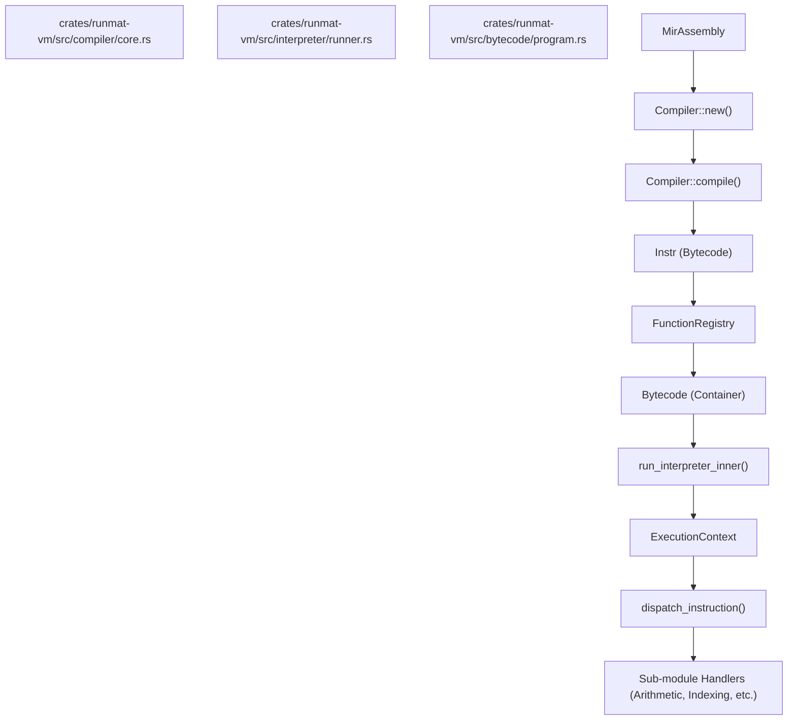

# VM Interpreter & Bytecode

<details>
<summary>Relevant source files</summary>

- [crates/runmat-vm/Cargo.toml](https://github.com/runmat-org/runmat/blob/82685330/crates/runmat-vm/Cargo.toml)
- [crates/runmat-vm/README.md](https://github.com/runmat-org/runmat/blob/82685330/crates/runmat-vm/README.md?plain=1)
- [crates/runmat-vm/src/bytecode/compile.rs](https://github.com/runmat-org/runmat/blob/82685330/crates/runmat-vm/src/bytecode/compile.rs)
- [crates/runmat-vm/src/bytecode/instr.rs](https://github.com/runmat-org/runmat/blob/82685330/crates/runmat-vm/src/bytecode/instr.rs)
- [crates/runmat-vm/src/call/shared.rs](https://github.com/runmat-org/runmat/blob/82685330/crates/runmat-vm/src/call/shared.rs)
- [crates/runmat-vm/src/compiler/core.rs](https://github.com/runmat-org/runmat/blob/82685330/crates/runmat-vm/src/compiler/core.rs)
- [crates/runmat-vm/src/interpreter/dispatch/calls.rs](https://github.com/runmat-org/runmat/blob/82685330/crates/runmat-vm/src/interpreter/dispatch/calls.rs)
- [crates/runmat-vm/src/interpreter/dispatch/indexing.rs](https://github.com/runmat-org/runmat/blob/82685330/crates/runmat-vm/src/interpreter/dispatch/indexing.rs)
- [crates/runmat-vm/src/interpreter/dispatch/mod.rs](https://github.com/runmat-org/runmat/blob/82685330/crates/runmat-vm/src/interpreter/dispatch/mod.rs)
- [crates/runmat-vm/src/interpreter/runner.rs](https://github.com/runmat-org/runmat/blob/82685330/crates/runmat-vm/src/interpreter/runner.rs)
- [crates/runmat-vm/src/object/mod.rs](https://github.com/runmat-org/runmat/blob/82685330/crates/runmat-vm/src/object/mod.rs)
- [crates/runmat-vm/src/ops/mod.rs](https://github.com/runmat-org/runmat/blob/82685330/crates/runmat-vm/src/ops/mod.rs)
- [crates/runmat-vm/src/runtime/call_stack.rs](https://github.com/runmat-org/runmat/blob/82685330/crates/runmat-vm/src/runtime/call_stack.rs)
- [crates/runmat-vm/src/runtime/gc.rs](https://github.com/runmat-org/runmat/blob/82685330/crates/runmat-vm/src/runtime/gc.rs)
- [crates/runmat-vm/src/runtime/globals.rs](https://github.com/runmat-org/runmat/blob/82685330/crates/runmat-vm/src/runtime/globals.rs)
- [crates/runmat-vm/src/runtime/mod.rs](https://github.com/runmat-org/runmat/blob/82685330/crates/runmat-vm/src/runtime/mod.rs)
- [crates/runmat-vm/tests/functions.rs](https://github.com/runmat-org/runmat/blob/82685330/crates/runmat-vm/tests/functions.rs)
- [docs-tmp/COMPLETION_AUDIT.md](https://github.com/runmat-org/runmat/blob/82685330/docs-tmp/COMPLETION_AUDIT.md?plain=1)
- [docs-tmp/DELIVERABLE_AUDIT.md](https://github.com/runmat-org/runmat/blob/82685330/docs-tmp/DELIVERABLE_AUDIT.md?plain=1)
- [docs-tmp/NEXT_STEPS.md](https://github.com/runmat-org/runmat/blob/82685330/docs-tmp/NEXT_STEPS.md?plain=1)
- [docs-tmp/PROGRESS.md](https://github.com/runmat-org/runmat/blob/82685330/docs-tmp/PROGRESS.md?plain=1)

</details>

The `runmat-vm` crate provides the core execution engine for RunMat. It defines the custom bytecode format, the compiler that lowers Mid-Level IR (MIR) into that format, and the asynchronous interpreter that executes it. The VM is designed as the middle tier of a tiered execution model, sitting between high-level semantic analysis and low-level JIT or GPU acceleration.

### System Architecture & Code Entities

The following diagram bridges the conceptual execution flow to the specific code entities within the `runmat-vm` crate.

Execution Lifecycle: Source to Runtime



<details>
<summary>Rendered SVG</summary>

```svg
<svg id="mermaid-iahu1zej36" xmlns="http://www.w3.org/2000/svg" xmlns:xlink="http://www.w3.org/1999/xlink" class="flowchart" style="max-width: 100%; touch-action: none; user-select: none; cursor: grab; min-height: fit-content; max-height: 100%;" viewBox="-183.99217942645532 0 1060.8281088529106 1530" role="graphics-document document" aria-roledescription="flowchart-v2" preserveAspectRatio="xMidYMid meet"><style>#mermaid-iahu1zej36{font-family:ui-sans-serif,-apple-system,system-ui,Segoe UI,Helvetica;font-size:16px;fill:#ccc;}@keyframes edge-animation-frame{from{stroke-dashoffset:0;}}@keyframes dash{to{stroke-dashoffset:0;}}#mermaid-iahu1zej36 .edge-animation-slow{stroke-dasharray:9,5!important;stroke-dashoffset:900;animation:dash 50s linear infinite;stroke-linecap:round;}#mermaid-iahu1zej36 .edge-animation-fast{stroke-dasharray:9,5!important;stroke-dashoffset:900;animation:dash 20s linear infinite;stroke-linecap:round;}#mermaid-iahu1zej36 .error-icon{fill:#333;}#mermaid-iahu1zej36 .error-text{fill:#cccccc;stroke:#cccccc;}#mermaid-iahu1zej36 .edge-thickness-normal{stroke-width:1px;}#mermaid-iahu1zej36 .edge-thickness-thick{stroke-width:3.5px;}#mermaid-iahu1zej36 .edge-pattern-solid{stroke-dasharray:0;}#mermaid-iahu1zej36 .edge-thickness-invisible{stroke-width:0;fill:none;}#mermaid-iahu1zej36 .edge-pattern-dashed{stroke-dasharray:3;}#mermaid-iahu1zej36 .edge-pattern-dotted{stroke-dasharray:2;}#mermaid-iahu1zej36 .marker{fill:#666;stroke:#666;}#mermaid-iahu1zej36 .marker.cross{stroke:#666;}#mermaid-iahu1zej36 svg{font-family:ui-sans-serif,-apple-system,system-ui,Segoe UI,Helvetica;font-size:16px;}#mermaid-iahu1zej36 p{margin:0;}#mermaid-iahu1zej36 .label{font-family:ui-sans-serif,-apple-system,system-ui,Segoe UI,Helvetica;color:#fff;}#mermaid-iahu1zej36 .cluster-label text{fill:#fff;}#mermaid-iahu1zej36 .cluster-label span{color:#fff;}#mermaid-iahu1zej36 .cluster-label span p{background-color:transparent;}#mermaid-iahu1zej36 .label text,#mermaid-iahu1zej36 span{fill:#fff;color:#fff;}#mermaid-iahu1zej36 .node rect,#mermaid-iahu1zej36 .node circle,#mermaid-iahu1zej36 .node ellipse,#mermaid-iahu1zej36 .node polygon,#mermaid-iahu1zej36 .node path{fill:#111;stroke:#222;stroke-width:1px;}#mermaid-iahu1zej36 .rough-node .label text,#mermaid-iahu1zej36 .node .label text,#mermaid-iahu1zej36 .image-shape .label,#mermaid-iahu1zej36 .icon-shape .label{text-anchor:middle;}#mermaid-iahu1zej36 .node .katex path{fill:#000;stroke:#000;stroke-width:1px;}#mermaid-iahu1zej36 .rough-node .label,#mermaid-iahu1zej36 .node .label,#mermaid-iahu1zej36 .image-shape .label,#mermaid-iahu1zej36 .icon-shape .label{text-align:center;}#mermaid-iahu1zej36 .node.clickable{cursor:pointer;}#mermaid-iahu1zej36 .root .anchor path{fill:#666!important;stroke-width:0;stroke:#666;}#mermaid-iahu1zej36 .arrowheadPath{fill:#0b0b0b;}#mermaid-iahu1zej36 .edgePath .path{stroke:#666;stroke-width:1px;}#mermaid-iahu1zej36 .flowchart-link{stroke:#666;fill:none;}#mermaid-iahu1zej36 .edgeLabel{background-color:#161616;text-align:center;}#mermaid-iahu1zej36 .edgeLabel p{background-color:#161616;}#mermaid-iahu1zej36 .edgeLabel rect{opacity:0.5;background-color:#161616;fill:#161616;}#mermaid-iahu1zej36 .labelBkg{background-color:rgba(22, 22, 22, 0.5);}#mermaid-iahu1zej36 .cluster rect{fill:#161616;stroke:#222;stroke-width:1px;}#mermaid-iahu1zej36 .cluster text{fill:#fff;}#mermaid-iahu1zej36 .cluster span{color:#fff;}#mermaid-iahu1zej36 div.mermaidTooltip{position:absolute;text-align:center;max-width:200px;padding:2px;font-family:ui-sans-serif,-apple-system,system-ui,Segoe UI,Helvetica;font-size:12px;background:#333;border:1px solid hsl(0, 0%, 10%);border-radius:2px;pointer-events:none;z-index:100;}#mermaid-iahu1zej36 .flowchartTitleText{text-anchor:middle;font-size:18px;fill:#ccc;}#mermaid-iahu1zej36 rect.text{fill:none;stroke-width:0;}#mermaid-iahu1zej36 .icon-shape,#mermaid-iahu1zej36 .image-shape{background-color:#161616;text-align:center;}#mermaid-iahu1zej36 .icon-shape p,#mermaid-iahu1zej36 .image-shape p{background-color:#161616;padding:2px;}#mermaid-iahu1zej36 .icon-shape .label rect,#mermaid-iahu1zej36 .image-shape .label rect{opacity:0.5;background-color:#161616;fill:#161616;}#mermaid-iahu1zej36 .label-icon{display:inline-block;height:1em;overflow:visible;vertical-align:-0.125em;}#mermaid-iahu1zej36 .node .label-icon path{fill:currentColor;stroke:revert;stroke-width:revert;}#mermaid-iahu1zej36 .node .neo-node{stroke:#222;}#mermaid-iahu1zej36 [data-look="neo"].node rect,#mermaid-iahu1zej36 [data-look="neo"].cluster rect,#mermaid-iahu1zej36 [data-look="neo"].node polygon{stroke:url(#mermaid-iahu1zej36-gradient);filter:drop-shadow( 1px 2px 2px rgba(185,185,185,1));}#mermaid-iahu1zej36 [data-look="neo"].node path{stroke:url(#mermaid-iahu1zej36-gradient);stroke-width:1px;}#mermaid-iahu1zej36 [data-look="neo"].node .outer-path{filter:drop-shadow( 1px 2px 2px rgba(185,185,185,1));}#mermaid-iahu1zej36 [data-look="neo"].node .neo-line path{stroke:#222;filter:none;}#mermaid-iahu1zej36 [data-look="neo"].node circle{stroke:url(#mermaid-iahu1zej36-gradient);filter:drop-shadow( 1px 2px 2px rgba(185,185,185,1));}#mermaid-iahu1zej36 [data-look="neo"].node circle .state-start{fill:#000000;}#mermaid-iahu1zej36 [data-look="neo"].icon-shape .icon{fill:url(#mermaid-iahu1zej36-gradient);filter:drop-shadow( 1px 2px 2px rgba(185,185,185,1));}#mermaid-iahu1zej36 [data-look="neo"].icon-shape .icon-neo path{stroke:url(#mermaid-iahu1zej36-gradient);filter:drop-shadow( 1px 2px 2px rgba(185,185,185,1));}#mermaid-iahu1zej36 :root{--mermaid-font-family:"trebuchet ms",verdana,arial,sans-serif;}</style><g><marker id="mermaid-iahu1zej36_flowchart-v2-pointEnd" class="marker flowchart-v2" viewBox="0 0 10 10" refX="5" refY="5" markerUnits="userSpaceOnUse" markerWidth="8" markerHeight="8" orient="auto"><path d="M 0 0 L 10 5 L 0 10 z" class="arrowMarkerPath" style="stroke-width: 1; stroke-dasharray: 1, 0;"></path></marker><marker id="mermaid-iahu1zej36_flowchart-v2-pointStart" class="marker flowchart-v2" viewBox="0 0 10 10" refX="4.5" refY="5" markerUnits="userSpaceOnUse" markerWidth="8" markerHeight="8" orient="auto"><path d="M 0 5 L 10 10 L 10 0 z" class="arrowMarkerPath" style="stroke-width: 1; stroke-dasharray: 1, 0;"></path></marker><marker id="mermaid-iahu1zej36_flowchart-v2-pointEnd-margin" class="marker flowchart-v2" viewBox="0 0 11.5 14" refX="11.5" refY="7" markerUnits="userSpaceOnUse" markerWidth="10.5" markerHeight="14" orient="auto"><path d="M 0 0 L 11.5 7 L 0 14 z" class="arrowMarkerPath" style="stroke-width: 0; stroke-dasharray: 1, 0;"></path></marker><marker id="mermaid-iahu1zej36_flowchart-v2-pointStart-margin" class="marker flowchart-v2" viewBox="0 0 11.5 14" refX="1" refY="7" markerUnits="userSpaceOnUse" markerWidth="11.5" markerHeight="14" orient="auto"><polygon points="0,7 11.5,14 11.5,0" class="arrowMarkerPath" style="stroke-width: 0; stroke-dasharray: 1, 0;"></polygon></marker><marker id="mermaid-iahu1zej36_flowchart-v2-circleEnd" class="marker flowchart-v2" viewBox="0 0 10 10" refX="11" refY="5" markerUnits="userSpaceOnUse" markerWidth="11" markerHeight="11" orient="auto"><circle cx="5" cy="5" r="5" class="arrowMarkerPath" style="stroke-width: 1; stroke-dasharray: 1, 0;"></circle></marker><marker id="mermaid-iahu1zej36_flowchart-v2-circleStart" class="marker flowchart-v2" viewBox="0 0 10 10" refX="-1" refY="5" markerUnits="userSpaceOnUse" markerWidth="11" markerHeight="11" orient="auto"><circle cx="5" cy="5" r="5" class="arrowMarkerPath" style="stroke-width: 1; stroke-dasharray: 1, 0;"></circle></marker><marker id="mermaid-iahu1zej36_flowchart-v2-circleEnd-margin" class="marker flowchart-v2" viewBox="0 0 10 10" refY="5" refX="12.25" markerUnits="userSpaceOnUse" markerWidth="14" markerHeight="14" orient="auto"><circle cx="5" cy="5" r="5" class="arrowMarkerPath" style="stroke-width: 0; stroke-dasharray: 1, 0;"></circle></marker><marker id="mermaid-iahu1zej36_flowchart-v2-circleStart-margin" class="marker flowchart-v2" viewBox="0 0 10 10" refX="-2" refY="5" markerUnits="userSpaceOnUse" markerWidth="14" markerHeight="14" orient="auto"><circle cx="5" cy="5" r="5" class="arrowMarkerPath" style="stroke-width: 0; stroke-dasharray: 1, 0;"></circle></marker><marker id="mermaid-iahu1zej36_flowchart-v2-crossEnd" class="marker cross flowchart-v2" viewBox="0 0 11 11" refX="12" refY="5.2" markerUnits="userSpaceOnUse" markerWidth="11" markerHeight="11" orient="auto"><path d="M 1,1 l 9,9 M 10,1 l -9,9" class="arrowMarkerPath" style="stroke-width: 2; stroke-dasharray: 1, 0;"></path></marker><marker id="mermaid-iahu1zej36_flowchart-v2-crossStart" class="marker cross flowchart-v2" viewBox="0 0 11 11" refX="-1" refY="5.2" markerUnits="userSpaceOnUse" markerWidth="11" markerHeight="11" orient="auto"><path d="M 1,1 l 9,9 M 10,1 l -9,9" class="arrowMarkerPath" style="stroke-width: 2; stroke-dasharray: 1, 0;"></path></marker><marker id="mermaid-iahu1zej36_flowchart-v2-crossEnd-margin" class="marker cross flowchart-v2" viewBox="0 0 15 15" refX="17.7" refY="7.5" markerUnits="userSpaceOnUse" markerWidth="12" markerHeight="12" orient="auto"><path d="M 1,1 L 14,14 M 1,14 L 14,1" class="arrowMarkerPath" style="stroke-width: 2.5;"></path></marker><marker id="mermaid-iahu1zej36_flowchart-v2-crossStart-margin" class="marker cross flowchart-v2" viewBox="0 0 15 15" refX="-3.5" refY="7.5" markerUnits="userSpaceOnUse" markerWidth="12" markerHeight="12" orient="auto"><path d="M 1,1 L 14,14 M 1,14 L 14,1" class="arrowMarkerPath" style="stroke-width: 2.5; stroke-dasharray: 1, 0;"></path></marker><g class="root"><g class="clusters"><g class="cluster" id="mermaid-iahu1zej36-subGraph2" data-look="classic"><rect style="" x="354.84375" y="1082" width="330" height="440"></rect><g class="cluster-label" transform="translate(369, 1082)"><foreignObject width="301.6875" height="24"><div style="display: table-cell; white-space: nowrap; line-height: 1.5;" xmlns="http://www.w3.org/1999/xhtml"><span class="nodeLabel"><p>Execution Space (runmat-vm::interpreter)</p></span></div></foreignObject></g></g><g class="cluster" id="mermaid-iahu1zej36-subGraph1" data-look="classic"><rect style="" x="377.1953125" y="824" width="285.296875" height="208"></rect><g class="cluster-label" transform="translate(388.078125, 824)"><foreignObject width="263.53125" height="24"><div style="display: table-cell; white-space: nowrap; line-height: 1.5;" xmlns="http://www.w3.org/1999/xhtml"><span class="nodeLabel"><p>Entity Space (runmat-vm::bytecode)</p></span></div></foreignObject></g></g><g class="cluster" id="mermaid-iahu1zej36-subGraph0" data-look="classic"><rect style="" x="363.984375" y="8" width="311.71875" height="766"></rect><g class="cluster-label" transform="translate(367.984375, 8)"><foreignObject width="303.71875" height="24"><div style="display: table-cell; white-space: nowrap; line-height: 1.5;" xmlns="http://www.w3.org/1999/xhtml"><span class="nodeLabel"><p>Compilation Space (runmat-vm::compiler)</p></span></div></foreignObject></g></g></g><g class="edgePaths"><path d="M519.844,262L519.844,295.333C519.844,328.667,519.844,395.333,519.844,432.167C519.844,469,519.844,476,519.844,479.5L519.844,483" id="mermaid-iahu1zej36-L_A_B_0" class="edge-thickness-normal edge-pattern-solid edge-thickness-normal edge-pattern-solid flowchart-link" style=";" data-edge="true" data-et="edge" data-id="L_A_B_0" data-points="W3sieCI6NTE5Ljg0Mzc1LCJ5IjoyNjJ9LHsieCI6NTE5Ljg0Mzc1LCJ5Ijo0NjJ9LHsieCI6NTE5Ljg0Mzc1LCJ5Ijo0ODd9XQ==" data-look="classic" marker-end="url(#mermaid-iahu1zej36_flowchart-v2-pointEnd)"></path><path d="M519.844,541L519.844,545.167C519.844,549.333,519.844,557.667,519.844,565.333C519.844,573,519.844,580,519.844,583.5L519.844,587" id="mermaid-iahu1zej36-L_B_C_0" class="edge-thickness-normal edge-pattern-solid edge-thickness-normal edge-pattern-solid flowchart-link" style=";" data-edge="true" data-et="edge" data-id="L_B_C_0" data-points="W3sieCI6NTE5Ljg0Mzc1LCJ5Ijo1NDF9LHsieCI6NTE5Ljg0Mzc1LCJ5Ijo1NjZ9LHsieCI6NTE5Ljg0Mzc1LCJ5Ijo1OTF9XQ==" data-look="classic" marker-end="url(#mermaid-iahu1zej36_flowchart-v2-pointEnd)"></path><path d="M519.844,645L519.844,649.167C519.844,653.333,519.844,661.667,519.844,669.333C519.844,677,519.844,684,519.844,687.5L519.844,691" id="mermaid-iahu1zej36-L_C_D_0" class="edge-thickness-normal edge-pattern-solid edge-thickness-normal edge-pattern-solid flowchart-link" style=";" data-edge="true" data-et="edge" data-id="L_C_D_0" data-points="W3sieCI6NTE5Ljg0Mzc1LCJ5Ijo2NDV9LHsieCI6NTE5Ljg0Mzc1LCJ5Ijo2NzB9LHsieCI6NTE5Ljg0Mzc1LCJ5Ijo2OTV9XQ==" data-look="classic" marker-end="url(#mermaid-iahu1zej36_flowchart-v2-pointEnd)"></path><path d="M519.844,749L519.844,753.167C519.844,757.333,519.844,765.667,519.844,774C519.844,782.333,519.844,790.667,519.844,799C519.844,807.333,519.844,815.667,519.844,823.333C519.844,831,519.844,838,519.844,841.5L519.844,845" id="mermaid-iahu1zej36-L_D_E_0" class="edge-thickness-normal edge-pattern-solid edge-thickness-normal edge-pattern-solid flowchart-link" style=";" data-edge="true" data-et="edge" data-id="L_D_E_0" data-points="W3sieCI6NTE5Ljg0Mzc1LCJ5Ijo3NDl9LHsieCI6NTE5Ljg0Mzc1LCJ5Ijo3NzR9LHsieCI6NTE5Ljg0Mzc1LCJ5Ijo3OTl9LHsieCI6NTE5Ljg0Mzc1LCJ5Ijo4MjR9LHsieCI6NTE5Ljg0Mzc1LCJ5Ijo4NDl9XQ==" data-look="classic" marker-end="url(#mermaid-iahu1zej36_flowchart-v2-pointEnd)"></path><path d="M519.844,903L519.844,907.167C519.844,911.333,519.844,919.667,519.844,927.333C519.844,935,519.844,942,519.844,945.5L519.844,949" id="mermaid-iahu1zej36-L_E_F_0" class="edge-thickness-normal edge-pattern-solid edge-thickness-normal edge-pattern-solid flowchart-link" style=";" data-edge="true" data-et="edge" data-id="L_E_F_0" data-points="W3sieCI6NTE5Ljg0Mzc1LCJ5Ijo5MDN9LHsieCI6NTE5Ljg0Mzc1LCJ5Ijo5Mjh9LHsieCI6NTE5Ljg0Mzc1LCJ5Ijo5NTN9XQ==" data-look="classic" marker-end="url(#mermaid-iahu1zej36_flowchart-v2-pointEnd)"></path><path d="M519.844,1007L519.844,1011.167C519.844,1015.333,519.844,1023.667,519.844,1032C519.844,1040.333,519.844,1048.667,519.844,1057C519.844,1065.333,519.844,1073.667,519.844,1081.333C519.844,1089,519.844,1096,519.844,1099.5L519.844,1103" id="mermaid-iahu1zej36-L_F_G_0" class="edge-thickness-normal edge-pattern-solid edge-thickness-normal edge-pattern-solid flowchart-link" style=";" data-edge="true" data-et="edge" data-id="L_F_G_0" data-points="W3sieCI6NTE5Ljg0Mzc1LCJ5IjoxMDA3fSx7IngiOjUxOS44NDM3NSwieSI6MTAzMn0seyJ4Ijo1MTkuODQzNzUsInkiOjEwNTd9LHsieCI6NTE5Ljg0Mzc1LCJ5IjoxMDgyfSx7IngiOjUxOS44NDM3NSwieSI6MTEwN31d" data-look="classic" marker-end="url(#mermaid-iahu1zej36_flowchart-v2-pointEnd)"></path><path d="M519.844,1161L519.844,1165.167C519.844,1169.333,519.844,1177.667,519.844,1185.333C519.844,1193,519.844,1200,519.844,1203.5L519.844,1207" id="mermaid-iahu1zej36-L_G_H_0" class="edge-thickness-normal edge-pattern-solid edge-thickness-normal edge-pattern-solid flowchart-link" style=";" data-edge="true" data-et="edge" data-id="L_G_H_0" data-points="W3sieCI6NTE5Ljg0Mzc1LCJ5IjoxMTYxfSx7IngiOjUxOS44NDM3NSwieSI6MTE4Nn0seyJ4Ijo1MTkuODQzNzUsInkiOjEyMTF9XQ==" data-look="classic" marker-end="url(#mermaid-iahu1zej36_flowchart-v2-pointEnd)"></path><path d="M519.844,1265L519.844,1269.167C519.844,1273.333,519.844,1281.667,519.844,1289.333C519.844,1297,519.844,1304,519.844,1307.5L519.844,1311" id="mermaid-iahu1zej36-L_H_I_0" class="edge-thickness-normal edge-pattern-solid edge-thickness-normal edge-pattern-solid flowchart-link" style=";" data-edge="true" data-et="edge" data-id="L_H_I_0" data-points="W3sieCI6NTE5Ljg0Mzc1LCJ5IjoxMjY1fSx7IngiOjUxOS44NDM3NSwieSI6MTI5MH0seyJ4Ijo1MTkuODQzNzUsInkiOjEzMTV9XQ==" data-look="classic" marker-end="url(#mermaid-iahu1zej36_flowchart-v2-pointEnd)"></path><path d="M519.844,1369L519.844,1373.167C519.844,1377.333,519.844,1385.667,519.844,1393.333C519.844,1401,519.844,1408,519.844,1411.5L519.844,1415" id="mermaid-iahu1zej36-L_I_J_0" class="edge-thickness-normal edge-pattern-solid edge-thickness-normal edge-pattern-solid flowchart-link" style=";" data-edge="true" data-et="edge" data-id="L_I_J_0" data-points="W3sieCI6NTE5Ljg0Mzc1LCJ5IjoxMzY5fSx7IngiOjUxOS44NDM3NSwieSI6MTM5NH0seyJ4Ijo1MTkuODQzNzUsInkiOjE0MTl9XQ==" data-look="classic" marker-end="url(#mermaid-iahu1zej36_flowchart-v2-pointEnd)"></path></g><g class="edgeLabels"><g class="edgeLabel"><g class="label" data-id="L_A_B_0" transform="translate(0, 0)"><foreignObject width="0" height="0"><div style="display: table-cell; white-space: nowrap; line-height: 1.5; max-width: 200px; text-align: center;" xmlns="http://www.w3.org/1999/xhtml" class="labelBkg"><span class="edgeLabel"></span></div></foreignObject></g></g><g class="edgeLabel"><g class="label" data-id="L_B_C_0" transform="translate(0, 0)"><foreignObject width="0" height="0"><div style="display: table-cell; white-space: nowrap; line-height: 1.5; max-width: 200px; text-align: center;" xmlns="http://www.w3.org/1999/xhtml" class="labelBkg"><span class="edgeLabel"></span></div></foreignObject></g></g><g class="edgeLabel"><g class="label" data-id="L_C_D_0" transform="translate(0, 0)"><foreignObject width="0" height="0"><div style="display: table-cell; white-space: nowrap; line-height: 1.5; max-width: 200px; text-align: center;" xmlns="http://www.w3.org/1999/xhtml" class="labelBkg"><span class="edgeLabel"></span></div></foreignObject></g></g><g class="edgeLabel"><g class="label" data-id="L_D_E_0" transform="translate(0, 0)"><foreignObject width="0" height="0"><div style="display: table-cell; white-space: nowrap; line-height: 1.5; max-width: 200px; text-align: center;" xmlns="http://www.w3.org/1999/xhtml" class="labelBkg"><span class="edgeLabel"></span></div></foreignObject></g></g><g class="edgeLabel"><g class="label" data-id="L_E_F_0" transform="translate(0, 0)"><foreignObject width="0" height="0"><div style="display: table-cell; white-space: nowrap; line-height: 1.5; max-width: 200px; text-align: center;" xmlns="http://www.w3.org/1999/xhtml" class="labelBkg"><span class="edgeLabel"></span></div></foreignObject></g></g><g class="edgeLabel"><g class="label" data-id="L_F_G_0" transform="translate(0, 0)"><foreignObject width="0" height="0"><div style="display: table-cell; white-space: nowrap; line-height: 1.5; max-width: 200px; text-align: center;" xmlns="http://www.w3.org/1999/xhtml" class="labelBkg"><span class="edgeLabel"></span></div></foreignObject></g></g><g class="edgeLabel"><g class="label" data-id="L_G_H_0" transform="translate(0, 0)"><foreignObject width="0" height="0"><div style="display: table-cell; white-space: nowrap; line-height: 1.5; max-width: 200px; text-align: center;" xmlns="http://www.w3.org/1999/xhtml" class="labelBkg"><span class="edgeLabel"></span></div></foreignObject></g></g><g class="edgeLabel"><g class="label" data-id="L_H_I_0" transform="translate(0, 0)"><foreignObject width="0" height="0"><div style="display: table-cell; white-space: nowrap; line-height: 1.5; max-width: 200px; text-align: center;" xmlns="http://www.w3.org/1999/xhtml" class="labelBkg"><span class="edgeLabel"></span></div></foreignObject></g></g><g class="edgeLabel"><g class="label" data-id="L_I_J_0" transform="translate(0, 0)"><foreignObject width="0" height="0"><div style="display: table-cell; white-space: nowrap; line-height: 1.5; max-width: 200px; text-align: center;" xmlns="http://www.w3.org/1999/xhtml" class="labelBkg"><span class="edgeLabel"></span></div></foreignObject></g></g></g><g class="nodes"><g class="root" transform="translate(0, 25)"><g class="clusters"><g class="cluster" id="mermaid-iahu1zej36-subGraph3" data-look="classic"><rect style="" x="8" y="8" width="340.421875" height="404"></rect><g class="cluster-label" transform="translate(130.09375, 8)"><foreignObject width="96.234375" height="24"><div style="display: table-cell; white-space: nowrap; line-height: 1.5;" xmlns="http://www.w3.org/1999/xhtml"><span class="nodeLabel"><p>Code Entities</p></span></div></foreignObject></g></g></g><g class="edgePaths"></g><g class="edgeLabels"></g><g class="nodes"><g class="node default" id="mermaid-iahu1zej36-flowchart-C_Path-18" data-look="classic" transform="translate(178.2109375, 82)"><rect class="basic label-container" style="" x="-130" y="-39" width="260" height="78"></rect><g class="label" style="" transform="translate(-100, -24)"><rect></rect><foreignObject width="200" height="48"><div style="display: table; white-space: break-spaces; line-height: 1.5; max-width: 200px; text-align: center; width: 200px;" xmlns="http://www.w3.org/1999/xhtml"><span class="nodeLabel"><p>crates/runmat-vm/src/compiler/core.rs</p></span></div></foreignObject></g></g><g class="node default" id="mermaid-iahu1zej36-flowchart-I_Path-19" data-look="classic" transform="translate(178.2109375, 210)"><rect class="basic label-container" style="" x="-130" y="-39" width="260" height="78"></rect><g class="label" style="" transform="translate(-100, -24)"><rect></rect><foreignObject width="200" height="48"><div style="display: table; white-space: break-spaces; line-height: 1.5; max-width: 200px; text-align: center; width: 200px;" xmlns="http://www.w3.org/1999/xhtml"><span class="nodeLabel"><p>crates/runmat-vm/src/interpreter/runner.rs</p></span></div></foreignObject></g></g><g class="node default" id="mermaid-iahu1zej36-flowchart-B_Path-20" data-look="classic" transform="translate(178.2109375, 338)"><rect class="basic label-container" style="" x="-132.7109375" y="-39" width="265.421875" height="78"></rect><g class="label" style="" transform="translate(-102.7109375, -24)"><rect></rect><foreignObject width="205.421875" height="48"><div style="display: table; white-space: break-spaces; line-height: 1.5; max-width: 200px; text-align: center; width: 200px;" xmlns="http://www.w3.org/1999/xhtml"><span class="nodeLabel"><p>crates/runmat-vm/src/bytecode/program.rs</p></span></div></foreignObject></g></g></g></g><g class="node default" id="mermaid-iahu1zej36-flowchart-A-0" data-look="classic" transform="translate(519.84375, 235)"><rect class="basic label-container" style="" x="-76.40625" y="-27" width="152.8125" height="54"></rect><g class="label" style="" transform="translate(-46.40625, -12)"><rect></rect><foreignObject width="92.8125" height="24"><div style="display: table-cell; white-space: nowrap; line-height: 1.5; max-width: 200px; text-align: center;" xmlns="http://www.w3.org/1999/xhtml"><span class="nodeLabel"><p>MirAssembly</p></span></div></foreignObject></g></g><g class="node default" id="mermaid-iahu1zej36-flowchart-B-1" data-look="classic" transform="translate(519.84375, 514)"><rect class="basic label-container" style="" x="-87.8671875" y="-27" width="175.734375" height="54"></rect><g class="label" style="" transform="translate(-57.8671875, -12)"><rect></rect><foreignObject width="115.734375" height="24"><div style="display: table-cell; white-space: nowrap; line-height: 1.5; max-width: 200px; text-align: center;" xmlns="http://www.w3.org/1999/xhtml"><span class="nodeLabel"><p>Compiler::new()</p></span></div></foreignObject></g></g><g class="node default" id="mermaid-iahu1zej36-flowchart-C-3" data-look="classic" transform="translate(519.84375, 618)"><rect class="basic label-container" style="" x="-101.421875" y="-27" width="202.84375" height="54"></rect><g class="label" style="" transform="translate(-71.421875, -12)"><rect></rect><foreignObject width="142.84375" height="24"><div style="display: table-cell; white-space: nowrap; line-height: 1.5; max-width: 200px; text-align: center;" xmlns="http://www.w3.org/1999/xhtml"><span class="nodeLabel"><p>Compiler::compile()</p></span></div></foreignObject></g></g><g class="node default" id="mermaid-iahu1zej36-flowchart-D-5" data-look="classic" transform="translate(519.84375, 722)"><rect class="basic label-container" style="" x="-88.4765625" y="-27" width="176.953125" height="54"></rect><g class="label" style="" transform="translate(-58.4765625, -12)"><rect></rect><foreignObject width="116.953125" height="24"><div style="display: table-cell; white-space: nowrap; line-height: 1.5; max-width: 200px; text-align: center;" xmlns="http://www.w3.org/1999/xhtml"><span class="nodeLabel"><p>Instr (Bytecode)</p></span></div></foreignObject></g></g><g class="node default" id="mermaid-iahu1zej36-flowchart-E-7" data-look="classic" transform="translate(519.84375, 876)"><rect class="basic label-container" style="" x="-91.265625" y="-27" width="182.53125" height="54"></rect><g class="label" style="" transform="translate(-61.265625, -12)"><rect></rect><foreignObject width="122.53125" height="24"><div style="display: table-cell; white-space: nowrap; line-height: 1.5; max-width: 200px; text-align: center;" xmlns="http://www.w3.org/1999/xhtml"><span class="nodeLabel"><p>FunctionRegistry</p></span></div></foreignObject></g></g><g class="node default" id="mermaid-iahu1zej36-flowchart-F-9" data-look="classic" transform="translate(519.84375, 980)"><rect class="basic label-container" style="" x="-107.6484375" y="-27" width="215.296875" height="54"></rect><g class="label" style="" transform="translate(-77.6484375, -12)"><rect></rect><foreignObject width="155.296875" height="24"><div style="display: table-cell; white-space: nowrap; line-height: 1.5; max-width: 200px; text-align: center;" xmlns="http://www.w3.org/1999/xhtml"><span class="nodeLabel"><p>Bytecode (Container)</p></span></div></foreignObject></g></g><g class="node default" id="mermaid-iahu1zej36-flowchart-G-11" data-look="classic" transform="translate(519.84375, 1134)"><rect class="basic label-container" style="" x="-112.9296875" y="-27" width="225.859375" height="54"></rect><g class="label" style="" transform="translate(-82.9296875, -12)"><rect></rect><foreignObject width="165.859375" height="24"><div style="display: table-cell; white-space: nowrap; line-height: 1.5; max-width: 200px; text-align: center;" xmlns="http://www.w3.org/1999/xhtml"><span class="nodeLabel"><p>run_interpreter_inner()</p></span></div></foreignObject></g></g><g class="node default" id="mermaid-iahu1zej36-flowchart-H-13" data-look="classic" transform="translate(519.84375, 1238)"><rect class="basic label-container" style="" x="-93.7421875" y="-27" width="187.484375" height="54"></rect><g class="label" style="" transform="translate(-63.7421875, -12)"><rect></rect><foreignObject width="127.484375" height="24"><div style="display: table-cell; white-space: nowrap; line-height: 1.5; max-width: 200px; text-align: center;" xmlns="http://www.w3.org/1999/xhtml"><span class="nodeLabel"><p>ExecutionContext</p></span></div></foreignObject></g></g><g class="node default" id="mermaid-iahu1zej36-flowchart-I-15" data-look="classic" transform="translate(519.84375, 1342)"><rect class="basic label-container" style="" x="-109.9921875" y="-27" width="219.984375" height="54"></rect><g class="label" style="" transform="translate(-79.9921875, -12)"><rect></rect><foreignObject width="159.984375" height="24"><div style="display: table-cell; white-space: nowrap; line-height: 1.5; max-width: 200px; text-align: center;" xmlns="http://www.w3.org/1999/xhtml"><span class="nodeLabel"><p>dispatch_instruction()</p></span></div></foreignObject></g></g><g class="node default" id="mermaid-iahu1zej36-flowchart-J-17" data-look="classic" transform="translate(519.84375, 1458)"><rect class="basic label-container" style="" x="-130" y="-39" width="260" height="78"></rect><g class="label" style="" transform="translate(-100, -24)"><rect></rect><foreignObject width="200" height="48"><div style="display: table; white-space: break-spaces; line-height: 1.5; max-width: 200px; text-align: center; width: 200px;" xmlns="http://www.w3.org/1999/xhtml"><span class="nodeLabel"><p>Sub-module Handlers (Arithmetic, Indexing, etc.)</p></span></div></foreignObject></g></g></g></g></g><defs><filter id="mermaid-iahu1zej36-drop-shadow" height="130%" width="130%"><feDropShadow dx="4" dy="4" stdDeviation="0" flood-opacity="0.06" flood-color="#000000"></feDropShadow></filter></defs><defs><filter id="mermaid-iahu1zej36-drop-shadow-small" height="150%" width="150%"><feDropShadow dx="2" dy="2" stdDeviation="0" flood-opacity="0.06" flood-color="#000000"></feDropShadow></filter></defs><linearGradient id="mermaid-iahu1zej36-gradient" gradientUnits="objectBoundingBox" x1="0%" y1="0%" x2="100%" y2="0%"><stop offset="0%" stop-color="#333" stop-opacity="1"></stop><stop offset="100%" stop-color="hsl(-120, 0%, 3.3333333333%)" stop-opacity="1"></stop></linearGradient></svg>
```

</details>

Sources: [crates/runmat-vm/src/compiler/core.rs #29-42](https://github.com/runmat-org/runmat/blob/82685330/crates/runmat-vm/src/compiler/core.rs#L29-L42) [crates/runmat-vm/src/bytecode/compile.rs #20-109](https://github.com/runmat-org/runmat/blob/82685330/crates/runmat-vm/src/bytecode/compile.rs#L20-L109) [crates/runmat-vm/src/interpreter/runner.rs #84-194](https://github.com/runmat-org/runmat/blob/82685330/crates/runmat-vm/src/interpreter/runner.rs#L84-L194)

---

## Bytecode Compilation (MIR → Bytecode)

The `Compiler` struct is responsible for the final lowering of `MirAssembly` into a sequence of `Instr` opcodes [crates/runmat-vm/src/compiler/core.rs #29-42](https://github.com/runmat-org/runmat/blob/82685330/crates/runmat-vm/src/compiler/core.rs#L29-L42) This process includes:

- Instruction Lowering: Converting MIR statements (`MirStmt`) and terminators (`MirTerminatorKind`) into stack-based or register-like bytecode instructions [crates/runmat-vm/src/compiler/core.rs #10-15](https://github.com/runmat-org/runmat/blob/82685330/crates/runmat-vm/src/compiler/core.rs#L10-L15)
- Fast-Path Detection: The compiler identifies specific patterns, such as "Stochastic Evolution," to enable specialized execution paths [crates/runmat-vm/src/compiler/core.rs #83-88](https://github.com/runmat-org/runmat/blob/82685330/crates/runmat-vm/src/compiler/core.rs#L83-L88)
- Fusion Metadata: If the `native-accel` feature is enabled, the compiler generates `FusionMetadata` to assist the GPU fusion engine in identifying groups of instructions that can be offloaded [crates/runmat-vm/src/bytecode/compile.rs #49-57](https://github.com/runmat-org/runmat/blob/82685330/crates/runmat-vm/src/bytecode/compile.rs#L49-L57)

For details on the lowering logic and jump patching, see [Bytecode Compilation (MIR → Bytecode)](https://app.devin.ai/org/runmat-org/wiki/runmat-org/runmat?branch=dev#3.1).

Sources: [crates/runmat-vm/src/compiler/core.rs #29-42](https://github.com/runmat-org/runmat/blob/82685330/crates/runmat-vm/src/compiler/core.rs#L29-L42) [crates/runmat-vm/src/bytecode/compile.rs #20-109](https://github.com/runmat-org/runmat/blob/82685330/crates/runmat-vm/src/bytecode/compile.rs#L20-L109)

---

## Interpreter Dispatch & Execution Loop

The interpreter is an asynchronous loop that processes instructions using a `dispatch_instruction` table [crates/runmat-vm/src/interpreter/runner.rs #4-7](https://github.com/runmat-org/runmat/blob/82685330/crates/runmat-vm/src/interpreter/runner.rs#L4-L7) Execution state is maintained within an `ExecutionContext`, which tracks the program counter (`pc`), the value stack, and local variables [crates/runmat-vm/src/interpreter/dispatch/mod.rs #55-66](https://github.com/runmat-org/runmat/blob/82685330/crates/runmat-vm/src/interpreter/dispatch/mod.rs#L55-L66)

- Modular Handlers: Dispatch is divided into specialized sub-modules for arithmetic, array construction, control flow, and exception handling [crates/runmat-vm/src/interpreter/dispatch/mod.rs #1-8](https://github.com/runmat-org/runmat/blob/82685330/crates/runmat-vm/src/interpreter/dispatch/mod.rs#L1-L8)
- Try/Catch Stack: The VM maintains a `try_stack` to manage MATLAB-compatible `try...catch` blocks and exception redirection [crates/runmat-vm/src/interpreter/dispatch/mod.rs #59-60](https://github.com/runmat-org/runmat/blob/82685330/crates/runmat-vm/src/interpreter/dispatch/mod.rs#L59-L60)

For details on the execution loop and instruction semantics, see [Interpreter Dispatch & Execution Loop](https://app.devin.ai/org/runmat-org/wiki/runmat-org/runmat?branch=dev#3.2).

Sources: [crates/runmat-vm/src/interpreter/runner.rs #181-194](https://github.com/runmat-org/runmat/blob/82685330/crates/runmat-vm/src/interpreter/runner.rs#L181-L194) [crates/runmat-vm/src/interpreter/dispatch/mod.rs #55-66](https://github.com/runmat-org/runmat/blob/82685330/crates/runmat-vm/src/interpreter/dispatch/mod.rs#L55-L66)

---

## Indexing Subsystem

MATLAB's indexing semantics (paren `()`, brace `{}`, and dot `.` indexing) are complex, supporting linear, logical, and multidimensional slice operations. The VM uses an `IndexPlan` to normalize these operations before execution [crates/runmat-vm/src/interpreter/dispatch/indexing.rs #9-14](https://github.com/runmat-org/runmat/blob/82685330/crates/runmat-vm/src/interpreter/dispatch/indexing.rs#L9-L14)

- Slice Operations: Handles `A(2:end-1)` using `IndexSliceExpr` and `StoreSliceExpr` [crates/runmat-vm/src/interpreter/dispatch/indexing.rs #11-16](https://github.com/runmat-org/runmat/blob/82685330/crates/runmat-vm/src/interpreter/dispatch/indexing.rs#L11-L16)
- End Evaluation: Provides specialized logic for the `end` keyword within indexing expressions [crates/runmat-vm/src/interpreter/dispatch/indexing.rs #175-180](https://github.com/runmat-org/runmat/blob/82685330/crates/runmat-vm/src/interpreter/dispatch/indexing.rs#L175-L180)
- Object Dispatch: If the base value is a class instance, the VM dispatches to `subsref` or `subsasgn` methods [crates/runmat-vm/src/interpreter/dispatch/indexing.rs #62-86](https://github.com/runmat-org/runmat/blob/82685330/crates/runmat-vm/src/interpreter/dispatch/indexing.rs#L62-L86)

For details on index planning and slice materialization, see [Indexing Subsystem](https://app.devin.ai/org/runmat-org/wiki/runmat-org/runmat?branch=dev#3.3).

Sources: [crates/runmat-vm/src/interpreter/dispatch/indexing.rs #1-22](https://github.com/runmat-org/runmat/blob/82685330/crates/runmat-vm/src/interpreter/dispatch/indexing.rs#L1-L22) [crates/runmat-vm/src/call/shared.rs #181-201](https://github.com/runmat-org/runmat/blob/82685330/crates/runmat-vm/src/call/shared.rs#L181-L201)

---

## Callable Resolution & Function Dispatch

The VM handles multiple types of callables through the `CallableIdentity` enum, including built-ins, anonymous functions, and class methods [crates/runmat-vm/src/call/shared.rs #50-71](https://github.com/runmat-org/runmat/blob/82685330/crates/runmat-vm/src/call/shared.rs#L50-L71)

- Resolution Protocol: The VM resolves names to `CallableDescriptor` objects, which determine if a call is a direct host-call, a bytecode jump, or a dynamic `feval` dispatch [crates/runmat-vm/src/call/descriptor.rs #1-5](https://github.com/runmat-org/runmat/blob/82685330/crates/runmat-vm/src/call/descriptor.rs#L1-L5)
- Closure Capture: Supports lexical closures by mapping `Value::Closure` captures to the function's local variable slots [crates/runmat-vm/src/interpreter/runner.rs #124-128](https://github.com/runmat-org/runmat/blob/82685330/crates/runmat-vm/src/interpreter/runner.rs#L124-L128)
- Semantic Hooks: Integrates with the `runmat-runtime` layer for calling built-in functions with variable input/output counts (`nargin`/`nargout`) [crates/runmat-vm/src/interpreter/runner.rs #165-174](https://github.com/runmat-org/runmat/blob/82685330/crates/runmat-vm/src/interpreter/runner.rs#L165-L174)

For details on the calling convention and method dispatch, see [Callable Resolution & Function Dispatch](https://app.devin.ai/org/runmat-org/wiki/runmat-org/runmat?branch=dev#3.4).

Sources: [crates/runmat-vm/src/call/shared.rs #50-71](https://github.com/runmat-org/runmat/blob/82685330/crates/runmat-vm/src/call/shared.rs#L50-L71) [crates/runmat-vm/src/interpreter/runner.rs #84-110](https://github.com/runmat-org/runmat/blob/82685330/crates/runmat-vm/src/interpreter/runner.rs#L84-L110)

---

## Data Structures & Layout

The VM relies on several key structures to manage program data and layout:

| Entity | Role | Location |
| --- | --- | --- |
| Instr | The opcode enum representing all VM operations. | crates/runmat-vm/src/bytecode/instr.rs |
| Bytecode | The top-level container for instructions, spans, and metadata. | crates/runmat-vm/src/bytecode/program.rs |
| FunctionRegistry | Maps FunctionId to FunctionBytecode for semantic calls. | crates/runmat-vm/src/bytecode/program.rs |
| VmAssemblyLayout | Maps MIR local IDs to physical VM stack/variable slots. | crates/runmat-vm/src/layout/mod.rs |

Sources: [crates/runmat-vm/src/compiler/core.rs #4-15](https://github.com/runmat-org/runmat/blob/82685330/crates/runmat-vm/src/compiler/core.rs#L4-L15) [crates/runmat-vm/src/bytecode/compile.rs #90-109](https://github.com/runmat-org/runmat/blob/82685330/crates/runmat-vm/src/bytecode/compile.rs#L90-L109)
